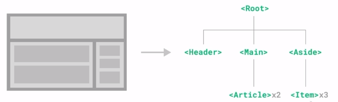
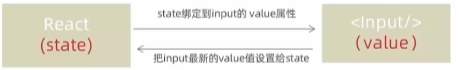
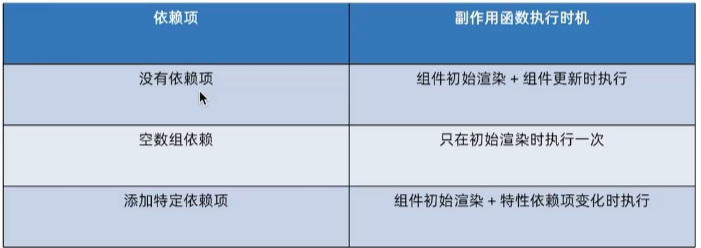
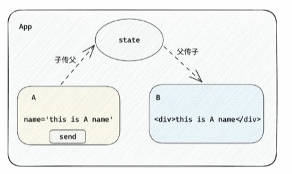
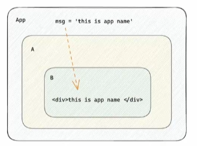
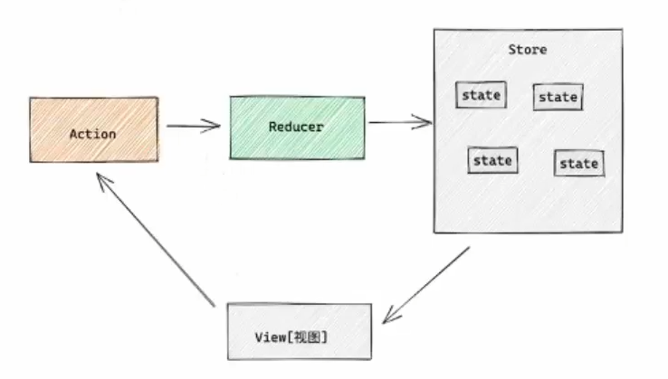
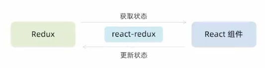
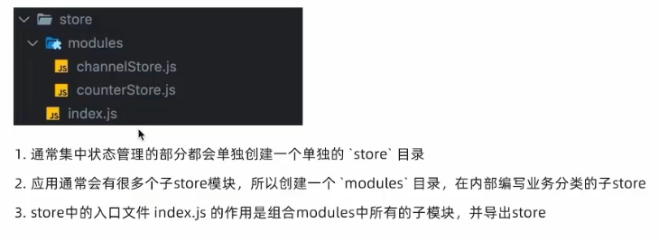
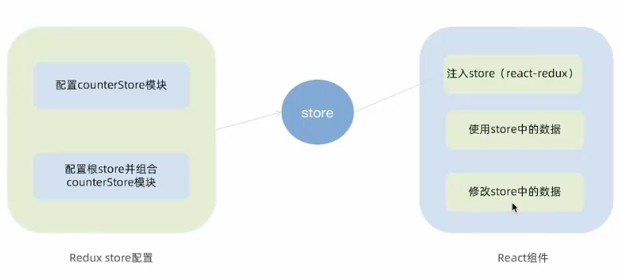

# React基础

## 介绍

React由Meta公司研发，是一个用于构建web和原生交互界面的库
优势：丰富的生态，跨平台支持

## 开发环境搭建

使用vite构建react项目
`pnpm create vite`
**React流程**
入口文件 【main.jsx】

```jsx
// 项目的入口，从这里开始运行

// React必要的两个核心包
import React from 'react'
import ReactDOM from 'react-dom/client'

// 导入项目的根组件
import App from './App.jsx'

// 把App根组件渲染到id为root的dom节点上
const root = ReactDOM.createRoot(document.getElementById('root'))
root.render(<App />)
```

项目根组件 【App.jsx】

```jsx
// 项目的根组件
function App() {
  return (
    <div className="App">
      this is App
    </div>
  )
}

export default App
```

**react项目渲染流程**
App.jsx -> main.jsx -> index.html(root)

## JSX

### 概念

JSX是Javascript和XML(HTML)的缩写，表示在JS代码中编写HTML模板结构，他是React中编写UI模板的方式
优势：

1. HTML的声明式模板写法
2. JS的可编程能力

**JSX本质**
JSX并不是标准的JS语法，是JS的语法拓展，浏览器本身不能识别，需要通过解析工具做解析之后才能在浏览器中运行
通过babel将jsx编译成js代码

### 基础使用

#### JSX使用JS表达式

在JSX中使用 {} 识别JS中的表达式，比如常见的变量，函数调用，方法调用等。

1. 使用引号传递字符串
2. 使用JavaScript变量
3. 函数调用和方法调用
4. 使用JavaScript对象

#### JSX实现列表渲染

语法：在JSX中可以使用原生JS中的map方法便利渲染列表
需要循环哪个结构，就return哪个结构
**注意：** 需要加上独一无二的key，字符串或者number 通常是id
key的作用：React框架内部使用，提升更新性能

```jsx
const list = [
  {id: 1, name: 'vue'},
  {id: 2, name: 'react'},
  {id: 3, name: 'angular'}
]
function App() {
  return (
    <div className="App">
      this is App
      <ul>
        {list.map(item=><li key={item.id}>{item.name}</li>)}
      </ul>
    </div>

  )
}
export default App
```

#### 实现条件渲染

**简单条件渲染**
语法：在React中，可以通过逻辑与运算符&&、三元运算符(?:)实现基础的条件渲染

```jsx
{flag && <span>this is span</span>}
// flag为true则渲染<span>
{flag ? <span>jack</span> : <sapn>loading...</sapn>}
```

**复杂条件渲染**
方法：自定义函数 + if判断语句

```jsx
const articleType = 1 // 0 1 3
function getArticleTem() {
  if (articleType == 0){
    return <div>无图</div>
  }else if(articleType == 1){
    return <div>单图</div>
  }else {
    return <div>无图</div>
  }
}

function App() {
  return (
    <div className="App">
      {getArticleTem()}
    </div>
  )
}
export default App
```

## 事件绑定

### 一般写法

语法：on + 事件名称 = {事件处理程序}，整体上遵循驼峰命名法

```jsx
function App() {
  const handleClick = (e) => {
    console.log('被点击了', e)
  }
  return (
    <div className="App">
      <button onClick={handleClick}>点击</button>
    </div>
  )
}

export default App
```

### **传递自定义参数**

**function函数和箭头函数**
this指向不同：

- function函数，this的指向随着环境的变化而变化
- 箭头函数中的this指向是固定不变的，一直指向的是定义函数的环境

普通函数可以作为**构造函数**，箭头函数不可以作为构造函数，不能new
普通函数可以先调用后声明,因为有**变量提升,** 但是箭头函数必须先声明后调用
语法：事件绑定的位置改造成箭头函数的写法，在执行clickHandler实际处理业务函数的时候传递实参
**注意**：不能直接写函数调用，这里事件绑定需要一个函数引用

```jsx
function App() {
  const handleClick = (name) => {
    console.log('被点击了', name)
  }
  return (
    <div className="App">
      <button onClick={() => handleClick('zhy')}>点击</button>
    </div>
  )
}

export default App
```

### **同时传递事件对象和自定义参数**

语法：在事件绑定的位置传递事件实参e和自定义参数，clickHandler中声明形参，注意顺序对应

```jsx
function App() {
  const handleClick = (name, e) => {
    console.log('被点击了', name, e)
  }
  return (
    <div className="App">
      <button onClick={(e) => handleClick('zhy', e)}>点击</button>
    </div>
  )
}

export default App
```

## React中的组件

概念：一个组件就是用户界面的一个部分，它可以有自己的逻辑和外观，组件之间可以互相嵌套，也可以复用多次  
​  
**React组件**  
一个组件就是==首字母大写的函数==，内部存放了组件的逻辑和视图UI，渲染组件只需要把组件当成标签书写

```jsx
function Button() {
  // 组件业务逻辑
  return <button>click</button>
}

function App() {
  return (
    <div className="App">
      {/* 渲染组件 */}
      <Button />
      <Button></Button>
    </div>
  )
}

export default App
```

## 组件的样式处理

1. 行内

```jsx
const style = {
  color: 'red'
}
function App() {
  return (
    <div className="App">
      <span style={style}>this is span</span>
    </div>
  )
}
export default App
```

2. 通过class类名控制新建样式文件【index.css】

```jsx
import './index.css'
function App() {
  return (
    <div className="App">
      <span className="foo">this is span</span>
    </div>
  )
}
```

### 案例

1. 需求：点击哪个tab项，哪个做高亮处理思路：点击哪个tab，就把它的type(独一的标识)记录下来，然后和遍历时的每一项的type做匹配，匹配到就设置负责高亮的类名
2. 需求：点击最新，评论列表按照创建事件倒序排列（新的在前），点击最热按照点赞数排序（多的在前）思路：把评论列表状态进行不同的排序处理。安装 lodash,使用 _.orderBy(collection, '字段', '方式')

### 工具: loadsh

```jsx
import { useState } from 'react'
import './App.scss'
import avatar from './images/bozai.png'
import _ from 'lodash'
/**
  * 评论列表的渲染和操作
  *
  * 1. 根据状态渲染评论列表
  * 2. 删除评论
  */

// 评论列表数据
const defaultList = [
  {
    // 评论id
    rpid: 3,
    // 用户信息
    user: {
      uid: '13258165',
      avatar: '',
      uname: '周杰伦',
    },
    // 评论内容
    content: '哎哟，不错哦',
    // 评论时间
    ctime: '10-18 08:15',
    like: 88,
  },
  {
    rpid: 2,
    user: {
      uid: '36080105',
      avatar: '',
      uname: '许嵩',
    },
    content: '我寻你千百度 日出到迟暮',
    ctime: '11-13 11:29',
    like: 88,
  },
  {
    rpid: 1,
    user: {
      uid: '30009257',
      avatar,
      uname: '黑马前端',
    },
    content: '学前端就来黑马',
    ctime: '10-19 09:00',
    like: 66,
  },
]
// 当前登录用户信息
const user = {
  // 用户id
  uid: '30009257',
  // 用户头像
  avatar,
  // 用户昵称
  uname: '黑马前端',
}

/**
  * 导航 Tab 的渲染和操作
  *
  * 1. 渲染导航 Tab 和高亮
  * 2. 评论列表排序
  *  最热 => 喜欢数量降序
  *  最新 => 创建时间降序
  */

// 导航 Tab 数组
const tabs = [
  { type: 'hot', text: '最热' },
  { type: 'time', text: '最新' },
]

const App = () => {
  const [commentList, setList] = useState(_.orderBy(defaultList, 'like', 'desc'))
  const handelDel = (id) => {
    setList(commentList.filter(item => item.rpid != id))
  }
  const [type, setType] = useState('hot')
  const handleTabChange = (type) => {
    setType(type)
    // 基于列表排序
    if(type === 'hot'){
      // 根据点赞数排序
      // lodash
      setList(_.orderBy(commentList, 'like', 'desc'))
    }else {
      // 根据创建事件排序
      setList(_.orderBy(commentList, 'ctime', 'desc'))
    }
  }
  return (
    <div className="app">
      {/* 导航 Tab */}
      <div className="reply-navigation">
        <ul className="nav-bar">
          <li className="nav-title">
            <span className="nav-title-text">评论</span>
            {/* 评论数量 */}
            <span className="total-reply">{10}</span>
          </li>
          <li className="nav-sort">
            {/* 高亮类名： active */}
            {/* 点击时记录type */}
            {tabs.map(item=><span key={item.type} onClick={()=>handleTabChange(item.type)} className={`nav-item ${type === item.type && 'active'}`}>{item.text}</span>)}

          </li>
        </ul>
      </div>

      <div className="reply-wrap">
        {/* 发表评论 */}
        <div className="box-normal">
          {/* 当前用户头像 */}
          <div className="reply-box-avatar">
            <div className="bili-avatar">
              
            </div>
          </div>
          <div className="reply-box-wrap">
            {/* 评论框 */}
            <textarea
              className="reply-box-textarea"
              placeholder="发一条友善的评论"
              />
            {/* 发布按钮 */}
            <div className="reply-box-send">
              <div className="send-text">发布</div>
            </div>
          </div>
        </div>
         {/* 评论列表 */}
         <div className="reply-list">
           {/* 评论项 */}
           {commentList.map(item => (
             <div className="reply-item">
               {/* 头像 */}
               <div className="root-reply-avatar">
                 <div className="bili-avatar">
                   
                 </div>
               </div>
 
               <div className="content-wrap">
                 {/* 用户名 */}
                 <div className="user-info">
                   <div className="user-name">{item.user.uname}</div>
                 </div>
                 {/* 评论内容 */}
                 <div className="root-reply">
                   <span className="reply-content">{item.content}</span>
                   <div className="reply-info">
                     {/* 评论时间 */}
                     <span className="reply-time">{item.ctime}</span>
                     {/* 评论数量 */}
                     <span className="reply-time">点赞数:{item.like}</span>
                     {item.user.uid == user.uid && <span className="delete-btn" onClick={() => handelDel(item.rpid)}
                     >
                       删除
                     </span>}
 
                   </div>
                 </div>
               </div>
             </div>
           ))}
 
         </div>
       </div>
     </div>
   )
 }
 export default App
```

### 工具：classnames

优化类名控制
classnames是一个简单的JS库，可以非常方便的通过条件动态控制class类名的显示
**使用**
pnpm i classnames
`className = {classNames('nav-item', { active: type === item.type })}`

```jsx
<li className="nav-sort">
  {/* 高亮类名： active */}
  {tabs.map(item=><span key={item.type} onClick={()=>handleTabChange(item.type)} className={className('nav-item', { active: type===item.type})}>{item.text}</span>)}
</li>
```

## React Hook

通过 Hook，可以在无需编写类组件的情况下，在函数组件中使用 React 的特性。

### React Hooks使用规则

1. 只能在组件中或者其他自定义Hook函数中调用
2. 只能在组件的顶层使用，不能嵌套在 if,for其他函数中

### useState

useState是一个React Hook(函数)，它允许我们向组件添加一个状态变量，从而控制影响组件的渲染结果
本质：和普通的JS变量不同，状态变量一旦发生变化，组件的视图UI也会发生变化（数据驱动视图）

1. useState是一个函数，返回值是一个数组
2. 数组中的第一个参数是状态变量，第二个参数是set函数用来修改状态变量
3. useState的参数将作为 变量的初始值

```jsx
import { useState } from "react"

function App() {
  const [count, setCount] = useState(0)
  // count状态变量
  // setCount 修改状态变量的方法

  const handleClick = () => {
    // 1. 用传入的值修改count
    // 2. 使用新的count渲染UI
    setCount(count + 1)
  }
  return (
    <div className="App">
      <button onClick={handleClick}>{count}</button>
    </div>
  )
}

export default App
```

#### 修改状态的规则

**状态不可变**
在React中，状态被认为是只读的，我们应该始终替换它而不是修改它，直接修改状态不能引发视图更新
**修改对象状态**
对于对象类型的状态变量，应该始终传给set方法一个全新的对象来修改

```jsx
import { useState } from "react"

function App() {
  const [user, setUser] = useState({
    name: 'zhy'
  })

  const changeUser = () => {
    setUser({
      ...user,
      name: 'hhh'
    })
  }
  return (
    <div className="App">
      <h1>{user.name}</h1>
      <button onClick={changeUser}>修改</button>
    </div>
  )
}

export default App
```

#### 受控表单绑定

使用React组件的状态(useState)控制表单的状态

**流程**

1. 准备一个React状态值const [value, setValue] = useState('')
2. 通过value属性绑定状态，通过onChange属性绑定状态同步的函数

```jsx
<input
  type="text"
  value={value}
  onChange={(e)=> setValue(e.target.value)}
>
```

### useEffect

useEffect是一个React Hook函数，用于React组件中创建不是由事件引起而是由渲染本身引起的操作，例如发送ajax请求，更改DOM等
**需求：** 在组件渲染完毕之后，立即从服务端获取频道列表数据并显示到页面中
**语法：** useEffect(() => {}, [])，不提供[]，每次组件更新触发
参数1是一个函数，称为副作用函数，在函数内部可以放置要执行的操作
参数2是一个数组(可选)，在数组中放置依赖项，不用依赖项会影响第一个参数函数的执行，当是一个空数组的时候，副作用函数只会在组件渲染完毕后执行一次

```jsx
import { useEffect, useState } from "react"

const URL = 'http://geek.itheima.net/v1_0/channels'

function App () {
  const [list, setList] = useState([])
  useEffect(()=> {
    // 获取频道列表
    async function getList () {
      const res = await fetch(URL)
      const jsonRes = await res.json()
      setList(jsonRes.data.channels)
    }
    getList()

  }, [])
  return (
    <div>
      this is app
      <ul>
        { list.map(item=> <li key={item.id}>{item.name}</li>)}
      </ul>
    </div>
  )
}
export default App
```

#### 依赖项参数说明

useEffect副作用函数的执行时机存在多种情况，根据传入依赖项的不同，会有不用的执行表现


#### 清除副作用

在useEffect中编写的由渲染本身引起的对接组件外部的操作，社区也经常把它叫做副作用操作，例如在useEffect中开启一个定时器，我们想在组件卸载时把这个定时器清理掉，这个过程就是清理副作用

```jsx
useEffect(()=> {
  // 实现副作用操作逻辑
  return () => {
    // 清除副作用逻辑
  }
}, [])
```

说明：清除副作用的函数最常见的执行时机是在组件卸载时自动执行

```jsx
import { useEffect, useState } from "react"

function Son () {
  useEffect(()=> {
    const timer = setInterval(()=> {
      console.log('定时器执行中...');
    }, 1000)

    return () => {
      clearInterval(timer)
    }
  })
  return <div>this is son</div>
}

function App () {
  const [show, setShow] = useState(true)
  return (
    <div>
      { show && <Son/>}
      <button onClick={()=> setShow(false)}>卸载son组件</button>
    </div>
  )
}
export default App
```

### useReducer

和useState的作用类似，用来管理相对复杂的状态数据

1. 定义一个reducer函数（根据不同的action返回不同的新状态）
2. 在组件中调用useReducer，并传入reducer函数和状态的初始值
3. 事件发生时，通过dispatch函数分派一个action对象（通知reducer要返回哪个新状态并渲染UI）

```jsx
import { useReducer } from "react";

function reducer(state, action) {
  switch (action.type) {
    case "INC":
      return state + 1;
    case "DEC":
      return state - 1;
    case "SET":
      return action.payload
    default:
      return state;
  }
}

function App() {
  const [state, dispatch] = useReducer(reducer, 0);
  return (
    <div>
      <div>hello world</div>
      <p>{state}</p>
      <button onClick={()=>dispatch({type: 'INC'})}>+</button>
      <button onCLick={()=>dispatch({type: 'SER', payload: 100})}></button>
    </div>
  );
}

export default App;

```

### useMemo

在组件每次重新渲染的时候缓存计算的结果

memo 是一个高阶组件，用于记忆化函数组件的输出。它会对组件的 props 进行浅比较，只有当 props 发生变化时，才会重新渲染组件

```jsx
useMemo(()=>{
  // 根据count1返回计算的结果
},[count1])
```

使用useMemo做缓存之后可以保证只有count1依赖项发生变化时才会重新计算
消耗非常大的计算时使用

### useCallback

在组件多次渲染的时候缓存函数

useCallback 钩子用于优化函数组件中的性能。它返回一个记忆化的回调函数，这个回调函数只有在其依赖项发生变化时才会更新。这样可以避免在组件重新渲染时创建新的回调函数，进而减少不必要的渲染。

```jsx
import {memo, useCallback} from "react";
import {useState} from "react";

const Input = memo(function Son({onChange}) {
    console.log('子组件重新渲染了');
    return (
        <div>
            <input type="text" onChange={(e) => onChange(e.target.value)}/>
        </div>
    )
})

function App() {
    const [count, setCount] = useState(0)
    const changeHandler = useCallback((value)=>console.log(value),[])
    return (
        <div>
            <p>hello world</p>
            <button onClick={() => setCount(count + 1)}>+ {count}</button>
            {/*  把函数作为prop传给子组件 */}
            <Input onChange={changeHandler} />
        </div>
    )
}

export default App
```

通过这种方式，当 changeHandler 作为 prop 传递给 Input 组件时，它不会在每次 App 组件重新渲染时都创建一个新的函数实例，从而避免了子组件的重复渲染。

### 自定义Hook函数

自定义Hook是以use打头的函数，通过自定hook函数可以用来实现逻辑的封装和复用
封装自定Hook通用思路

1. 声明一个以use打头的函数
2. 在函数体内封装可复用的逻辑
3. 把组件中用到的状态或回调return出去

### useRef

React获取DOM

在React组件中获取/操作DOM，需要使用useRef钩子函数，分为两步：

1. 使用useRef构建ref对象，并于jsx绑定

```jsx
const inputRef = useRef(null)
  <input type="text" ref={inputRef} />
```

2. 在DOM可用时，通过inputRef.current拿到DOM对象

#### 案例补充

**新加评论**
rpid需要一个唯一的随机数：uuid
ctime要求以当前时间为标准，生成固定格式: dayjs

#### 工具：uuid，dayjs

```jsx
pnpm i uuid
pnpm i dayjs
```

```jsx
import { v4 as uuidV4 } from 'uuid'
import dayjs from 'dayjs'

// 发表评论
const [comment,setComment] = useState('')
const handlePublish = () => {
  setList([
    ...commentList,
    {
      rpid: uuidV4(),
      user: {
        uid: '473',
        avatar,
        uname: 'zhy'
      },
      content: comment,
      ctime: dayjs(new Date()).format('MM-DD hh:mm'),
      like: 66,
    }
  ])
}
```

**清空内容并重新聚焦**

1. 清空内容：把控制input框的value状态设置为空串
2. 重新聚焦：拿到input的dom元素，调用focus方法

```jsx
const handlePublish = () => {
  setList([
    ...commentList,
    {
      rpid: uuidV4(),
      user: {
        uid: '473',
        avatar,
        uname: 'zhy'
      },
      content: comment,
      ctime: dayjs(new Date()).format('MM-DD hh:mm'),
      like: 66,
    }
  ])
  // 清空输入框
  setComment('')
  // 重新聚焦
  inputRef.current.focus()
}
```

### React.memo

允许组件在Props没有改变的情况下跳过渲染
React组件默认的渲染机制：只要父组件重新渲染子组件就会重新渲染
基础语法：

```jsx
const MemoComponent = memo(function SomeComponent (props) {
  // ...
})
```

```jsx
import { memo } from "react";
import { useState } from "react";

const MemoSon = memo(function Son() {
  console.log('子组件重新渲染了');
  return (
      <div>Son</div>
  )
})

function App() {
  const [count, setCount] = useState(0)
  return (
    <div>
      <p>hello world</p>
      <button onClick={()=>setCount(count + 1)}>+ {count}</button>
      <MemoSon />
    </div>
  )
}

export default App
```

### props的比较机制

React会对每一个prop使用Object.is比较新值和老值，返回true表示没有变化
prop是简单类型 =>没有变化
prop是引用类型(对象/数组) `Object.is([],[])` => 对比地址，有变化
保证引用稳定 => useMemo 组件渲染过程中缓存一个值

### React.forwardRef

使用ref暴露DOM节点给父组件

### useImperativeHandle

通过ref暴露子组件中的方法

```jsx
import {forwardRef, useImperativeHandle, useRef} from "react";

// 子组件
const Son = forwardRef(function Son (props, ref)  {
    // 实现聚焦逻辑
    const inputRef = useRef(null);
    const focusHandler = () => {
        inputRef.current.focus()
    }
    // 把聚焦方法暴露出去
    useImperativeHandle(ref, ()=>{
        return {
            // 暴露的方法
            focusHandler
        }
    })
    return <input type="text" ref={inputRef}/>
})

function App() {
    const sonRef = useRef(null)
    // 调用子组件的方法
    const focus = () => {
        sonRef.current.focusHandler()
    }
    return (
        <div>
            <p>hello world</p>
            <Son ref={sonRef} />
            <button onClick={focus} >focus</button>
        </div>
    )
}

export default App
```

## 组件通信

### 父传子

步骤：

1. 父组件传递数据 - 在子组件标签上绑定属性
2. 子组件接收数据 - 子组件通过props参数接收数据

```jsx
function Son(props) {
  // props对象包含父组件传递的属性
  return <div>{props.name}</div>
}

function App() {
  const name = 'this is app name'
  return (
    <div>
      <Son name={name} /> 
    </div>
  )
}
export default App
```

#### props说明

1. props可以传递任意的数据
2. props是只读对象

子组件只能读取props中的数据，不能直接进行修改，父组件的数据只能由父组件修改

#### children说明

场景：当我们把内容嵌套在子组件标签中，父组件会自动在名为children的props属性接收该内容

```jsx
function Son(props) {
  // 父组件在子组件标签之间传递的数据都会存储在children属性中
  return <div>
    {props.children}
  </div>
}

function App() {
  return (
    <div>
      <Son>
        <span>children 传递</span>
      </Son>
    </div>
  )
}
export default App
```

### 子传父

**思路**：在子组件中调用父组件中的函数并传递参数

```jsx
import { useState } from "react"

function Son({onGetSonMsg}) {
  // Son组件中的数据
  const sonMsg = 'this is son msg'
  return (
    <div>
      this is Son
      <button onClick={()=>onGetSonMsg(sonMsg)}>sendMsg</button>
    </div>
  )
}

function App() {
  const [msg, setMsg] = useState('')
  const getMsg = (msg)=> {
    setMsg(msg)
  }
  return (
    <div>
      this is {msg}
      <Son onGetSonMsg={getMsg} />
    </div>
  )
}
export default App
```

### 兄弟组件通信

使用状态提升实现

思路：借用“状态提升”机制，通过父组件进行兄弟组件之间的数据传递

1. A组件通过子传父把数据传递给父组件app
2. app拿到数据后通过父传子传递给B组件

### 跨层组件通信

使用Context机制实现

实现：

1. 使用createContext方法创建一个上下文对象Ctx
2. 在顶层组件App中通过Ctx.Provider组件提供数据
3. 在底层组件B中通过useContext钩子函数获取消费数据

```jsx
import { createContext, useContext } from "react"
// 使用createContext()创建
const MsgContext = createContext()

function A () {
  return (
    <div>
      this is A component
      <B />
    </div>
  )
}
function B () {
  // 使用useContext获取数据
  const msg = useContext(MsgContext)
  return (
    <div>
      this is B component, {msg}
    </div>
  )
}


function App() {
  const msg = 'this is app msg'
  return (
    <div>
      {/* 使用 MsgContext.Provider 组件包裹需要传递的组件 */}
      {/* value 是要传递的值 */}
      <MsgContext.Provider value={msg}>
        this is App
        <A/>
      </MsgContext.Provider>

    </div>
  )
}
export default App
```

## Redux

Redux是React最常用的集中状态管理工具，类似于Vue中的Pinia，可以独立于框架运行
使用步骤：

1. 定义一个`reducer函数`（根据当前想要做的修改返回一个新的状态）
2. 使用createStore方法传入reducer函数，生成一个`store实例对象`
3. 使用store实例的`subscribe方法`订阅数据的变化（数据一旦变化，可以得到通知）
4. 使用store实例的`dispatch方法`提交`action对象`触发数据变化（告诉reducer你想怎么修改数据）
5. 使用store实例的`getState方法`获取最新的状态数据更新到视图中


为了职责清晰，数据流向明确，Redux把整个数据修改的流程分为了三个核心概念，分别是：==state, action 和 reducer==

1. state: 一个对象，存放我们管理的数据状态
2. action: 一个对象，用来描述你想怎么改数据
3. reducer: 一个函数，根据action的描述生成一个新的state

```jsx
<!DOCTYPE html>
  <html lang="en">
    <head>
      <meta charset="UTF-8">
        <meta name="viewport" content="width=device-width, initial-scale=1.0">
          <title>redux例子</title>
        </head>
        <body>
          <button id="increment">+</button>

          <script src="https://unpkg.com/redux@latest/dist/redux.min.js"></script>
          <script>
            // 1. 定义reducer函数
            // 作用：根据不同的action对象，返回不用的新的state
            // state: 管理的数据初始状态
            // action: 对象type标记当前想要做什么样的修改
            function reducer (state={ count: 0 }, action) {
              // 数据不可变：基于原始状态生成一个新的状态
              if(action.type = 'INCREMENT'){
              return { count: state.count + 1 }
              }
            if(action.type == 'DECREMENT') {
            return { count: state.count - 1 }
            }
            return state
            }

            // 2. 使用reducer函数生成store实例
            const store = Redux.createStore(reducer)

            // 3. 通过store实例的subscribe订阅数据变化
            // 回调函数可以在每次state发生变化时自动执行
            store.subscribe(()=> {
              console.log('state变化');
            })

            // 4. 通过store实例的dispach函数提交action更改状态
            const inBtn = document.getElementById('increment')
            inBtn.addEventListener('click', () => {
              // 增加
              store.dispatch({
                type: 'INCREMENT'
              })
            })

            const dBtn = document.getElementById('decrement')
            inBtn.addEventListener('click', () => {
              // 减少
              store.dispatch({
                type: 'DECREMENT'
              })
            })

            // 5. 通过store实例的getState方法获取最新状态更新到视图中
          </script>

        </body>
      </html>
```

### 环境准备

需要两个插件 - Redux Toolkit 和 react-redux

1. Redux Toolkit (RTK) - 官方推荐编写Redux逻辑的方式，是一套工具的集合，简化书写方式
2. react-redux - 用来链接Redux和React组件的中间件


`pnpm i @reduxjs/toolkit react-redux`
**store目录结构设计**


### 实现


**使用React Toolkit创建counterStore**
通过createSlice函数创建仓库
【store/modules/counterStore.jsx】

```jsx
import { createSlice } from '@reduxjs/toolkit'

// 创建仓库
const counterStore = createSlice({
  name: 'counter',
  // 初始化state
  initialState: {
    count: 0
  },
  // 修改状态的方法 同步方法 支持直接修改
  reducers: {
    inscrement (state) {
      state.count++
    },
    decrement (state) {
      state.count--
    }
  }
})

// 解构出来actionCreater函数
const { inscrement, decrement } = counterStore.actions
// 获取reducer
const reducer = counterStore.reducer
// 以按需导出的方式导出actionCreater
export { inscrement, decrement }
// 以默认导出的方式导出reducer
export default reducer
```

【store/index.jsx】

```jsx
import { configureStore } from '@reduxjs/toolkit'
// 导入子模块reducer
import counterReducer from './modules/counterStore'
const store = configureStore({
  reducer: {
    counter: counterReducer
  }
})

export default store
```

**为React注入store**
react-redux负责把Redux和React链接起来，内置Provider组件通过store参数把创建好的store实例注入到应用中

```jsx
// 项目的入口，从这里开始运行

// React必要的两个核心包
import React from 'react'
import ReactDOM from 'react-dom/client'
import store from './store/index.jsx'
import { Provider } from 'react-redux'
// 导入项目的根组件
import App from './App.jsx'

// 把App根组件渲染到id为root的dom节点上
const root = ReactDOM.createRoot(document.getElementById('root'))
root.render(
  <Provider store={store}>
    <App />
  </Provider>
)
```

**React组件使用store中的数据**
在React组件中使用store中的数据，需要一个钩子函数-useSelector，它的作用是把store中的数据映射到组件中
const { count } = useSelector(state => state.counter)

```jsx
import {useSelector} from 'react-redux'

function App () {
  const { count } = useSelector(state=>state.counter)
  return (
    <div className="App">
      <h1>{count}</h1>
    </div>
  )
}

export default App
```

**React组件修改store中的数据**
react组件中修改store中的数据需要借助另外一个Hook函数-useDispatch，它的作用是生成提交action对象的dispatch函数

```jsx
import {useSelector, useDispatch} from 'react-redux'
// 导入actionCreater
import { inscrement, decrement } from './store/modules/counterStore'
function App () {
  const { count } = useSelector(state=>state.counter)
  const dispatch = useDispatch()
  return (
    <div className="App">
      <button onClick={()=>dispatch(decrement())}>-</button>
      {count}
      <button onClick={()=>dispatch(inscrement())}>+</button>
    </div>
  )
}

export default App
```

**Redux与React 提交action传参**
在reducers的同步修改方法中添加action对象参数，在调用actionCreater的时候传递参数，参数会被传递到action对象payload属性上
【counterStore.jsx】

```jsx
import { createSlice } from '@reduxjs/toolkit'

// 创建仓库
const counterStore = createSlice({
  name: 'counter',
  // 初始化state
  initialState: {
    count: 0
  },
  // 修改状态的方法 同步方法 支持直接修改
  reducers: {
    inscrement (state) {
      state.count++
    },
    decrement (state) {
      state.count--
    },
    addToNum(state, action){
      state.count = action.payload
    }
  }
})

// 解构出来actionCreater函数
const { inscrement, decrement, addToNum } = counterStore.actions
// 获取reducer
const reducer = counterStore.reducer
// 以按需导出的方式导出actionCreater
export { inscrement, decrement, addToNum }
// 以默认导出的方式导出reducer
export default reducer
```

【App.jsx】

```jsx
import {useSelector, useDispatch} from 'react-redux'
// 导入actionCreater
import { inscrement, decrement, addToNum } from './store/modules/counterStore'
function App () {
  const { count } = useSelector(state=>state.counter)
  const dispatch = useDispatch()
  return (
    <div className="App">
      <button onClick={()=>dispatch(decrement())}>-</button>
      {count}
      <button onClick={()=>dispatch(inscrement())}>+</button>
      <button onClick={()=>dispatch(addToNum(10))}>add to 10</button>
    </div>
  )
}

export default App
```

### 异步操作

1. 创建sotre的写法保持不变，配置好同步修改状态的方法
2. 单独封装一个函数，在函数内部return一个新函数，在新函数中
   1. 封装异步请求获取数据
   2. 调用同步actionCreater传入异步数据生成一个action对象，并使用dispatch提交
3. 组件中dispatch的写法保持不变

【channelStore.jsx】

```jsx
import { createSlice } from '@reduxjs/toolkit'
import axios from 'axios'

const channelStore = createSlice({
  name: 'channel',
  initialState: {
    channelList: []
  },
  reducers: {
    setChannels (state, action) {
      state.channelList = action.payload
    }
  }
})

// 异步请求
const { setChannels } = channelStore.actions
const fetchChannelList = () => {
  return async (dispatch) => {
    const res = await axios.get('http://localhost:3004/list')
    dispatch(setChannels(res.data))
  }
}

export { fetchChannelList }

export default channelStore.reducer
```

## ReactRouter

一个路径path对应一个组件component，当我们在浏览器中访问一个path时，path对应的组件就会在页面中渲染

### 快速开始

1. 安装：`pnpm i react-router-dom`
2. 从'react-router-dom'导入 createBrowserRouter, RouterProvider
3. 创建router实例对象，并配置路由关系

```jsx
import React from 'react'
import ReactDOM from 'react-dom/client'
import { createBrowserRouter, RouterProvider} from 'react-router-dom'

// 创建router实例对象并且配置路由对应关系
const router = createBrowserRouter([
    {
        path: '/login',
        element: <div>login</div>
    },
    {
        path: '/article',
        element: <div>article</div>
    }
])

const root = ReactDOM.createRoot(document.getElementById('root'))
root.render(
    <RouterProvider router={router}></RouterProvider>
)
```

### 抽象路由模块

1. 创建page文件夹

page/Login/index.jsx
page/Article/index.jsx

2. 引入组件配置path-component

创建 src/router/index.jsx

```jsx
import Login from "../page/Login"
import Article from "../page/Article"
import { createBrowserRouter } from 'react-router-dom'

const router = createBrowserRouter([
  {
    path: '/login',
    element: <Login/>
  },
  {
    path: '/article',
    element: <Article/>
  }
])
export default router
```

```jsx
import React from 'react'
import ReactDOM from 'react-dom/client'
import { RouterProvider} from 'react-router-dom'
import router from './router'

const root = ReactDOM.createRoot(document.getElementById('root'))
root.render(
    <RouterProvider router={router}></RouterProvider>
)
```

### 路由导航

路由系统的多个路由之间需要进行路由跳转，并且在跳转的同时可能需要传递参数进行通信

#### 声明式导航

使用`<Link/>`组件描述要跳转到哪里去

```jsx
<Link to="/article">文章</Link>
```

语法说明：通过给组件的to属性指定要跳转到路由path，组件会被渲染为浏览器支持的a链接，如果需要传参直接通过字符串拼接的方式即可

```jsx
import { Link } from 'react-router-dom'

const Login = () => {
  return (
    <div>
      登录页
      <Link to="/article">去文章页</Link>
    </div>
  )
}

export default Login
```

#### 编程式导航

通过`useNavigate`钩子得到导航方法，然后通过调用方法以命令的形式进行路由跳转
语法说明：通过调用`navigate`方法传入地址path实现跳转

```jsx
import { Link, useNavigate } from 'react-router-dom'

const Login = () => {
  const navigate = useNavigate()
  return (
    <div>
      <h1>登录页</h1>
      <Link to="/article">去文章页</Link>

      <button onClick={()=>navigate('/article')}>去文章页</button>
    </div>
  )
}

export default Login
```

### 路由传参

#### searchParams传参

`navigate('/article?id=12&name=zhy')`
获取参数

```jsx
import { useSearchParams } from 'react-router-dom'
const Article = () => {
  const [params] = useSearchParams()
  const id = params.get('id')
  const name = params.get('name')
  return (
    <div>
      <h1>文章页</h1>
      <p>id: {id}, name: {name}</p>
    </div>)
}

export default Article
```

#### params传参

`navigate('/article/1001')`
需要对应的路由配置

```jsx
const router = createBrowserRouter([
  {
    path: '/login',
    element: <Login/>
  },
  {
    path: '/article/:id',
    element: <Article/>
  }
])
```

获取参数

```jsx
import { useSearchParams, useParams } from 'react-router-dom'
const Article = () => {
  const params = useParams()
  const id = params.id
  return (
    <div>
      <h1>文章页</h1>
      <p>id: {id}</p>
    </div>)
}

export default Article
```

### 嵌套路由

实现步骤：

1. 使用children属性配置路由嵌套关系

```jsx
const router = createBrowserRouter([
  {
    path: '/',
    element: <Layout/>,
    children: [
      {
        path: 'board',
        element: <Board/>
      }
    ]
  },
  {
    path: '/login',
    element: <Login/>
  },
  {
    path: '/article/:id',
    element: <Article/>
  }
])
```

2. 使用`<Outlet/>`组件配置二级路由渲染位置

#### 默认二级路由配置

当访问的是一级路由时，默认的二级路由组件可以得到渲染，只需要在二级路由的位置去掉path，设置index属性为true

### 404路由配置

实现步骤：

1. 准备一个NotFound组件
2. 在路由表数组的末尾，以*作为路由path配置路由

```jsx
{
  path: '*',
  element: <NotFound />
}
```

### 两种路由模式

history模式和hash模式
ReactRouter分别由 createBrowerRouter和createHashRouter函数创建

|路由模式|url表现|底层原理|是否需要后端支持|
| --------| -----------| ---------------------------| ----------------|
|history|url/login|history对象 + pushState事件|需要|
|hash|url/#/login|监听hashChange事件|不需要|

## Class API

编写类组件

```jsx
import {Component} from "react";

// 类组件
class Counter extends Component {
    state = {
        count: 0
    }
    // 定义事件回调
    setCount = () => {
        this.setState({
            count: this.state.count + 1
        })
    }
    render() {
        return (
            <div>
                <button onClick={this.setCount}>{this.state.count}</button>
            </div>
        )
    }
}

function App() {
    return (
        <div>
            <p>hello world</p>
            <Counter />
        </div>
    )
}

export default App
```

### 类组件的生命周期函数

## zustand

轻便的状态管理工具
安装：`pnpm add zustand`

### 入门

```jsx
import { create } from 'zustand'

// 创建store
// 函数参数返回一个对象，对象内部编写状态数据和方法
// set是用来修改数据的方法，必须调用set来修改方法
// 语法1：参数是函数 需要用到老数据的场景
// 语法2: 参数是一个对象，set({ count: 100 })
const useStore = create((set) => {
    return {
        // 状态数据
        count: 0,
        // 修改状态数据的方法
        inc: ()=> {
            set((state)=>(
                {
                    count: state.count + 1
                }
            ))
        }
    }
})

// 绑定store到组件
const App = () => {
    const {count, inc} = useStore()
    return (
        <div>
            <p>hello world</p>
            <button onClick={inc}>{count}</button>
        </div>
    )
}

export default App
```

### 异步支持

对于异步的支持不需要特殊的操作，直接在函数中编写异步逻辑，最后只需要调用set方法传入新状态即可

```jsx
const useStore = create((set) => {
    return {
        channelList: [],
        getChannelList: async ()=> {
            const res = await fetch(url)
            set({
                channelList: res.data.channels
            })
        }
    }
})
```

### 切片模式

当单个store比较大的时候，可以使用切片模式进行模块拆分组合，类似于模块化

## 与ts使用的问题

```tsx
// MenuProps类型的 items数组中任意一个元素的类型，使用Required表示其中的类型是必须的。
type MenuItem = Required<MenuProps>['items'][number]
```

## KeepAlive

安装react-activation

`pnpm add react-activation`

1. 在route中配置`<KeepAlive></Keeplive>`包围

   ```tsx
   const router = createBrowserRouter([
     {
       path: '/',
       element: <MainContainer />,
       children: [
         {
           index: true,
           element: <Home />,
         },
         {
           path: '/editor',
           element: <KeepAlive><Editor /></KeepAlive>,
         },
       ],
     },
   ])
   ```
2. 在`<Outlet />`外加上 `<AliveScope></AliveScope>`
