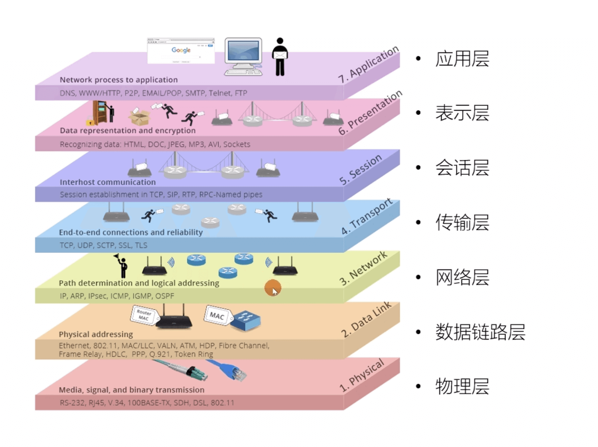
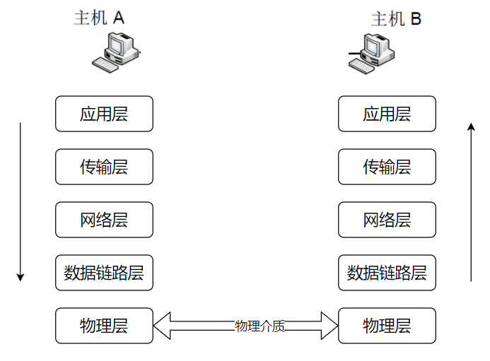
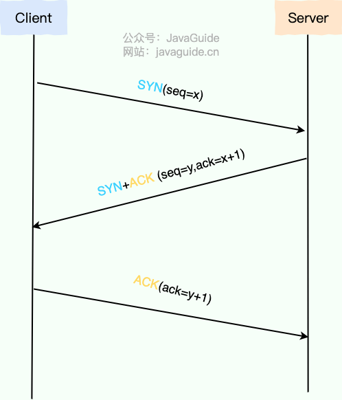
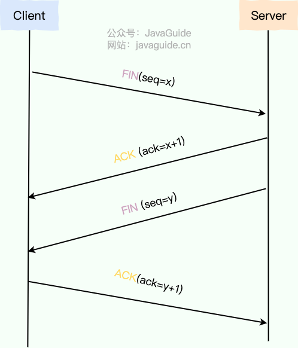
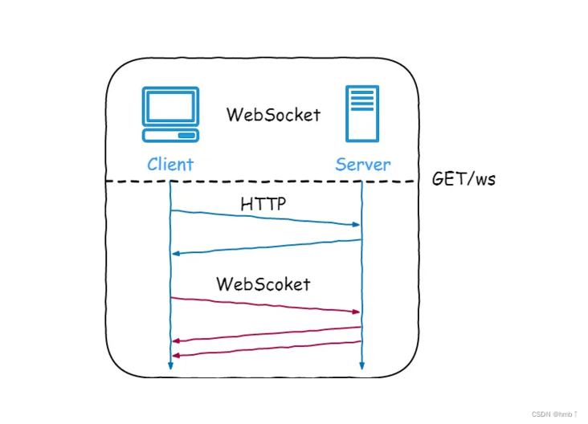

# 网络

## 简要介绍

- 电脑视角：

  1. 首先我要知道我的IP以及对方的 IP
  2. 通过子网掩码判断我们是否在同一个子网
  3. 在同个就通过arp获取对mac地址直接扔出去
  4. 不在同个就通过arp获取默认关的mac地址直接扔出去
- 交换机视角：

  1. 我收到的数据包必须有目标MAC 地址
  2. 通过MAC 地址表查映射关系
  3. 查到了就按照映射关系从我的指定端口发出去
  4. 查不到就所有端口都发出去
- 路由器视角：

  1. 我收到的数据包必须有目标 IP地址
  2. 通过路由表查映射关系
  3. 查到了就按照映射关系从我的指定端口发出去
  4. 查不到则返回一个路由不可达的数据包

交换机中有 Mac 地址表，用于映射 Mac 地址和它的端口

路由器中有路由表，用于映射 IP 地址和它的端口

电脑和路由器中都有 ARP 缓存表，用于缓存 IP 和 MAC 地址的映射关系

## 网络分层模型

### OSI 七层模型

OSI 的七层体系结构概念清楚，理论也很完整，但是它比较复杂而且不实用，而且有些功能在多个层中重复出现。

### TCP/IP 四层模型

复杂的系统需要分层，因为每一层都需要专注于一类事情。网络分层的原因也是一样，每一层只专注于做一类事情。

1. 应用层
2. 传输层
3. 网络层
4. 网络接口层

## 常见网络协议

### HTTP：超文本传输协议

==超文本传输协议（HTTP，HyperText Transfer Protocol) 是==一种用于传输超文本和多媒体内容的协议，主要是为 Web 浏览器与 Web 服务器之间的通信而设计的。当我们使用浏览器浏览网页的时候，我们网页就是通过 HTTP 请求进行加载的。

HTTP 使用客户端-服务器模型，客户端向服务器发送 HTTP Request（请求），服务器响应请求并返回 HTTP Response（响应）。

HTTP 协议基于 TCP 协议，发送 HTTP 请求之前首先要建立 TCP 连接也就是要经历 3 次握手。目前使用的 HTTP 协议大部分都是 1.1。在 1.1 的协议里面，默认是开启了 Keep-Alive 的，这样的话建立的连接就可以在多次请求中被复用了。

另外， HTTP 协议是“无状态”的协议，它无法记录客户端用户的状态，一般我们都是通过 Session 来记录客户端用户的状态。

### ⭐从输入URL到页面显示发生了什么

1. 在浏览器中输入指定的网页的URL。

   URL 由协议、域名、端口、资源路径、参数、锚点组成。
2. 浏览器通过DNS协议，获取域名对应的 IP 地址。

   DNS（Domain Name System）域名系统，要解决的是域名和 IP 地址的映射问题。
3. 浏览器根据 IP 地址和端口号，向目标服务器发起一个 TCP 连接请求。

   - **建立连接-TCP三次握手**

     

     1. 第一次握手（SYN）：

        客户端向服务端发送一个 SYN（Synchronize Sequence Numbers）报文段，其中包含一个由客户端随机生成的初始序列号（Initial Sequence Number, ISN），例如 seq\=x。发送后，客户端进入 **SYN_SEND** 状态，等待服务端的确认。
     2. 第二次握手（SYN+ACK）：服务端收到 SYN 报文段后，如果同意建立连接，会向客户端回复一个确认报文段。
     3. 第三次握手（ACK）：客户端收到服务端的 SYN+ACK 报文段后，会向服务端发送一个最终的确认报文段。该报文段包含确认号 ack\=y+1。发送后，客户端进入 ==ESTABLISHED== 状态。服务端收到这个 ACK 报文段后，也进入 ==ESTABLISHED== 状态。
   - 断开连接-TCP四次挥手

     

     1. 第一次挥手（FIN）：当客户端（任一方）决定关闭连接时，它会向服务端发送一个FIN（Finish）标志的报文段，表示自己已经没有数据要发送了。
     2. 第二次挥手（ACK）：服务端收到FIN报文段后，会立即回复一个ACK确认报文段。服务端进入==CLOSE-WAIT==状态。
     3. 第三次挥手（FIN）：当服务端确认所有待发送的数据都已经发送完毕后，它也会向客户端发送一个FIN报文段，表示自己也准备关闭连接。服务端进入LAST-ACK状态，等待客户端最终确认。
     4. 第四次挥手：客户端收到服务端的FIN报文段后，会回复一个最终的ACK确认报文段。客户端进入 TIME-WAIT状态。服务器收到这个ACK后，立即进入CLOSED状态，完成连接关闭。客户端则会在 ==TIME-WAIT== 状态下等待 2MSL（Maximum Segment Lifetime，报文段最大生存时间）后，才最终进入 ==CLOSED== 状态。

4. 浏览器在 TCP 连接上，向服务器发送一个 HTTP 请求报文，请求获取网页的内容。

   **传输层**

   由于 HTTP 协议是基于 TCP 协议的，在应用层的数据封装好以后，要交给传输层，经 TCP 协议继续封装。

   TCP 协议保证了数据传输的可靠性，是数据包传输的主力协议。

   **网络层**

   来到网络层，此时我们的主机不再是和另一台主机进行交互了，而是在和中间系统进行交互。也就是说，应用层和传输层都是端到端的协议，而网络层及以下都是中间件的协议了。

   ==网络层的核心功能——转发与路由==

   - 转发：将分组从路由器的输入端口转移到合适的输出端口。
   - 路由：确定分组从源到目的经过的路径。

5. 服务器收到 HTTP 请求报文后，处理请求，并返回 HTTP 响应报文给浏览器。

6. 浏览器收到 HTTP 响应报文后，解析响应体中的 HTML 代码，渲染网页的结构和样式，同时根据 HTML 中的其他资源的 URL（如图片、CSS、JS 等），再次发起 HTTP 请求，获取这些资源的内容，直到网页完全加载显示。

7. 浏览器在不需要和服务器通信时，可以主动关闭 TCP 连接，或者等待服务器的关闭请求。

**HTTP 状态码有哪些**

||类别|原因短语|
| -----| ----------------------------------| ----------------------------|
|1XX|Information（信息性状态码）|接收的请求正在处理|
|2XX|Success（成功状态码）|请求正常处理完毕|
|3XX|Redirection（重定向状态码）|需要进行附加操作以完成请求|
|4XX|Client Error（客户端错误状态码）|服务器无法处理请求|
|5XX|Server Error（服务器错误状态码）|服务器处理请求错误|

### ⭐HTTP 和 HTTPS 的区别

- ​**端口号**：HTTP 默认是 80，HTTPS 默认是 443。
- ​**URL 前缀**​：HTTP 的 URL 前缀是 `http://`​，HTTPS 的 URL 前缀是 `https://`。
- ​**安全性和资源消耗**：HTTP 协议运行在 TCP 之上，所有传输的内容都是明文，客户端和服务器端都无法验证对方的身份。HTTPS 是运行在 SSL/TLS 之上的 HTTP 协议，SSL/TLS 运行在 TCP 之上。所有传输的内容都经过加密，加密采用对称加密，但对称加密的密钥用服务器方的证书进行了非对称加密。所以说，HTTP 安全性没有 HTTPS 高，但是 HTTPS 比 HTTP 耗费更多服务器资源。
- ​**SEO（搜索引擎优化）** ：搜索引擎通常会更青睐使用 HTTPS 协议的网站，因为 HTTPS 能够提供更高的安全性和用户隐私保护。使用 HTTPS 协议的网站在搜索结果中可能会被优先显示，从而对 SEO 产生影响。

**信息加密：**

公钥加密，私钥解密 -> 防偷看

私钥加密（签名），公钥解密（验签） -> 防篡改

通信过程中，使用对称加密，因为非对称加密设计了复杂的数学算法，计算的代价较高。

在双方通信之前，需要商量一个用于对称加密的密钥。网络通信的信道是不安全的，传输的报文对任何人都是可见的，因此使用非对称加密，对对称加密的密钥进行加密，保护该密钥不在网络信道中被窃听。这样，只需要一次非对称加密，交换对称加密的密钥，在之后的信息通信中，使用绝对安全的密钥，对信息进行对称加密，即可保证传输消息的保密性。

为了公钥传输的信赖性问题，第三方机构应运而生——证书颁发机构（CA，Certificate Authority）。CA 默认是受信任的第三方。CA 会给各个服务器颁发证书，证书存储在服务器上，并附有 CA 的==电子签名。==

当客户端（浏览器）向服务器发送 HTTPS 请求时，一定要先获取目标服务器的证书，并根据证书上的信息，检验证书的合法性。一旦客户端检测到证书非法，就会发生错误。客户端获取了服务器的证书后，由于证书的信任性是由第三方信赖机构认证的，而证书上又包含着服务器的公钥信息，客户端就可以放心的信任证书上的公钥就是目标服务器的公钥。

总结来说，带有证书的公钥传输机制如下：

1. 设有服务器 S，客户端 C，和第三方信赖机构 CA。
2. S 信任 CA，CA 是知道 S 公钥的，CA 向 S 颁发证书。并附上 CA 私钥对消息摘要的加密签名。
3. S 获得 CA 颁发的证书，将该证书传递给 C。
4. C 获得 S 的证书，信任 CA 并知晓 CA 公钥，使用 CA 公钥对 S 证书上的签名解密，同时对消息进行散列处理，得到摘要。比较摘要，验证 S 证书的真实性。
5. 如果 C 验证 S 证书是真实的，则信任 S 的公钥（在 S 证书中）。

**HTTP/1.1 和 HTTP/2.0 区别**

- ​**多路复用（Multiplexing）** ：HTTP/2.0 在同一连接上可以同时传输多个请求和响应（可以看作是 HTTP/1.1 中长链接的升级版本），互不干扰。HTTP/1.1 则使用串行方式，每个请求和响应都需要独立的连接，而浏览器为了控制资源会有 6-8 个 TCP 连接的限制。这使得 HTTP/2.0 在处理多个请求时更加高效，减少了网络延迟和提高了性能。
- ​**二进制帧（Binary Frames）** ：HTTP/2.0 使用二进制帧进行数据传输，而 HTTP/1.1 则使用文本格式的报文。二进制帧更加紧凑和高效，减少了传输的数据量和带宽消耗。
- ​**队头阻塞**：HTTP/2 引入了多路复用技术，允许多个请求和响应在单个 TCP 连接上并行交错传输，解决了 HTTP/1.1 应用层的队头阻塞问题，但 HTTP/2 依然受到 TCP 层队头阻塞 的影响。
- ​**头部压缩（Header Compression）** ​：HTTP/1.1 支持`Body`​压缩，`Header`​不支持压缩。HTTP/2.0 支持对`Header`​压缩，使用了专门为`Header`压缩而设计的 HPACK 算法，减少了网络开销。
- ​**服务器推送（Server Push）** ：HTTP/2.0 支持服务器推送，可以在客户端请求一个资源时，将其他相关资源一并推送给客户端，从而减少了客户端的请求次数和延迟。而 HTTP/1.1 需要客户端自己发送请求来获取相关资源。

**HTTP 是不保存状态的协议，如何保存用户状态**

1. 方案一：Session（会话）配合Cookie（主流方式）：

   1. 用户登录成功后，服务器为这个用户创建一个专属的Session对象（内存中存放该用户的信息），分配一个唯一的SessionID。
   2. 服务器通过HTTP响应头中的==Set-Cookie==指令，把这个SessionID发送给用户的浏览器。
   3. 浏览器接收到SessionID后，会将其以Cookie的形式存放在本地。每次向该服务器发请求，浏览器会自动带上SessionID的Cookie。
   4. 服务器收到请求后，从Cookie中拿出SessionID，就能找到对应的Session对象。
2. 当Cookie被禁用时：URL重写（一般不用）
3. Token-based 认证（如JWT- JSON Web Tokens）

   以 JWT 为例（普通 Token 方案也可以），简化后的步骤如下

   1. 用户向服务器发送用户名、密码以及验证码用于登陆系统；
   2. 如果用户用户名、密码以及验证码校验正确的话，服务端会返回已经签名的 Token，也就是 JWT；
   3. 客户端收到 Token 后自己保存起来（比如浏览器的 `localStorage` ）；
   4. 用户以后每次向后端发请求都在 Header 中带上这个 JWT ；
   5. 服务端检查 JWT 并从中获取用户相关信息。

Cookie + Session 是最传统也最广泛使用的方式，而 Token-based 认证则在现代 Web 应用中越来越受欢迎。

### **Websocket：全双工通信协议**

一种基于 TCP 连接的全双工通信协议，即客户端和服务器可以同时发送和接收数据。

WebSocket 协议本质上是应用层的协议，用于弥补 HTTP 协议在持久通信能力上的不足。客户端和服务器仅需一次握手，两者之间就直接可以创建持久性的连接，并进行双向数据传输。

常见应用场景：

- 视频弹幕
- 实时消息推送
- 多用户协同编辑
- 社交聊天

**WebSocket 和 HTTP 有什么区别**

- WebSocket 是一种双向实时通信协议，而 HTTP 是一种单向通信协议。并且，HTTP 协议下的通信只能由客户端发起，服务器无法主动通知客户端。
- WebSocket 使用 ws:// 或 wss://（使用 SSL/TLS 加密后的协议，类似于 HTTP 和 HTTPS 的关系） 作为协议前缀，HTTP 使用 http:// 或 https:// 作为协议前缀。
- WebSocket 可以支持扩展，用户可以扩展协议，实现部分自定义的子协议，如支持压缩、加密等。
- WebSocket 通信数据格式比较轻量，用于协议控制的数据包头部相对较小，网络开销小，而 HTTP 通信每次都要携带完整的头部，网络开销较大（HTTP/2.0 使用二进制帧进行数据传输，还支持头部压缩，减少了网络开销）。

‍

### **SMTP：简单邮件传输（发送）协议**

==简单邮件传输(发送)协议（SMTP，Simple Mail Transfer Protocol）== 基于 TCP 协议，是一种用于发送电子邮件的协议。

注意 ⚠️：==接受邮件的协议不是 SMTP 而是 POP3/IMAP（也基于TCP） 协议。==

### **FTP：文件传输协议**

==FTP 协议== 基于 TCP 协议，是一种用于在计算机之间传输文件的协议，可以屏蔽操作系统和文件存储方式。

FTP 协议与其他客户服务器程序最大的不同点就在于它在两台通信的主机之间使用了两条TCP连接（其他一般只有一条TCP连接）

1. 控制连接：用于传送控制信息（命令和响应）
2. 数据连接：用于数据传送

这种将命令和数据分开传送的思想大大提高了 FTP 的效率。

FTP 是一种不安全的协议，因为它在传输过程中不会对数据进行加密。因此，FTP 传输的文件可能会被窃听或篡改。建议在传输敏感数据时使用更安全的协议，如 SFTP（SSH File Transfer Protocol，一种基于 SSH 协议的安全文件传输协议，用于在网络上安全地传输文件）。

**SSH：安全的网络传输协议**

==SSH（Secure Shell）== 基于 TCP 协议，通过加密和认证机制实现安全的访问和文件传输等业务。

SSH 的经典用途是登录到远程电脑中执行命令。除此之外，SSH 也支持隧道协议、端口映射和 X11 连接（允许用户在本地运行远程服务器上的图形应用程序）。借助 SFTP（SSH File Transfer Protocol） 或 SCP（Secure Copy Protocol） 协议，SSH 还可以安全传输文件。

### DNS

DNS（Domain Name System）域名管理系统，是当用户使用浏览器访问网址之后，使用的第一个重要协议。DNS 要解决的是域名和 IP 地址的映射问题。

在一台电脑上，可能存在浏览器 DNS 缓存，操作系统 DNS 缓存，路由器 DNS 缓存。如果以上缓存都查询不到，那么 DNS 就闪亮登场了。

目前 DNS 的设计采用的是分布式、层次数据库结构，DNS 是应用层协议，它可以在 UDP 或 TCP 协议之上运行，端口为 53 。

## 传输层与网络层相关

### ⭐TCP与UDP的区别

1. ​**是否面向连接**：

   - TCP 是面向连接的。在传输数据之前，必须先通过“三次握手”建立连接；数据传输完成后，还需要通过“四次挥手”来释放连接。这保证了双方都准备好通信。
   - UDP 是无连接的。发送数据前不需要建立任何连接，直接把数据包（数据报）扔出去。
2. ​**是否是可靠传输**：

   - TCP 提供可靠的数据传输服务。它通过序列号、确认应答 (ACK)、超时重传、流量控制、拥塞控制等一系列机制，来确保数据能够无差错、不丢失、不重复且按顺序地到达目的地。
   - UDP 提供不可靠的传输。它尽最大努力交付 (best-effort delivery)，但不保证数据一定能到达，也不保证到达的顺序，更不会自动重传。收到报文后，接收方也不会主动发确认。
3. ​**是否有状态**：

   - TCP 是有状态的。因为要保证可靠性，TCP 需要在连接的两端维护连接状态信息，比如序列号、窗口大小、哪些数据发出去了、哪些收到了确认等。
   - UDP 是无状态的。它不维护连接状态，发送方发出数据后就不再关心它是否到达以及如何到达，因此开销更小。
4. ​**传输效率**：

   - TCP 因为需要建立连接、发送确认、处理重传等，其开销较大，传输效率相对较低。
   - UDP 结构简单，没有复杂的控制机制，开销小，传输效率更高，速度更快。
5. ​**传输形式**：

   - TCP 是面向字节流 (Byte Stream) 的。它将应用程序交付的数据视为一连串无结构的字节流，可能会对数据进行拆分或合并。
   - UDP 是面向报文 (Message Oriented) 的。应用程序交给 UDP 多大的数据块，UDP 就照样发送，既不拆分也不合并，保留了应用程序消息的边界。
6. ​**首部开销**：

   - TCP 的头部至少需要 20 字节，如果包含选项字段，最多可达 60 字节。
   - UDP 的头部非常简单，固定只有 8 字节。
7. ​**是否提供广播或多播服务**：

   - TCP 只支持点对点 (Point-to-Point) 的单播通信。
   - UDP 支持一对一 (单播)、一对多 (多播/Multicast) 和一对所有 (广播/Broadcast) 的通信方式。

**HTTP基于 TCP 还是 UDP**

HTTP/3.0 之前是基于TCP协议的，HTTP/3.0将弃用TCP，改用基于UDP协议的QUIC协议。

### TCP 如何保证传输的可靠性

1. ​**基于数据块传输**：应用数据被分割成 TCP 认为最适合发送的数据块，再传输给网络层，数据块被称为报文段或段。
2. ​**对失序数据包重新排序以及去重**：TCP 为了保证不发生丢包，就给每个包一个序列号，有了序列号能够将接收到的数据根据序列号排序，并且去掉重复序列号的数据就可以实现数据包去重。
3. **校验和** : TCP 将保持它首部和数据的检验和。这是一个端到端的检验和，目的是检测数据在传输过程中的任何变化。如果收到段的检验和有差错，TCP 将丢弃这个报文段和不确认收到此报文段。
4. **重传机制** : 在数据包丢失或延迟的情况下，重新发送数据包，直到收到对方的确认应答（ACK）。TCP 重传机制主要有：基于计时器的重传（也就是超时重传）、快速重传（基于接收端的反馈信息来引发重传）、SACK（在快速重传的基础上，返回最近收到的报文段的序列号范围，这样客户端就知道，哪些数据包已经到达服务器了）、D-SACK（重复 SACK，在 SACK 的基础上，额外携带信息，告知发送方有哪些数据包自己重复接收了）。
5. **流量控制** : TCP 连接的每一方都有固定大小的缓冲空间，TCP 的接收端只允许发送端发送接收端缓冲区能接纳的数据。当接收方来不及处理发送方的数据，能提示发送方降低发送的速率，防止包丢失。TCP 使用的流量控制协议是可变大小的滑动窗口协议（TCP 利用滑动窗口实现流量控制）。
6. **拥塞控制** : 当网络拥塞时，减少数据的发送。TCP 在发送数据的时候，需要考虑两个因素：一是接收方的接收能力，二是网络的拥塞程度。接收方的接收能力由滑动窗口表示，表示接收方还有多少缓冲区可以用来接收数据。网络的拥塞程度由拥塞窗口表示，它是发送方根据网络状况自己维护的一个值，表示发送方认为可以在网络中传输的数据量。发送方发送数据的大小是滑动窗口和拥塞窗口的最小值，这样可以保证发送方既不会超过接收方的接收能力，也不会造成网络的过度拥塞。

**TCP利用流量窗口来实现流量控制**

流量控制是为了控制发送方发送速率，保证接收方来得及接收。

### IP

==IP（Internet Protocol，网际协议）== 是 TCP/IP 协议中最重要的协议之一，属于网络层的协议，主要作用是定义数据包的格式、对数据包进行路由和寻址，以便它们可以跨网络传播并到达正确的目的地。

### IPv4 和 IPv6 的区别

IPv6的优势：

- 地址空间更大
- 无状态地址自动配置（Stateless Address Autoconfiguration，简称 SLAAC）：主机可以直接通过根据接口标识和网络前缀生成全局唯一的 IPv6 地址，而无需依赖 DHCP（Dynamic Host Configuration Protocol）服务器，简化了网络配置和管理。
- NAT（Network Address Translation，网络地址转换） 成为可选项：IPv6 地址资源充足，可以给全球每个设备一个独立的地址。

### NAT 的作用

==NAT（Network Address Translation，网络地址转换）== 主要用于在不同网络之间转换 IP 地址。它允许将私有 IP 地址（如在局域网中使用的 IP 地址）映射为公有 IP 地址（在互联网中使用的 IP 地址）或者反向映射，从而实现局域网内的多个设备通过单一公有 IP 地址访问互联网。

NAT 协议，在 LAN 中的主机在与 LAN 外界通信时，起到了地址转换的关键作用。

### ARP

**MAC地址**

MAC 地址的全称是 ==媒体访问控制地址（Media Access Control Address）==。如果说，互联网中每一个资源都由 IP 地址唯一标识（IP 协议内容），那么一切网络设备都由 MAC 地址唯一标识。

MAC 地址有一个特殊地址：FF-FF-FF-FF-FF-FF（全 1 地址），该地址表示广播地址。

ARP 协议，全称 ==地址解析协议（Address Resolution Protocol）==，它解决的是网络层地址和链路层地址之间的转换问题。因为一个 IP 数据报在物理上传输的过程中，总是需要知道下一跳（物理上的下一个目的地）该去往何处，但 IP 地址属于逻辑地址，而 MAC 地址才是物理地址，ARP 协议解决了 IP 地址转 MAC 地址的一些问题。
