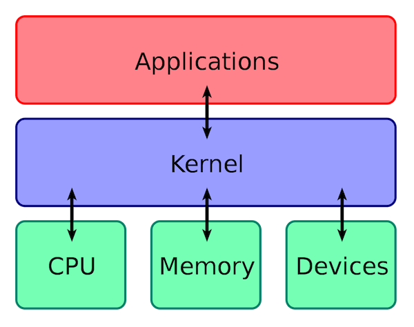
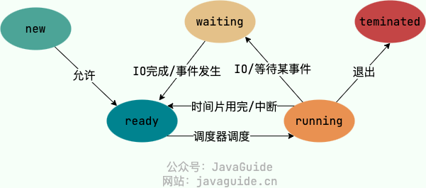
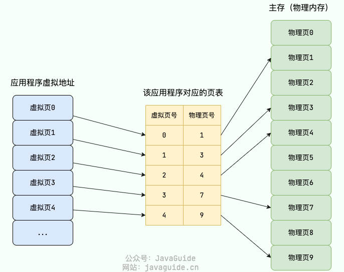

# 操作系统

## 操作系统基础

**应用程序、内核、CPU的关系**

**操作系统的主要功能**

1. ​**进程和线程的管理**：进程的创建、撤销、阻塞、唤醒，进程间的通信等。
2. ​**存储管理**：内存的分配和管理、外存（磁盘等）的分配和管理等。
3. ​**文件管理**：文件的读、写、创建及删除等。
4. ​**设备管理**：完成设备（输入输出设备和外部存储设备等）的请求或释放，以及设备启动等功能。
5. ​**网络管理**：操作系统负责管理计算机网络的使用。网络是计算机系统中连接不同计算机的方式，操作系统需要管理计算机网络的配置、连接、通信和安全等，以提供高效可靠的网络服务。
6. **安全管理**：用户的身份认证、访问控制、文件加密等，以防止非法用户对系统资源的访问和操作。

**常见的操作系统**

- Windows
- Unix
- GNU/Linux

  严格来讲，Linux 这个词本身只表示 Linux 内核，在 GNU/Linux 系统中，Linux 实际就是 Linux 内核，而该系统的其余部分主要是由 GNU 工程编写和提供的程序组成。
- MacOS

### **用户态和内核态**

- 用户态

  用户态运行的进程可以直接读取用户程序的数据，拥有较低的权限。当应用程序需要执行某些需要特殊权限的操作，例如读写磁盘、网络通信等，就需要向操作系统发起系统调用请求，进入内核态。
- 内核态

  内核态运行的进程几乎可以访问计算机的任何资源包括系统的内存空间、设备、驱动程序等，不受限制，拥有非常高的权限。当操作系统接收到进程的系统调用请求时，就会从用户态切换到内核态，执行相应的系统调用，并将结果返回给进程，最后再从内核态切换回用户态。

进入内核态需要付出较高的开销（需要进行一系列的上下文切换和权限检查），应该尽量减少进入内核态的次数，以提高系统的性能和稳定性。

**用户态和内核态如何切换**

用户态切换到内核态的3种方式：

1. ​**系统调用（Trap）** ​：这是最主要的方式，是应用程序==主动==发起的。比如，当我们的程序需要读取一个文件或者发送网络数据时，它无法直接操作磁盘或网卡，就必须调用操作系统提供的接口（如 `read()`​,`send()`), 这会触发一次从用户态到内核态的切换。
2. ​**中断（Interrupt）** ​：这是==被动==的，由外部硬件设备触发。比如，当硬盘完成了数据读取，会向 CPU 发送一个中断信号，CPU 会暂停当前用户态的程序，切换到内核态去处理这个中断。
3. ​**异常（Exception）** ​：这也是==被动==的，由程序自身错误引起。比如，我们的代码执行了一个除以零的操作，或者访问了一个非法的内存地址（缺页异常），CPU 会捕获这个异常，并切换到内核态去处理它。

### **系统调用**

**什么是系统调用**

我们运行的程序基本都是运行在用户态，如果需要调用操作系统提供的内核态的功能就需要系统调用。

系统调用和普通库函数调用非常相似，只是系统调用由操作系统内核提供，运行于内核态，而普通的库函数调用由函数库或用户自己提供，运行于用户态。

**系统调用的过程**

1. 用户态的程序发起系统调用，因为系统调用中涉及一些特权指令（只能由操作系统内核态执行的指令），用户态程序权限不足，因此会中断执行，也就是 Trap（Trap 是一种中断）。

2. 发生中断后，当前 CPU 执行的程序会中断，跳转到中断处理程序。内核程序开始执行，也就是开始处理系统调用。
3. 当系统调用处理完成后，操作系统使用特权指令（如 `iret`​、`sysret`​ 或 `eret`）切换回用户态，恢复用户态的上下文，继续执行用户程序。

## 进程和线程

### **进程和线程的区别**

- **资源所有权：**  进程是资源分配的基本单位，拥有独立的地址空间；而线程是 CPU 调度的基本单位，几乎不拥有系统资源，只保留少量私有数据（PC、栈、寄存器），主要共享其所属进程的资源。
- **开销：**  创建或销毁一个进程的开销很大，需要分配独立的资源。而创建或销毁线程的开销就小得多。同理，进程间的上下文切换开销远大于线程间的切换。
- **健壮性：**  进程之间是隔离的，一个进程崩溃不会影响其他进程。但一个进程内的线程之间是共享资源的，一个线程操作失误（比如一个线程访问了非法内存）可能会导致整个进程崩溃。

### **为什么需要线程**

核心原因就是为了在单个应用内实现低开销、高效率的并发。

如果我想让微信同时接收消息和发送文件，如果用两个进程来实现，不仅资源开销巨大，它们之间通信还非常麻烦（需要 IPC）。而使用两个线程，它们不仅切换成本低，还能直接通过共享内存高效通信，从而能更好地利用多核 CPU，提升应用的响应速度和吞吐量。

### **线程之间的同步方式**

1. **互斥锁(Mutex)**  ：采用互斥对象机制，只有拥有互斥对象的线程才有访问公共资源的权限。因为互斥对象只有一个，所以可以保证公共资源不会被多个线程同时访问。比如 Java 中的 `synchronized`​ 关键词和各种 `Lock` 都是这种机制。
2. **读写锁（Read-Write Lock）**  ：允许多个线程同时读取共享资源，但只有一个线程可以对共享资源进行写操作。
3. **信号量(Semaphore)**  ：它允许同一时刻多个线程访问同一资源，但是需要控制同一时刻访问此资源的最大线程数量。
4. **屏障（Barrier）**  ：屏障是一种同步原语，用于等待多个线程到达某个点再一起继续执行。当一个线程到达屏障时，它会停止执行并等待其他线程到达屏障，直到所有线程都到达屏障后，它们才会一起继续执行。比如 Java 中的 `CyclicBarrier` 是这种机制。
5. **事件(Event)**  :Wait/Notify：通过通知操作的方式来保持多线程同步，还可以方便的实现多线程优先级的比较操作。

### **PCB**

==PCB（Process Control Block）== 即进程控制块，是操作系统中用来管理和跟踪进程的数据结构，每个进程都对应着一个独立的 PCB。

当操作系统创建一个新进程时，会为该进程分配一个唯一的进程 ID，并且为该进程创建一个对应的进程控制块。当进程执行时，PCB 中的信息会不断变化，操作系统会根据这些信息来管理和调度进程。

### **进程的状态**

- ​**创建状态(new)** ：进程正在被创建，尚未到就绪状态。
- ​**就绪状态(ready)** ：进程已处于准备运行状态，即进程获得了除了处理器之外的一切所需资源，一旦得到处理器资源(处理器分配的时间片)即可运行。
- ​**运行状态(running)** ：进程正在处理器上运行(单核 CPU 下任意时刻只有一个进程处于运行状态)。
- ​**阻塞状态(waiting)** ：又称为等待状态，进程正在等待某一事件而暂停运行如等待某资源为可用或等待 IO 操作完成。即使处理器空闲，该进程也不能运行。
- **结束状态(terminated)** ：进程正在从系统中消失。可能是进程正常结束或其他原因中断退出运行。

### **进程间的通信**

1. ==管道/匿名管道(Pipes)== ：用于具有亲缘关系的父子进程间或者兄弟进程之间的通信。
2. ==有名管道(Named Pipes)== : 匿名管道由于没有名字，只能用于亲缘关系的进程间通信。为了克服这个缺点，提出了有名管道。有名管道严格遵循 先进先出(First In First Out) 。有名管道以磁盘文件的方式存在，可以实现本机任意两个进程通信。
3. ==信号(Signal)== ：信号是一种比较复杂的通信方式，用于通知接收进程某个事件已经发生；
4. ==消息队列(Message Queuing)== ：消息队列是消息的链表，具有特定的格式，存放在内存中并由消息队列标识符标识。管道和消息队列的通信数据都是先进先出的原则。与管道（无名管道：只存在于内存中的文件；命名管道：存在于实际的磁盘介质或者文件系统）不同的是消息队列存放在内核中，只有在内核重启(即，操作系统重启)或者显式地删除一个消息队列时，该消息队列才会被真正的删除。消息队列可以实现消息的随机查询，消息不一定要以先进先出的次序读取，也可以按消息的类型读取。比 FIFO 更有优势。消息队列克服了信号承载信息量少，管道只能承载无格式字 节流以及缓冲区大小受限等缺点。
5. ==信号量(Semaphores)== ：信号量是一个计数器，用于多进程对共享数据的访问，信号量的意图在于进程间同步。这种通信方式主要用于解决与同步相关的问题并避免竞争条件。
6. ==共享内存(Shared memory)== ：使得多个进程可以访问同一块内存空间，不同进程可以及时看到对方进程中对共享内存中数据的更新。这种方式需要依靠某种同步操作，如互斥锁和信号量等。可以说这是最有用的进程间通信方式。
7. ==套接字(Sockets)== : 此方法主要用于在客户端和服务器之间通过网络进行通信。套接字是支持 TCP/IP 的网络通信的基本操作单元，可以看做是不同主机之间的进程进行双向通信的端点，简单的说就是通信的两方的一种约定，用套接字中的相关函数来完成通信过程。

### **进程的调度算法**

第一类：非抢占式调度 (Non-Preemptive)

这种方式下，一旦 CPU 分配给一个进程，它就会一直运行下去，直到任务完成或主动放弃（比如等待 I/O）。

1. ==先到先服务调度算法(FCFS，First Come, First Served) :== 这是最简单的，就像排队，谁先来谁先用。优点是公平、实现简单。但缺点很明显，如果一个很长的任务先到了，后面无数个短任务都得等着，这会导致平均等待时间很长，我们称之为“护航效应”。
2. ==短作业优先的调度算法(SJF，Shortest Job First)== : 从就绪队列中选出一个估计运行时间最短的进程为之分配资源。理论上，它的平均等待时间是最短的，吞吐量很高。但缺点是，它需要预测运行时间，这很难做到，而且可能会导致长作业“饿死”，永远得不到执行。

第二类：抢占式调度 (Preemptive)

操作系统可以强制剥夺当前进程的 CPU 使用权，分配给其他更重要的进程。现代操作系统基本都采用这种方式。

- ==时间片轮转调度算法（RR，Round-Robin）== : 这是最经典、最公平的抢占式算法。它给每个进程分配一个固定的时间片，用完了就把它放到队尾，切换到下一个进程。它非常适合分时系统，保证了每个进程都能得到响应，但时间片的设置很关键：太长了退化成 FCFS，太短了则会导致过于频繁的上下文切换，增加系统开销。
- ==优先级调度算法（Priority）==：每个进程都有一个优先级，进程调度器总是选择优先级最高的进程，具有相同优先级的进程以 FCFS 方式执行。这很灵活，可以根据内存要求，时间要求或任何其他资源要求来确定优先级，但同样可能导致低优先级进程“饿死”。

前面介绍的几种进程调度的算法都有一定的局限性，如：短进程优先的调度算法，仅照顾了短进程而忽略了长进程 。那有没有一种结合了上面这些进程调度算法优点的呢？

==多级反馈队列调度算法（MFQ，Multi-level Feedback Queue）== 是现实世界中最常用的一种算法，比如早期的 UNIX。它非常聪明，结合了 RR 和优先级调度。它设置了多个不同优先级的队列，每个队列使用 RR 调度，时间片大小也不同。新进程先进入最高优先级队列；如果在一个时间片内没执行完，就会被降级到下一个队列。这样既照顾了短作业（在高优先级队列中快速完成），也保证了长作业不会饿死（最终会在低优先级队列中得到执行），是一种非常均衡的方案。

### **死锁**

**什么是死锁**

死锁（Deadlock）描述的是这样一种情况：多个进程/线程同时被阻塞，它们中的一个或者全部都在等待某个资源被释放。由于进程/线程被无限期地阻塞，因此程序不可能正常终止。

**死锁产生的条件**

1. ==互斥==：资源必须处于非共享模式，即一次只有一个进程可以使用。如果另一进程申请该资源，那么必须等待直到该资源被释放为止。
2. ==占有并等待==：一个进程至少应该占有一个资源，并等待另一资源，而该资源被其他进程所占有。
3. ==非抢占==：资源不能被抢占。只能在持有资源的进程完成任务后，该资源才会被释放。
4. ==循环等待==：有一组等待进程 {P0, P1,..., Pn}， P0 等待的资源被 P1 占有，P1 等待的资源被 P2 占有，……，Pn-1 等待的资源被 Pn 占有，Pn 等待的资源被 P0 占有。

## 内存管理

### 虚拟内存

==虚拟内存(Virtual Memory)== 是计算机系统内存管理非常重要的一个技术，本质上来说它只是逻辑存在的，是一个假想出来的内存空间，主要作用是作为进程访问主存（物理内存）的桥梁并简化内存管理。

虚拟内存提供了下面这些能力：

- 隔离进程：物理内存通过虚拟地址空间访问，虚拟地址空间与进程一一对应。每个进程都认为自己拥有了整个物理内存，进程之间彼此隔离，一个进程中的代码无法更改正在由另一进程或操作系统使用的物理内存。
- 提升物理内存利用率：有了虚拟地址空间后，操作系统只需要将进程当前正在使用的部分数据或指令加载入物理内存。
- 简化内存管理：进程都有一个一致且私有的虚拟地址空间，程序员不用和真正的物理内存打交道，而是借助虚拟地址空间访问物理内存，从而简化了内存管理。
- 多个进程共享物理内存：进程在运行过程中，会加载许多操作系统的动态库。这些库对于每个进程而言都是公用的，它们在内存中实际只会加载一份，这部分称为共享内存。
- 提高内存使用安全性：控制进程对物理内存的访问，隔离不同进程的访问权限，提高系统的安全性。
- 提供更大的可使用内存空间：可以让程序拥有超过系统物理内存大小的可用内存空间。这是因为当物理内存不够用时，可以利用磁盘充当，将物理内存页（通常大小为 4 KB）保存到磁盘文件（会影响读写速度），数据或代码页会根据需要在物理内存与磁盘之间移动。

**虚拟地址和物理地址**

==物理地址（Physical Address）== 是真正的物理内存中地址，更具体点来说是内存地址寄存器中的地址。程序中访问的内存地址不是物理地址，而是 ==虚拟地址（Virtual Address）== 。

操作系统一般通过 CPU 芯片中的一个重要组件 MMU(Memory Management Unit，内存管理单元) 将虚拟地址转换为物理地址，这个过程被称为 地址翻译/地址转换（Address Translation） 。

**虚拟地址空间和物理地址空间**

- 虚拟地址空间是虚拟地址的集合，是虚拟内存的范围。每一个进程都有一个一致且私有的虚拟地址空间。
- 物理地址空间是物理地址的集合，是物理内存的范围。

**分段机制**

==分段机制（Segmentation）== 以段(一段 ==连续== 的物理内存)的形式管理/分配物理内存。应用程序的虚拟地址空间被分为大小不等的段，段是有实际意义的，每个段定义了一组逻辑信息，例如有主程序段 MAIN、子程序段 X、数据段 D 及栈段 S 等。

**分页机制**

==分页机制（Paging）== 把主存（物理内存）分为连续等长的物理页，应用程序的虚拟地址空间划也被分为连续等长的虚拟页。现代操作系统广泛采用分页机制。

页是连续等长的，不同于分段机制下不同长度的段。

在分页机制下，应用程序虚拟地址空间中的任意虚拟页可以被映射到物理内存中的任意物理页上，因此可以实现物理内存资源的离散分配。分页机制按照固定页大小分配物理内存，使得物理内存资源易于管理，可有效避免分段机制中外部内存碎片的问题。

**页表**

分页管理通过 ==页表（Page Table）== 映射虚拟地址和物理地址。

在分页机制下，每个进程都会有一个对应的页表。

## 文件系统

### **硬链接和软链接区别**

在 Linux/类 Unix 系统上，文件链接（File Link）是一种特殊的文件类型，可以在文件系统中指向另一个文件。常见的文件链接类型有两种：

1. 硬链接（Hard Link）

   每个文件和目录都有一个唯一的索引节点（inode）号，用来标识该文件或目录。硬链接通过 inode 节点号建立连接，硬链接和源文件的 inode 节点号相同，两者对文件系统来说是完全平等的。
2. 软链接

   软链接和源文件的 inode 节点号不同，而是指向一个文件路径。软连接类似于 Windows 系统中的快捷方式。
