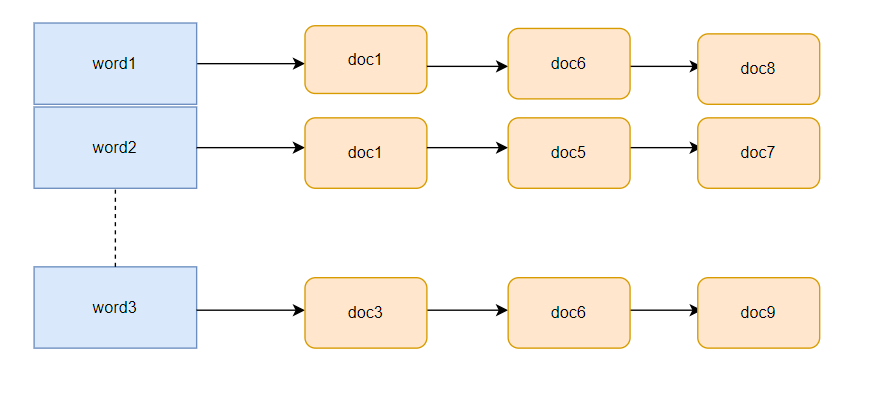
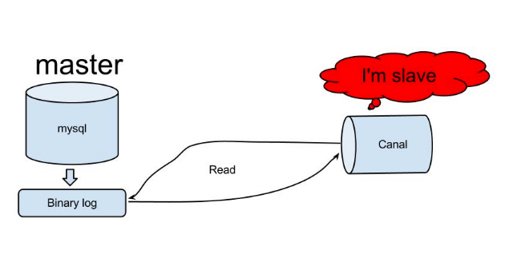

# Elasticsearch

## Elasticsearch 是什么

ElasticSearch 是一个开源的 分布式、RESTful 搜索和分析引擎，可以用来解决使用数据库进行模糊搜索时存在的性能问题，适用于所有类型的数据，包括文本、数字、地理空间、结构化和非结构化数据。

ElasticSearch 使用 Java 语言开发，基于 Lucence。ES 早期版本需要 JDK，在 7.X 版本后已经集成了 JDK，已无需第三方依赖。

## 为什么需要Elasticsearch

Elasticsearch 主要为系统提供搜索功能， MySQL 这类传统关系型数据库主要为系统提供数据存储功能。

1)传统关系型数据库的痛点：

- 传统关系型数据库(如 MySQL )在大数据量下查询效率低下， 模糊匹配有可能导致全表扫描。
- MySQL 全文索引只支持 CHAR，VARCHAR 或者 TEXT 字段类型，不支持分词器。

2)Elasticsearch 的优势 ：

- 支持多种数据类型，非结构化，数值，地理信息。
- 简单的 RESTful API，天生的兼容多语言开发。
- 提供更丰富的分词器，支持热点词汇查询。
- 近实时查询，Elasticsearch 每隔 1s 把数据存储至系统缓存中，且使用倒排索引提高检索效率。
- 支持相关性搜索，可以根据条件对结果进行打分。
- 天然分布式存储，使用分片支持更大的数据量。

## Elasticsearch 基本概念

- **Index（索引）** ： 作为名词理解的话，索引是一类拥有相似特征的文档的集合比如商品索引、商家索引、订单索引，有点类似于 MySQL 中的 Table（表）。作为动词理解的话，索引就是将一份文档保存在一个索引中。
- **Document（文档）** ：可搜索最小单位，用于存储数据。索引中的每一条数据叫作一个文档，一般为 JSON 格式，有点类似于 MySQL 中的 Row（行）。文档由一个或者多个字段(Field)组成，字段类型可以是布尔，数值，字符串、二进制、日期等数据类型。
- **Type（字段类型）** : 每个文档在 ES 中都必须设定它的类型。ES 7.0 之前，一个 Index 可以有多个 Type。6.0 开始，Type 已经被 Deprecated。7.0 开始，一个索引只能创建一个 Type ：`_doc`。8.0 之后，Type 被完全删除，解决了多 Type 索引带来的资源浪费、字段冲突、查询效率低下等问题，移除的具体的原因看这里：[https://www.elastic.co/guide/en/elasticsearch/reference/7.17/removal-of-types.html](https://www.elastic.co/guide/en/elasticsearch/reference/7.17/removal-of-types.html) 。
- **Mapping（映射）** ：定义字段名称、数据类型、优化信息（比如是否索引)、分词器，有点类似于数据库中的表结构定义（Schema）。6.x 及更早版本中，一个 Index 对应多个 Mapping。7.x 开始，一个 Index 对应一个 Mapping。
- **Node（节点）** : 相当于一个 ES 实例，多个节点构成一个集群。
- **Cluster（集群）** ：多个 ES 节点的集合，用于解决单个节点无法处理的搜索需求和数据存储需求。
- **Shard（分片）**: Index（索引）被分为多个碎片存储在不同的 Node 节点上的分片中，以提高性能和吞吐量。
- **Replica（副本）** ：Index 副本，每个 Index 有一个或多个副本，以提高拓展功能和吞吐量。
- **DSL(查询语言)** ：基于 JSON 的查询语言，类似于 SQL 语句。

## 倒排索引

### 倒排索引是什么

倒排索引 也被称作反向索引（inverted index），是用于提高数据检索速度的一种数据结构，空间消耗比较大。倒排索引首先将检索文档进行分词得到多个词语/词条，然后将词语和文档 ID 建立关联，从而提高检索效率。



- **文档（Document）** ：用来搜索的数据，其中的每一条数据就是一个文档。例如一个商品信息、商家信息、一页网页的内容。
- **词语/词条（Term）** ：对文档数据或用户搜索数据，利用某种算法分词，得到的具备含义的词语就是词条。例如 `"数据库索引可以大幅提高查询速度"` 这段话被中文分词器 IK Analyzer 细粒度分词后得到`[数据库,索引,可以,大幅,提高,查询,速度]`。
- **词典（Term Dictionary）** ：Term 的集合。

### 倒排索引的创建和检索流程

**创建流程：**

1. 建立文档列表，每个文档都有一个唯一的文档 ID 与之对应。
2. 通过分词器对文档进行分词，生成类似于 `<词语，文档ID>` 的一组组数据。
3. 将词语作为索引关键字，记录下词语和文档的对应关系，也就是哪些文档中包含了该词语。

这里可以记录更多信息比如词语的位置、词语出现的频率，这样可以方便高亮显示以及对搜索结果进行排序。

**检索流程：**

1. 根据分词查找对应文档 ID
2. 根据文档 ID 找到文档

### Elasticsearch 如何针对某些字段不做索引

在 `Mapping` 中设置属性 `index = false`，则该字段不可作为检索条件，但结果中还是包含该字段。

## 分词器

分词器是搜索引擎的一个核心组件，负责对文档内容进行分词(在 ES 里面被称为 **Analysis**)，也就是将一个文档转换成 **单词词典（Term Dictionary）** 。单词词典是由文档中出现过的所有单词构成的字符串集合。为了满足不同的分词需求，分词器有很多种，不同的分词器分词逻辑可能会不一样。

### 中文分词器

IK Analyzer：最常用的开源中文分词器。包括两种模式：

- **ik_max_word**：细粒度切分模式，会将文本做最细粒度的拆分，尽可能多的拆分出词语。
- **ik_smart**：智能模式，会做最粗粒度的拆分，已被分出的词语将不会再次被其它词语占有。

## 数据类型

**常见数据类型：**

+ 关键词： `keyword` 、`constant_keyword`，和 `wildcard`
+ 数值型：`long`, `integer`, `short`, `byte`, `double`, `float`, `half_float`, `scaled_float`
+ 布尔型：`boolean`
+ 日期型：`date`, `date_nanos`
+ 二进制：`binary`

**结构化数据类型：**

+ 范围型：`integer_range`, `float_range`, `long_range`, `double_range`, `date_range`
+ ip 地址类型 ：`ip`
+ 软件版本 ：`version`

**文本搜索类型：**

+ 非结构化文本 ： `text`
+ 包含特殊标记的文本：`annotated-text`
+ 自动完成建议： `completion`

**对象和关系类型：**

+ 嵌套类型： `nested` 、`join`
+ 对象类型 ： `object`、`flattened`

**空间类型：**

+ 地理坐标类型 ：`geo_point`
+ 地理形状类型 ： `geo_shape`

### keyword 和 text 有什么区别

`keyword` 不走分词器，而 `text` 会走分词器，使用 `keyword` 关键字查询效率更高，一般在 `fields` 中定义`keyword`类型字段

## Mapping

Mapping（映射）定义字段名称、数据类型、优化信息（比如是否索引)、分词器，有点类似于数据库中的表结构定义。一个 Index 对应一个 Mapping。

Mapping 分为动态 Mapping 和显示 Mapping 两种：

+ 动态 Mapping：根据待索引数据自动建立索引、自动定义映射类型。
+ 显示 Mapping：手动控制字段的存储和索引方式比如哪些字符串字段应被视为全文字段。

```json
// 显示映射创建索引
PUT /my-index-000001
{
  "mappings": {
    "properties": {
      "age":    { "type": "integer" },
      "email":  { "type": "keyword"  },
      "name":   { "type": "text"  }
    }
  }
}
```

## 如何分页

Elasticsearch 主要提供了三种分页方式：`from + size`，`scroll` 和 `sort + search_after`。

1. `from + size` 分页

`from` + `size` 分页机制类似于 SQL 中的 `LIMIT` 和 `OFFSET`，通过指定 `from`（起始偏移量）和 `size`（每页返回的记录数）来获取特定页的数据。

```json
GET /my-index/_search
{
  "query": {
    "match_all": {}
  },
  "from": 10,  // 跳过前 10 条记录
  "size": 20   // 返回接下来的 20 条记录
}
```

这种分页方式简单直观，适合在数据量较小或分页深度不大的场景下使用，例如只需要获取前几页数据的情况。

2. `scroll` 分页

`scroll` 可以处理大量数据，并且在分页过程中保持数据一致性。适用于需要遍历大量数据（如全量导出）的场景。

```json
// 初始化 scroll 请求，创建一个 scroll 上下文，保存当前查询的快照
GET /my-index/_search?scroll=1m
{
  "query": {
    "match_all": {}
  },
  "size": 100  // 每次返回 100 条记录
}

// 使用返回的 scroll_id 获取下一页数据
GET /_search/scroll
{
  "scroll": "1m",  // 指定 scroll 上下文的有效期
  "scroll_id": "DXF1ZXJ5QW5kRmV0Y2gBAAAAAAAAABZWMjJDZ3Z1RlEtOUc1T1pNZnVtUncAAAAAAAABF..."
}
```

`scroll`不适合实时分页

3. `sort` + `search_after` 分页

在 Elasticsearch 中，推荐的分页方式是 `sort` + `search_after`( 5.0 版本及之后的版本才有)，它在深度分页时比 `from` + `size` 更具性能优势，也比 `scroll` 更适合实时分页的场景。

优势：

+ **避免深度分页性能问题:** 与 `from + size` 不同，`search_after` 不需要 Elasticsearch 计算和存储大量中间结果， 因此在深度分页时效率更高。
+ **资源占用少:** `search_after` 只需要记录上一页最后一条数据的排序值，相比 `scroll` 机制需要维护大量数据上下文，占用的资源更少。
+ **稳定的排序结果:** `search_after` 基于排序值定位下一页数据，保证了即使数据更新，分页结果的顺序依然稳定可靠。

## 数据同步

可以将同步类型分为 **全量同步**和**增量同步**。

全量同步即建好 Elasticsearch 索引后一次性导入 MySQL 所有数据。全量同步有很多现成的工具可以用比如 go-mysql-elasticsearch、Datax。

增量同步即对 MySQL 中新增，修改，删除的数据进行同步：

+ **异步双写** ：修改数据时，使用 MQ 异步写入 Elasticsearch 提高效率。这种方式引入了新的组件和服务，增加了系统整体复杂性。
+ **定时器** ：定时同步数据到 Elasticsearch。这种方式时效性差，通常用于数据实时性不高的场景。
+ **binlog 同步组件 Canal(推荐)** ： 使用 Canal 可以做到业务代码完全解耦，API 完全解耦，零代码实现准实时同步, Canal 通过解析 MySQL 的 binlog 日志文件进行数据同步。

### Canal 增量同步 Elasticsearch 的原理

1. Canal 模拟 MySQL Slave 节点与 MySQL Master 节点的交互协议，把自己伪装成一个 MySQL Slave 节点，向 MySQL Master 节点请求 binlog；
2. MySQL Master 节点接收到请求之后，根据偏移量将新的 binlog 发送给 MySQL Slave 节点；
3. Canal 接收到 binlog 之后，就可以对这部分日志进行解析，获取主库的结构及数据变更。




