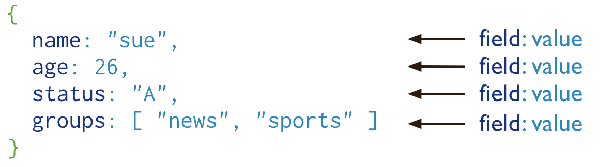

# MongoDB

MongoDB 是一个基于 ==分布式文件存储== 的开源 NoSQL 数据库系统，由 C++ 编写。

MongoDB 提供了 面向文档 的存储方式，操作起来比较简单和容易，支持“无模式”的数据建模，可以存储比较复杂的数据类型，是一款非常流行的 ==文档类型数据库== 。

## 存储结构

MongoDB 的存储结构区别于传统的关系型数据库，主要由如下三个单元组成：

- ==文档（Document）==：MongoDB 中最基本的单元，由 BSON 键值对（key-value）组成，类似于关系型数据库中的行（Row）。
- ==集合（Collection）==：一个集合可以包含多个文档，类似于关系型数据库中的表（Table）。
- ==数据库（Database）==：一个数据库中可以包含多个集合，可以在 MongoDB 中创建多个数据库，类似于关系型数据库中的数据库（Database）。

也就是说，MongoDB 将数据记录存储为文档 （更具体来说是[BSON 文档](https://www.mongodb.com/docs/manual/core/document/#std-label-bson-document-format)），这些文档在集合中聚集在一起，数据库中存储一个或多个文档集合。

|SQL|MongoDB|
| --------------------------| ---------------------------------|
|表（Table）|集合（Collection）|
|行（Row）|文档（Document）|
|列（Col）|字段（Field）|
|主键（Primary Key）|对象 ID（Objectid）|
|索引（Index）|索引（Index）|
|嵌套表（Embedded Table）|嵌入式文档（Embedded Document）|
|数组（Array）|数组（Array）|

### 文档

MongoDB 中的记录就是一个 BSON 文档，它是由键值对组成的数据结构，类似于 JSON 对象，是 MongoDB 中的基本数据单元。字段的值可能包括其他文档、数组和文档数组。

### 集合

MongoDB 集合存在于数据库中，==没有固定的结构==，也就是 ==无模式== 的，这意味着可以往集合插入不同格式和类型的数据。不过，通常情况下，插入集合中的数据都会有一定的关联性。

集合不需要事先创建，当第一个文档插入或者第一个索引创建时，如果该集合不存在，则会创建一个新的集合。

集合名可以是满足下列条件的任意 UTF-8 字符串：

- 集合名不能是空字符串`""`。
- 集合名不能含有 `\0` （空字符)，这个字符表示集合名的结尾。
- 集合名不能以"system."开头，这是为系统集合保留的前缀。例如 `system.users`​ 这个集合保存着数据库的用户信息，`system.namespaces` 集合保存着所有数据库集合的信息。
- 集合名必须以下划线或者字母符号开始，并且不能包含 `$`。

### 数据库

数据库用于存储所有集合，而集合又用于存储所有文档。一个 MongoDB 中可以创建多个数据库，每一个数据库都有自己的集合和权限。

MongoDB 预留了几个特殊的数据库。

- **admin** : admin 数据库主要是保存 root 用户和角色。例如，system.users 表存储用户，system.roles 表存储角色。一般不建议用户直接操作这个数据库。将一个用户添加到这个数据库，且使它拥有 admin 库上的名为 dbAdminAnyDatabase 的角色权限，这个用户自动继承所有数据库的权限。一些特定的服务器端命令也只能从这个数据库运行，比如关闭服务器。
- **local** : local 数据库是不会被复制到其他分片的，因此可以用来存储本地单台服务器的任意 collection。一般不建议用户直接使用 local 库存储任何数据，也不建议进行 CRUD 操作，因为数据无法被正常备份与恢复。
- **config** : 当 MongoDB 使用分片设置时，config 数据库可用来保存分片的相关信息。
- **test** : 默认创建的测试库，连接 [mongod](https://mongoing.com/docs/reference/program/mongod.html) 服务时，如果不指定连接的具体数据库，默认就会连接到 test 数据库。

数据库名可以是满足以下条件的任意 UTF-8 字符串：

- 不能是空字符串`""`。
- 不得含有`' '`​（空格)、`.`​、`$`​、`/`​、`\`​和 `\0` (空字符)。
- 应全部小写。
- 最多 64 字节。

数据库名最终会变成文件系统里的文件，这也就是有如此多限制的原因。

## MongoDB 存储引擎

- ==WiredTiger 存储引擎==：自 MongoDB 3.2 以后，默认的存储引擎为 WiredTiger 存储引擎 。非常适合大多数工作负载，建议用于新部署。WiredTiger 提供文档级并发模型、检查点和数据压缩（后文会介绍到）等功能。
- ==In-Memory 存储引擎==：In-Memory 存储引擎在 MongoDB Enterprise 中可用。它不是将文档存储在磁盘上，而是将它们保留在内存中以获得更可预测的数据延迟。

**WiredTiger 基于LSM Tree 还是 B+ Tree**

对于 NoSQL 数据库来说，绝大部分（比如 HBase、Cassandra、RocksDB）都是基于 LSM 树，MongoDB 不太一样。

WiredTiger 使用的是 B+ 树作为其存储结构。

## MongoDB 聚合

MongoDB 提供了两种执行聚合的方法：

- ==聚合管道（Aggregation Pipeline）==：执行聚合操作的首选方法。
- ==单一目的聚合方法（Single purpose aggregation methods）==：也就是单一作用的聚合函数比如 `count()`​、`distinct()`​、`estimatedDocumentCount()`。

## MongoDB 事务

NoSQL 数据库通常不支持事务，为了可扩展和高性能进行了权衡。不过，也有例外，MongoDB 就支持事务。

MongoDB 单文档原生支持原子性，也具备事务的特性。当谈论 MongoDB 事务的时候，通常指的是 多文档 。MongoDB 4.0 加入了对多文档 ACID 事务的支持，但只支持复制集部署模式下的 ACID 事务，也就是说事务的作用域限制为一个副本集内。MongoDB 4.2 引入了 分布式事务 ，增加了对分片集群上多文档事务的支持，并合并了对副本集上多文档事务的现有支持。

## MongoDB 数据压缩

借助 WiredTiger 存储引擎（ MongoDB 3.2 后的默认存储引擎），MongoDB 支持对所有集合和索引进行压缩。压缩以额外的 CPU 为代价最大限度地减少存储使用。

## MongoDB 索引

- ==单字段索引==​ **：**  建立在单个字段上的索引，索引创建的排序顺序无所谓，MongoDB 可以头/尾开始遍历。
- ==复合索引==​ **：**  建立在多个字段上的索引，也可以称之为组合索引、联合索引。
- ==多键索引==：MongoDB 的一个字段可能是数组，在对这种字段创建索引时，就是多键索引。MongoDB 会为数组的每个值创建索引。就是说你可以按照数组里面的值做条件来查询，这个时候依然会走索引。
- ==哈希索引==：按数据的哈希值索引，用在哈希分片集群上。
- ==文本索引==​ **：**  支持对字符串内容的文本搜索查询。文本索引可以包含任何值为字符串或字符串元素数组的字段。一个集合只能有一个文本搜索索引，但该索引可以覆盖多个字段。MongoDB 虽然支持全文索引，但是性能低下，暂时不建议使用。
- ==地理位置索引==​ **：**  基于经纬度的索引，适合 2D 和 3D 的位置查询。
- ==唯一索引==：确保索引字段不会存储重复值。如果集合已经存在了违反索引的唯一约束的文档，则后台创建唯一索引会失败。
- ==TTL 索引==：TTL 索引提供了一个过期机制，允许为每一个文档设置一个过期时间，当一个文档达到预设的过期时间之后就会被删除。

## MongoDB 高可用

客户端连接到整个 Mongodb 复制集群，主节点机负责整个复制集群的写，从节点可以进行读操作，但默认还是主节点负责整个复制集群的读。主节点发生故障时，自动从从节点中选举出一个新的主节点，确保集群的正常使用，这对于客户端来说是无感知的。

通常来说，一个复制集群包含 1 个主节点（Primary），多个从节点（Secondary）以及零个或 1 个仲裁节点（Arbiter）。

- ==主节点==：整个集群的写操作入口，接收所有的写操作，并将集合所有的变化记录到操作日志中，即 oplog。主节点挂掉之后会自动选出新的主节点。
- ==从节点==：从主节点同步数据，在主节点挂掉之后选举新节点。不过，从节点可以配置成 0 优先级，阻止它在选举中成为主节点。
- ==仲裁节点==：这个是为了节约资源或者多机房容灾用，只负责主节点选举时投票不存数据，保证能有节点获得多数赞成票。

主节点与备节点之间是通过 ==oplog（操作日志）== 来同步数据的。oplog 是 local 库下的一个特殊的 上限集合(Capped Collection) ，用来保存写操作所产生的增量日志，类似于 MySQL 中 的 Binlog。

当主节点上的一个写操作完成后，会向 oplog 集合写入一条对应的日志，而从节点则通过这个 oplog 不断拉取到新的日志，在本地进行回放以达到数据同步的目的。
