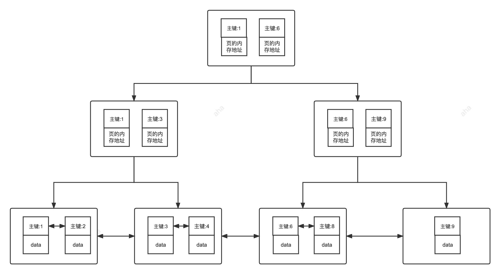
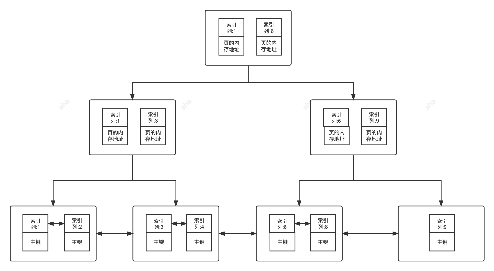
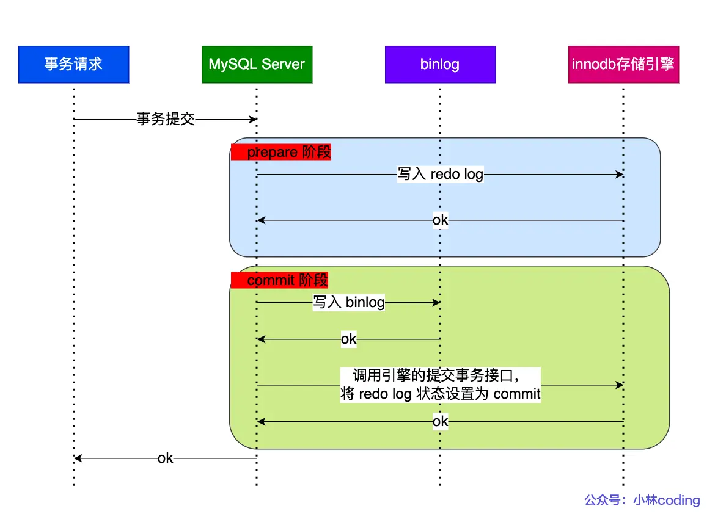
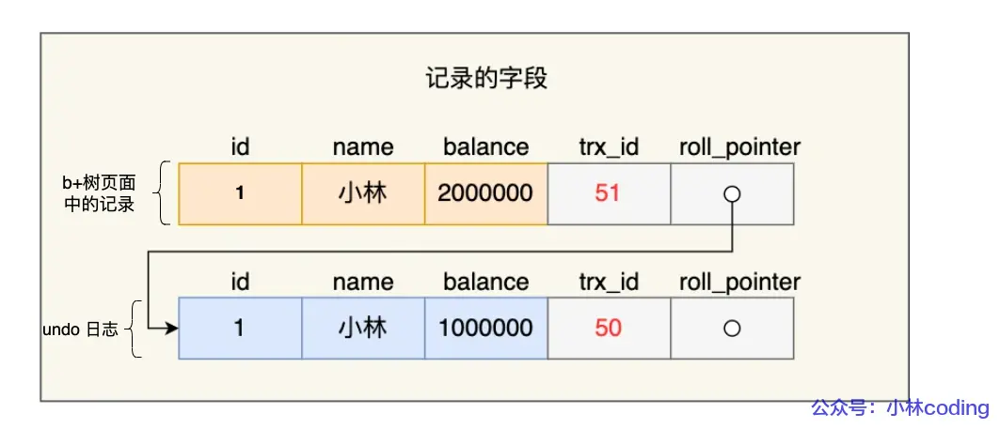
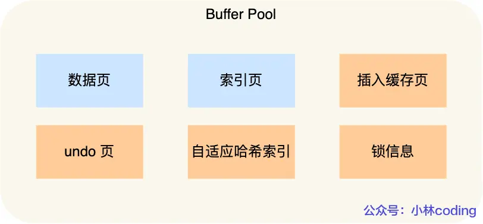
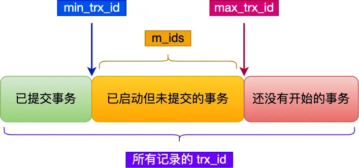

# MySQL

## MySQL 基础

### ⭐MySQL 优点

1. 生态和成本

   开源免费、社区庞大、生态完善
2. 核心技术，强大且均衡

   强大的事务支持、优秀的性能和可扩展性

3. 运维和使用来说，比较易用

   开箱即用，上手简单。维护成本低。

### 整数类型的 UNSIGNED 属性

UNSIGNED 属性表示不允许负值的无符号整数，使用 UNSIGNED 属性可以将正整数的上限提高一倍，因为它不需要存储负数值。

对于从 0 开始递增的 ID 列，使用 UNSIGNED 属性可以非常适合，因为不允许负值并且可以拥有更大的上限范围，提供了更多的 ID 值可用。

### CHAR 和 VARCHAR 区别

char 是定长字符串，varchar 是变长字符串

CHAR 更适合存储长度较短或者长度都差不多的字符串，例如 Bcrypt 算法、MD5 算法加密后的密码、身份证号码。VARCHAR 类型适合存储长度不确定或者差异较大的字符串，例如用户昵称、文章标题等。

CHAR(M) 和 VARCHAR(M) 的 M 都代表能够保存的字符数的最大值，无论是字母、数字还是中文，每个都只占用一个字符。

**VARCHAR(100) 和 VARCHAR(10) 的区别**

VARCHAR(100)和 VARCHAR(10)都是变长类型，表示能存储最多 100 个字符和 10 个字符。

VARCHAR(100)和 VARCHAR(10)能存储的字符范围不同，但二者存储相同的字符串，所占用磁盘的存储空间其实是一样的。

VARCHAR(100) 会消耗更多的内存。这是因为 VARCHAR 类型在内存中操作时，通常会分配固定大小的内存块来保存值，即使用字符类型中定义的长度。例如在进行排序的时候，VARCHAR(100)是按照 100 这个长度来进行的，也就会消耗更多内存。

### 为什么不推荐使用TEXT和BLOB

text 类似于char 和 varchar，但可以存储更长的字符串。

blob 主要用于存储二进制大对象，例如图片、音视频等文件。

开发中，很少使用 text 类型，blob 基本不使用。

缺点：

- 不能有默认值
- 使用临时表时无法使用内存临时表，只能在磁盘创建临时表。
- 检索效率低
- 不能直接创建索引，需要指定前缀长度。

### ⭐DATETIME 和 TIMESTAMP 的区别

- datetime 没有时区信息，timestamp 和时区有关
- timestamp 只需要使用4个字节存储，datetime 需要耗费8个字节。timestamp 表示的时间范围更小。

如何选择：

- timestamp 核心优势在于内建的时区处理能力，简化了需要处理多时区应用的开发。timestamp 只能表示1970-2038之间的时间。
- 如果不涉及时区转换，需要2038年之后的时间，datetime 是更稳妥的选择。

### NULL 和 '' 的区别

​`NULL`​ 代表缺失或未知的数据，而`''`只是一个存在的空字符串。

- ​`NULL`​ 代表一个不确定的值，不等于任何值，包括它自身。某些操作，数据库系统会将NULL当成相同的类别处理，例如 `DISTINCT, GROUP BY, ORDER BY`。
- ​`''`表示一个空字符串，是一个已知的值。
- 任何值与 `NULL`​ 进行比较（例如 `=`​, `!=`​, `>`​, `<`​ 等）的结果都是 `NULL`​，表示结果不确定。要判断一个值是否为 `NULL`​，必须使用 `IS NULL`​ 或 `IS NOT NULL`。
- 大多数聚合函数（例如 `SUM`​, `AVG`​, `MIN`​, `MAX`​）会忽略 `NULL` 值。
- ​`COUNT(*)`​ 会统计所有行数，包括包含 `NULL`​ 值的行。`COUNT(列名)`​ 会统计指定列中非 `NULL` 值的行数。

### ⭐Boolean 类型如何表示

MySQL 中没有专门的布尔类型，而是用 TINYINT(1) 类型来表示布尔值。TINYINT(1) 类型可以存储 0 或 1，分别对应 false 或 true。

### ⭐手机号存储

存储手机号，强烈推荐使用 VARCHAR 类型，而不是 INT 或 BIGINT。主要原因：

1. 格式兼容性与完整性：手机号可能包含前缀0。VARCHAR 可以存储多个格式的号码，无论是国内11位还是其他国家的。
2. 非算术性：基本不会对手机号进行数学运算。
3. 查询灵活性：有时需要根据号段（前缀）进行查询，比如字符串支持 `LIKE '138%'`。
4. 加密存储的要求：手机号这种敏感的个人信息需要加密存储，加密后的数据（密文）是一长串字符串。

## MySQL 基础结构

- 连接器：身份认证和权限相关
- 查询缓存：执行查询语句的时候，会先查询缓存（MySQL 8.0 后移除）
- 分析器：没有命中缓存的话，SQL语句就会经过分析器，分析器主要是看SQL语句要干嘛，再检查SQL语法是否正确
- 优化器：按照MySQL认为最优的方案去执行
- 执行器：执行语句，然后从存储引擎返回数据。
- 插件式存储引擎：主要负责数据的存储和读取，采取的是插件式架构，InnoDB式默认的存储引擎。

## ⭐MySQL 索引

索引的优点：

1. 查询速度快（主要目的）

2. 加速排序和分组

索引的缺点：

1. 创建和维护耗时
2. 占用存储空间
3. 可能被误用或失效：设计不当或查询语句写的不好，优化器可能不会使用索引

### **索引一定能提高查询性能吗**

大多数情况下，合理使用索引比全表扫描快得多，也有例外：

- 数据量小
- 查询结果集占比过大：如果查询的数据占了整张表的大部分（比如超过20%-30%）

### **索引为什么快**

索引之所以快，核心原因是大大减少了磁盘IO的次数。

本质是一种排好序的数据结构，MySQL中是B+树。

B+树结构主要从两方面做了优化：

1. B+树的特点是矮胖，一个千万数据的表，索引树的高度可能只有 3-4 层。这意味着，最多只需要3-4 次磁盘 I/O，就能精确定位到想要的数据。
2. B+树的叶子节点是用链表连起来的。找到开头后，就能顺着链表顺序读下去，这对磁盘非常友好，还能触发预读。

---

### **主键索引（Primary Key）**

一张数据表有只能有一个主键，并且主键不能为 null，不能重复。

InnoDB中，当没有显示指定表的主键时，InnoDB 会自动先检查表中是否有唯一索引且不允许null值的字段，如果有，则选择该字段为默认的主键，否则 InnoDB 将会自动创建一个 6Byte 的自增主键。



### **二级索引**

二级索引（Secondary Index）的叶子节点存储的数据是主键的值，也就是说，通过二级索引可以定位主键的位置，二级索引又称为辅助索引/非主键索引。

唯一索引、普通索引、前缀索引等索引都属于二级索引。



### **聚簇索引和非聚簇索引**

- 聚簇索引（聚集索引）

  聚簇索引（Clustered Index）即索引结构和数据一起存放的索引，并不是一种单独的索引类型。InnoDB 中的主键索引就属于聚簇索引。

  优点：

  - 查询速度快，定位到索引的节点，就定位到了数据。

  - 对排序查找和范围查找速度非常快。

  缺点：

  - 依赖于有序的数据。
  - 更新代价大。

- 非聚簇索引（非聚集索引）

  非聚簇索引（Non-Clustered Index）即索引结构和数据分开存放的索引，并不是一种单独的索引类型。二级索引（辅助索引）就属于非聚簇索引。

  非聚簇索引的叶子节点并不一定存放数据的指针，因为二级索引的叶子节点就存放的是主键，根据主键再回表查数据。

  优点：

  更新代价比聚簇索引要小。

  缺点：

  - 依赖于有序的数据。
  - 可能会二次查询（回表）。

### **覆盖索引和联合索引**

**覆盖索引**

如果一个索引包含（或者说覆盖）所有需要查询的字段的值，我们就称之为 ==覆盖索引（Covering Index）==。

覆盖索引即需要查询的字段正好是索引的字段，那么直接根据该索引，就可以查到数据了，而无需回表查询。

**联合索引**

使用表中的多个字段创建索引，就是==联合索引==。

### **最左前缀匹配原则**

最左前缀匹配原则指的是在使用联合索引时，MySQL 会根据索引中的字段顺序，从左到右依次匹配查询条件中的字段。如果查询条件与索引中的最左侧字段相匹配，那么 MySQL 就会使用索引来过滤数据，这样可以提高查询效率。

最左匹配原则会一直向右匹配，直到遇到范围查询（如 \>、\<）为止。对于 \>\=、\<\=、BETWEEN 以及前缀匹配 LIKE 的范围查询，不会停止匹配。

**索引下推**

==索引下推（Index Condition Pushdown，简称 ICP）== 是 MySQL 5.6 版本中提供的一项索引优化功能，它允许存储引擎在索引遍历过程中，执行部分 `WHERE` 字句的判断条件，直接过滤掉不满足条件的记录，从而减少回表次数，提高查询效率。

---

### **正确建立索引**

- 选择适合的字段创建索引

  - **不为 NULL 的字段**：索引字段的数据应该尽量不为 NULL，因为对于数据为 NULL 的字段，数据库较难优化。
  - ​**被频繁查询的字段**：我们创建索引的字段应该是查询操作非常频繁的字段。
  - ​**被作为条件查询的字段**：被作为 WHERE 条件查询的字段，应该被考虑建立索引。
  - ​**频繁需要排序的字段**：索引已经排序，这样查询可以利用索引的排序，加快排序查询时间。
  - **被经常频繁用于连接的字段**：经常用于连接的字段可能是一些外键列，对于外键列并不一定要建立外键，只是说该列涉及到表与表的关系。对于频繁被连接查询的字段，可以考虑建立索引，提高多表连接查询的效率。

- 被频繁更新的字段应该慎重建立索引。

- 限制每张表上的索引数量。

- 尽可能的考虑联合索引而不是单列索引。

- 注意避免冗余索引。

- 字符串类型的字段使用前缀索引代替普通索引。

**避免索引失效：**

- 创建了组合索引，但查询条件未遵守最左匹配原则;
- 在索引列上进行计算、函数、类型转换等操作;
- 以 % 开头的 LIKE 查询比如 `LIKE '%abc';`;
- 查询条件中使用 OR，且 OR 的前后条件中有一个列没有索引，涉及的索引都不会被使用到;
- IN 的取值范围较大时会导致索引失效，走全表扫描(NOT IN 和 IN 的失效场景相同);
- 发生隐式转换。

## ⭐MySQL 日志

### show query log（慢查询日志）

慢查询日志记录了执行时间超过 `long_query_time`（默认是 10s，通常设置为1s）的所有查询语句，在解决 SQL 慢查询（SQL 执行时间过长）问题的时候经常会用到。

找到慢 SQL 是优化 SQL 语句性能的第一步，然后再用`EXPLAIN`​ 命令可以对慢 SQL 进行分析，获取==执行计划==的相关信息。

==执行计划==是指一条 SQL 语句在经过 ==MySQL 查询优化器==的优化会后，具体的执行方式。

通过 `EXPLAIN` 的结果，可以了解到如数据表的查询顺序、数据查询操作的操作类型、哪些索引可以被命中、哪些索引实际会命中、每个数据表有多少行记录被查询等信息。

### binlog（二进制日志）

主要记录了对 MySQL 数据库执行了更改的所有操作(数据库执行的所有 DDL 和 DML 语句)，包括表结构变更（CREATE、ALTER、DROP TABLE…）、表数据修改（INSERT、UPDATE、DELETE...），但不包括 SELECT、SHOW 这类不会对数据库造成更改的操作。

binlog 通过追加的方式进行写入，大小没有限制。

binlog 最主要的应用场景是==主从复制==，主备、主主、主从都离不开binlog，需要依靠 binlog 来同步数据，保证数据一致性。

**主从复制过程：**

1. 主库将数据库中数据的变化写入到 binlog
2. 从库连接主库
3. 从库会创建一个 I/O 线程向主库请求更新的 binlog
4. 主库会创建一个 binlog dump 线程来发送 binlog ，从库中的 I/O 线程负责接收。
5. 从库的 I/O 线程将接收的 binlog 写入到 relay log 中。
6. 从库的 SQL 线程读取 relay log 同步数据本地（也就是再执行一遍 SQL ）。

**binlog 的刷盘时机**

对于InnoDB存储引擎而言，事务在执行过程中，会先把日志写入到`binlog cache`​中，只有在事务提交的时候，才会把`binlog cache`​中的日志持久化到磁盘上的`binlog`文件中。写入内存的速度更快，这样做也是为了效率考虑。

通过 `sync_binlog` 参数控制 binlog 的刷盘时机，取值范围是 0-N，默认为 0 ：

- 0：不去强制要求，由系统自行判断何时写入磁盘；
- 1：每次提交事务的时候都要将binlog写入磁盘；
- N：每 N 个事务，才会将binlog写入磁盘。

**什么情况重新生成**​**​`binlog`​**

- MySQL 服务器停止或重启。
- 使用flush logs 命令后。
- binlog 文件超过 max_binlog_size 变量的阈值后。

### redo log（重做日志）

redo log 主要做的事情就是记录页的修改，比如某个页某个偏移量处修改了几个字节的值以及具体被修改的内容是什么。

在事务提交时，我们会将 redo log 按照刷盘策略刷到磁盘上去，这样即使 MySQL 宕机了，重启之后也能恢复未能写入磁盘的数据，从而保证事务的持久性。

**redo log 刷到磁盘上有几种情况：**

1. 事务提交。
2. log buffer 不足时。
3. 事务日志缓冲区满。
4. checkpoint：InnoDB 定期会执行检查点操作，将内存中的脏数据（已修改但尚未写入磁盘的数据）刷新到磁盘。
5. 后台刷新线程：InnoDB 启动了一个后台线程，负责周期性（每隔1秒）地将脏页刷新到磁盘。
6. 正常关闭服务器。

设置刷盘策略 `innodb_flush_log_at_trx_commit`:

- 0：事务提交时不进行刷盘，性能最高，最不安全。
- 1：每次事务提交时都进行刷盘操作。
- 2：每次事务提交时都只将 log buffer 里的 redo log 内容写入 page cache（文件系统缓存）。这种方式性能和安全性介于两者之间。

默认为1。

redo log 采用循环写的方式进行写入。

**bin log 和 redo log 有什么区别：**

- bin log主要用于数据库还原，属于数据级别的数据恢复。redo log 主要用于保证事务的持久性，属于事务级别的数据恢复。
- redo log 属于 InnoDB 引擎特有的，bin log 属于所有存储引擎共有的，因为bin log 是MySQL 的Server 层实现的。
- redo log 属于物理日志，主要记录的是某个页的修改（如将第789号数据页中偏移量为2的位置写入值30）。bin log 属于逻辑日志，主要记录的是数据库执行的所有 DDL 和 DML 语句（如将ID=2的记录的age更新为30）。
- bin log 通过追加的方式进行写入，大小没有限制。

**MySQL 如何保证redo log 和bin log 的数据一致性**



**两阶段提交**

1. ==prepare 阶段==：将数据写入到 redo log，同时将redo log 对应的事务状态设置为prepare，然后将redo log 持久化到磁盘。
2. ==commit 阶段==：将数据写入到 bin log，然后将bin log 持久化到磁盘，接着调用引擎的提交事务接口，将redo log 状态设置为 commit。

在MySQL 重启后会按顺序扫描 redo log 文件，碰到处于 prepare 状态的 redo log，就拿着 redo log 中的id 去 bin log 查看是否存在此id：

- 如果 binlog 中没有当前事务的id，说明 redo log 完成刷盘，但是 binlog 还没刷盘，则回滚事务。
- 如果 binlog 中有当前事务的id，说明 redo log 和 binlog 都已经完成了刷盘，则提交事务。

### undo log（撤销日志）

每一个事务对数据的修改都会被记录到 undo log ，当执行事务过程中出现错误或者需要执行回滚操作的话，MySQL 可以利用 undo log 将数据恢复到事务开始之前的状态。

回滚日志，在insert、update、delete的时候产生的便于数据回滚的日志。  
当insert的时候，产生的undo log日志只在回滚时需要，在事务提交后，可被立即删除。  
而update、delete的时候，产生的undo log日志不仅在回滚时需要，mvcc版本访问也需要，不会立即被删除。



一条记录的每一次更新操作产生的 undo log 格式都有一个 roll\_pointer 指针和一个 trx\_id 事务id：

- 通过 trx\_id 可以知道该记录是被哪个事务修改的；
- 通过 roll\_pointer 指针可以将这些 undo log 串成一个链表，这个链表就被称为版本链；

另外，undo log 还有一个作用，通过 ReadView + undo log 实现 MVCC（多版本并发控制）。



开启事务后，InnoDB 层更新记录前，首先要记录相应的 undo log，如果是更新操作，需要把被更新的列的旧值记下来，也就是要生成一条 undo log，undo log 会写入 Buffer Pool 中的 Undo 页面。

## ⭐MySQL 事务

事务是逻辑上的一组操作，要么都执行，要么都不执行。

关系型数据库事务有 ACID 特性：

- A（原子性，Atomicity）：事务是最小的执行单位，不允许分割。
- C（一致性，Consistency）：执行事务前后，数据保持一致。
- I（隔离性，Isolation）：并发访问数据库时，一个用户的事务不被其他事务所干扰，各并发事务之间数据库是独立的。
- D（持久性，Durability）：一个事务被提交之后。它对数据库中数据的改变是持久的，即使数据库发生故障也不应该对其有任何影响。

**并发事务带来的问题：**

- 脏读：事务A读取了事务B没提交的数据，如果事务B回滚，那么事务A读到的就是脏数据。
- 不可重复读：

  指在一个事务内多次读同一数据。在这个事务还没有结束时，另一个事务也访问该数据。那么，在第一个事务中的两次读数据之间，由于第二个事务的修改导致第一个事务两次读取的数据可能不太一样。这就发生了在一个事务内两次读到的数据是不一样的情况，因此称为不可重复读。
- 幻读：幻读与不可重复读类似。它发生在一个事务读取了几行数据，接着另一个并发事务插入了一些数据时。在随后的查询中，第一个事务就会发现多了一些原本不存在的记录，就好像发生了幻觉一样，所以称为幻读。

  例如：事务 2 读取某个范围的数据，事务 1 在这个范围插入了新的数据，事务 2 再次读取这个范围的数据发现相比于第一次读取的结果多了新的数据。

### 并发事务控制

**锁** 控制方式下会通过锁来显式控制共享资源而不是通过调度手段，MySQL 中主要是通过 **读写锁** 来实现并发控制。

- ​**共享锁（S 锁）** ：又称读锁，事务在读取记录的时候获取共享锁，允许多个事务同时获取（锁兼容）。
- **排他锁（X 锁）** ：又称写锁/独占锁，事务在修改记录的时候获取排他锁，不允许多个事务同时获取。如果一个记录已经被加了排他锁，那其他事务不能再对这条记录加任何类型的锁（锁不兼容）。

根据锁颗粒度的不同，分为表级锁和行级锁。InnoDB 支持表级锁和行级锁，默认行级锁。

行级锁的粒度更小，仅对相关的记录上锁即可（对一行或者多行记录加锁），所以对于并发写入操作来说， InnoDB 的性能更高。不论是表级锁还是行级锁，都存在共享锁（Share Lock，S 锁）和排他锁（Exclusive Lock，X 锁）这两类。

**SQL 标准定义了四种事务隔离级别**，用来平衡事务的隔离性和并发性能。

- 读未提交（read-uncommitted）：允许读取尚未提交的数据变更，可能导致脏读、幻读或不可重复读。
- 读已提交（read-committed）：允许读取并发事务已经提交的数据，可以阻止脏读，但是幻读或不可重复读仍有可能发生。这是大部分数据库的默认隔离级别。
- 可重复读（repeatable-read）：对同一字段的多次读取结果是一致的，可以阻止脏读和不可重复读，但幻读仍有可能发生。MySQL InnoDB 存储引擎的默认级别。InnoDB 在此级别下通过MVCC 和 Next-key Locks 机制，很大程度上解决了幻读问题。
- 可串行化（serializable）：最高的隔离级别，所有事务依次逐个执行，可以防止幻读、不可重复读以及幻读。

### 并发事务控制-MVCC

全称Multi-Version Concurrency Control，多版本并发控制。指维护一个数据的多个版本，使得读写操作没有冲突

MVCC的具体实现，主要依赖于数据库记录中的==隐式字段==、==undo log日志==、==readView==。

**ReadView**


Read View 有四个重要的字段：

- m\_ids ：指的是在创建 Read View 时，当前数据库中「活跃事务」的事务 id 列表，注意是一个列表“活跃事务”指的就是，==启动了但还没提交的事务==。
- min\_trx\_id ：指的是在创建 Read View 时，当前数据库中「活跃事务」中事务==id 最小的事务==，也就是 m\_ids 的最小值。
- max\_trx\_id ：这个并不是 m\_ids 的最大值，而==创建 Read View 时当前数据库中应该给下一个事务的 id 值==，也就是全局事务中最大的事务 id 值 + 1；
- creator\_trx\_id ：指的是​**创建该 Read View 的事务的事务 id**。

对于使用 InnoDB 存储引擎的数据库表，它的聚簇索引记录中都包含下面==两个隐藏列==：

- trx\_id，修改当前行数据的事务的==事务 id==；
- roll\_pointer，指向每一个旧版本记录，可以通过它找到==修改前的记录==。

在创建 Read View 后，我们可以将记录中的 trx\_id 划分这三种情况：



一个事务去访问记录的时候，除了自己的更新记录总是可见之外，还有这几种情况：

- 如果记录的 trx\_id 值小于 Read View 中的 `min_trx_id`​ 值，表示这个版本的记录是在创建 Read View **前**已经提交的事务生成的，所以该版本的记录对当前事务​**可见**。
- 如果记录的 trx\_id 值大于等于 Read View 中的 `max_trx_id`​ 值，表示这个版本的记录是在创建 Read View **后**才启动的事务生成的，所以该版本的记录对当前事务​**不可见**。
- 如果记录的 trx\_id 值在 Read View 的 `min_trx_id`​ 和 `max_trx_id`​ 之间，需要判断 trx\_id 是否在 m\_ids 列表中：

  - 如果记录的 trx\_id **在** `m_ids`​ 列表中，表示生成该版本记录的活跃事务依然活跃着（还没提交事务），所以该版本的记录对当前事务​**不可见**。
  - 如果记录的 trx\_id **不在** `m_ids`​列表中，表示生成该版本记录的活跃事务已经被提交，所以该版本的记录对当前事务​**可见**。

==这种通过「版本链」来控制并发事务访问同一个记录时的行为就叫 MVCC（多版本并发控制）==

### MySQL 锁

InnoDB 不光支持表级锁(table-level locking)，还支持行级锁(row-level locking)，默认为行级锁。

行级锁的粒度更小，仅对相关的记录上锁即可（对一行或者多行记录加锁），所以对于并发写入操作来说， InnoDB 的性能更高。

- **表级锁：**  MySQL 中锁定粒度最大的一种锁（全局锁除外），是针对非索引字段加的锁，对当前操作的整张表加锁，实现简单，资源消耗也比较少，加锁快，不会出现死锁。不过，触发锁冲突的概率最高，高并发下效率极低。表级锁和存储引擎无关，MyISAM 和 InnoDB 引擎都支持表级锁。
- **行级锁：**  MySQL 中锁定粒度最小的一种锁，是 **针对索引字段加的锁** ，只针对当前操作的行记录进行加锁。 行级锁能大大减少数据库操作的冲突。其加锁粒度最小，并发度高，但加锁的开销也最大，加锁慢，会出现死锁。行级锁和存储引擎有关，是在存储引擎层面实现的。

**行级锁注意事项**

InnoDB 的行锁是针对索引字段加的锁，表级锁是针对非索引字段加的锁。当我们执行 `UPDATE`​、`DELETE`​ 语句时，如果 `WHERE`条件中字段没有命中唯一索引或者索引失效的话，就会导致扫描全表对表中的所有行记录进行加锁。

不过，很多时候即使用了索引也有可能会走全表扫描，这是因为 MySQL 优化器的原因。

**InnoDB 的行锁**

InnoDB 行锁是通过对索引数据页上的记录加锁实现的，InnoDB 支持三种行锁定方式：

- 记录锁（Record Lock）：属于单个行记录上的锁。
- 间隙锁（Gap Lock）：锁定一个范围，不包括记录本身。
- 临键锁（Next-Key Lock）：Record Lock + Gap Lock，锁定一个范围，包括记录本身，主要解决了幻读问题。记录锁只能锁住已经存在的记录，为了避免插入新记录，需要依赖间隙锁。

**在 InnoDB 默认的隔离级别 REPEATABLE-READ 下，行锁默认使用的是 Next-Key Lock。但是，如果操作的索引是唯一索引或主键，InnoDB 会对 Next-Key Lock 进行优化，将其降级为 Record Lock，即仅锁住索引本身，而不是范围。**

**共享锁和排他锁**

不论是表级锁还是行级锁，都存在共享锁（Share Lock，S 锁）和排他锁（Exclusive Lock，X 锁）这两类：

- ​**共享锁（S 锁）** ：又称读锁，事务在读取记录的时候获取共享锁，允许多个事务同时获取（锁兼容）。
- ​**排他锁（X 锁）** ：又称写锁/独占锁，事务在修改记录的时候获取排他锁，不允许多个事务同时获取。如果一个记录已经被加了排他锁，那其他事务不能再对这条事务加任何类型的锁（锁不兼容）。

排他锁与任何的锁都不兼容，共享锁仅和共享锁兼容。

**意向锁**

如果需要用到表锁的话，使用意向锁来快速判断是否可以对某个表使用表锁。

意向锁属于表级锁，共有两种：

- ​**意向共享锁（Intention Shared Lock，IS 锁）** ：事务有意向对表中的某些记录加共享锁（S 锁），加共享锁前必须先取得该表的 IS 锁。
- ​**意向排他锁（Intention Exclusive Lock，IX 锁）** ：事务有意向对表中的某些记录加排他锁（X 锁），加排他锁之前必须先取得该表的 IX 锁。

意向锁之间相互兼容。

意向锁和排他锁互斥（指表级锁）

[MySQL 设计规约](https://mp.weixin.qq.com/s/XC8e5iuQtfsrEOERffEZ-Q)

[数据库建表15个技巧](https://mp.weixin.qq.com/s/NM-aHaW6TXrnO6la6Jfl5A)

## ⭐常见SQL 优化手段

### 避免使用 select *

- ​`select *` 无用字段增加网络带宽，增加数据传输时间。

- ​`select *` 无法使用MySQL 优化器覆盖索引的优化

### 深度分页优化

```sql
# 从第1000000行开始，获取10条记录。
SELECT `score`,`name` FROM `cus_order` LIMIT 1000000, 10
```

如果数据量变大，达到百万甚至是千万级别，普通的分页耗费的时间就非常长了。像这种查询偏移量过大的场景我们称为深度分页。

优化：将上述语句修改为子查询

```sql
# 子查询查出当前分页的首行id
SELECT `score`, `name` FROM `cus_order`
WHERE id >= (SELECT id FROM `cus_order` LIMIT 1000000, 1)
LIMIT 10;
```

先查询出 limit 第一个参数对应的主键值，再根据这个主键值再去过滤并 limit，这样效率会更快一些。

### 尽量避免多表做 join

超过三个表不建议join。使用嵌套循环来实现关联查询，效率不是很高。

实际业务场景避免多表 join 常见的做法有两种：

1. **单表查询后在内存中自己做关联** ：对数据库做单表查询，再根据查询结果进行二次查询，以此类推，最后再进行关联。
2. ​**数据冗余**，把一些重要的数据在表中做冗余，尽可能地避免关联查询。很笨的一种做法，表结构比较稳定的情况下才会考虑这种做法。进行冗余设计之前，思考一下自己的表结构设计的是否有问题。

更加推荐第一种，这种在实际项目中的使用率比较高，除了性能不错之外，还有如下优势：

1. **拆分后的单表查询代码可复用性更高** ：join 联表 SQL 基本不太可能被复用。
2. **单表查询更利于后续的维护** ：不论是后续修改表结构还是进行分库分表，单表查询维护起来都更容易。

### 选择合适的字段类型

- 某些字符串可以转换为数字类型，比如IP地址

  数字是连续的，性能更好，占用空间也更小。
- 对于非负型（如自增ID、整型IP、年龄），优先使用无符号整型存储
- 小数值类型（年龄、状态）优先使用tinyint
- 日期类型，不要使用字符串存储。可以考虑datetime, timestamp和数值型时间戳
- 金额字段使用decimal，避免精度丢失
- 尽量使用自增型id作为主键

  如果主键为自增 id 的话，每次都会将数据加在 B+树尾部（本质是双向链表），时间复杂度为 O(1)。在写满一个数据页的时候，直接申请另一个新数据页接着写就可以了。

  如果主键是非自增 id 的话，为了让新加入数据后 B+树的叶子节点还能保持有序，它就需要往叶子结点的中间找，查找过程的时间复杂度是 O(lgn)。如果这个也被写满的话，就需要进行页分裂。页分裂操作需要加悲观锁，性能非常低。

  不过， 像分库分表这类场景就不建议使用自增 id 作为主键，应该使用分布式 ID 比如 uuid 。
- 不建议使用 NULL 作为默认值

### 尽量使用 UNION ALL 代替 UNION

UNION 会把两个结果集的所有数据放到临时表中后再进行去重操作，更耗时，更消耗 CPU 资源。

UNION ALL 不会再对结果集进行去重操作，获取到的数据包含重复的项。

不过，如果实际业务场景中不允许产生重复数据的话，还是可以使用 UNION。

### 优化慢 SQL

MySQL 慢查询日志是用来记录 MySQL 在执行命令中，响应时间超过预设阈值的 SQL 语句。因此，通过分析慢查询日志我们就可以找出执行速度比较慢的 SQL 语句。

### 正确使用索引

- 选择合适的字段创建索引

  - 不为 NULL 的字段
  - 被频繁查询的字段
  - 被作为条件查询的字段
  - 频繁需要排序的字段
  - 被频繁用于连接的字段
- 被频繁更新的字段应该慎重建立索引
- 尽可能考虑建立联合索引而不是单列索引

  因为索引是需要占用磁盘空间的，可以简单理解为每个索引都对应着一颗 B+树。如果一个表的字段过多，索引过多，那么当这个表的数据达到一个体量后，索引占用的空间也是很多的，且修改索引时，耗费的时间也是较多的。如果是联合索引，多个字段在一个索引上，那么将会节约很大磁盘空间，且修改数据的操作效率也会提升。
- 考虑在字符串类型的字段上使用前缀索引代替普通索引
- 避免索引失效

### 读写分离和分库分表

读写分离主要是为了将对数据库的读写操作分散到不同的数据库节点上 **。**  这样的话，就能够小幅提升写性能，大幅提升读性能。

一般情况下，我们都会选择一主多从，也就是一台主数据库负责写，其他的从数据库负责读。主库和从库之间会进行数据同步，以保证从库中数据的准确性。这样的架构实现起来比较简单，并且也符合系统的写少读多的特点。

**实现读写分离**

- 部署多台数据库，选择其中的一台作为主数据库，其他的一台或者多台作为从数据库。
- 保证主数据库和从数据库之间的数据是实时同步的，这个过程也就是我们常说的​**主从复制**。
- 系统将写请求交给主数据库处理，读请求交给从数据库处理。

**主从复制原理**

MySQL binlog(binary log 即二进制日志文件) 主要记录了 MySQL 数据库中数据的所有变化(数据库执行的所有 DDL 和 DML 语句)。因此，我们根据主库的 MySQL binlog 日志就能够将主库的数据同步到从库中。

- 主库将数据库中数据的变化写入到 binlog
- 从库连接主库
- 从库会创建一个 I/O 线程向主库请求更新的 binlog
- 主库会创建一个 binlog dump 线程来发送 binlog ，从库中的 I/O 线程负责接收
- 从库的 I/O 线程将接收的 binlog 写入到 relay log 中。
- 从库的 SQL 线程读取 relay log 同步数据到本地（也就是再执行一遍 SQL ）。

**分库分表**

解决 MySQL 的存储压力。

- **分库** 就是将数据库中的数据分散到不同的数据库上，可以垂直分库，也可以水平分库。

  **垂直分库** 就是把单一数据库按照业务进行划分，不同的业务使用不同的数据库，进而将一个数据库的压力分担到多个数据库。

  **水平分库** 是把同一个表按一定规则拆分到不同的数据库中，每个库可以位于不同的服务器上，这样就实现了水平扩展，解决了单表的存储和性能瓶颈的问题。
- **分表** 就是对单表的数据进行拆分，可以是垂直拆分，也可以是水平拆分。

  **垂直分表** 是对数据表列的拆分，把一张列比较多的表拆分为多张表。

  **水平分表** 是对数据表行的拆分，把一张行比较多的表拆分为多张表，可以解决单一表数据量过大的问题。

  水平拆分只能解决单表数据量大的问题，为了提升性能，我们通常会选择将拆分后的多张表放在不同的数据库中。也就是说，水平分表通常和水平分库同时出现。

**什么情况下需要分库分表**

- 单表的数据达到千万级别以上，数据库读写速度比较缓慢。
- 数据库中的数据占用的空间越来越大，备份时间越来越长。
- 应用的并发量太大（应该优先考虑其他性能优化方法，而非分库分表）。

**常见的分片算法**

分片算法主要解决了数据被水平分片之后，数据究竟该存放在哪个表的问题。

常见的分片算法有：

- **哈希分片**：求指定分片键的哈希，然后根据哈希值确定数据应被放置在哪个表中。哈希分片比较适合随机读写的场景，不太适合经常需要范围查询的场景。哈希分片可以使每个表的数据分布相对均匀，但对动态伸缩（例如新增一个表或者库）不友好。
- **范围分片**：按照特定的范围区间（比如时间区间、ID 区间）来分配数据，比如 将 `id`​ 为 `1~299999`​ 的记录分到第一个表， `300000~599999` 的分到第二个表。范围分片适合需要经常进行范围查找且数据分布均匀的场景，不太适合随机读写的场景（数据未被分散，容易出现热点数据的问题）。
