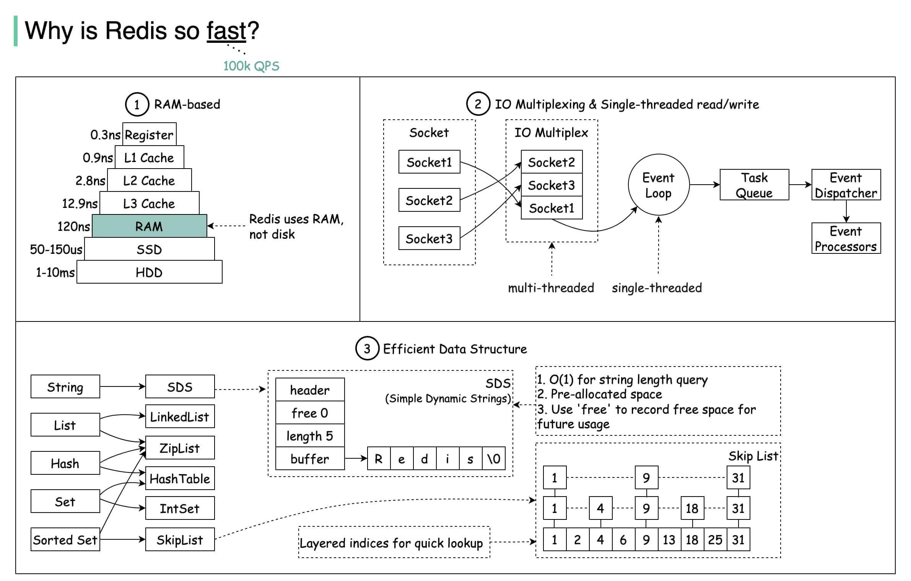
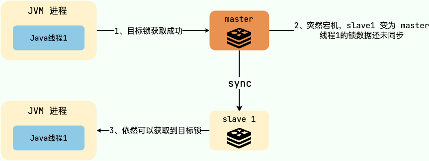
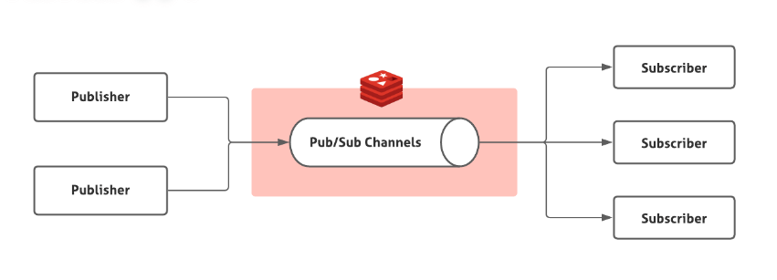
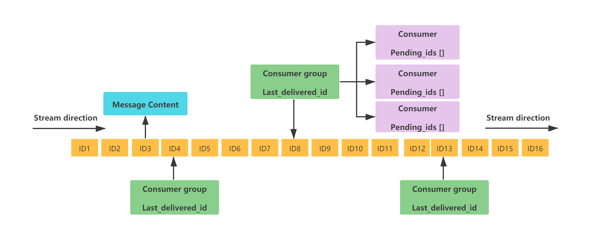
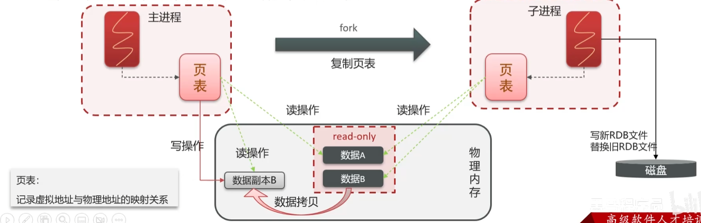
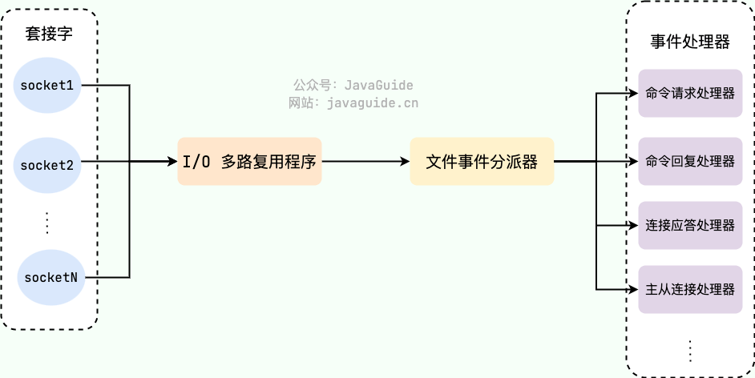
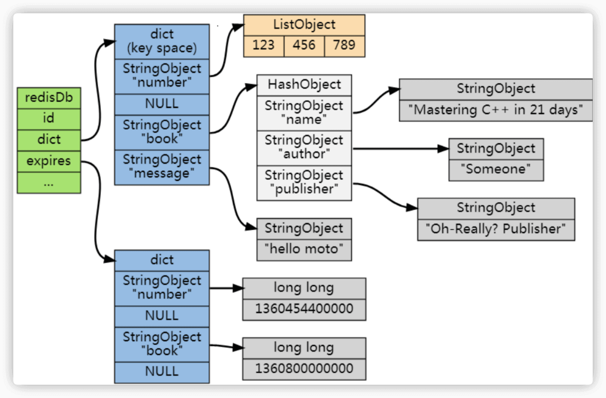
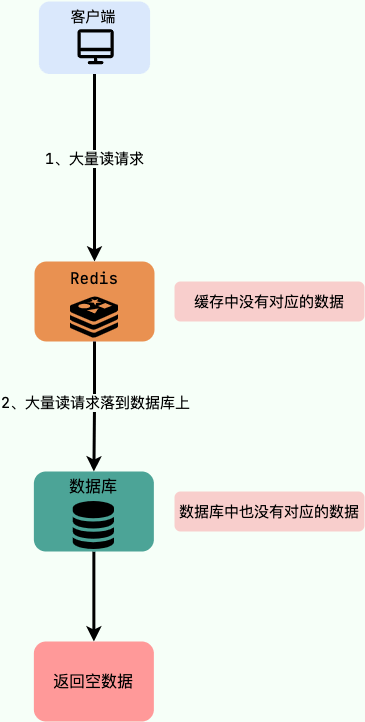
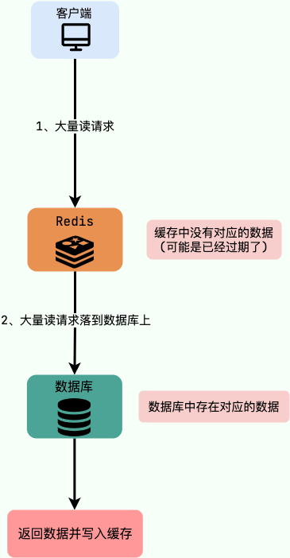
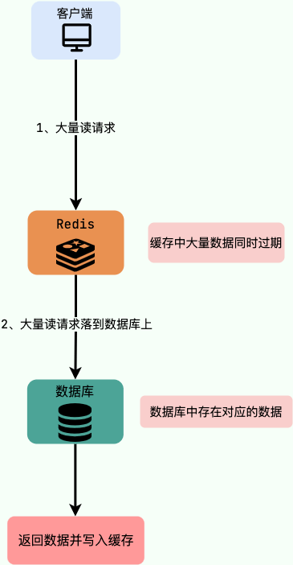

# Redis

## Redis 基础

### Redis 基本数据类型

- String

  - 存储

    字符串、整数、浮点数

  - 用途

    缓存对象、常规计数、分布式锁、共享session等

  - 常用命令

    |命令|介绍|
    | -----------------------------------| ----------------------------------|
    |SET key value|设置指定 key 的值|
    |SETNX key value|只有在 key 不存在时设置 key 的值|
    |GET key|获取指定 key 的值|
    |MSET key1 value1 key2 value2 ……|设置一个或多个指定 key 的值|
    |MGET key1 key2 ...|获取一个或多个指定 key 的值|
    |STRLEN key|返回 key 所储存的字符串值的长度|
    |INCR key|将 key 中储存的数字值增一|
    |DECR key|将 key 中储存的数字值减一|
    |EXISTS key|判断指定 key 是否存在|
    |DEL key（通用）|删除指定的 key|
    |EXPIRE key seconds（通用）|给指定 key 设置过期时间|

- Hash

  - 存储

    键值对无序散列表
  - 用途

    缓存对象、购物车等
  - 常用命令

    |命令|介绍|
    | -------------------------------------------| ----------------------------------------------------------|
    |HSET key field value|设置指定哈希表中指定字段的值|
    |HSETNX key field value|只有指定字段不存在时设置指定字段的值|
    |HMSET key field1 value1 field2 value2 ...|同时将一个或多个 field-value (域-值)对设置到指定哈希表中|
    |HGET key field|获取指定哈希表中指定字段的值|
    |HMGET key field1 field2 ...|获取指定哈希表中一个或者多个指定字段的值|
    |HGETALL key|获取指定哈希表中所有的键值对|
    |HEXISTS key field|查看指定哈希表中指定的字段是否存在|
    |HDEL key field1 field2 ...|删除一个或多个哈希表字段|
    |HLEN key|获取指定哈希表中字段的数量|
    |HINCRBY key field increment|对指定哈希中的指定字段做运算操作（正数为加，负数为减）|

- List

  - 存储

    链表，其中每个节点包含一个字符串
  - 用途

    消息队列（问题：1. 生产者需要自行实现全局唯一；2. 不能以消费组形式消费数据）
  - 常用命令

    |命令|介绍|
    | -----------------------------| --------------------------------------------|
    |RPUSH key value1 value2 ...|在指定列表的尾部（右边）添加一个或多个元素|
    |LPUSH key value1 value2 ...|在指定列表的头部（左边）添加一个或多个元素|
    |LSET key index value|将指定列表索引 index 位置的值设置为 value|
    |LPOP key|移除并获取指定列表的第一个元素(最左边)|
    |RPOP key|移除并获取指定列表的最后一个元素(最右边)|
    |LLEN key|获取列表元素数量|
    |LRANGE key start end|获取列表 start 和 end 之间 的元素|

- Set

  - 存储
  - 用途

    存储一个列表数据，又不希望出现重复数据
  - 常用命令

    |命令|介绍|
    | ---------------------------------------| -------------------------------------------|
    |SADD key member1 member2 ...|向指定集合添加一个或多个元素|
    |SMEMBERS key|获取指定集合中的所有元素|
    |SCARD key|获取指定集合的元素数量|
    |SISMEMBER key member|判断指定元素是否在指定集合中|
    |SINTER key1 key2 ...|获取给定所有集合的交集|
    |SINTERSTORE destination key1 key2 ...|将给定所有集合的交集存储在 destination 中|
    |SUNION key1 key2 ...|获取给定所有集合的并集|
    |SUNIONSTORE destination key1 key2 ...|将给定所有集合的并集存储在 destination 中|
    |SDIFF key1 key2 ...|获取给定所有集合的差集|
    |SDIFFSTORE destination key1 key2 ...|将给定所有集合的差集存储在 destination 中|
    |SPOP key count|随机移除并获取指定集合中一个或多个元素|
    |SRANDMEMBER key count|随机获取指定集合中指定数量的元素|

- Sorted Set （Zset）

  Sorted Set 增加了一个权重参数 `score`​，使得集合中的元素能够按 `score` 进行有序排列

  - 常用命令

    |命令|介绍|
    | -----------------------------------------------| ---------------------------------------------------------------------------------------------------------------|
    |ZADD key score1 member1 score2 member2 ...|向指定有序集合添加一个或多个元素|
    |ZCARD KEY|获取指定有序集合的元素数量|
    |ZSCORE key member|获取指定有序集合中指定元素的 score 值|
    |ZINTERSTORE destination numkeys key1 key2 ...|将给定所有有序集合的交集存储在 destination 中，对相同元素对应的 score 值进行 SUM 聚合操作，numkeys 为集合数量|
    |ZUNIONSTORE destination numkeys key1 key2 ...|求并集，其它和 ZINTERSTORE 类似|
    |ZDIFFSTORE destination numkeys key1 key2 ...|求差集，其它和 ZINTERSTORE 类似|
    |ZRANGE key start end|获取指定有序集合 start 和 end 之间的元素（score 从低到高）|
    |ZREVRANGE key start end|获取指定有序集合 start 和 end 之间的元素（score 从高到底）|
    |ZREVRANK key member|获取指定有序集合中指定元素的排名(score 从大到小排序)|

**三种特殊数据类型**

- HyperLogLog

  用一点点精确度损失，换取巨大的内存空间节省。它给出的不是一个 100%精确的数字，而是一个带有很小标准误差（Redis 中默认是 0.81%）的近似值。
- Bitmap
- Geospatial

‍

### Redis 为什么这么快



1. 纯内存操作
2. 高效的IO模型

   Redis 使用单线程事件循环配合 I/O 多路复用技术，让单个线程可以同时处理多个网络连接上的 I/O 事件（如读写），避免了多线程模型中的上下文切换和锁竞争问题。
3. 优化的内部数据结构

   Redis 提供多种数据类型，其内部实现采用高度优化的编码方式。

4. 简洁高效的通信协议

   Redis 使用的是自己设计的 RESP (REdis Serialization Protocol) 协议。这个协议实现简单、解析性能好，并且是二进制安全的。

**redis 和 memcached**

1. Redis 支持更丰富的数据类型。
2. Redis 支持数据持久化。
3. Redis 支持原生集群模式。
4. Memcached 多线程、非阻塞IO复用的网络模型；Redis 使用单线程多路IO复用模型。

## Redis 应用

- 缓存
- 分布式锁
- 限流
- 消息队列
- 延时队列

### 分布式锁

不论是本地锁还是分布式锁，核心都在于“互斥”。

SETNX 命令可以实现互斥。`SETNX`​ 即 **SET** if **N**ot e**X**ists (对应 Java 中的 `setIfAbsent`​ 方法)，如果 key 不存在的话，才会设置 key 的值。如果 key 已经存在， `SETNX` 啥也不做。

```bash
SETNX lockKey uniqueValue
(integer) 1
SETNX lockKey uniqueValue
(integer) 0
```

为了避免锁无法被释放，可以给这个key（也就是锁）设置一个过期时间

**实现锁续期**

> Redisson 是一个开源的 Java 语言 Redis 客户端，提供了很多开箱即用的功能，不仅仅包括多种分布式锁的实现。并且，Redisson 还支持 Redis 单机、Redis Sentinel、Redis Cluster 等多种部署架构。

Redisson 中的分布式锁自带自动续期机制，使用起来非常简单，原理也比较简单，其提供了一个专门用来监控和续期锁的 ==Watch Dog（ 看门狗）==，如果操作共享资源的线程还未执行完成的话，Watch Dog 会不断地延长锁的过期时间，进而保证锁不会因为超时而被释放。


**实现可重入锁**

所谓可重入锁指的是在一个线程中可以多次获取同一把锁，比如一个线程在执行一个带锁的方法，该方法中又调用了另一个需要相同锁的方法，则该线程可以直接执行调用的方法即可重入 ，而无需重新获得锁。synchronized 和 ReentrantLock 都属于可重入锁。

不可重入的分布式锁基本可以满足绝大部分业务场景了，一些特殊的场景可能会需要使用可重入的分布式锁。

可重入分布式锁的实现核心思路是线程在获取锁的时候判断是否为自己的锁，如果是的话，就不用再重新获取了。

实际中，推荐使用 ==Redisson== ，其内置了多种类型的锁比如可重入锁（Reentrant Lock）、自旋锁（Spin Lock）、公平锁（Fair Lock）、多重锁（MultiLock）、 红锁（RedLock）、 读写锁（ReadWriteLock）。

**解决集群情况下分布式锁的可靠性**

由于 Redis 集群数据同步到各个节点时是异步的，如果在 Redis 主节点获取到锁后，在没有同步到其他节点时，Redis 主节点宕机了，此时新的 Redis 主节点依然可以获取锁，所以多个应用服务就可以同时获取到锁。



使用 RedLock 来解决

Redlock 算法的思想是让客户端向 Redis 集群中的多个独立的 Redis 实例依次请求申请加锁，如果客户端能够和半数以上的实例成功地完成加锁操作，那么我们就认为，客户端成功地获得分布式锁，否则加锁失败。

即使部分 Redis 节点出现问题，只要保证 Redis 集群中有半数以上的 Redis 节点可用，分布式锁服务就是正常的。

实际项目中不建议使用 Redlock 算法，成本和收益不成正比，可以考虑基于 Redis 主从复制+哨兵模式实现分布式锁。

### Redis 实现消息队列

使用 List 来实现，Redis 提供了 BLPOP、BRPOP 这种阻塞式读取的命令，并且还支持了一个超时参数。如果 List 为空，Redis 服务端不会立刻返回结果，它会等待 List 中有新数据后再返回或者是等待最多一个超时时间后返回空。如果将超时时间设置为 0 时，即可无限等待，直到弹出消息。

List 实现消息队列功能太简单，像消息确认机制等功能还需要我们自己实现，最要命的是没有广播机制，消息也只能被消费一次。  
Redis 2.0 引入了发布订阅 (pub/sub) 功能，解决了 List 实现消息队列没有广播机制的问题。



pub/sub 中引入了一个概念叫 channel（频道），发布订阅机制的实现就是基于这个 channel 来做的。pub/sub 涉及发布者（Publisher）和订阅者（Subscriber，也叫消费者）两个角色：发布者通过 PUBLISH 投递消息给指定 channel。订阅者通过SUBSCRIBE订阅它关心的 channel。并且，订阅者可以订阅一个或者多个 channel。

pub/sub 既能单播又能广播，还支持 channel 的简单正则匹配。不过，消息丢失（客户端断开连接或者 Redis 宕机都会导致消息丢失）、消息堆积（发布者发布消息的时候不会管消费者的具体消费能力如何）等问题依然没有一个比较好的解决办法。

为此，Redis 5.0 新增加的一个数据结构 `Stream`​ 来做消息队列。`Stream` 支持：

- 发布 / 订阅模式；
- 按照消费者组进行消费（借鉴了 Kafka 消费者组的概念）；
- 消息持久化（ RDB 和 AOF）；
- ACK 机制（通过确认机制来告知已经成功处理了消息）；
- 阻塞式获取消息。

​`Stream` 的结构如下：



这是一个有序的消息链表，每个消息都有一个唯一的 ID 和对应的内容。ID 是一个时间戳和序列号的组合，用来保证消息的唯一性和递增性。内容是一个或多个键值对（类似 Hash 基本数据类型），用来存储消息的数据。

这里再对图中涉及到的一些概念，进行简单解释：

- ​`Consumer Group`：消费者组用于组织和管理多个消费者。消费者组本身不处理消息，而是再将消息分发给消费者，由消费者进行真正的消费。
- ​`last_delivered_id`​：标识消费者组当前消费位置的游标，消费者组中任意一个消费者读取了消息都会使 last\_delivered\_id 往前移动。
- ​`pending_ids`：记录已经被客户端消费但没有 ack 的消息的 ID。

## Redis 持久化

### RDB 持久化

Redis 可以通过创建快照来获得存储在内存里面的数据在 **某个时间点** 上的副本。Redis 创建快照之后，可以对快照进行备份，可以将快照复制到其他服务器从而创建具有相同数据的服务器副本（Redis 主从结构，主要用来提高 Redis 性能），还可以将快照留在原地以便重启服务器的时候使用。

Redis 提供了两个命令来生成 RDB 快照文件：

- ​`save` : 同步保存操作，会阻塞 Redis 主线程；
- ​`bgsave` : fork 出一个子进程，子进程执行，不会阻塞 Redis 主线程，默认选项。

子进程采用的是==copy-on-write==技术：



- 当主进程执行读操作时，访问共享内存
- 当主进程执行写操作时，则会拷贝一份数据，执行写操作

### AOF 持久化

AOF（append only file）。与快照持久化相比，AOF 持久化的实时性更好。

开启 AOF 持久化后每执行一条会更改 Redis 中的数据的命令，Redis 就会将该命令写入到 AOF 缓冲区 `server.aof_buf`​ 中，然后再写入到内核缓冲区中，最后再根据持久化方式（ `fsync`策略）的配置来决定何时将系统内核缓存区的数据同步到硬盘中的。


**AOF 工作的基本流程**

- ​**命令追加（append）** ：所有的写命令会追加到 AOF 缓冲区中。
- **内核缓冲区写入（write）** ：将 AOF 缓冲区的数据写入到内核缓冲区中。这一步需要调用`write`​函数（系统调用），`write`将数据写入到了系统内核缓冲区之后直接返回了（延迟写）。
- **文件同步（fsync）** ：根据在 `redis.conf`​ 文件里 `appendfsync`​ 配置的策略，Redis 会在不同的时机，调用 `fsync`​ 函数（系统调用）。`fsync`​ 针对单个文件操作，对其进行强制硬盘同步(文件在内核缓冲区里的数据写到硬盘)，`fsync` 将阻塞直到写入磁盘完成后返回，保证了数据持久化。
- **文件重写（rewrite）** ：随着 AOF 文件越来越大，需要定期对 AOF 文件进行重写，达到压缩的目的。

  由于 AOF 重写会进行大量的写入操作，为了避免对 Redis 正常处理命令请求造成影响，Redis 将 AOF 重写程序放到子进程里执行。

  AOF 文件重写期间，Redis 还会维护一个 **AOF 重写缓冲区**，该缓冲区会在子进程创建新 AOF 文件期间，记录服务器执行的所有写命令。当子进程完成创建新 AOF 文件的工作之后，服务器会将重写缓冲区中的所有内容追加到新 AOF 文件的末尾，使得新的 AOF 文件保存的数据库状态与现有的数据库状态一致。最后，服务器用新的 AOF 文件替换旧的 AOF 文件，以此来完成 AOF 文件重写操作。
- **重启加载（load）** ：当 Redis 重启时，可以加载 AOF 文件进行数据恢复。

Redis 4.0开始支持RDB和AOF的混合持久化。

## Redis 线程模型

**Redis 基于 Reactor 模式设计开发了一套高效的事件处理模型**（Netty 的线程模型也基于 Reactor 模式），这套事件处理模型对应的是 Redis 中的文件==事件处理器（file event handler）==。由于文件事件处理器（file event handler）是单线程方式运行的，所以我们一般都说 Redis 是单线程模型。



Redis 通过 **IO 多路复用程序** 来监听来自客户端的大量连接（或者说是监听多个 socket），它会将感兴趣的事件及类型（读、写）注册到内核中并监听每个事件是否发生。

这样的好处非常明显：**I/O 多路复用技术的使用让 Redis 不需要额外创建多余的线程来监听客户端的大量连接，降低了资源的消耗**（和 NIO 中的 `Selector` 组件很像）。

文件事件处理器（file event handler）主要是包含 4 个部分：

- 多个 socket（客户端连接）
- IO 多路复用程序（支持多个客户端连接的关键）
- 文件事件分派器（将 socket 关联到相应的事件处理器）
- 事件处理器（连接应答处理器、命令请求处理器、命令回复处理器）

## Redis 内存管理



**redis 如何判断数据是否过期**

Redis 通过一个叫做过期字典（可以看作是 hash 表）来保存数据过期的时间。过期字典的键指向 Redis 数据库中的某个 key（键），过期字典的值是一个 long long 类型的整数，这个整数保存了 key 所指向的数据库键的过期时间（毫秒精度的 UNIX 时间戳）。

在查询一个 key 的时候，Redis 首先检查该 key 是否存在于过期字典中（时间复杂度为 O(1)），如果不在就直接返回，在的话需要判断一下这个 key 是否过期，过期直接删除 key 然后返回 null。

**Redis 过期key删除策略**

常用过期数据删除策略

1. 惰性删除：只会在取出/查询 key 的时候才对数据进行过期检查。这种方式对 CPU 最友好，但是可能会造成太多过期 key 没有被删除。
2. 定期删除：周期性地随机从设置了过期时间的 key 中抽查一批，然后逐个检查这些 key 是否过期，过期就删除 key。相比于惰性删除，定期删除对内存更友好，对 CPU 不太友好。
3. 延迟队列：把设置过期时间的 key 放到一个延迟队列里，到期之后就删除 key。这种方式可以保证每个过期 key 都能被删除，但维护延迟队列太麻烦，队列本身也要占用资源。
4. 定时删除：每个设置了过期时间的 key 都会在设置的时间到达时立即被删除。这种方法可以确保内存中不会有过期的键，但是它对 CPU 的压力最大，因为它需要为每个键都设置一个定时器。

Redis 采用的是 ==定期删除+惰性/懒汉式删除== 结合的策略。

Redis 的定期删除过程是随机的（周期性地随机从设置了过期时间的 key 中抽查一批），所以并不保证所有过期键都会被立即删除。这也就解释了为什么有的 key 过期了，并没有被删除。并且，Redis 底层会通过限制删除操作执行的时长和频率来减少删除操作对 CPU 时间的影响。

---

**内存淘汰策略**

Redis 的内存淘汰策略只有在运行内存达到了配置的最大内存阈值时才会触发。

Redis 提供了 6 种内存淘汰策略：

1. **volatile-lru（least recently used）** ：从已设置过期时间的数据集中挑选最近最少使用的数据淘汰。
2. **volatile-ttl**：从已设置过期时间的数据集中挑选将要过期的数据淘汰。
3. **volatile-random**：从已设置过期时间的数据集中任意选择数据淘汰。
4. **allkeys-lru（least recently used）** ：从数据集中移除最近最少使用的数据淘汰。
5. **allkeys-random**：从数据集中任意选择数据淘汰。
6. **no-eviction**（默认内存淘汰策略）：禁止驱逐数据，当内存不足以容纳新写入数据时，新写入操作会报错。

4.0 版本后增加以下两种：

7. **volatile-lfu（least frequently used）** ：从已设置过期时间的数据集中挑选最不经常使用的数据淘汰。
8. **allkeys-lfu（least frequently used）** ：从数据集中移除最不经常使用的数据淘汰。

​`allkeys-xxx`​ 表示从所有的键值中淘汰数据，而 `volatile-xxx` 表示从设置了过期时间的键值中淘汰数据。

## Redis 生产问题

### 缓存穿透



请求的key 即不在缓存中，也不在数据库中，导致这些请求直接到了数据库上，根本没有经过缓存这一层，对数据库造成了巨大的压力。

解决方法：

1. **缓存无效key**

   如果缓存和数据库都查不到某个key的数据，就写一个到缓存中并设置缓存时间。可以解决key变化不频繁的情况，如果黑客恶意攻击，每次构建不同的key，会导致redis中缓存大量无效的key。
2. **布隆过滤器**

   Bloom Filter 会使用一个较大的bit数组来保存所有的数据，数组中的每个元素只占用1bit。

   ==当一个元素加入布隆过滤器中的时候，会进行如下操作==​ **：**

   1. 使用布隆过滤器中的哈希函数对元素值进行计算，得到哈希值（有几个哈希函数得到几个哈希值）。
   2. 根据得到的哈希值，在位数组中把对应下标的值置为 1。

   ==当需要判断一个元素是否存在于布隆过滤器的时候，会进行如下操作==​ **：**

   1. 对给定元素再次进行相同的哈希计算；
   2. 得到值之后判断位数组中的每个元素是否都为 1，如果值都为 1，那么说明这个值在布隆过滤器中，如果存在一个值不为 1，说明该元素不在布隆过滤器中。
3. **接口限流**

   根据用户或IP对接口进行限流，对于异常频繁的访问行为，还可以采取黑名单机制，例如将异常 IP 列入黑名单。

### 缓存击穿



热点key过期，导致大量的请求打到数据库上，对数据库造成了巨大的压力

举个例子：秒杀进行过程中，缓存中的某个秒杀商品的数据突然过期，这就导致瞬时大量对该商品的请求直接落到数据库上，对数据库造成了巨大的压力。

解决方法：

1. **提前预热（推荐）** ：针对热点数据提前预热，将其存入缓存中并设置合理的过期时间比如秒杀场景下的数据在秒杀结束之前不过期。
2. **加锁（看情况）** ：在缓存失效后，通过设置互斥锁确保只有一个请求去查询数据库并更新缓存。

### 缓存雪崩



缓存在同一时间大面积的失效，导致大量的请求都直接落到了数据库上，对数据库造成了巨大的压力。

​**针对大量缓存同时失效的情况**：

1. ​**设置随机失效时间**（可选）：为缓存设置随机的失效时间，例如在固定过期时间的基础上加上一个随机值，这样可以避免大量缓存同时到期，从而减少缓存雪崩的风险。
2. **提前预热**（推荐）：针对热点数据提前预热，将其存入缓存中并设置合理的过期时间，比如秒杀场景下的数据在秒杀结束之前不过期。

**缓存预热如何实现**

- 使用定时任务，比如 xxl-job，来定时触发缓存预热的逻辑，将数据库中的热点数据查询出来并存入缓存中。
- 使用消息队列，比如 Kafka，来异步地进行缓存预热，将数据库中的热点数据的主键或者 ID 发送到消息队列中，然后由缓存服务消费消息队列中的数据，根据主键或者 ID 查询数据库并更新缓存。

### 如何保证缓存和数据库数据的一致性

[缓存和数据库一致性问题](https://mp.weixin.qq.com/s?__biz=MzIyOTYxNDI5OA==&amp;mid=2247487312&amp;idx=1&amp;sn=fa19566f5729d6598155b5c676eee62d&amp;chksm=e8beb8e5dfc931f3e35655da9da0b61c79f2843101c130cf38996446975014f958a6481aacf1&amp;scene=178&amp;cur_album_id=1699766580538032128#rd)

绝对的一致性往往意味着更高的系统复杂度和性能开销，所以实践中我们通常会根据业务场景选择合适的策略，在性能和一致性之间找到一个平衡点。

**Cache Aside Pattern（旁路缓存模式）** 是一种非常常用的缓存读写策略。

- ​**读操作**：

  1. 先尝试从缓存读取数据。
  2. 如果缓存命中，直接返回数据。
  3. 如果缓存未命中，从数据库查询数据，将查到的数据放入缓存并返回数据。
- ​**写操作**：

  1. 先更新数据库。
  2. 再直接删除缓存中对应的数据。

更新数据库和删除缓存的先后顺序，通常并发情况下，先更新数据库，后删除缓存：

如果发生这种情况：

1. 缓存中 X 不存在（数据库 X \= 1）
2. 线程 A 读取数据库，得到旧值（X \= 1）
3. 线程 B 更新数据库（X \= 2)
4. 线程 B 删除缓存
5. 线程 A 将旧值写入缓存（X \= 1）

这种情况，理论上可能发生，但实际发生的概率很低。

必须满足这三个条件：

1. 缓存刚好已失效
2. 读请求 + 写请求并发
3. 更新数据库 + 删除缓存的时间（步骤 3-4），要比读数据库 + 写缓存时间短（步骤 2 和 5）

条件 3 发生的概率其实是非常低的。因为写数据库一般会先「加锁」，所以写数据库，通常是要比读数据库的时间更长的。

**延迟双删**

- 先删除缓存，再更新数据库
- 读写分离+主从复制延迟，在先更新数据库，再删除缓存方案下，也会导致不一致：

  1. 线程 A 更新主库 X \= 2（原值 X \= 1）
  2. 线程 A 删除缓存
  3. 线程 B 查询缓存，没有命中，查询「从库」得到旧值（从库 X \= 1）
  4. 从库「同步」完成（主从库 X \= 2）
  5. 线程 B 将「旧值」写入缓存（X \= 1）

  最终 X 的值在缓存中是 1（旧值），在主从库中是 2（新值），也发生不一致。

会导致的问题都有由于缓存被改回了旧值，解决方案：==缓存延迟双删策略==

- 先删除缓存、更新完数据库之后，先休眠一会，再删除一次缓存
- 线程A生成一条延迟消息，写到消息队列中，消费者延迟删除缓存

‍

**如果更新数据库成功，而删除缓存这一步失败的情况的话：**

**增加缓存更新重试机制**（常用）：如果缓存服务当前不可用导致缓存删除失败的话，我们就隔一段时间进行重试，重试次数可以自己定。不过，这里更适合引入消息队列实现异步重试，将删除缓存重试的消息投递到消息队列，然后由专门的消费者来重试，直到成功。虽然说多引入了一个消息队列，但其整体带来的收益还是要更高一些。

**总结：**

1、想要提高应用的性能，可以引入「缓存」来解决

2、引入缓存后，需要考虑缓存和数据库一致性问题，可选的方案有：「更新数据库 + 更新缓存」、「更新数据库 + 删除缓存」

3、更新数据库 + 更新缓存方案，在「并发」场景下无法保证缓存和数据一致性，且存在「缓存资源浪费」和「机器性能浪费」的情况发生

4、在更新数据库 + 删除缓存的方案中，「先删除缓存，再更新数据库」在「并发」场景下依旧有数据不一致问题，解决方案是「延迟双删」，但这个延迟时间很难评估，所以推荐用「先更新数据库，再删除缓存」的方案

5、在「先更新数据库，再删除缓存」方案下，为了保证两步都成功执行，需配合「消息队列」或「订阅变更日志」的方案来做，本质是通过「重试」的方式保证数据一致性

6、在「先更新数据库，再删除缓存」方案下，「读写分离 + 主从库延迟」也会导致缓存和数据库不一致，缓解此问题的方案是「延迟双删」，凭借经验发送「延迟消息」到队列中，延迟删除缓存，同时也要控制主从库延迟，尽可能降低不一致发生的概率

## Redis 集群

### Redis Sentinel


**Sentinel 作用**

- **监控**：监控所有 redis 节点（包括 sentinel 节点自身）的状态是否正常。
- **故障转移**：如果一个 master 出现故障，Sentinel 会帮助我们实现故障转移，自动将某一台 slave 升级为 master，确保整个 Redis 系统的可用性。
- **通知** ：通知 slave 新的 master 连接信息，让它们执行 replicaof 成为新的 master 的 slave。
- **配置提供** ：客户端连接 sentinel 请求 master 的地址，如果发生故障转移，sentinel 会通知新的 master 链接信息给客户端。

**Sentinel 如何检测节点是否下线**

- **主观下线(SDOWN)**  ：sentinel 节点认为某个 Redis 节点已经下线了（主观下线），但还不是很确定，需要其他 sentinel 节点的投票。
- **客观下线(ODOWN)**  ：法定数量（通常为过半）的 sentinel 节点认定某个 Redis 节点已经下线（客观下线），那它就算是真的下线了。

**Sentinel 集群如何选出 Leader**

当sentinel集群确认有master客观下线了，就会开始故障转移流程，第一步要选出一个leader。

==共识算法==了，简单来说，共识算法就是让分布式系统中的节点就一个问题达成共识。在 sentinel 选举 leader 这个场景下，这些 sentinel 要达成的共识就是谁才是 leader。

通过 ==Raft== 算法选出。

**Sentinel 如何选出新的 master**

1. slave 优先级：通过修改 slave-priority 配置的值设置slave的优先级，默认为100，越小得分越高。
2. 复制进度：Sentinel 总是希望选出数据最完整也就是复制进度最快的slave被提升为新master，复制进度越快得分越高。
3. runid（运行id）：如果有多个slave的优先级和复制进度一样的话，那就runid小的称为新的master。

**Sentinel 脑裂**

- 原来的主节点（Master）因为网络故障暂时与哨兵或部分从节点失联。
- 哨兵认为主节点宕机了，于是从剩余的从节点中选举出一个新的主节点。
- 这时，原主节点其实还在正常运行，它可能继续接受客户端的写请求。
- 结果就是系统里 ==出现两个主节点==，导致数据写入不一致。

解决：

redis中配置两个参数：

```bash
min-slaves-to-write 1
min-slaves-max-lag 10
```

- 含义：主节点只有在至少有 **1 个从节点延迟**  **<**  **10 秒** 的情况下，才允许写操作。
- 如果主节点和大部分从节点断开了，就会 **拒绝写请求**，避免孤立主节点继续对外提供服务。

### Redis Cluster

**为什么使用**

高并发场景下，使用 Redis 主要遇到的两个问题：

1. 海量数据存储问题
2. 高并发写的问题

使用 Redis 切片集群，部署多态 Redis 主节点（master），这些节点之间平等，没有主从之说，同时对外提供读/写服务。缓存的数据库相对均匀地分布在这些 Redis 实例上，客户端的请求通过路由规则转发到目标 master 上。

为了保障集群整体的高可用，我们需要保证集群中每一个 master 的高可用，可以通过主从复制给每个 master 配置一个或者多个从节点（slave）。​​

- 集群中有多个master，每个master保存不同数据
- 每个master都可以有多个slave节点
- master之间通过ping检测彼此健康状态

- 客户端请求可以访问集群任意节点，最终都会被转发到正确节点


**数据读写**

Redis分片集群引入了哈希槽点概念，Redis集群有16384个哈希槽，每个key通过CRC16校验后对16384取模来决定放置那个槽，集群的每个节点负责一部分hash槽

**为什么使用16384**

CRC16 算法产生的校验码有16位，理论上可以产生 65536（2^16），65536 个固然可以确保每个主节点有足够的哈希槽，但其占用的空间太大。而且，Redis Cluster 的主节点通常不会扩展太多，16384 个哈希槽完全足够用了。
