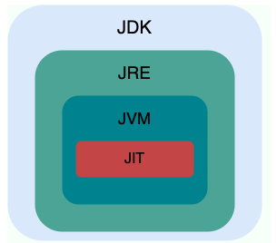
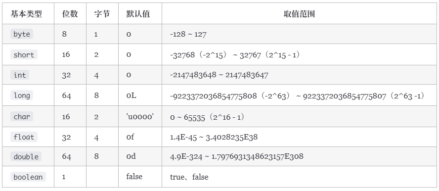
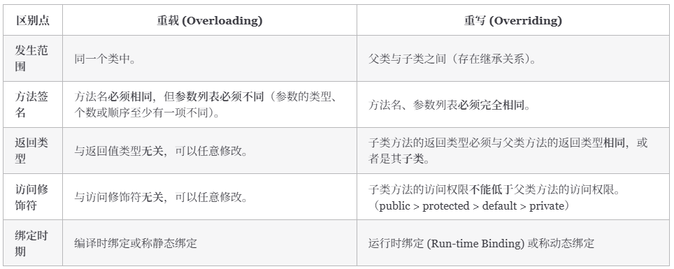
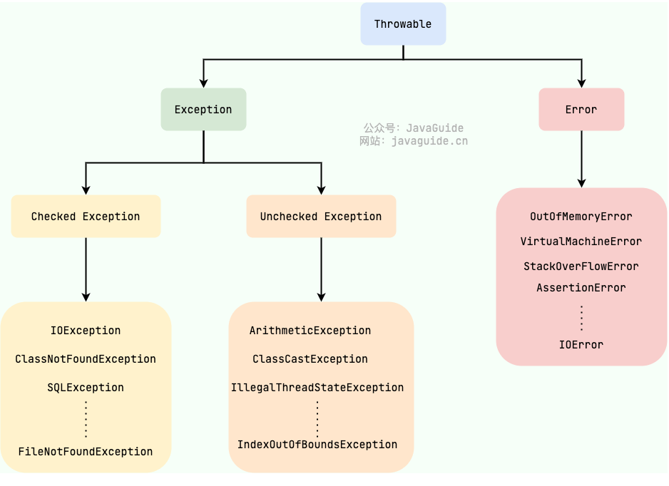
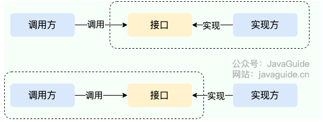
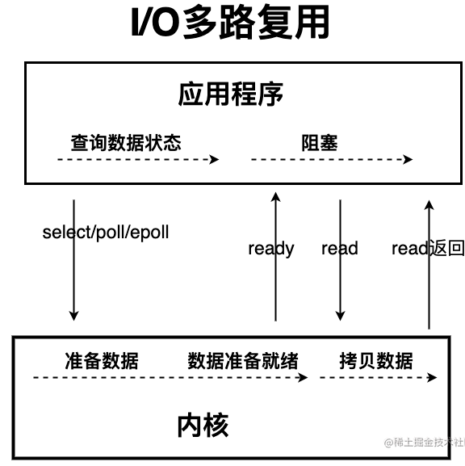
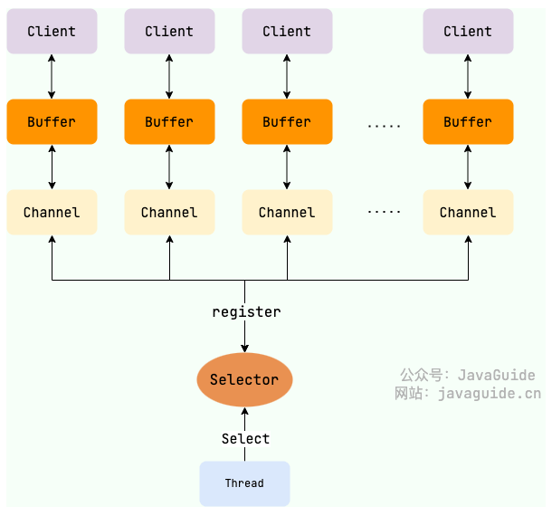
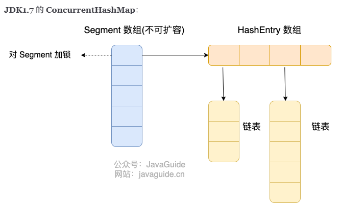
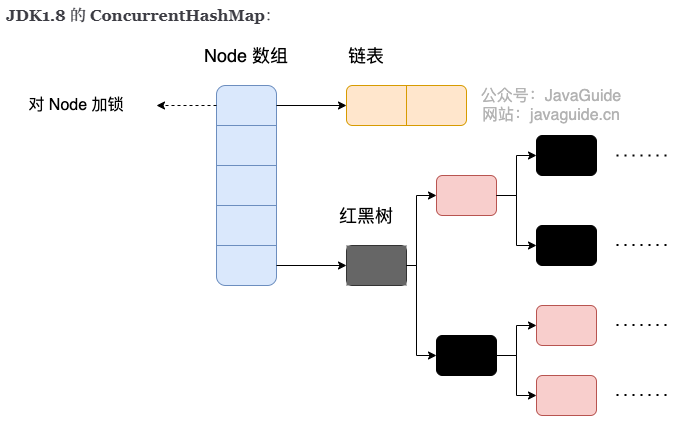

# Java基础

## <span class="star-badge">⭐</span> JVM、JDK、JRE区别



- Java 虚拟机（Java Virtual Machine, ==JVM==）是运行 Java 字节码的虚拟机。

  JVM 有针对不同系统的特定实现（Windows，Linux，macOS），目的是使用相同的字节码，它们都会给出相同的结果。字节码和不同系统的 JVM 实现是 Java 语言“一次编译，随处可以运行”的关键所在。

  不同编程语言（Java、Kotlin、JRuby）通过各自的编译器编译成`.class`文件，最终通过jvm在不同平台运行
- ==JDK==（Java Development Kit）是一个功能齐全的 Java 开发工具包，供开发者使用，用于创建和编译 Java 程序。它包含了 JRE（Java Runtime Environment），以及编译器 javac 和其他工具，如 javadoc（文档生成器）、jdb（调试器）、jconsole（监控工具）、javap（反编译工具）等。
- JRE 是运行已编译 Java 程序所需的环境，主要包含：

  1. JVM
  2. Java基础类库（Class Library）：一组标准的类库，提供常用的功能和 API（如 I/O 操作、网络通信、数据结构等）。

## <span class="star-badge">⭐</span> 什么是字节码

在 Java 中，JVM 可以理解的代码就叫做字节码（即扩展名为 `.class` 的文件），它不面向任何特定的处理器，只面向虚拟机。Java 语言通过字节码的方式，在一定程度上解决了传统解释型语言执行效率低的问题，同时又保留了解释型语言可移植的特点。

.class -> 机器码这一步，JVM类加载器首先加载字节码文件，然后通过解释器逐行执行，这种方式执行较慢。后面引进了 ==JIT（Just in Time Compilation）== 编译器，而 JIT 属于运行时编译。

---

### 为什么说Java语言“编译与解释并存”

- ==编译型==：[编译型语言](https://zh.wikipedia.org/wiki/%E7%B7%A8%E8%AD%AF%E8%AA%9E%E8%A8%80) 会通过[编译器](https://zh.wikipedia.org/wiki/%E7%B7%A8%E8%AD%AF%E5%99%A8)将源代码一次性翻译成可被该平台执行的机器码。一般情况下，编译语言的执行速度比较快，开发效率比较低。常见的编译性语言有 C、C++、Go、Rust 等等。
- ==解释型==：[解释型语言](https://zh.wikipedia.org/wiki/%E7%9B%B4%E8%AD%AF%E8%AA%9E%E8%A8%80)会通过[解释器](https://zh.wikipedia.org/wiki/%E7%9B%B4%E8%AD%AF%E5%99%A8)一句一句的将代码解释（interpret）为机器代码后再执行。解释型语言开发效率比较快，执行速度比较慢。常见的解释性语言有 Python、JavaScript、PHP 等等。

Java 语言既具有编译型语言的特征，也具有解释型语言的特征。因为 Java 程序要经过先编译，后解释两个步骤，由 Java 编写的程序需要先经过编译步骤，生成字节码（`.class` 文件），这种字节码必须由 Java 解释器来解释执行。

---

**AOT[补充]**

JDK 9 引入了一种新的编译模式 AOT(Ahead of Time Compilation) 。和 JIT 不同的是，这种编译模式会在程序被执行前就将其编译成机器码，属于静态编译。

缺点：AOT 编译无法支持 Java 的一些动态特性，如反射、动态代理、动态加载、JNI（Java Native Interface）等。


## <span class="star-badge">⭐</span> 移位运算符

移位运算符是最基本的运算符之一，移位操作中，被操作的数据被视为二进制数，移位就是将其向左或向右移动若干位的运算。

使用移位运算符的主要原因：

1. ==高效==：移位运算符直接对应于处理器的移位指令。现代处理器具有专门的硬件指令来执行这些移位操作，这些指令通常在一个时钟周期内完成。相比之下，乘法和除法等算术运算在硬件层面上需要更多的时钟周期来完成。
2. ==节省内存==：通过移位操作，可以使用一个整数（如 `int`​ 或 `long`）来存储多个布尔值或标志位，从而节省内存

移位运算符最常用于快速乘以或除以 2 的幂次方

移位操作实际上只支持int和long，编译器在对short、byte、char类型移位前，都会将其转为int

## <span class="star-badge">⭐</span> 基本数据类型与包装类型



### 基本类型和包装类型的区别

- 基本数据类型的局部变量存放在 Java 虚拟机栈中的局部变量表中，基本数据类型的成员变量（未被 `static` 修饰 ）存放在 Java 虚拟机的堆中。包装类型属于对象类型，几乎所有对象实例都存在于堆中。
- 相比于包装类型（对象类型）， 基本数据类型占用的空间往往非常小。
- 成员变量包装类型不赋值就是 `null`​ ，而基本类型有默认值且==不是== `null`。
- 对于基本数据类型来说，`==`​ 比较的是值。对于包装数据类型来说，`==`​ 比较的是对象的内存地址。所有整型包装类对象之间值的比较，全部使用 `equals()` 方法。

注意⚠️：基本数据类型存放在栈中是一个常见的误区。

基本数据类型的存储位置取决于它们的作用域和声明方式。如果它们是局部变量，那么它们会存放在栈中；如果它们是成员变量，那么它们会存放在堆/方法区/元空间中。

---

### 包装类型的缓存机制

​`Byte`​,`Short`​,`Integer`​,`Long`​ 这 4 种包装类默认创建了数值  **[-128，127]**  的相应类型的缓存数据，`Character`​ 创建了数值在  **[0,127]**  范围的缓存数据，`Boolean`​ 直接返回 `TRUE`​ or `FALSE`。

### 自动装箱与拆箱

- ==装箱==：将基本类型用它们对应的引用类型包装起来；
- ==拆箱==：将包装类型转换为基本数据类型；

装箱其实就是调用了 包装类的`valueOf()`​方法，拆箱其实就是调用了 `xxxValue()`方法

因此：

- ​`Integer i = 10`​ 等价于 `Integer i = Integer.valueOf(10)`
- ​`int n = i`​ 等价于 `int n = i.intValue()`;

---

### 浮点数运算为什么有精度丢失风险

计算机是二进制的，而且计算机在表示一个数字时，宽度是有限的，无限循环的小数存储在计算机时，只能被截断，所以就会导致小数精度发生损失的情况。这也就是解释了为什么浮点数没有办法用二进制精确表示。

如何解决：

使用`BigDecimal`​可以实现对浮点数的运算，不会造成精度丢失。通常情况下，大部分需要浮点数精确运算结果的业务场景（比如涉及到钱的场景）都是通过 `BigDecimal` 来做的。

### 超过long整形的数据如何表示

使用`BigInteger`

## <span class="star-badge">⭐</span> 成员变量与局部变量

- 成员变量是属于类的，而局部变量是在代码块或方法中定义的变量或是方法的参数；
- 如果成员变量是使用 `static`​ 修饰的，那么这个成员变量是属于类的，如果没有使用 `static` 修饰，这个成员变量是属于实例的。而对象存在于堆内存，局部变量则存在于栈内存。
- 成员变量是对象的一部分，它随着对象的创建而存在，而局部变量随着方法的调用而自动生成，随着方法的调用结束而消亡。
- 成员变量如果没有被赋初始值，则会自动以类型的默认值而赋值（一种情况例外:被 `final` 修饰的成员变量也必须显式地赋值），而局部变量则不会自动赋值。

## <span class="star-badge">⭐</span> 重载和重写的区别

- 重载：发生在同一个类中（或者父类和子类之间），方法名必须相同，参数类型不同、个数不同、顺序不同，方法返回值和访问修饰符可以不同。

  重载就是同一个类中多个同名方法根据不同的传参来执行不同的逻辑处理
- 重写：重写发生在运行期，是子类对父类的允许访问的方法的实现过程进行重新编写。

  1. 方法名、参数列表必须相同，子类方法返回值类型应比父类方法返回值类型更小或相等，抛出的异常范围小于等于父类，访问修饰符范围大于等于父类。
  2. 如果父类方法访问修饰符为 `private/final/static`​ 则子类就不能重写该方法，但是被 `static` 修饰的方法能够被再次声明。
  3. 构造方法无法被重写。



<span class="star-badge">⭐</span> ：如果方法的返回类型是 void 和基本数据类型，则返回值重写时不可修改。但是如果方法的返回值是引用类型，重写时是可以返回该引用类型的子类的。

---

**可变长参数**

可变长参数就是允许在调用方法时传入不定长度的参数。

遇到方法重载的情况，优先匹配固定参数的方法

## <span class="star-badge">⭐</span> 面向对象三大特征

- 封装

  封装是指把一个对象的状态信息（也就是属性）隐藏在对象内部，不允许外部对象直接访问对象的内部信息。但是可以提供一些可以被外界访问的方法来操作属性。

- 继承

  1. 子类拥有父类对象所有的属性和方法（包括私有属性和私有方法），但是父类中的私有属性和方法子类是无法访问，==只是拥有==。
  2. 子类可以拥有自己属性和方法，即子类可以对父类进行扩展。
  3. 子类可以用自己的方式实现父类的方法。

- 多态

  表示一个对象具有多种的状态，具体表现为父类的引用指向子类的实例。

  特点：

  - 对象类型和引用类型之间具有继承（类）/实现（接口）的关系；
  - 引用类型变量发出的方法调用的到底是哪个类中的方法，必须在程序运行期间才能确定；
  - 多态不能调用“只在子类存在但在父类不存在”的方法；
  - 如果子类重写了父类的方法，真正执行的是子类重写的方法，如果子类没有重写父类的方法，执行的是父类的方法。

## <span class="star-badge">⭐</span> 接口和抽象类的异同

共同点：

- 实例化：接口和抽象类都不能直接实例化，只能被实现（接口）或继承（抽象类）后才能创建具体的对象。
- 抽象方法：接口和抽象类都可以包含抽象方法。抽象方法没有方法体，必须在子类或实现类中实现。

区别：

- 设计目的：接口主要用于对类的行为进行约束，你实现了某个接口就具有了对应的行为。抽象类主要用于代码复用，强调的是所属关系。
- 继承和实现：一个类只能继承一个类（包括抽象类），因为 Java 不支持多继承。但一个类可以实现多个接口，一个接口也可以继承多个其他接口。
- 成员变量：接口中的成员变量只能是 `public static final`​ 类型的，不能被修改且必须有初始值。抽象类的成员变量可以有任何修饰符（`private`​, `protected`​, `public`），可以在子类中被重新定义或赋值。

- 方法 **：**

  - Java 8 之前，接口中的方法默认是 `public abstract`​ ，也就是只能有方法声明。自 Java 8 起，可以在接口中定义 `default`​（默认） 方法和 `static`​ （静态）方法。 自 Java 9 起，接口可以包含 `private` 方法。
  - 抽象类可以包含抽象方法和非抽象方法。抽象方法没有方法体，必须在子类中实现。非抽象方法有具体实现，可以直接在抽象类中使用或在子类中重写。

## <span class="star-badge">⭐</span> Object 类的常见方法

Object 类是一个特殊的类，是所有类的父类，主要提供了以下 11 个方法：

```java
/**
 * native 方法，用于返回当前运行时对象的 Class 对象，使用了 final 关键字修饰，故不允许子类重写。
 */
public final native Class<?> getClass()
/**
 * native 方法，用于返回对象的哈希码，主要使用在哈希表中，比如 JDK 中的HashMap。
 */
public native int hashCode()
/**
 * 用于比较 2 个对象的内存地址是否相等，String 类对该方法进行了重写以用于比较字符串的值是否相等。
 */
public boolean equals(Object obj)
/**
 * native 方法，用于创建并返回当前对象的一份拷贝。
 */
protected native Object clone() throws CloneNotSupportedException
/**
 * 返回类的名字实例的哈希码的 16 进制的字符串。建议 Object 所有的子类都重写这个方法。
 */
public String toString()
/**
 * native 方法，并且不能重写。唤醒一个在此对象监视器上等待的线程(监视器相当于就是锁的概念)。如果有多个线程在等待只会任意唤醒一个。
 */
public final native void notify()
/**
 * native 方法，并且不能重写。跟 notify 一样，唯一的区别就是会唤醒在此对象监视器上等待的所有线程，而不是一个线程。
 */
public final native void notifyAll()
/**
 * native方法，并且不能重写。暂停线程的执行。注意：sleep 方法没有释放锁，而 wait 方法释放了锁 ，timeout 是等待时间。
 */
public final native void wait(long timeout) throws InterruptedException
/**
 * 多了 nanos 参数，这个参数表示额外时间（以纳秒为单位，范围是 0-999999）。 所以超时的时间还需要加上 nanos 纳秒。。
 */
public final void wait(long timeout, int nanos) throws InterruptedException
/**
 * 跟之前的2个wait方法一样，只不过该方法一直等待，没有超时时间这个概念
 */
public final void wait() throws InterruptedException
/**
 * 实例被垃圾回收器回收的时候触发的操作
 */
protected void finalize() throws Throwable { }
```

### <span class="star-badge">⭐</span> `==` 和 `equals()` 的区别

因为 Java 只有值传递，所以，对于 == 来说，不管是比较基本数据类型，还是引用数据类型的变量，其本质比较的都是值，只是==引用类型变量存的值是对象的地址==。

​`equals()`​ 不能用于判断基本数据类型的变量，只能用来判断两个对象是否相等。`equals()`​方法存在于`Object`​类中，而`Object`​类是所有类的直接或间接父类，因此所有的类都有`equals()`方法。

​`String`​ 中的 `equals`​ 方法是被重写过的，因为 `Object`​ 的 `equals`​ 方法是比较的对象的内存地址，而 `String`​ 的 `equals` 方法比较的是对象的值。

当创建 `String`​ 类型的对象时，虚拟机会在常量池中查找有没有已经存在的值和要创建的值相同的对象，如果有就把它赋给当前引用。如果没有就在常量池中重新创建一个 `String` 对象。

### <span class="star-badge">⭐</span> hashCode 和 equals

- 如果两个对象的`hashCode` 值相等，那这两个对象不一定相等（哈希碰撞）。
- 如果两个对象的`hashCode`​ 值相等并且`equals()`​方法也返回 `true`，我们才认为这两个对象相等。
- 如果两个对象的`hashCode` 值不相等，我们就可以直接认为这两个对象不相等。

## <span class="star-badge">⭐</span> String、StringBuffer、StringBuilder

**可变性**

​`String` 是不可变的

​`StringBuilder`​ 与 `StringBuffer`​ 都继承自 `AbstractStringBuilder`​ 类，在 `AbstractStringBuilder`​ 中也是使用字符数组保存字符串，不过没有使用 `final`​ 和 `private`​ 关键字修饰，最关键的是这个 `AbstractStringBuilder`​ 类还提供了很多修改字符串的方法比如 `append` 方法。

**<span class="star-badge">⭐</span> 线程安全性**

- String不可变，可以理解为线程安全
- ​`StringBuffer` 对方法加了同步锁或者对调用的方法加了同步锁，所以是线程安全的。
- ​`StringBuilder` 并没有对方法进行加同步锁，所以是非线程安全的。

**性能**

- 每次对 `String`​ 类型进行改变的时候，都会生成一个新的 `String`​ 对象，然后将指针指向新的 `String` 对象。
- ​`StringBuffer`​ 每次都会对 `StringBuffer` 对象本身进行操作，而不是生成新的对象并改变对象引用。
- 相同情况下使用 `StringBuilder`​ 相比使用 `StringBuffer` 仅能获得 10%~15% 左右的性能提升，但却要冒多线程不安全的风险。

---

### <span class="star-badge">⭐</span> String 为什么是不可变的

1. 保存字符串的数组被 `final`​ 修饰且为私有的，并且`String` 类没有提供/暴露修改这个字符串的方法。
2. ​`String`​ 类被 `final`​ 修饰导致其不能被继承，进而避免了子类破坏 `String` 不可变。

### <span class="star-badge">⭐</span> 字符串拼接用+还是StringBuilder

Java 语言本身并不支持运算符重载，“+”和“+=”是专门为 String 类重载过的运算符，也是 Java 中仅有的两个重载过的运算符。

字符串对象通过“+”的字符串拼接方式，实际上是通过 `StringBuilder`​ 调用 `append()`​ 方法实现的，拼接完成之后调用 `toString()`​ 得到一个 `String` 对象 。

**字符串常量池**

[字符串常量池](#20251216172641-ez10du4)

### <span class="star-badge">⭐</span> String s1 new String("abc") 创建了几个字符串对象

会创建1个或2个字符串对象

1. 字符串常量池中不存在 "abc"：会创建 2 个 字符串对象。一个在字符串常量池中，由 `ldc(load constant)`​ 指令触发创建。一个在堆中，由 `new String()` 创建，并使用常量池中的 "abc" 进行初始化。
2. 字符串常量池中已存在 "abc"：会创建 1 个 字符串对象。该对象在堆中，由 `new String()` 创建，并使用常量池中的 "abc" 进行初始化。

## 异常相关
### <span class="star-badge">⭐</span> Checked Exception 和 Unchecked Exception 的区别



所有的异常都有一个共同的祖先 `java.lang`​ 包中的 `Throwable`​ 类。`Throwable` 类有两个重要的子类:

- ​**​`Exception`​**​ :程序本身可以处理的异常，可以通过 `catch`​ 来进行捕获。`Exception` 又可以分为 Checked Exception (受检查异常，必须处理) 和 Unchecked Exception (不受检查异常，可以不处理)。

  - Checked Exception：Java 代码在编译过程中，如果受检查异常没有被 `catch`​或者`throws` 关键字处理的话，就没办法通过编译。

    除了`RuntimeException`​及其子类以外，其他的`Exception`​类及其子类都属于受检查异常 。常见的受检查异常有：IO 相关的异常、`ClassNotFoundException`​、`SQLException`...。
  - Unchecked Exception：Java 代码在编译过程中 ，我们即使不处理不受检查异常也可以正常通过编译。

    - ​`NullPointerException`(空指针错误)
    - ​`IllegalArgumentException`(参数错误比如方法入参类型错误)
    - ​`NumberFormatException`​（字符串转换为数字格式错误，`IllegalArgumentException`的子类）
    - ​`ArrayIndexOutOfBoundsException`（数组越界错误）
    - ​`ClassCastException`（类型转换错误）
    - ​`ArithmeticException`（算术错误）
    - ​`SecurityException` （安全错误比如权限不够）
    - ​`UnsupportedOperationException`(不支持的操作错误比如重复创建同一用户)
- ​**​`Error`​**​：`Error`​ 属于程序无法处理的错误 ，不建议通过`catch`​捕获 。例如 Java 虚拟机运行错误（`Virtual MachineError`​）、虚拟机内存不够错误(`OutOfMemoryError`​)、类定义错误（`NoClassDefFoundError`）等 。这些异常发生时，Java 虚拟机（JVM）一般会选择线程终止。

---

### Throwable 类常用方法

- ​`String getMessage()`: 返回异常发生时的详细信息
- ​`String toString()`: 返回异常发生时的简要描述
- ​`String getLocalizedMessage()`​: 返回异常对象的本地化信息。使用 `Throwable`​ 的子类覆盖这个方法，可以生成本地化信息。如果子类没有覆盖该方法，则该方法返回的信息与 `getMessage()`返回的结果相同
- ​`void printStackTrace()`​: 在控制台上打印 `Throwable` 对象封装的异常信息

### try-with-resources 代替 try-catch-finally

1. 适用范围（资源的定义） **：**  任何实现 `java.lang.AutoCloseable`​或者 `java.io.Closeable` 的对象
2. 关闭资源和 finally 块的执行顺序 **：**  在 `try-with-resources` 语句中，任何 catch 或 finally 块在声明的资源关闭后运行

通过使用分号分隔，可以在`try-with-resources`块中声明多个资源。

---

### <span class="star-badge">⭐</span> 异常使用有哪些需要注意的地方

- 不要把异常定义为静态变量，因为这样会导致异常栈信息错乱。每次手动抛出异常，我们都需要==手动 new== 一个异常对象抛出。
- 抛出的异常信息一定要==有意义==。
- 建议抛出更加具体的异常，比如字符串转换为数字格式错误的时候应该抛出`NumberFormatException`​而不是其父类`IllegalArgumentException`。
- 避免重复记录日志：如果在捕获异常的地方已经记录了足够的信息（包括异常类型、错误信息和堆栈跟踪等），那么在业务代码中再次抛出这个异常时，就不应该再次记录相同的错误信息。重复记录日志会使得日志文件膨胀，并且可能会掩盖问题的实际原因，使得问题更难以追踪和解决。

## <span class="star-badge">⭐</span> 反射

Java 反射 (Reflection) 是一种在程序运行时，动态地获取类的信息并操作类或对象（方法、属性）的能力。

优点：

1. ==灵活性和动态性==：反射允许程序在运行时动态地加载类、创建对象、调用方法和访问字段。这样可以根据实际需求（如配置文件、用户输入、注解等）动态地适应和扩展程序的行为，显著提高了系统的灵活性和适应性。

2. ==框架开发的基础==：许多现代 Java 框架（如 Spring、Hibernate、MyBatis）都大量使用反射来实现依赖注入（DI）、面向切面编程（AOP）、对象关系映射（ORM）、注解处理等核心功能。反射是实现这些“魔法”功能不可或缺的基础工具。
3. ==解耦合和通用性==：通过反射，可以编写更通用、可重用和高度解耦的代码，降低模块之间的依赖。例如，可以通过反射实现通用的对象拷贝、序列化、Bean 工具等。

缺点：

1. ==性能开销==：反射操作通常比直接代码调用要慢。因为涉及到动态类型解析、方法查找以及 JIT 编译器的优化受限等因素。不过，对于大多数框架场景，这种性能损耗通常是可以接受的，或者框架本身会做一些缓存优化。

2. ==安全性问题==：反射可以绕过 Java 语言的访问控制机制（如访问 `private` 字段和方法），破坏了封装性，可能导致数据泄露或程序被恶意篡改。此外，还可以绕过泛型检查，带来类型安全隐患。

3. ==代码可读性和维护性==：过度使用反射会使代码变得复杂、难以理解和调试。错误通常在运行时才会暴露，不像编译期错误那样容易发现。

### 获取Class对象的四种方式

1. 知道具体的类

   ```java
   Class alunbarClass = TargetObject.class;
   ```
2. 通过 `Class.forName()`传入类的全路径获取

   ```java
   Class alunbarClass1 = Class.forName("cn.javaguide.TargetObject");
   ```
3. 通过对象实例`instance.getClass()`获取

   ```java
   TargetObject o = new TargetObject();
   Class alunbarClass2 = o.getClass();
   ```
4. 通过类加载器`xxxClassLoader.loadClass()`传入类路径获取

   ```java
   ClassLoader.getSystemClassLoader().loadClass("cn.javaguide.TargetObject");
   ```

### 反射应用场景

1. 依赖注入与控制反转（IoC）

   以 Spring/Spring Boot 为代表的 IoC 框架，会在启动时扫描带有特定注解（如 `@Component`​, `@Service`​, `@Repository`​, `@Controller`​）的类，利用反射实例化对象（Bean），并通过反射注入依赖（如 `@Autowired`、构造器注入等）。

2. 注解处理

   注解本身只是个“标记”，得有人去读这个标记才知道要做什么。反射就是那个“读取器”。框架通过反射检查类、方法、字段上有没有特定的注解，然后根据注解信息执行相应的逻辑。

3. 动态代理与AOP

   动态代理是实现 AOP 的常用手段。JDK 自带的动态代理（Proxy 和 InvocationHandler）就离不开反射。代理对象在内部调用真实对象的方法时，就是通过反射的 `Method.invoke` 来完成的。
4. 对象关系映射（ORM）

   把数据库查出来的一行行数据，自动变成一个个 Java 对象。通过反射获取 Java 类的属性列表，然后把查询结果按名字或配置对应起来，再用反射调用 setter 或直接修改字段值。反过来，保存对象到数据库时，也是用反射读取属性值来拼 SQL。

‍

## SPI

SPI 即 Service Provider Interface ，字面意思就是：“服务提供者的接口”，专门提供给服务提供者或者扩展框架功能的开发者去使用的一个接口。

SPI 将服务接口和具体的服务实现分离开来，将服务调用方和服务实现者解耦，能够提升程序的扩展性、可维护性。修改或者替换服务实现并不需要修改调用方。

### SPI 和 API 有什么区别



- 当实现方提供了接口和实现，我们可以通过调用实现方的接口从而拥有实现方给我们提供的能力，这就是 ​**API**。这种情况下，接口和实现都是放在实现方的包中。调用方通过接口调用实现方的功能，而不需要关心具体的实现细节。
- 当接口存在于调用方这边时，这就是 **SPI** 。由接口调用方确定接口规则，然后由不同的厂商根据这个规则对这个接口进行实现，从而提供服务。

### SPI 优缺点

通过 SPI 机制能够大大地提高接口设计的灵活性，但是 SPI 机制也存在一些缺点，比如：

- 需要遍历加载所有的实现类，不能做到按需加载，这样效率还是相对较低的。
- 当多个 `ServiceLoader`​ 同时 `load` 时，会有并发问题。

## 序列化和反序列化

- ==序列化==：将数据结构或对象转换成可以存储或传输的形式，通常是二进制字节流，也可以是 JSON, XML 等文本格式
- ==反序列化==：将在序列化过程中所生成的数据转换为原始数据结构或者对象的过程

### 常见应用场景

- 对象在进行网络传输（比如远程方法调用 RPC 的时候）之前需要先被序列化，接收到序列化的对象之后需要再进行反序列化；
- 将对象存储到文件之前需要进行序列化，将对象从文件中读取出来需要进行反序列化；
- 将对象存储到数据库（如 Redis）之前需要用到序列化，将对象从缓存数据库中读取出来需要反序列化；
- 将对象存储到内存之前需要进行序列化，从内存中读取出来之后需要进行反序列化。

### 常见序列化协议

JDK 自带的序列化方式一般不会用 ，因为序列化效率低并且存在安全问题。比较常用的序列化协议有 Hessian、Kryo、Protobuf、ProtoStuff，这些都是基于二进制的序列化协议。

### 为什么不使用JDK自带的序列化方式

- 不支持跨语言调用: 如果调用的是其他语言开发的服务的时候就不支持了。
- 性能差：相比于其他序列化框架性能更低，主要原因是序列化之后的字节数组体积较大，导致传输成本加大。
- 存在安全问题：序列化和反序列化本身并不存在问题。但当输入的反序列化的数据可被用户控制，那么攻击者即可通过构造恶意输入，让反序列化产生非预期的对象，在此过程中执行构造的任意代码。

## Java IO 模型

### BIO（Blocking IO）

==BIO 属于同步阻塞 IO 模型 。==

同步阻塞 IO 模型中，应用程序发起 read 调用后，会一直==阻塞==，直到内核把数据拷贝到用户空间。

### NIO（Non-blocking/New IO）

NIO 中的 N 可以理解为 Non-blocking，不单纯是 New。它是支持面向缓冲的，基于通道的 I/O 操作方法。 对于高负载、高并发的（网络）应用，应使用 NIO。

Java 中的 NIO 可以看作是 ==I/O 多路复用模型==​。



【只看下面两段就行】

IO 多路复用模型中，线程首先发起 select 调用，询问内核数据是否准备就绪，等内核把数据准备好了，用户线程再发起 read 调用。read 调用的过程（数据从内核空间 -\> 用户空间）还是阻塞的。

Java 中的 NIO ，有一个非常重要的==选择器 ( Selector )== 的概念，也可以被称为 ==多路复用器==。通过它，只需要一个线程便可以管理多个客户端连接。当客户端数据到了之后，才会为其服务。



**Java核心组件**

|Java NIO 组件|作用|底层 Linux 对应物|
| ---------------| -------------------------------------------------------| --------------------------------------------------|
|​`Channel`|双向 I/O 通道（替代 BIO 的 Stream），支持非阻塞|文件描述符（fd）：如 socket fd、文件 fd|
|​`Selector`|多路复用器，监听多个 Channel 的事件（如 OP\_READ）|epoll 实例 /select 的 fd 集合|
|​`SelectionKey`|记录 Channel 与 Selector 的绑定关系 + 事件类型|epoll\_ctl 注册的事件（EPOLLIN、EPOLLOUT 等）|

**select 和 epoll 过程**

- select

  - 用户态：把需要监听的 ​**读 / 写 / 异常 fd 集合**​（fd\_set）拷贝到内核态（每次调用 select 都要拷贝，这是 select 的痛点之一）；
  - 内核态：​**轮询所有注册的 fd**（O (n) 效率），检查每个 fd 是否有就绪事件（如数据可读、连接建立）；
  - 内核态→用户态：把 “就绪的 fd” 对应的位在 fd\_set 中标记为 1，然后拷贝整个 fd\_set 回用户态；
  - 用户态：遍历整个 fd\_set，找出被标记为 1 的 fd（即就绪 fd），进行处理。

- epoll

  - 初始化：用户态调用 `epoll_create`​，内核创建一个 **红黑树（管理所有注册的 fd）**  + 一个 ​**双向就绪链表（只存就绪的 fd）** ；
  - 注册 fd：用户态调用 `epoll_ctl`​，把 fd 及监听的事件（如 EPOLLIN）注册到内核的红黑树中（​**仅注册时拷贝一次 fd，之后无需再拷贝**，解决 select 的拷贝痛点）；
  - 内核监听：内核通过 “中断通知” 机制监听 fd（不用轮询），一旦某个 fd 有事件就绪，内核会 **直接把该 fd 对应的事件结构加入就绪链表**（红黑树仅用于快速查找 / 删除注册的 fd）；
  - 用户态获取：用户态调用 `epoll_wait`，内核直接返回就绪链表中的所有 fd（O (1) 效率），无需用户态遍历全部注册 fd。

**AIO**

是异步 IO 模型，异步 IO 是基于事件和回调机制实现的，也就是应用操作之后会直接返回，不会堵塞在那里，当后台处理完成，操作系统会通知相应的线程进行后续的操作。

目前来说 AIO 的应用还不是很广泛。Netty 之前也尝试使用过 AIO，不过又放弃了。这是因为，Netty 使用了 AIO 之后，在 Linux 系统上的性能并没有多少提升。

## Java代理模式

使用代理对象来代替对真实对象(real object)的访问，这样就可以在不修改原目标对象的前提下，提供额外的功能操作，扩展目标对象的功能。==代理模式的主要作用是扩展目标对象的功能==，比如说在目标对象的某个方法执行前后你可以增加一些自定义的操作。

### 静态代理

编译期就确定代理类与目标类的关系，代理类是「手动编写」或「工具生成」的.java 文件，编译后生成.class 文件，与目标类实现==同一个接口==。代理类持有目标类实例，在实现接口方法时，先执行增强逻辑（如日志、事务、权限校验），再调用目标类的原方法。

缺点：

- 若接口新增 / 修改方法，不仅所有目标类要实现该方法，所有对应的代理类也必须同步修改（否则编译报错）。
- 静态代理只能代理「固定接口」的类，无法动态适配不同类型的目标对象（比如同时代理 `UserService`​ 和 `OrderService` 需写两个代理类）。而动态代理只需一个增强处理器，就能代理任意类的任意方法，灵活性极强。

### 动态代理

编译期无代理类，==运行时通过反射 / 字节码技术动态生成代理类==，无需手动编写代理代码。

**JDK 动态代理**

1. 定义一个接口及其实现类
2. 自定义InvocationHandler 并重写`invoke`​方法，在 `invoke` 方法中我们会调用原生方法（被代理类的方法）并自定义一些处理逻辑；
3. 通过 `Proxy.newProxyInstance(ClassLoader loader,Class<?>[] interfaces,InvocationHandler h)` 方法创建代理对象。

**CGLIB 动态代理**

==JDK 动态代理有一个最致命的问题是其只能代理实现了接口的类。==

==CGLIB==(Code Generation Library)是一个基于ASM的字节码生成库，它允许我们在运行时对字节码进行修改和动态生成。CGLIB 通过==继承==方式实现代理。

在 CGLIB 动态代理机制中 `MethodInterceptor`​ 接口和 `Enhancer` 类是核心。

### <span class="star-badge">⭐</span> JDK 动态代理与 CGLIB 动态代理对比

- ==JDK 动态代理只能代理实现了接口的类或者直接代理接口，而 CGLIB 可以代理未实现任何接口的类==​ **。**  另外， CGLIB 动态代理是通过生成一个被代理类的子类来拦截被代理类的方法调用，因此不能代理声明为 final 类型的类和方法，private 方法也无法代理。
- 就二者的效率来说，大部分情况都是 JDK 动态代理更优秀，随着 JDK 版本的升级，这个优势更加明显。

## BigDecimal

**创建**

为了防止精度丢失，推荐使用 `BigDecimal(String val)`​ 构造方法或者 `BigDecimal.valueOf(double val)` 静态方法来创建对象

**加减乘除**

​`add`​ 方法用于将两个 `BigDecimal`​ 对象相加，`subtract`​ 方法用于将两个 `BigDecimal`​ 对象相减。`multiply`​ 方法用于将两个 `BigDecimal`​ 对象相乘，`divide`​ 方法用于将两个 `BigDecimal` 对象相除。

**大小比较**

​`a.compareTo(b)`​ : 返回 -1 表示 `a`​ 小于 `b`​，0 表示 `a`​ 等于 `b`​ ， 1 表示 `a`​ 大于 `b`。

不使用equals，因为 `equals()`​ 方法不仅仅会比较值的大小（value）还会比较精度（scale），而 `compareTo()` 方法比较的时候会忽略精度。

**保留几位小数**

通过 `setScale`方法设置保留几位小数以及保留规则。

## 集合

### <span class="star-badge">⭐</span> List, Set, Queue, Map 区别

- ​`List`(对付顺序的好帮手): 存储的元素是有序的、可重复的。
- ​`Set`(注重独一无二的性质): 存储的元素不可重复的。
- ​`Queue`(实现排队功能的叫号机): 按特定的排队规则来确定先后顺序，存储的元素是有序的、可重复的。
- ​`Map`(用 key 来搜索的专家): 使用键值对（key-value）存储，key 是无序的、不可重复的，value 是无序的、可重复的，每个键最多映射到一个值。

### List

- ​`ArrayList`​：`Object[]` 数组。

  **<span class="star-badge">⭐</span> 与Array的区别**

  - ArrayList 会根据实际存储的元素动态地扩容或缩容，Array创建后不可更改
  - ArrayList 允许使用泛型
  - ArrayList 只允许存储对象，对于基本类型，需要包装类
  - ArrayList 支持插入、删除、遍历，提供了丰富的API，Array只是固定长度数组，只能下标访问
  - ArrayList 创建时不需要指定大小

  **<span class="star-badge">⭐</span> 插入和删除元素的时间复杂度**

  插入：

  - 头部插入：O(n)
  - 尾部插入：容量未达到极限时，O(1)；当容量达到极限需要扩容时，需要执行一次O(n)的操作将原数组复制到更大的数组中，然后执行O(1)的插入。
  - 指定位置插入：需要将目标位置的所有元素都向后移动一个位置，O(n)

  删除：

  - 头部删除：O(n)
  - 尾部删除：O(1)
  - 指定位置删除：O(n)

  **<span class="star-badge">⭐</span> ArrayList 扩容机制**

  三种初始化方式：

  1. 默认构造函数，使用初始容量10构造一个空数组（无参数构造）

     无参构造方法创建 ArrayList 时，实际上初始化赋值的是一个空数组。当真正对数组添加元素操作时，才真正分配容量。
  2. 带初始容量参数的构造函数，用户自己指定容量
  3. 构造包含指定collection元素的列表，这些元素利用该集合的迭代器按顺序返回

  **扩容：**
  1. 首次添加元素（触发第一次扩容）

  初始数组是空数组，容量0。默认扩容到10（JDK8 首次扩容固定为10）。数组变为长度为10的空数组，存入元素。

  2. 添加第11个元素（触发常规扩容）。

  已经存了10个元素，添加第11个元素，触发扩容。`新容量 = 旧容量 + 旧容量 >> 1`，即扩容为原来的1.5倍。

  ```java
  int newCapacity = oldCapacity + (oldCapacity >> 1);
  ...
  elementData = Arrays.copyOf(elementData, newCapacity);
  ```
- ​`Vector`​：`Object[]` 数组。
- ​`LinkedList`：双向链表(JDK1.6 之前为循环链表，JDK1.7 取消了循环)。

  <span class="star-badge">⭐</span> 插入删除时间复杂度

  - 头部插入/删除：修改头节点指针，O(1)
  - 尾部插入/删除：修改尾节点指针，O(1)
  - 指定位置插入/删除：先移动到指定位置，再修改指针，O(n)

  <span class="star-badge">⭐</span> ArrayList 与 LinkedList 区别

  - 都不是线程安全的
  - 底层数据结构：ArrayList 是 Object数组；LinkedList 是双向链表
  - LinkedList 不支持高效的随机元素访问
  - 内存占用：ArrayList 会在list列表的结尾预留一定的容量空间，LinkedList 每一个元素都需要消耗比ArrayList更多的空间

### Set

- ​`HashSet`​(无序，唯一): 基于 `HashMap`​ 实现的，底层采用 `HashMap` 来保存元素（key 存元素，value 存统一对象）。
- ​`LinkedHashSet`​: `LinkedHashSet`​ 是 `HashSet`​ 的子类，并且其内部是通过 `LinkedHashMap` 来实现的。
- ​`TreeSet`(有序，唯一): 红黑树(自平衡的排序二叉树)

### Queue

- ​`PriorityQueue`​: `Object[]` 数组来实现小顶堆。
- ​`DelayQueue`​:`PriorityQueue`。
- ​`ArrayDeque`: 可扩容动态双向数组。

### Map

- ​`HashMap`​：JDK1.8 之前 `HashMap`​ 由数组+链表组成的，数组是 `HashMap` 的主体，链表则是主要为了解决哈希冲突而存在的（“拉链法”解决冲突）。JDK1.8 以后在解决哈希冲突时有了较大的变化，当链表长度大于阈值（默认为 8）（将链表转换成红黑树前会判断，如果当前数组的长度小于 64，那么会选择先进行数组扩容，而不是转换为红黑树）时，将链表转化为红黑树，以减少搜索时间。
- ​`LinkedHashMap`​：`LinkedHashMap`​ 继承自 `HashMap`​，所以它的底层仍然是基于拉链式散列结构即由数组和链表或红黑树组成。另外，`LinkedHashMap` 在上面结构的基础上，增加了一条双向链表，使得上面的结构可以保持键值对的插入顺序。同时通过对链表进行相应的操作，实现了访问顺序相关逻辑。
- ​`Hashtable`​：数组+链表组成的，数组是 `Hashtable` 的主体，链表则是主要为了解决哈希冲突而存在的。
- ​`TreeMap`：红黑树（自平衡的排序二叉树）。

### 集合中的 fail-fast 和 fail-safe 是什么

快速失败的思想即针对可能发生的异常进行提前表明故障并停止运行，通过尽早的发现和停止错误，降低故障系统级联的风险。

在`java.util`​包下的大部分集合是不支持线程安全的，为了能够提前发现并发操作导致线程安全风险，提出通过维护一个`modCount`​记录修改的次数，迭代期间通过比对预期修改次数`expectedModCount`​和`modCount`是否一致来判断是否存在并发操作，从而实现快速失败，由此保证在避免在异常时执行非必要的复杂代码。

而`fail-safe`也就是安全失败的含义，它旨在即使面对意外情况也能恢复并继续运行，这使得它特别适用于不确定或者不稳定的环境

该思想常运用于并发容器，最经典的实现就是`CopyOnWriteArrayList`​的实现，通过写时复制的思想保证在进行修改操作时复制出一份快照，基于这份快照完成添加或者删除操作后，将`CopyOnWriteArrayList`底层的数组引用指向这个新的数组空间，由此避免迭代时被并发修改所干扰所导致并发操作安全问题，当然这种做法也存在缺点，即进行遍历操作时无法获得实时结果。

### HashSet、LinkedHashSet、TreeSet 异同

- ​`HashSet`​、`LinkedHashSet`​ 和 `TreeSet`​ 都是 `Set` 接口的实现类，都能保证元素唯一，并且都不是线程安全的。
- ​`HashSet`​、`LinkedHashSet`​ 和 `TreeSet`​ 的主要区别在于底层数据结构不同。`HashSet`​ 的底层数据结构是哈希表（基于 `HashMap`​ 实现）。`LinkedHashSet`​ 的底层数据结构是链表和哈希表，元素的插入和取出顺序满足 FIFO。`TreeSet` 底层数据结构是红黑树，元素是有序的，排序的方式有自然排序和定制排序。
- 底层数据结构不同又导致这三者的应用场景不同。`HashSet`​ 用于不需要保证元素插入和取出顺序的场景，`LinkedHashSet`​ 用于保证元素的插入和取出顺序满足 FIFO 的场景，`TreeSet` 用于支持对元素自定义排序规则的场景。

### Queue 与 Deque 区别

​`Queue`​ 是单端队列，只能从一端插入元素，另一端删除元素，实现上一般遵循 ==先进先出（FIFO）== 规则。

​`Queue`​ 扩展了 `Collection`​ 的接口，根据 ==因为容量问题而导致操作失败后处理方式的不同== 可以分为两类方法: 一种在操作失败后会抛出异常，另一种则会返回特殊值。

|​`Queue` 接口|抛出异常|返回特殊值|
| --------------| -----------| ------------|
|插入队尾|add(E e)|offer(E e)|
|删除队首|remove()|poll()|
|查询队首元素|element()|peek()|

​`Deque` 是双端队列，在队列的两端均可以插入或删除元素。

​`Deque`​ 扩展了 `Queue` 的接口, 增加了在队首和队尾进行插入和删除的方法，同样根据失败后处理方式的不同分为两类：

|​`Deque`接口|抛出异常|返回特殊值|
| --------------| ---------------| -----------------|
|插入队首|addFirst(E e)|offerFirst(E e)|
|插入队尾|addLast(E e)|offerLast(E e)|
|删除队首|removeFirst()|pollFirst()|
|删除队尾|removeLast()|pollLast()|
|查询队首元素|getFirst()|peekFirst()|
|查询队尾元素|getLast()|peekLast()|

事实上，`Deque`​ 还提供有 `push()`​ 和 `pop()` 等其他方法，可用于模拟栈。

### <span class="star-badge">⭐</span> ArrayBlockingQueue 和 LinkedBlockingQueue 区别

​`ArrayBlockingQueue`​ 和 `LinkedBlockingQueue` 是 Java 并发包中常用的两种阻塞队列实现，它们都是线程安全的。不过，不过它们之间也存在下面这些区别：

- 底层实现：`ArrayBlockingQueue`​ 基于数组实现，而 `LinkedBlockingQueue` 基于链表实现。
- 是否有界：`ArrayBlockingQueue`​ 是有界队列，必须在创建时指定容量大小。`LinkedBlockingQueue`​ 创建时可以不指定容量大小，默认是`Integer.MAX_VALUE`，也就是无界的。但也可以指定队列大小，从而成为有界的。
- 锁是否分离： `ArrayBlockingQueue`​中的锁是没有分离的，即生产和消费用的是同一个锁；`LinkedBlockingQueue`​中的锁是分离的，即生产用的是`putLock`​，消费是`takeLock`，这样可以防止生产者和消费者线程之间的锁争夺。
- 内存占用：`ArrayBlockingQueue`​ 需要提前分配数组内存，而 `LinkedBlockingQueue`​ 则是动态分配链表节点内存。这意味着，`ArrayBlockingQueue`​ 在创建时就会占用一定的内存空间，且往往申请的内存比实际所用的内存更大，而`LinkedBlockingQueue` 则是根据元素的增加而逐渐占用内存空间。

### HashMap 和 Hashtable 区别

- ==线程是否安全==​ **：**  `HashMap`​ 是非线程安全的，`Hashtable`​ 是线程安全的，因为 `Hashtable`​ 内部的方法基本都经过`synchronized`​ 修饰。如果你要保证线程安全的话就使用 `ConcurrentHashMap` ；

- ==效率==​ **：**  因为线程安全的问题，`HashMap`​ 要比 `Hashtable`​ 效率高一点。另外，`Hashtable` 基本被淘汰，不要在代码中使用它

- ==对 Null key 和 Null value 的支持==​ **：**  `HashMap`​ 可以存储 null 的 key 和 value，但 null 作为键只能有一个，null 作为值可以有多个；Hashtable 不允许有 null 键和 null 值，否则会抛出 `NullPointerException`。

- ==初始容量大小和每次扩充容量大小的不同==​ **：**  ① 创建时如果不指定容量初始值，`Hashtable`​ 默认的初始大小为 11，之后每次扩充，容量变为原来的 2n+1。`HashMap`​ 默认的初始化大小为 16。之后每次扩充，容量变为原来的 2 倍。② 创建时如果给定了容量初始值，那么 `Hashtable`​ 会直接使用你给定的大小，而 `HashMap`​ 会将其扩充为 2 的幂次方大小。也就是说 `HashMap` 总是使用 2 的幂作为哈希表的大小。
- ==底层数据结构==​ **：**  JDK1.8 以后的 `HashMap`​ 在解决哈希冲突时有了较大的变化，当链表长度大于阈值（默认为 8）时，将链表转化为红黑树（将链表转换成红黑树前会判断，如果当前数组的长度小于 64，那么会选择先进行数组扩容，而不是转换为红黑树），以减少搜索时间。`Hashtable` 没有这样的机制。
- ==哈希函数的实现==：`HashMap`​ 对哈希值进行了高位和低位的混合扰动处理以减少冲突，而 `Hashtable`​ 直接使用键的 `hashCode()` 值。

### HashMap 和 TreeMap 区别

​`TreeMap`​ 和`HashMap`​ 都继承自`AbstractMap`​ ，但是需要注意的是`TreeMap`​它还实现了`NavigableMap`​接口和`SortedMap` 接口。

实现 `NavigableMap`​ 接口让 `TreeMap` 有了对集合内元素的搜索的能力。

​`NavigableMap` 接口提供了丰富的方法来探索和操作键值对:

- ​**定向搜索**​: `ceilingEntry()`​, `floorEntry()`​, `higherEntry()`​和 `lowerEntry()` 等方法可以用于定位大于等于、小于等于、严格大于、严格小于给定键的最接近的键值对。
- ​**子集操作**​: `subMap()`​, `headMap()`​和 `tailMap()` 方法可以高效地创建原集合的子集视图，而无需复制整个集合。
- ​**逆序视图**​:`descendingMap()`​ 方法返回一个逆序的 `NavigableMap`​ 视图，使得可以反向迭代整个 `TreeMap`。
- ​**边界操作**​: `firstEntry()`​, `lastEntry()`​, `pollFirstEntry()`​和 `pollLastEntry()` 等方法可以方便地访问和移除元素。

### HashMap

#### <span class="star-badge">⭐</span> HashMap 底层实现
**JDK 1.8 之前**

​`HashMap`​ 底层是 ==数组和链表== 结合在一起使用也就是 ==链表散列。==

HashMap 通过 key 的 `hashcode`​ 经过扰动函数处理过后得到 hash 值，然后通过 `(n - 1) & hash` 判断当前元素存放的位置（这里的 n 指的是数组的长度），如果当前位置存在元素的话，就判断该元素与要存入的元素的 hash 值以及 key 是否相同，如果相同的话，直接覆盖，不相同就通过拉链法解决冲突。

​`HashMap`​ 中的扰动函数（`hash`​ 方法）是用来优化哈希值的分布。通过对原始的 `hashCode()`​ 进行额外处理，扰动函数可以减小由于糟糕的 `hashCode()` 实现导致的碰撞，从而提高数据的分布均匀性。

即 hash 扰动，混合高低位信息

```java
hash = key.hashCode() ^ (key.hashCode() >>> 16)
```

​`key.hashCode() >>> 16` 表示将 hashCode 无符号右移 16 位，得到一个 “高 16 位被截断，仅保留原高 16 位” 的新值（因为右移 16 位后，原高 16 位移到了低 16 位，高位补 0）。

**JDK 1.8之后**

JDK1.8 之后在解决哈希冲突时有了较大的变化，当链表长度大于阈值（默认为 8）（将链表转换成红黑树前会判断，如果当前数组的长度小于 64，那么会选择先进行数组扩容，而不是转换为红黑树）时，将链表转化为红黑树。

这样做的目的是减少搜索时间：链表的查询效率为 O(n)（n 是链表的长度），红黑树是一种自平衡二叉搜索树，其查询效率为 O(log n)。当链表较短时，O(n) 和 O(log n) 的性能差异不明显。但当链表变长时，查询性能会显著下降。

优先扩容而不是直接转为红黑树的原因：数组扩容能减少哈希冲突的发生概率，在大多数情况下比直接转换为红黑树更高效。

#### <span class="star-badge">⭐</span> HashMap 的长度为什么是2的幂次方

==取余(%)操作中如果除数是 2 的幂次则等价于与其除数减一的与(&)操作==（也就是说 `hash%length==hash&(length-1)`​ 的前提是 length 是 2 的 n 次方）。并且，==采用二进制位操作 & 相对于 % 能够提高运算效率==​ **。**

#### <span class="star-badge">⭐</span> HashMap JDK1.7 多线程操作导致死循环问题

由于当一个桶位中有多个元素需要进行扩容时，多个线程同时对链表进行操作，头插法可能会导致链表中的节点指向错误的位置，从而形成一个环形链表，进而使得查询元素的操作陷入死循环无法结束。

为了解决这个问题，JDK1.8 版本的 HashMap 采用了尾插法而不是头插法来避免链表倒置，使得插入的节点永远都是放在链表的末尾，避免了链表中的环形结构。但是还是不建议在多线程下使用 `HashMap`​，因为多线程下使用 `HashMap`​ 还是会存在数据覆盖的问题。并发环境下，推荐使用 `ConcurrentHashMap` 。

#### <span class="star-badge">⭐</span> HashMap 为什么线程不安全

​`HashMap`​ 不是线程安全的。在多线程环境下对 `HashMap` 进行并发写操作，可能会导致两种主要问题：

1. ​**数据丢失**​：并发 `put` 操作可能导致一个线程的写入被另一个线程覆盖。
2. ​**无限循环**​：在 JDK 7 及以前的版本中，并发扩容时，由于头插法可能导致链表形成环，从而在 `get` 操作时引发无限循环，CPU 飙升至 100%。

JDK 1.8 后，在 `HashMap`​ 中，多个键值对可能会被分配到同一个桶（bucket），并以链表或红黑树的形式存储。多个线程对 `HashMap`​ 的 `put` 操作会导致线程不安全，具体来说会有数据覆盖的风险。

### CocurrentHashMap
#### <span class="star-badge">⭐</span> ConcurrentHashMap 和 Hashtable 的区别

**实现线程安全的方式**

- 在 JDK1.7 的时候，`ConcurrentHashMap`​ 对整个桶数组进行了分割分段(`Segment`，分段锁)，每一把锁只锁容器其中一部分数据，多线程访问容器里不同数据段的数据，就不会存在锁竞争，提高并发访问率。

- 到了 JDK1.8 的时候，`ConcurrentHashMap`​ 已经摒弃了 `Segment`​ 的概念，而是直接用 `Node`​ 数组+链表+红黑树的数据结构来实现，并发控制使用 `synchronized`​ 和 CAS 来操作。（JDK1.6 以后 `synchronized`​ 锁做了很多优化） 整个看起来就像是优化过且线程安全的 `HashMap`​，虽然在 JDK1.8 中还能看到 `Segment` 的数据结构，但是已经简化了属性，只是为了兼容旧版本；

- ​**​`Hashtable`​**​ **(同一把锁)**  :使用 `synchronized` 来保证线程安全，效率非常低下。当一个线程访问同步方法时，其他线程也访问同步方法，可能会进入阻塞或轮询状态，如使用 put 添加元素，另一个线程不能使用 put 添加元素，也不能使用 get，竞争会越来越激烈效率越低。





#### <span class="star-badge">⭐</span> Java 8 ConcurrentHashMap 的实现

​`ConcurrentHashMap`​ 取消了 `Segment`​ 分段锁，采用 `Node + CAS + synchronized`​ 来保证并发安全。数据结构跟 `HashMap` 1.8 的结构类似，数组+链表/红黑二叉树。Java 8 在链表长度超过一定阈值（8）时将链表（寻址时间复杂度为 O(N)）转换为红黑树（寻址时间复杂度为 O(log(N))）。

Java 8 中，锁粒度更细，`synchronized` 只锁定当前链表或红黑二叉树的首节点，这样只要 hash 不冲突，就不会产生并发，就不会影响其他 Node 的读写，效率大幅提升。

#### ConcurrentHashMap 能保证符合操作的原子性吗

​`ConcurrentHashMap`​ 是线程安全的，意味着它可以保证多个线程同时对它进行读写操作时，不会出现数据不一致的情况，也不会导致 JDK1.7 及之前版本的 `HashMap` 多线程操作导致死循环问题。但是，这并不意味着它可以保证所有的复合操作都是原子性的，一定不要搞混了！

复合操作是指由多个基本操作(如`put`​、`get`​、`remove`​、`containsKey`​等)组成的操作，例如先判断某个键是否存在`containsKey(key)`​，然后根据结果进行插入或更新`put(key, value)`。这种操作在执行过程中可能会被其他线程打断，导致结果不符合预期。

**如何保证**

​`ConcurrentHashMap`​ 提供了一些原子性的复合操作，如 `putIfAbsent`​、`compute`​、`computeIfAbsent`​ 、`computeIfPresent`​、`merge`等。这些方法都可以接受一个函数作为参数，根据给定的 key 和 value 来计算一个新的 value，并且将其更新到 map 中。