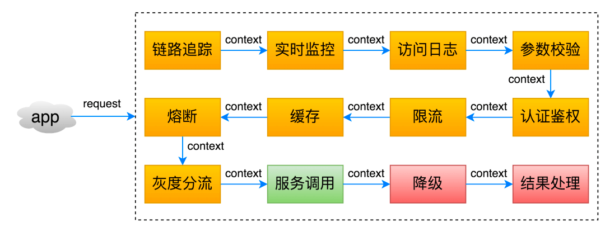
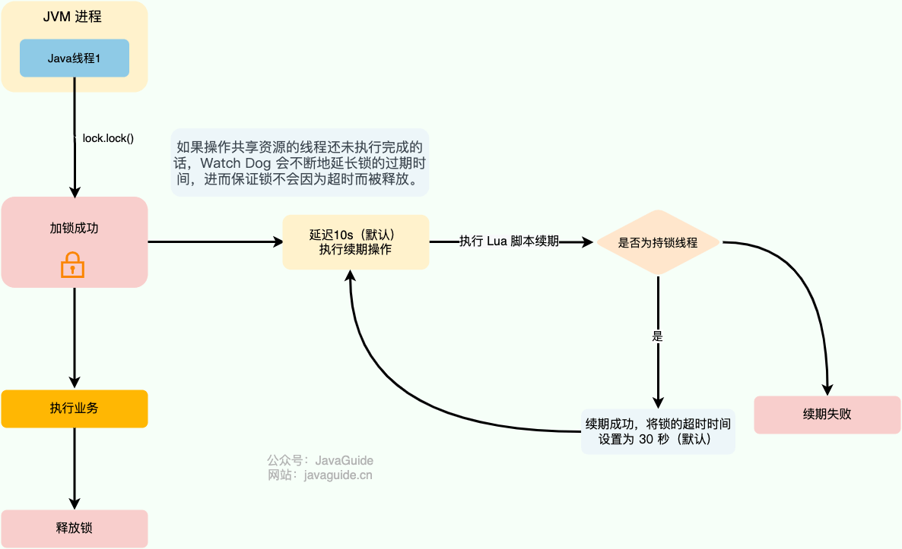
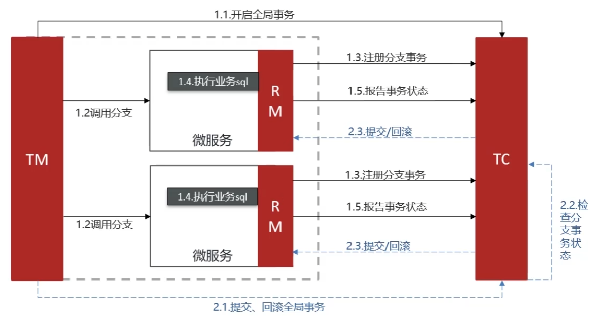
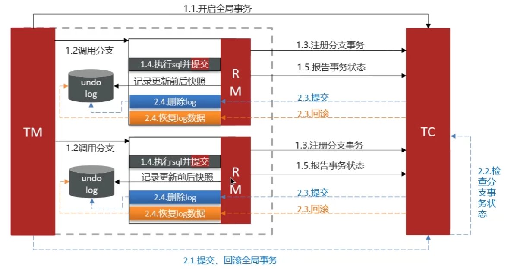
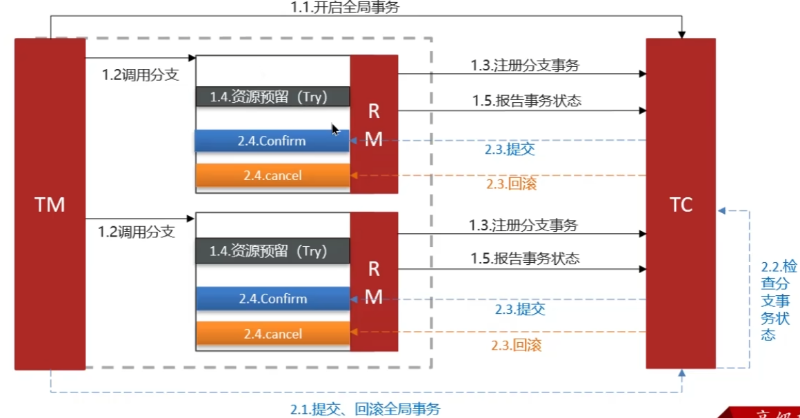
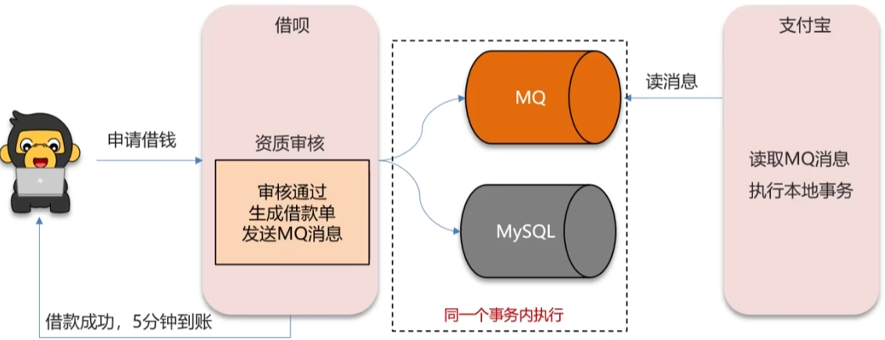
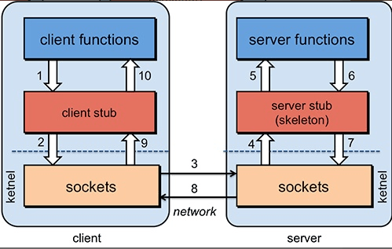

# 分布式

## ⭐CAP 理论

- **一致性（Consistency）**  : 所有节点访问同一份最新的数据副本
- ​**可用性（Availability）** : 非故障的节点在合理的时间内返回合理的响应（不是错误或者超时的响应）。
- **分区容错性（Partition Tolerance）**  : 分布式系统出现网络分区的时候，仍然能够对外提供服务。

==分布式系统理论上不可能选择 CA 架构，只能选择 CP 或者 AP 架构==

如果系统发生“分区”，我们要考虑选择 CP 还是 AP。如果系统没有发生“分区”的话，我们要思考如何保证 CA 。

## ⭐BASE 理论

BASE 是 Basically Available（基本可用）、Soft-state（软状态） 和 Eventually Consistent（最终一致性） 三个短语的缩写。

核心思想：即使无法做到强一致性，但每个应用都可以根据自身业务特点，采用适当的方式来使系统达到最终一致性。

也就是牺牲数据的一致性来满足系统的高可用性，系统中一部分数据不可用或者不一致时，仍需要保持系统整体“主要可用”。

## ⭐一致性哈希算法

**普通哈希算法**

传统的哈希取模算法有一个比较大的缺陷就是：无法很好的解决机器/节点动态减少（比如某台机器宕机）或者增加的场景（比如又增加了一台机器）。

比如，服务器的初始数量为 4 台 (N \= 4)，如果其中一台服务器宕机，N 就变成了 3。此时，对于同一个 key，`hash(key) % 3`​ 的结果很可能与 `hash(key) % 4` 完全不同。

**一致性哈希算法**

是一种特殊的哈希算法，在移除或者添加一个服务器时，能够尽可能小地改变已存在的服务请求与处理请求服务器之间的映射关系。一致性哈希解决了传统哈希算法在分布式哈希表（Distributed Hash Table，DHT）中存在的动态伸缩等问题 。

一致性哈希算法的底层原理也很简单，关键在于==哈希环==的引入。

一致性哈希算法将哈希空间组织成一个环形结构，将数据和节点都映射到这个环上，然后根据顺时针的规则确定数据或请求应该分配到哪个节点上。通常情况下，哈希环的起点是 0，终点是 2\^32 - 1，并且起点与终点连接，故这个环的整数分布范围是 ==[0, 2^32-1]== 。

传统哈希算法是对服务器数量取模，一致性哈希算法是对哈希环的范围取模，固定值，通常为 2\^32

```JAVA
node_number = hash(key) % 2^32
```

新增节点和移除节点的情况下，哈希环的引入可以避免影响范围太大，减少需要迁移的数据。

## ⭐API 网关

一般情况下，网关可以为我们提供请求转发、安全认证（身份/权限认证）、流量控制、负载均衡、降级熔断、日志、监控、参数校验、协议转换等功能。

实际上，网关主要做了两件事情：==请求转发 + 请求过滤==。



**常见的网关系统**

- Spring Cloud Gateway

  SpringCloud Gateway 属于 Spring Cloud 生态系统中的网关。为了提升网关的性能，SpringCloud Gateway 基于 Spring WebFlux 。Spring WebFlux 使用 Reactor 库来实现响应式编程模型，底层基于 Netty 实现同步非阻塞的 I/O。

  Spring Cloud Gateway 不仅提供统一的路由方式，并且基于 Filter 链的方式提供了网关基本的功能，例如：安全，监控/指标，限流。
- Kong

  Kong 是一款基于 OpenResty （Nginx + Lua）的高性能、云原生、可扩展、生态丰富的网关系统。

- APISIX

  APISIX 是一款基于 OpenResty 和 etcd 的高性能、云原生、可扩展的网关系统。

  与传统 API 网关相比，APISIX 具有动态路由和插件热加载，特别适合微服务系统下的 API 管理。并且，APISIX 与 SkyWalking（分布式链路追踪系统）、Zipkin（分布式链路追踪系统）、Prometheus（监控系统） 等 DevOps 生态工具对接都十分方便。

## 分布式锁

为了保证共享资源被安全地访问，我们需要使用互斥操作对共享资源进行保护，即同一时刻只允许一个线程访问共享资源，其他线程需要等待当前线程释放后才能访问。这样可以避免数据竞争和脏数据问题，保证程序的正确性和稳定性。

如何才能实现共享资源的互斥访问呢？ 锁是一个比较通用的解决方案，更准确点来说是==悲观锁==。

悲观锁总是假设最坏的情况，认为共享资源每次被访问的时候就会出现问题(比如共享数据被修改)，所以每次在获取资源操作的时候都会上锁，这样其他线程想拿到这个资源就会阻塞直到锁被上一个持有者释放。也就是说，==共享资源每次只给一个线程使用，其它线程阻塞，用完后再把资源转让给其它线程。==

单机多线程中，通常使用`ReentrantLock`​类、`synchronized` 关键字这类JDK自带的本地锁来控制一个JVM进程内的多线程对本地资源的访问。

分布式系统下，使用分布式锁。

分布式锁具备的条件：

- ​**互斥**：任意一个时刻，锁只能被一个线程持有。
- ​**高可用**：锁服务是高可用的，当一个锁服务出现问题，能够自动切换到另外一个锁服务。并且，即使客户端的释放锁的代码逻辑出现问题，锁最终一定还是会被释放，不会影响其他线程对共享资源的访问。这一般是通过超时机制实现的。
- ​**可重入**：一个节点获取了锁之后，还可以再次获取锁。

除了上面这三个基本条件之外，一个好的分布式锁还需要满足下面这些条件：

- ​**高性能**：获取和释放锁的操作应该快速完成，并且不应该对整个系统的性能造成过大影响。
- **非阻塞**：如果获取不到锁，不能无限期等待，避免对系统正常运行造成影响。

分布式锁的常见实现方式：

- 基于关系型数据库比如 MySQL 实现分布式锁。（一般不用）
- 基于分布式协调服务 ZooKeeper 实现分布式锁。
- 基于分布式键值存储系统比如 Redis 、Etcd 实现分布式锁。

### **基于 Redis 实现分布式锁**

使用 `SETNX`​ 命令实现互斥。`SETNX`​ 即 `SET if Not eXists` (对应 Java 中的 setIfAbsent 方法)，如果 key 不存在的话，才会设置 key 的值。如果 key 已经存在， SETNX 啥也不做。

为了避免锁无法被释放，可以给这个key（也就是锁）设置一个过期时间。

如果操作共享资源的操作还没完成，可以进行续期。对于Java，可以使用Redisson。

Redisson 是一个开源的 Java 语言 Redis 客户端，提供了很多开箱即用的功能，不仅仅包括多种分布式锁的实现。并且，Redisson 还支持 Redis 单机、Redis Sentinel、Redis Cluster 等多种部署架构。

Redisson 中的分布式锁自带自动续期机制，使用起来非常简单，原理也比较简单，其提供了一个专门用来监控和续期锁的 ==Watch Dog（ 看门狗）==，如果操作共享资源的线程还未执行完成的话，Watch Dog 会不断地延长锁的过期时间，进而保证锁不会因为超时而被释放。



**如何实现可重入锁**

所谓可重入锁指的是在一个线程中可以多次获取同一把锁，比如一个线程在执行一个带锁的方法，该方法中又调用了另一个需要相同锁的方法，则该线程可以直接执行调用的方法即可重入 ，而无需重新获得锁。像 Java 中的 `synchronized`​ 和 `ReentrantLock` 都属于可重入锁。

不可重入的分布式锁基本可以满足绝大部分业务场景了，一些特殊的场景可能会需要使用可重入的分布式锁。

可重入分布式锁的实现核心思路是线程在获取锁的时候判断是否为自己的锁，如果是的话，就不用再重新获取了。为此，我们可以为每个锁关联一个==可重入计数器==和一个==占有它的线程==。当可重入计数器大于 0 时，则锁被占有，需要判断占有该锁的线程和请求获取锁的线程是否为同一个。

实际项目中，使用 ==Redisson==，内置了多种类型的锁内置了多种类型的锁比如可重入锁（Reentrant Lock）、自旋锁（Spin Lock）、公平锁（Fair Lock）、多重锁（MultiLock）、 红锁（RedLock）、 读写锁（ReadWriteLock）。

**Redis 如何解决集群情况下分布式锁的可靠性**

为了避免单点故障，生产环境下的 Redis 服务通常是集群化部署的。

Redis 集群下，上面介绍到的分布式锁的实现会存在一些问题。由于 Redis 集群数据同步到各个节点时是异步的，如果在 Redis 主节点获取到锁后，在没有同步到其他节点时，Redis 主节点宕机了，此时新的 Redis 主节点依然可以获取锁，所以多个应用服务就可以同时获取到锁。

针对这个问题，Redis 之父 antirez 设计了 Redlock 算法 来解决。

Redlock 算法的思想是让客户端向 Redis 集群中的多个独立的 Redis 实例依次请求申请加锁，如果客户端能够和半数以上的实例成功地完成加锁操作，那么我们就认为，客户端成功地获得分布式锁，否则加锁失败。

即使部分 Redis 节点出现问题，只要保证 Redis 集群中有半数以上的 Redis 节点可用，分布式锁服务就是正常的。

实际项目中不建议使用 Redlock 算法，成本和收益不成正比，可以考虑基于 Redis 主从复制+哨兵模式实现分布式锁。

## ⭐分布式事务

事务是逻辑上的一组操作，要么都执行，要么都不执行。

分布式事务的目标就是保证系统中多个相关联的数据库中的数据的一致性。

**分布式事务解决方案**

**Seata**

**XA 模式（CP）**

XA 模式是基于**数据库原生的 XA 协议**实现的分布式事务模式，严格遵循 “两阶段提交（2PC）” 规范，是传统分布式事务的经典实现，核心追求**强一致性。**



RM一阶段的工作：

1. 注册分支事务到TC
2. 执行分支业务sql但不提交
3. 报告执行状态到TC

TC.二阶段的工作：

- TC检测各分支事务执行状态

  - 如果都成功，通知所有RM提交事务
  - 如果有失败，通知所有RM回滚事务

RM二阶段的工作：

- 接收TC指令，提交或回滚事务

**AT 模式（AP）**



AT模式同样是分阶段提交的事务模型，不过缺弥补了XA模型中资源锁定周期过长的缺陷。

阶段一RM的工作：

- 注册分支事务
- ==记录undo-log（数据快照）==
- 执行业务sql并==提交==
- 报告事务状态

阶段二提交时RM的工作：

- 删除undo-log即可

删除undo-log即可

- 根据undo-log恢复数据到更新前

**TCC（AP）**



TCC 是 Try、Confirm、Cancel 三个词的缩写，它分为三个阶段：

1. **Try（尝试）阶段** : 尝试执行。完成业务检查，并预留好必需的业务资源。
2. **Confirm（确认）阶段** ：确认执行。当所有事务参与者的 Try 阶段执行成功就会执行 Confirm ，Confirm 阶段会处理 Try 阶段预留的业务资源。否则，就会执行 Cancel 。
3. **Cancel（取消）阶段** ：取消执行，释放 Try 阶段预留的业务资源。

**MQ 分布式事务**



**总结**

- 只要是发生了多个服务之间的==写操作==，都需要进行分布式事务控制
- 描述项目中采用的哪种方案(seata丨MQ)

  1. seata的XA模式，CP，需要互相等待各个分支事务提交，可以保证强一致性，性能差 ==银行业务==
  2. seata的AT模式，AP，底层使用undolog实现，性能好  ==互联网业务==
  3. seata的TCC模式，AP，性能较好，不过需要人工编码实现  ==银行业务==
  4. MQ模式实现分布式事务，在A服务写数据的时候，需要在同一个事务内发送消息到另外一个事务，异步，性能最好 ==互联网业务==

## RPC

### ⭐概念

RPC（Remote Procedure Call） 即远程过程调用，通过名字我们就能看出 RPC 关注的是远程调用而非本地调用。

通过 RPC 可以帮助我们调用远程计算机上某个服务的方法，这个过程就像调用本地方法一样简单。

### RPC 原理



- 服务消费端（client）以本地调用的方式调用远程服务；
- 客户端 Stub（client stub） 接收到调用后负责将方法、参数等组装成能够进行网络传输的消息体（序列化）：`RpcRequest`；
- 客户端 Stub（client stub） 找到远程服务的地址，并将消息发送到服务提供端；
- 服务端 Stub（桩）收到消息将消息反序列化为 Java 对象: `RpcRequest`；
- 服务端 Stub（桩）根据`RpcRequest`中的类、方法、方法参数等信息调用本地的方法；
- 服务端 Stub（桩）得到方法执行结果并将组装成能够进行网络传输的消息体：`RpcResponse`（序列化）发送至消费方；
- 客户端 Stub（client stub）接收到消息并将消息反序列化为 Java 对象:`RpcResponse` ，这样也就得到了最终结果。

### 常用的RPC框架

**Dubbo**

Apache Dubbo 是一款微服务框架，为大规模微服务实践提供高性能 RPC 通信、流量治理、可观测性等解决方案，涵盖 Java、Golang 等多种语言 SDK 实现。

Dubbo 提供了从服务定义、服务发现、服务通信到流量管控等几乎所有的服务治理能力，支持 Triple 协议（基于 HTTP/2 之上定义的下一代 RPC 通信协议）、应用级服务发现、Dubbo Mesh （Dubbo3 赋予了很多云原生友好的新特性）等特性。

**gRPC**

gRPC 是 Google 开源的一个高性能、通用的开源 RPC 框架。其由主要面向移动应用开发并基于 HTTP/2 协议标准而设计（支持双向流、消息头压缩等功能，更加节省带宽），基于 ProtoBuf 序列化协议开发，并且支持众多开发语言。

**Thrift**

Apache Thrift 是 Facebook 开源的跨语言的 RPC 通信框架，目前已经捐献给 Apache 基金会管理，由于其跨语言特性和出色的性能，在很多互联网公司得到应用，有能力的公司甚至会基于 thrift 研发一套分布式服务框架，增加诸如服务注册、服务发现等功能。

## ZooKeeper

ZooKeeper 是一个开源的==分布式协调服务==，它的设计目标是将那些复杂且容易出错的分布式一致性服务封装起来，构成一个高效可靠的原语集，并以一系列简单易用的接口提供给用户使用。

ZooKeeper 为我们提供了高可用、高性能、稳定的分布式数据一致性解决方案，通常被用于实现诸如数据发布/订阅、负载均衡、命名服务、分布式协调/通知、集群管理、Master 选举、分布式锁和分布式队列等功能。这些功能的实现主要依赖于 ZooKeeper 提供的 ==数据存储+事件监听== 功能。
