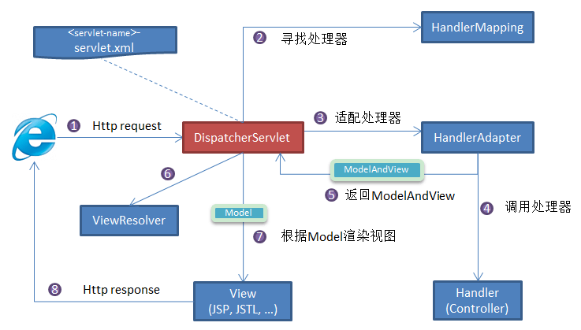
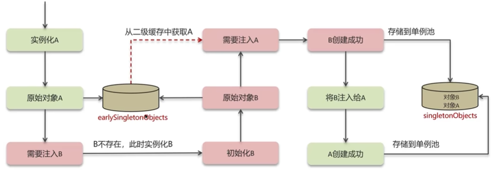

# 常用框架

## Spring

Spring 是一款开源的轻量级 Java 开发框架，旨在提高开发人员的开发效率以及系统的可维护性。

我们一般说 Spring 框架指的都是 Spring Framework，它是很多模块的集合，使用这些模块可以很方便地协助我们进行开发，比如说 Spring 支持 IoC（Inversion of Control:控制反转） 和 AOP(Aspect-Oriented Programming:面向切面编程)、可以很方便地对数据库进行访问、可以很方便地集成第三方组件（电子邮件，任务，调度，缓存等等）、对单元测试支持比较好、支持 RESTful Java 应用程序的开发。

### ⭐Spring, Spring MVC, Spring Boot 关系

Spring 包含了多个功能模块，其中最重要的是 Spring-Core（主要提供 IoC 依赖注入功能的支持） 模块， Spring 中的其他模块（比如 Spring MVC）的功能实现基本都需要依赖于该模块。

Spring MVC 是 Spring 中的一个很重要的模块，主要赋予 Spring 快速构建 MVC 架构的 Web 程序的能力。MVC 是模型(Model)、视图(View)、控制器(Controller)的简写，其核心思想是通过将业务逻辑、数据、显示分离来组织代码。

使用 Spring 进行开发各种配置过于麻烦比如开启某些 Spring 特性时，需要用 XML 或 Java 进行显式配置。Spring Boot 旨在简化 Spring 开发（减少配置文件，开箱即用）。

### Spring IoC

#### ⭐什么是IoC

IoC （Inversion of Control ）即控制反转/反转控制。它是一种思想不是一个技术实现。描述的是：Java 开发领域对象的创建以及管理的问题。

使用 IoC 思想的开发方式 ：不通过 new 关键字来创建对象，而是通过 IoC 容器(Spring 框架) 来帮助我们实例化对象。我们需要哪个对象，直接从 IoC 容器里面去取即可。

**为什么叫控制反转：**

- 控制 ：指的是对象创建（实例化、管理）的权力
- 反转 ：控制权交给外部环境（IoC 容器）

#### ⭐IoC 解决了什么问题？

IoC 的思想就是两方之间不互相依赖，由第三方容器来管理相关资源。好处：

1. 对象之间的耦合度或者说依赖程度降低；
2. 资源变的容易管理；比如用 Spring 容器提供的话很容易就可以实现一个单例。

#### 什么是 Spring Bean？

资源变的容易管理；比如你用 Spring 容器提供的话很容易就可以实现一个单例。

我们需要告诉 IoC 容器帮助我们管理哪些对象，这个是通过配置元数据来定义的。配置元数据可以是 XML 文件、注解或者 Java 配置类。

```xml
<!-- Constructor-arg with 'value' attribute -->
<bean id="..." class="...">
   <constructor-arg value="..."/>
</bean>
```

**将一个类声明为 Bean 的注解：**

- `@Component`：通用的注解，可标注任意类为 Spring 组件。如果一个 Bean 不知道属于哪个层，可以使用`@Component` 注解标注。
- `@Repository`: 对应持久层即 Dao 层，主要用于数据库相关操作。
- `@Service`: 对应服务层，主要涉及一些复杂的逻辑，需要用到 Dao 层。
- `@Controller`: 对应 Spring MVC 控制层，主要用于接受用户请求并调用 Service 层返回数据给前端页面。

#### @Component 和 @Bean 的区别

- `@Component` 注解作用于类，而`@Bean`注解作用于方法。
- `@Component`通常是通过类路径扫描来自动侦测以及自动装配到 Spring 容器中。`@Bean` 注解通常是我们在标有该注解的方法中定义产生这个 bean,`@Bean`告诉了 Spring 这是某个类的实例，当我需要用它的时候还给我。
-`@Bean` 注解比 `@Component` 注解的自定义性更强，而且很多地方我们只能通过 `@Bean` 注解来注册 bean。比如当我们引用第三方库中的类需要装配到 Spring容器时，则只能通过 `@Bean`来实现。

#### ⭐@Autowired 和 @Resource 的区别是什么？

- `@Autowired` 是 Spring 内置的注解，默认注入逻辑为先按类型（byType）匹配，若存在多个同类型 Bean，则再尝试按名称（byName）筛选。
- `@Resource` 源自 JSR-250 规范（标准 Java 规范），在 JDK 6 到 JDK 10 中，它确实存在于 JDK 提供的包中。不过，从 JDK 11 开始，它不再默认存在于 JDK 内部，你需要引入额外的依赖 javax.annotation-api才能使用。
  
  Spring 对 `@Resource`（无参情况）的处理：先按名称（byName），没找到就按类型（byType）

#### ⭐Bean 的作用域有哪些？

- singleton：单例模式。Spring 中的 bean 默认是单例的。
- prototype：每次获取都会创建一个新的 bean 实例。

还有几个仅 web 应用可用的模式。

#### ⭐Bean 是线程安全的吗？

Spring 框架中的 Bean 是否线程安全，取决于其作用域和状态。

几乎所有场景的 Bean 作用域默认采用默认的 singleton。

prototype 作用域下，每次获取都会创建一个新的 bean 实例，不存在资源竞争问题，所以不存在线程安全问题。singleton 作用域下，IoC 容器中只有唯一的 bean 实例，可能会存在资源竞争问题（取决于 Bean 是否有状态）。如果这个 bean 是有状态的话，那就存在线程安全问题（有状态 Bean 是指包含可变的成员变量的对象）。

不过，大部分 Bean 实际都是无状态（没有定义可变的成员变量）的（比如 Dao、Service），这种情况下， Bean 是线程安全的。

#### ⭐Bean 的生命周期

- 创建 Bean 的实例：Bean 容器首先会找到配置文件中的 Bean 定义，然后使用 Java 反射 API 来创建 Bean 的实例。
- Bean 属性赋值/填充：为 Bean 设置相关属性和依赖，例如`@Autowired` 等注解注入的对象、`@Value` 注入的值、setter方法或构造函数注入依赖和值、`@Resource`注入的各种资源。
- Bean 初始化：按照 Bean 实现的不同接口进行方法调用。
- 销毁 Bean：销毁并不是说要立马把 Bean 给销毁掉，而是把 Bean 的销毁方法先记录下来，将来需要销毁 Bean 或者销毁容器的时候，就调用这些方法去释放 Bean 所持有的资源。

### Spring AOP

#### ⭐对 AOP 的理解

AOP(Aspect-Oriented Programming:面向切面编程)能够将那些与业务无关，却为业务模块所共同调用的逻辑或责任（例如事务处理、日志管理、权限控制等）封装起来，便于减少系统的重复代码，降低模块间的耦合度，并有利于未来的可拓展性和可维护性。

Spring AOP 就是基于动态代理的，如果要代理的对象，实现了某个接口，那么 Spring AOP 会使用 JDK Proxy，去创建代理对象，而对于没有实现接口的对象，就无法使用 JDK Proxy 去进行代理了，这时候 Spring AOP 会使用 Cglib 生成一个被代理对象的子类来作为代理

#### ⭐AOP 常见的通知类型

- **Before**（前置通知）：目标对象的方法调用之前触发。
- **After** （后置通知）：目标对象的方法调用之后触发。
- **AfterReturning**（返回通知）：目标对象的方法调用完成，在返回结果值之后触发。
- **AfterThrowing**（异常通知）：目标对象的方法运行中抛出 / 触发异常后触发。AfterReturning 和 AfterThrowing 两者互斥。如果方法调用成功无异常，则会有返回值；如果方法抛出了异常，则不会有返回值。
- **Around** （环绕通知）：编程式控制目标对象的方法调用。环绕通知是所有通知类型中可操作范围最大的一种，因为它可以直接拿到目标对象，以及要执行的方法，所以环绕通知可以任意的在目标对象的方法调用前后搞事，甚至不调用目标对象的方法

### Spring MVC

MVC 是模型(Model)、视图(View)、控制器(Controller)的简写，其核心思想是通过将业务逻辑、数据、显示分离来组织代码。

#### ⭐SpringMVC 工作原理了解吗?



#### 统一异常处理

推荐使用注解的方式统一异常处理，具体会使用到 `@ControllerAdvice` + `@ExceptionHandler` 这两个注解。

```java
@ControllerAdvice
@ResponseBody
public class GlobalExceptionHandler {

    @ExceptionHandler(BaseException.class)
    public ResponseEntity<?> handleAppException(BaseException ex, HttpServletRequest request) {
      //......
    }

    @ExceptionHandler(value = ResourceNotFoundException.class)
    public ResponseEntity<ErrorReponse> handleResourceNotFoundException(ResourceNotFoundException ex, HttpServletRequest request) {
      //......
    }
}
```

这种异常处理方式下，会给所有或者指定的 `Controller` 织入异常处理的逻辑（AOP），当 `Controller` 中的方法抛出异常的时候，由被`@ExceptionHandler` 注解修饰的方法进行处理。

### Spring 的循环依赖

循环依赖是指 Bean 对象循环引用，是两个或多个 Bean 之间相互持有对方的引用，例如 CircularDependencyA → CircularDependencyB → CircularDependencyA。

Spring 框架通过使用三级缓存来解决这个问题，确保即使在循环依赖的情况下也能正确创建 Bean。

Spring 中的三级缓存其实就是三个 Map，如下：

```java
// 一级缓存
/** Cache of singleton objects: bean name to bean instance. */
private final Map<String, Object> singletonObjects = new ConcurrentHashMap<>(256);

// 二级缓存
/** Cache of early singleton objects: bean name to bean instance. */
private final Map<String, Object> earlySingletonObjects = new HashMap<>(16);

// 三级缓存
/** Cache of singleton factories: bean name to ObjectFactory. */
private final Map<String, ObjectFactory<?>> singletonFactories = new HashMap<>(16);
```

Spring 的三级缓存包括：
1. **一级缓存（singletonObjects）**：存放最终形态的 Bean（已经实例化、属性填充、初始化）。
2. **二级缓存（earlySingletonObjects）**：存放过渡 Bean（半成品，尚未属性填充），也就是三级缓存中ObjectFactory产生的对象，与三级缓存配合使用的，可以防止 AOP 的情况下，每次调用ObjectFactory#getObject()都是会产生新的代理对象的。
  
  

3. **三级缓存（singletonFactories）**：解决代理对象的存放ObjectFactory，ObjectFactory的getObject()方法（最终调用的是`getEarlyBeanReference()`方法）可以生成原始 Bean 对象或者代理对象（如果 Bean 被 AOP 切面代理）。三级缓存只会对单例 Bean 生效。

==三级缓存的作用==：
一级缓存只存放完全初始化的 Bean。假设 A 依赖 B，B 依赖 A：

- 当创建 A 时，A 需要注入 B，但 B 尚未初始化（不在一级缓存），因此会触发 B 的创建。
- 当创建 B 时，B 需要注入 A，但 A 尚未初始化（不在一级缓存），此时若没有其他缓存，会陷入 “A 等 B，B 等 A” 的死循环。

若只有二级缓存（直接存放未初始化的原始 Bean），当 Bean 需要被 AOP 代理时会出问题：

- 例如，A 需要被代理（如被`@Transactional`注解），则 A 的最终完整对象是代理对象，而非原始对象。
- 若 B 依赖 A 时，从二级缓存获取的是 A 的原始对象，而 A 最终初始化完成后会以代理对象存入一级缓存，导致 B 中注入的 A（原始对象）与最终的 A（代理对象）不一致，引发逻辑错误。

因此，需要一种机制：**在 B 需要 A 的引用时，动态生成 A 的代理对象（若需要），而非直接暴露原始对象**—— 这就是三级缓存的核心作用。

### Spring 事务

#### ⭐事务失效场景

**场景一：异常捕获处理**

```java
@Transactional
publicvoidupdate(Integer from,Integer to,Double money){
	try{
		// 转账的用户不能为空
		Account fromAccount = accountDao.selectByld(from);
		// 判断用户的钱是否够转账
		if(fromAccount.getMoney()-money>=0){
		fromAccount.setMoney(fromAccount.getMoney()-money);
		accountDao.updateByld(fromAccount);
		// 异常
		int a = 1/0;
		// 被转账的用户
		Account toAccount= accountDao.selectByld(to);
		toAccount.setMoney(toAccount.getMoney()+money);
		accountDao.updaieByld(toAccount);
	}catch(Exception e){
		e.printStackTrace();
	}
}
```

**原因**

事务通知只有捉到了目标抛出的异常，才能进行后续的回滚处理，如果目标自己处理掉异常，事务通知无法知悉

**解决**

在`catch`块添加`throw new RuntimeException(e)`抛出


**场景二：抛出检查异常**

```java
@Transactional
public void update(Integer from,Integer to,Double money) throws FileNotFoundException{
	// 转账的用户不能为空
	Account fromAccount = accountDao.selectByld(from);
	// 判断用户的钱是否够转账
	if(fromAccount.getMoney()-money>=0){
		fromAccount.setMoney(fromAccount.getMoney()-money);
		accountDao.updateByld(fromAccount);
		// 读取文件
		newFilelnputStream("dddd");
		// 被转账的用户
		Account toAccount=accountDao.selectByld(to);
		toAccount.setMoney(toAccount.getMoney()+money);
		accountDao.updateByld(toAccount);
	}
}
```

**原因：**

Spring默认只会回滚非检查异常（runtime 异常）

**解决：**

```java
@Transactional(rollbackFor=Exception.class)
```


**场景三：非public方法导致的事务失败**

```java
@Transactional(rollbackFor=Exception.class)
void update(Integer from,Integer to,Double money) throws FileNotFoundException{
	// 转账的用户不能为空
	Account fromAccount=accountDao.selectByld(from);
	// 判断用户的钱是否够转账
	if(fromAccount.getMoney()-money>=0){
		fromAccount.setMoney(fromAccount.getMoney()-money);
		accountDao.updateByld(fromAccount);
		// 读取文件
		new FilelnputStream("dddd");
		// 被转账的用户
		Account toAccount=accountDao.selectByld(to);
		toAccount.setMoney(toAccount.getMoney()+money);
		accountDao.updateByld(toAccount);
	}
}
```

**原因：**

Spring为方法创建代理、添加事务通知、前提条件都是该方法是public的

**解决：**

改为public

## Spring Boot

### @SpringBootApplication

`@SpringBootApplication`看作是 `@Configuration`、`@EnableAutoConfiguration`、`@ComponentScan` 注解的集合。

这三个注解的作用分别是：

- `@EnableAutoConfiguration`：启用 SpringBoot 的自动配置机制
- `@ComponentScan`： 扫描被`@Component` (`@Service`,`@Controller`)注解的 bean，注解默认会扫描该类所在的包下所有的类。
- `@Configuration`：允许在上下文中注册额外的 bean 或导入其他配置类

### Spring Boot 的自动配置是如何实现的

`@EnableAutoConfiguration`是启动自动配置的关键。

```java
@Target({ElementType.TYPE})
@Retention(RetentionPolicy.RUNTIME)
@Documented
@Inherited
@AutoConfigurationPackage
@Import({AutoConfigurationImportSelector.class})
public @interface EnableAutoConfiguration {
    String ENABLED_OVERRIDE_PROPERTY = "spring.boot.enableautoconfiguration";

    Class<?>[] exclude() default {};

    String[] excludeName() default {};
}
```

Spring Boot 的自动配置机制通过 `@EnableAutoConfiguration` 启动。该注解利用 `@Import` 注解导入了 `AutoConfigurationImportSelector` 类，而 `AutoConfigurationImportSelector` 类则负责加载并管理所有的自动配置类。这些自动配置类通常在META-INF/spring.factories 文件中声明，并根据项目的依赖和配置条件，通过条件注解（如 `@ConditionalOnClass`、`@ConditionalOnBean` 等）判断是否应该生效。

### Spring Boot 中如何实现定时任务

使用 `@Scheduled` 注解就能很方便地创建一个定时任务。

```java
@Component
public class ScheduledTasks {
    private static final Logger log = LoggerFactory.getLogger(ScheduledTasks.class);
    private static final SimpleDateFormat dateFormat = new SimpleDateFormat("HH:mm:ss");

    /**
     * fixedRate：固定速率执行。每5秒执行一次。
     */
    @Scheduled(fixedRate = 5000)
    public void reportCurrentTimeWithFixedRate() {
        log.info("Current Thread : {}", Thread.currentThread().getName());
        log.info("Fixed Rate Task : The time is now {}", dateFormat.format(new Date()));
    }
}
```

单纯依靠 `@Scheduled` 注解 还不行，我们还需要在 SpringBoot 中我们只需要在启动类上加上`@EnableScheduling` 注解，这样才可以启动定时任务。`@EnableScheduling` 注解的作用是发现注解 `@Scheduled` 的任务并在后台执行该任务。

## MyBatis

### ⭐`#{}` 和 `${}` 的区别

- `${}` 是变量占位符，它可以用于标签属性值和 sql 内部，属于原样文本替换，可以替换任意内容
- `#{}` 是 sql 的参数占位符，MyBatis 会将 sql 中的#{}替换为? 号，在 sql 执行前会按序给 sql 的? 号占位符设置参数值。

### xml 映射文件中，常见标签

`<select>`, `<insert>`, `<update>`, `<delete>`, `<resultMap>`, `<parameterMap>`, `<sql>`, `<include>`, `<selectKey>`

动态 sql 标签：`trim|where|set|foreach|if|choose|when|otherwise|bind`

其中 `<sql>` 为 sql 片段标签，通过 `<include>` 标签引入 sql 片段， `<selectKey>` 为不支持自增的主键生成策略标签。

### MyBatis 如何进行分页，分页插件原理

(1) MyBatis 使用 RowBounds 对象进行分页，它是针对 ResultSet 结果集执行的内存分页，而非物理分页；(2) 可以在 sql 内直接书写带有物理分页的参数来完成物理分页功能，(3) 也可以使用分页插件来完成物理分页。

分页插件的基本原理是使用 MyBatis 提供的插件接口，实现自定义插件，在插件的拦截方法内拦截待执行的 sql，然后重写 sql，根据 dialect 方言，添加对应的物理分页语句和物理分页参数。


