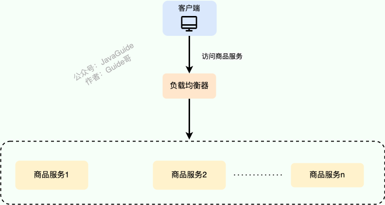
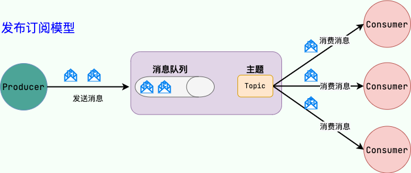
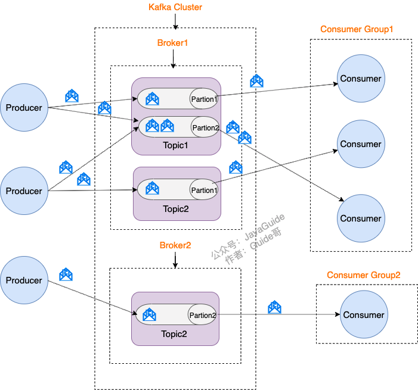
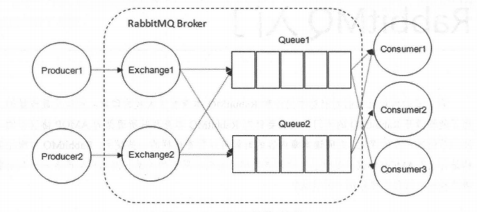
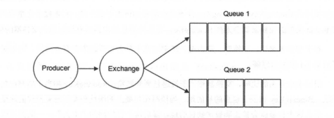
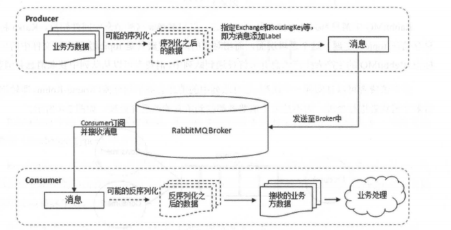
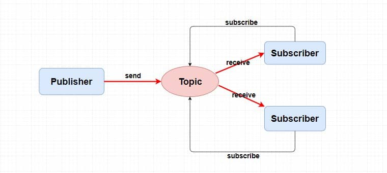
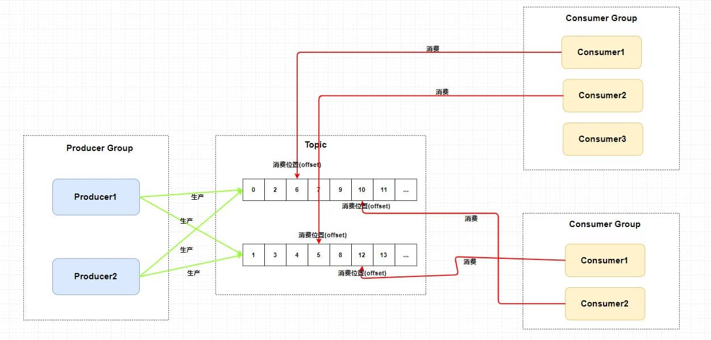
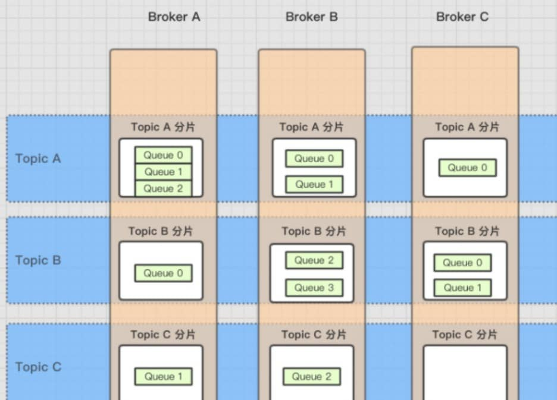

# 高性能

## CDN

CDN 全称是 Content Delivery Network/Content Distribution Network，内容分发网络 。

CDN 就是将静态资源分发到多个不同的地方以实现就近访问，进而加快静态资源的访问速度，减轻服务器以及带宽的负担。

## 负载均衡

**负载均衡** 指的是将用户请求分摊到不同的服务器上处理，以提高系统整体的并发处理能力以及可靠性。负载均衡服务可以有由专门的软件或者硬件来完成，一般情况下，硬件的性能更好，软件的价格更便宜。

负载均衡是一种比较常用且实施起来较为简单的提高系统并发能力和可靠性的手段，不论是单体架构的系统还是微服务架构的系统几乎都会用到。

**负载均衡分哪几种**

**服务端负载均衡**

服务端负载均衡 主要应用在 系统外部请求 和 网关层 之间，可以使用==软件==或者==硬件==实现。

硬件负载均衡 通过专门的硬件设备（比如 F5、A10、Array ）实现负载均衡功能。硬件负载均衡的优势是性能很强且稳定，缺点就是实在是太贵了。

软件负载均衡通过软件（比如 LVS、Nginx、HAproxy ）实现负载均衡功能。

通常会使用 Nginx 来做七层负载均衡，LVS(Linux Virtual Server 虚拟服务器， Linux 内核的 4 层负载均衡)来做四层负载均衡。

**客户端负载均衡**

客户端负载均衡 主要应用于系统内部的不同的服务之间，可以使用现成的负载均衡组件来实现。

在客户端负载均衡中，客户端会自己维护一份服务器的地址列表，发送请求之前，客户端会根据对应的负载均衡算法来选择具体某一台服务器处理请求。

客户端负载均衡器和服务运行在同一个进程或者说 Java 程序里，不存在额外的网络开销。不过，客户端负载均衡的实现会受到编程语言的限制，比如说 Spring Cloud Load Balancer 就只能用于 Java 语言。

Java 领域主流的微服务框架 Dubbo、Spring Cloud 等都内置了开箱即用的客户端负载均衡实现。Dubbo 属于是默认自带了负载均衡功能，Spring Cloud 是通过组件的形式实现的负载均衡，属于可选项，比较常用的是 Spring Cloud Load Balancer（官方，推荐） 和 Ribbon（Netflix，已被弃用）。

**负载均衡常见的算法**

- 随机法
- 轮询法

  轮询法是挨个轮询服务器处理，也可以设置权重。
- 两次随机法

  两次随机法在随机法的基础上多增加了一次随机，多选出一个服务器。随后再根据两台服务器的负载等情况，从其中选择出一个最合适的服务器。
- 哈希法

  将请求的参数信息通过哈希函数转换成一个哈希值，然后根据哈希值来决定请求被哪一台服务器处理。
- 一致性哈希法
- 最小连接法

  当有新的请求出现时，遍历服务器节点列表并选取其中连接数最小的一台服务器来响应当前请求。相同连接的情况下，可以进行加权随机。

## 消息队列

操作系统中的进程通信的一种很重要的方式就是消息队列。我们这里提到的消息队列稍微有点区别，更多指的是各个服务以及系统内部各个组件/模块之前的通信，属于一种 ==中间件== 。

中间件就是一类为应用软件服务的软件，应用软件是为用户服务的，用户不会接触或者使用到中间件。

**消息队列的作用**

用消息队列主要能为我们的系统带来下面三点好处：

1. 异步处理

   将用户请求中包含的耗时操作，通过消息队列实现异步处理，将对应的消息发送到消息队列之后就立即返回结果，减少响应时间，提高用户体验。随后，系统再对消息进行消费。
2. 削峰/限流

   先将短时间高并发产生的事务消息存储在消息队列中，然后后端服务再慢慢根据自己的能力去消费这些消息，这样就避免直接把后端服务打垮掉。
3. 降低系统耦合性

   使用消息队列还可以降低系统耦合性。如果模块之间不存在直接调用，那么新增模块或者修改模块就对其他模块影响较小，这样系统的可扩展性无疑更好一些。

除了这三点之外，消息队列还有其他的一些应用场景，例如实现分布式事务、顺序保证和数据流处理。

**顺序保证**

在很多应用场景中，处理数据的顺序至关重要。消息队列保证数据按照特定的顺序被处理，适用于那些对数据顺序有严格要求的场景。大部分消息队列，例如 RocketMQ、RabbitMQ、Pulsar、Kafka，都支持顺序消息。

**延时/定时处理**

消息发送后不会立即被消费，而是指定一个时间，到时间后再消费。大部分消息队列，例如 RocketMQ、RabbitMQ、Pulsar，都支持定时/延时消息。

**数据流处理**

针对分布式系统产生的海量数据流，如业务日志、监控数据、用户行为等，消息队列可以实时或批量收集这些数据，并将其导入到大数据处理引擎中，实现高效的数据流管理和处理。

**使用消息队列会带来哪些问题**

- 系统可用性降低 **：**  系统可用性在某种程度上降低，为什么这样说呢？在加入 MQ 之前，你不用考虑消息丢失或者说 MQ 挂掉等等的情况，但是，引入 MQ 之后你就需要去考虑了！
- 系统复杂性提高 **：**  加入 MQ 之后，你需要保证消息没有被重复消费、处理消息丢失的情况、保证消息传递的顺序性等等问题！
- 一致性问题 **：**  我上面讲了消息队列可以实现异步，消息队列带来的异步确实可以提高系统响应速度。但是，万一消息的真正消费者并没有正确消费消息怎么办？这样就会导致数据不一致的情况了。

### Kafka

Kafka 是一个分布式流式处理平台。

流平台具有三个关键功能：

1. 消息队列：发布和订阅消息流，这个功能类似于消息队列，这也是 Kafka 也被归类为消息队列的原因。
2. 容错的持久方式存储记录消息流：Kafka 会把消息持久化到磁盘，有效避免了消息丢失的风险。
3. 流式处理平台 **：**  在消息发布的时候进行处理，Kafka 提供了一个完整的流式处理类库。

Kafka 主要有两大应用场景：

1. 消息队列：建立实时流数据管道，以可靠地在系统或应用程序之间获取数据。
2. 数据处理 **：**  构建实时的流数据处理程序来转换或处理数据流。

**Kafka 的优势**

- ==极致的性能==：基于 Scala 和 Java 语言开发，设计中大量使用了批量处理和异步的思想，最高可以每秒处理千万级别的消息。
- ==生态系统兼容性无可匹敌==：Kafka 与周边生态系统的兼容性是最好的没有之一，尤其在大数据和流计算领域。

发布订阅模型（Pub-Sub） 使用主题（Topic） 作为消息通信载体，类似于广播模式；发布者发布一条消息，该消息通过主题传递给所有的订阅者，在一条消息广播之后才订阅的用户则是收不到该条消息的。

**Kafka 核心概念**

Kafka 将生产者发布的消息发送到 Topic（主题） 中，需要这些消息的消费者可以订阅这些 Topic（主题），如下图所示：

- ==Producer（生产者）== : 产生消息的一方。
- ==Consumer（消费者）== : 消费消息的一方。
- ==Broker（代理）== : 可以看作是一个独立的 Kafka 实例。多个 Kafka Broker 组成一个 Kafka Cluster。

每个 Broker 中又包含了 Topic 以及 Partition 这两个重要的概念：

- ==Topic（主题）== : Producer 将消息发送到特定的主题，Consumer 通过订阅特定的 Topic(主题) 来消费消息。
- ==Partition（分区）== : Partition 属于 Topic 的一部分。一个 Topic 可以有多个 Partition ，并且同一 Topic 下的 Partition 可以分布在不同的 Broker 上，这也就表明一个 Topic 可以横跨多个 Broker 。这正如我上面所画的图一样。

Kafka 中的 Partition（分区） 实际上可以对应成为消息队列中的队列。这样更好理解一点。

**Kafka 的多副本机制**

Kafka 为分区（Partition）引入了多副本（Replica）机制。分区（Partition）中的多个副本之间会有一个叫做 leader 的家伙，其他副本称为 follower。我们发送的消息会被发送到 leader 副本，然后 follower 副本才能从 leader 副本中拉取消息进行同步。

生产者和消费者只与 leader 副本交互。可以理解为其他副本只是 leader 副本的拷贝，它们的存在只是为了保证消息存储的安全性。当 leader 副本发生故障时会从 follower 中选举出一个 leader,但是 follower 中如果有和 leader 同步程度达不到要求的参加不了 leader 的竞选。

**Kafka 的多分区（Partition）以及多副本（Replica）机制有什么好处**

1. Kafka 通过给特定 Topic 指定多个 Partition, 而各个 Partition 可以分布在不同的 Broker 上, 这样便能提供比较好的并发能力（负载均衡）。
2. Partition 可以指定对应的 Replica 数, 这也极大地提高了消息存储的安全性, 提高了容灾能力，不过也相应的增加了所需要的存储空间

**Kafka 如何保证消息的消费顺序**

Kafka 中 Partition(分区)是真正保存消息的地方，我们发送的消息都被放在了这里。而我们的 Partition(分区) 又存在于 Topic(主题) 这个概念中，并且我们可以给特定 Topic 指定多个 Partition。

每次添加消息到 Partition(分区) 的时候都会采用尾加法，Kafka 只能为我们保证 Partition(分区) 中的消息有序。

所以，我们就有一种很简单的保证消息消费顺序的方法：1 个 Topic 只对应一个 Partition。这样当然可以解决问题，但是破坏了 Kafka 的设计初衷。

Kafka 中发送 1 条消息的时候，可以指定 topic, partition, key,data（数据） 4 个参数。如果你发送消息的时候指定了 Partition 的话，所有消息都会被发送到指定的 Partition。并且，同一个 key 的消息可以保证只发送到同一个 partition，这个我们可以采用表/对象的 id 来作为 key 。

对于如何保证 Kafka 中消息消费的顺序，有了下面两种方法：

1. 1 个 Topic 只对应一个 Partition。
2. （推荐）发送消息的时候指定 key/Partition。

**Kafka 如何保证消息不丢失**

- 生产者丢失消息的情况

  生产者(Producer) 调用`send`方法发送消息之后，消息可能因为网络问题并没有发送过去。

  为 Producer 的 retries（重试次数）设置一个比较合理的值，一般是 3。设置完成之后，当出现网络问题之后能够自动重试消息发送，避免消息丢失。
- 消费者丢失消息的情况

  手动关闭自动提交 offset，每次在真正消费完消息之后再自己手动提交 offset，这样会带来消息被重复消费的问题。

**Kafka 如何保证消息不重复消费**

kafka 出现消息重复消费的原因：

- 服务端侧已经消费的数据没有成功提交 offset（根本原因）。
- Kafka 侧 由于服务端处理业务时间长或者网络链接等等原因让 Kafka 认为服务假死，触发了分区 rebalance。

**解决方案：**

- 消费消息服务做幂等校验，比如 Redis 的 set、MySQL 的主键等天然的幂等功能。这种方法最有效。
- 将 **​`enable.auto.commit`​** 参数设置为 false，关闭自动提交，开发者在代码中手动提交 offset。那么这里会有个问题：什么时候提交 offset 合适？

  - 处理完消息再提交：依旧有消息重复消费的风险，和自动提交一样
  - 拉取到消息即提交：会有消息丢失的风险。允许消息延时的场景，一般会采用这种方式。然后，通过定时任务在业务不繁忙（比如凌晨）的时候做数据兜底。

### RabbitMQ

RabbitMQ 是一个在 AMQP（Advanced Message Queuing Protocol ）基础上实现的，可复用的企业消息系统。它可以用于大型软件系统各个模块之间的高效通信，支持高并发，支持可扩展。

**核心概念**

RabbitMQ 整体上是一个生产者与消费者模型，主要负责接收、存储和转发消息。

- Producer（生产者）：生产消息的一方（邮件投递者）
- Consumer（消费者） ：消费消息的一方（邮件收件人）
- Exchange（交换器）

  在 RabbitMQ 中，消息并不是直接被投递到 Queue(消息队列) 中的，中间还必须经过 Exchange(交换器) 这一层，Exchange(交换器) 会把我们的消息分配到对应的 Queue(消息队列) 中。

  Exchange(交换器) 用来接收生产者发送的消息并将这些消息路由给服务器中的队列中，如果路由不到，或许会返回给 Producer(生产者) ，或许会被直接丢弃掉 。这里可以将 RabbitMQ 中的交换器看作一个简单的实体。

  RabbitMQ 的 Exchange(交换器) 有 4 种类型，不同的类型对应着不同的路由策略：==direct(默认)==，==fanout==, ==topic==, 和 ==headers==，不同类型的 Exchange 转发消息的策略有所区别。

  

  生产者将消息发送给交换器时，需要一个 RoutingKey,当 BindingKey 和 RoutingKey 相匹配时，消息会被路由到对应的队列中。在绑定多个队列到同一个交换器的时候，这些绑定允许使用相同的 BindingKey。BindingKey 并不是在所有的情况下都生效，它依赖于交换器类型，比如 fanout 类型的交换器就会无视，而是将消息路由到所有绑定到该交换器的队列中。
- Queue（消息队列）

  Queue(消息队列) 用来保存消息直到发送给消费者。它是消息的容器，也是消息的终点。一个消息可投入一个或多个队列。消息一直在队列里面，等待消费者连接到这个队列将其取走。

  RabbitMQ 中消息只能存储在 队列 中，这一点和 Kafka 这种消息中间件相反。Kafka 将消息存储在 topic（主题） 这个逻辑层面，而相对应的队列逻辑只是 topic 实际存储文件中的位移标识。 RabbitMQ 的生产者生产消息并最终投递到队列中，消费者可以从队列中获取消息并消费。
- Broker（消息中间件的服务节点）

  对于 RabbitMQ 来说，一个 RabbitMQ Broker 可以简单地看作一个 RabbitMQ 服务节点，或者 RabbitMQ 服务实例。大多数情况下也可以将一个 RabbitMQ Broker 看作一台 RabbitMQ 服务器。

  
- Exchange 类型

  - fanout：把所有发送到该 Exchange 的消息路由到所有与它绑定的 Queue 中，不需要做任何判断操作，所以 fanout 类型是所有的交换机类型里面速度最快的。fanout 类型常用来广播消息。
  - direct：会把消息路由到那些 Bindingkey 与 RoutingKey 完全匹配的 Queue 中。
  - topic

    topic 类型的交换器在匹配规则上进行了扩展，它与 direct 类型的交换器相似，也是将消息路由到 BindingKey 和 RoutingKey 相匹配的队列中，但这里的匹配规则有些不同，它约定：

    - RoutingKey 为一个点号“．”分隔的字符串（被点号“．”分隔开的每一段独立的字符串称为一个单词），如 “com.rabbitmq.client”、“java.util.concurrent”、“com.hidden.client”;
    - BindingKey 和 RoutingKey 一样也是点号“．”分隔的字符串；
    - BindingKey 中可以存在两种特殊字符串“\*”和“#”，用于做模糊匹配，其中“*”用于匹配一个单词，“\#”用于匹配多个单词(可以是零个)。
  - headers（不推荐）

**死信队列**

DLX，全称为 `Dead-Letter-Exchange`​，死信交换器，死信邮箱。当消息在一个队列中变成死信 (`dead message`) 之后，它能被重新发送到另一个交换器中，这个交换器就是 DLX，绑定 DLX 的队列就称之为死信队列。

导致的死信的几种原：

- 消息被拒（`Basic.Reject /Basic.Nack`​) 且 `requeue = false`。
- 消息 TTL 过期。
- 队列满了，无法再添加。

**什么是延迟队列，如何实现延迟队列**

延迟队列指的是存储对应的延迟消息，消息被发送以后，并不想让消费者立刻拿到消息，而是等待特定时间后，消费者才能拿到这个消息进行消费。

RabbitMQ 本身是没有延迟队列的，要实现延迟消息，一般有两种方式：

1. 通过 RabbitMQ 本身队列的特性来实现，需要使用 RabbitMQ 的死信交换机（Exchange）和消息的存活时间 TTL（Time To Live）。
2. 在 RabbitMQ 3.5.7 及以上的版本提供了一个插件（rabbitmq-delayed-message-exchange）来实现延迟队列功能。同时，插件依赖 Erlang/OPT 18.0 及以上。

### RocketMQ

RocketMQ 是一个 队列模型 的消息中间件，具有高性能、高可靠、高实时、分布式 的特点。

在​主题模型中，消息的生产者称为 ==发布者(Publisher)== ，消息的消费者称为 ==订阅者(Subscriber)== ，存放消息的容器称为 ==主题(Topic)== 。

其中，发布者将消息发送到指定主题中，订阅者需要 ==提前订阅主题== 才能接受特定主题的消息。

​`RocketMQ`​ 中的消息模型就是按照 ==主题模型== 所实现的。

- ​`Producer Group`​ 生产者组：代表某一类的生产者，比如我们有多个秒杀系统作为生产者，这多个合在一起就是一个 `Producer Group` 生产者组，它们一般生产相同的消息。
- ​`Consumer Group`​ 消费者组：代表某一类的消费者，比如我们有多个短信系统作为消费者，这多个合在一起就是一个 `Consumer Group` 消费者组，它们一般消费相同的消息。
- ​`Topic` 主题：代表一类消息，比如订单消息，物流消息等等。

可以看到图中生产者组中的生产者会向主题发送消息，而 **主题中存在多个队列**，生产者每次生产消息之后是指定主题中的某个队列发送消息的。

每个主题中都有多个队列(分布在不同的 `Broker`​中，如果是集群的话，`Broker`​又分布在不同的服务器中)，集群消费模式下，一个消费者集群多台机器共同消费一个 `topic`​ 的多个队列，**一个队列只会被一个消费者消费**。如果某个消费者挂掉，分组内其它消费者会接替挂掉的消费者继续消费。

每个消费组在每个队列上维护一个消费位置。

在发布订阅模式中一般会涉及到多个消费者组，而每个消费者组在每个队列中的消费位置都是不同的。如果此时有多个消费者组，那么消息被一个消费者组消费完之后是不会删除的(因为其它消费者组也需要呀)，它仅仅是为每个消费者组维护一个 **消费位移(offset)**  ，每次消费者组消费完会返回一个成功的响应，然后队列再把维护的消费位移加一，这样就不会出现刚刚消费过的消息再一次被消费了。

**RocketMQ 架构**

【略】
