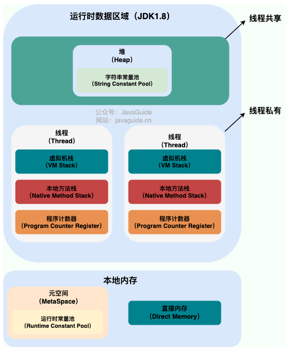
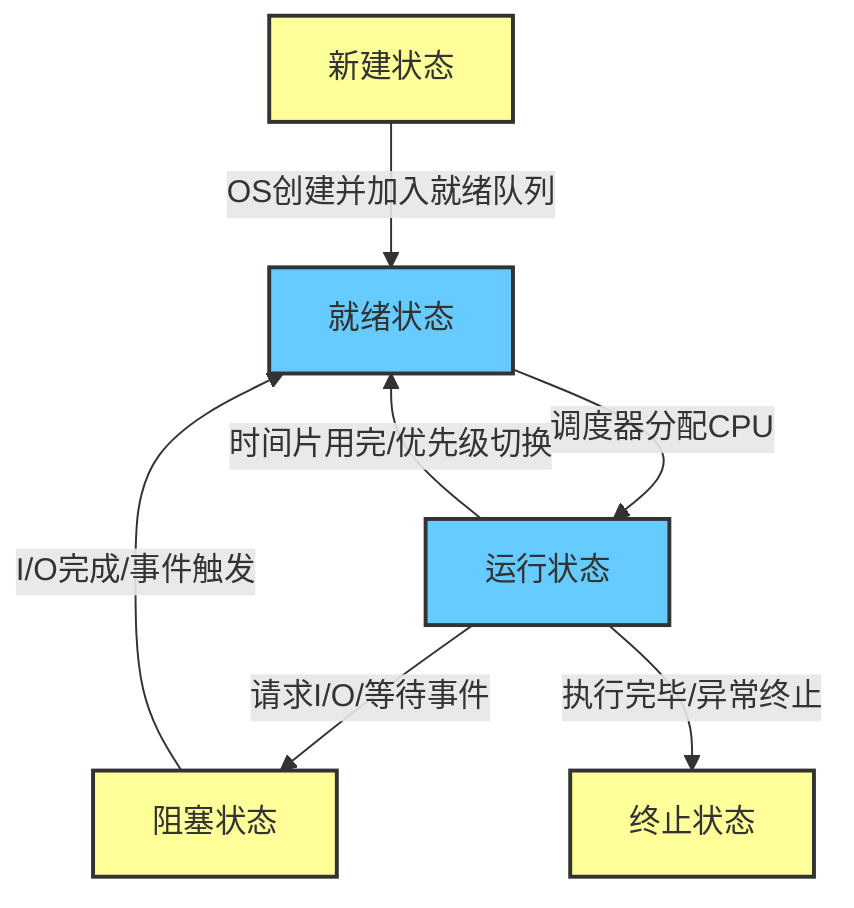
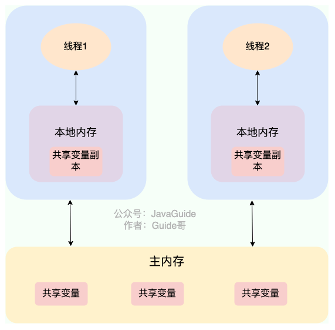
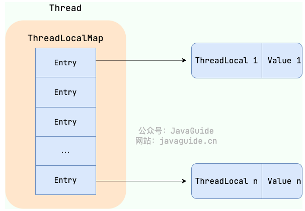
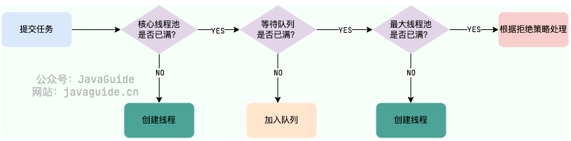

# 并发编程
## 线程与进程

Java 线程采用的是一对一的线程模型，也就是一个 Java 线程对应一个系统内核线程



一个进程中可以有多个线程，多个线程共享进程的**堆**和**方法区 (JDK1.8 之后的元空间)资源，但是每个线程有自己的程序计数器**、**虚拟机栈** 和 **本地方法栈**。

线程是进程划分成的更小的运行单位。线程和进程最大的不同在于基本上各进程是独立的，而各线程则不一定，因为同一进程中的线程极有可能会相互影响。线程执行开销小，但不利于资源的管理和保护；而进程正相反。

**创建线程**

继承`Thread`​类、实现`Runnable`​接口、实现`Callable`​接口、使用线程池、使用`CompletableFuture`类

严格来说，Java 就只有一种方式可以创建线程，那就是通过`new Thread().start()`​创建。不管是哪种方式，最终还是依赖于`new Thread().start()`。

---

**线程的生命周期和状态**



- NEW: 初始状态，线程被创建出来但没有被调用 `start()` 。
- RUNNABLE: 运行状态，线程被调用了 `start()`等待运行的状态。
- BLOCKED：阻塞状态，需要等待锁释放。
- WAITING：等待状态，表示该线程需要等待其他线程做出一些特定动作（通知或中断）。
- TIME\_WAITING：超时等待状态，可以在指定的时间后自行返回而不是像 WAITING 那样一直等待。
- TERMINATED：终止状态，表示该线程已经运行完毕。

‍

- 当线程执行 `wait()`​方法之后，线程进入 **WAITING（等待）**  状态。进入等待状态的线程需要依靠其他线程的通知才能够返回到运行状态。
- **TIMED_WAITING(超时等待)**  状态相当于在等待状态的基础上增加了超时限制，比如通过 `sleep（long millis）`​方法或 `wait（long millis）`​方法可以将线程置于 TIMED\_WAITING 状态。当超时时间结束后，线程将会返回到 RUNNABLE 状态。
- 当线程进入 `synchronized`​ 方法/块或者调用 `wait`​ 后（被 `notify`​）重新进入 `synchronized`​ 方法/块，但是锁被其它线程占有，这个时候线程就会进入 **BLOCKED（阻塞）**  状态。
- 线程在执行完了 `run()`​方法之后将会进入到 **TERMINATED（终止）**  状态。

---

**线程上下文切换**

线程在执行过程中会有自己的运行条件和状态（也称上下文），比如上文所说到过的程序计数器，栈信息等。当出现如下情况的时候，线程会从占用 CPU 状态中退出。

- 主动让出 CPU，比如调用了 `sleep()`​, `wait()` 等。
- 时间片用完，因为操作系统要防止一个线程或者进程长时间占用 CPU 导致其他线程或者进程饿死。
- 调用了阻塞类型的系统中断，比如请求 IO，线程被阻塞。
- 被终止或结束运行

这其中前三种都会发生线程切换，线程切换意味着需要保存当前线程的上下文，留待线程下次占用 CPU 的时候恢复现场。并加载下一个将要占用 CPU 的线程上下文。这就是所谓的 **上下文切换**。

---

**Thread::sleep() 和 Object::wait()**

**共同点**：两者都可以暂停线程的执行。

​**区别**：

- ​**​`sleep()`​** ​ **方法没有释放锁，而** **​`wait()`​** ​ **方法释放了锁** 。
- ​`wait()`​ 通常被用于线程间交互/通信，`sleep()`通常被用于暂停执行。
- ​`wait()`​ 方法被调用后，线程不会自动苏醒，需要别的线程调用同一个对象上的 `notify()`​或者 `notifyAll()`​ 方法。`sleep()`​方法执行完成后，线程会自动苏醒，或者也可以使用 `wait(long timeout)` 超时后线程会自动苏醒。
- ​`sleep()`​ 是 `Thread`​ 类的静态本地方法，`wait()`​ 则是 `Object` 类的本地方法。

## 为什么要使用多线程

- **从计算机底层来说：**  线程可以比作是轻量级的进程，是程序执行的最小单位，线程间的切换和调度的成本远远小于进程。另外，多核 CPU 时代意味着多个线程可以同时运行，这减少了线程上下文切换的开销。
- **从当代互联网发展趋势来说：**  现在的系统动不动就要求百万级甚至千万级的并发量，而多线程并发编程正是开发高并发系统的基础，利用好多线程机制可以大大提高系统整体的并发能力以及性能。

---

**单核CPU支持Java多线程吗**

单核 CPU 是支持 Java 多线程的。操作系统通过时间片轮转的方式，将 CPU 的时间分配给不同的线程。尽管单核 CPU 一次只能执行一个任务，但通过快速在多个线程之间切换，可以让用户感觉多个任务是同时进行的。

Java 使用的线程调度是抢占式的。也就是说，JVM 本身不负责线程的调度，而是将线程的调度委托给操作系统。操作系统通常会基于线程优先级和时间片来调度线程的执行，高优先级的线程通常获得 CPU 时间片的机会更多。

**单核CPU运行多个线程效率一定会高吗**

单核 CPU 同时运行多个线程的效率是否会高，取决于线程的类型和任务的性质。一般来说，有两种类型的线程：

- ​**CPU 密集型**：CPU 密集型的线程主要进行计算和逻辑处理，需要占用大量的 CPU 资源。
- ​**IO 密集型**：IO 密集型的线程主要进行输入输出操作，如读写文件、网络通信等，需要等待 IO 设备的响应，而不占用太多的 CPU 资源。

在单核 CPU 上，同一时刻只能有一个线程在运行，其他线程需要等待 CPU 的时间片分配。如果线程是 CPU 密集型的，那么多个线程同时运行会导致频繁的线程切换，增加了系统的开销，降低了效率。如果线程是 IO 密集型的，那么多个线程同时运行可以利用 CPU 在等待 IO 时的空闲时间，提高了效率。

使用多线程可能带来的问题：内存泄漏、死锁、线程不安全等。

线程安全与不安全：

- 线程安全指的是在多线程环境下，对于同一份数据，不管有多少个线程同时访问，都能保证这份数据的正确性和一致性。
- 线程不安全则表示在多线程环境下，对于同一份数据，多个线程同时访问时可能会导致数据混乱、错误或者丢失

## 线程死锁

线程死锁描述的是这样一种情况：多个线程同时被阻塞，它们中的一个或者全部都在等待某个资源被释放。由于线程被无限期地阻塞，因此程序不可能正常终止。

**产生死锁的四个必要条件**

- ​**互斥条件**：该资源任意一个时刻只由一个线程占用。
- ​**请求与保持条件**：一个线程因请求资源而阻塞时，对已获得的资源保持不放。
- ​**不剥夺条件**：线程已获得的资源在未使用完之前不能被其他线程强行剥夺，只有自己使用完毕后才释放资源。
- ​**循环等待条件**：若干线程之间形成一种头尾相接的循环等待资源关系。

## Java 内存模型



**Java 内存模型（JMM）**  抽象了线程和主内存之间的关系，就比如说线程之间的共享变量必须存储在主内存中。

**什么是主内存？什么是本地内存？**

- ​**主内存**：所有线程创建的实例对象都存放在主内存中，不管该实例对象是成员变量，还是局部变量，类信息、常量、静态变量都是放在主内存中。为了获取更好的运行速度，虚拟机及硬件系统可能会让工作内存优先存储于寄存器和高速缓存中。
- **本地内存**：每个线程都有一个私有的本地内存，本地内存存储了该线程已读 / 写共享变量的副本。每个线程只能操作自己本地内存中的变量，无法直接访问其他线程的本地内存。如果线程间需要通信，必须通过主内存来进行。本地内存是 JMM 抽象出来的一个概念，并不真实存在，它涵盖了缓存、写缓冲区、寄存器以及其他的硬件和编译器优化。

  由于操作频繁，对速度要求高，大部分使用寄存器和CPU 缓存

关于主内存与工作内存直接的具体交互协议，即一个变量如何从主内存拷贝到工作内存，如何从工作内存同步到主内存之间的实现细节，Java 内存模型定义八种同步操作。

## 并发编程三大特性

**原子性**

一次操作或者多次操作，要么所有的操作全部都得到执行并且不会受到任何因素的干扰而中断，要么都不执行。

在 Java 中，可以借助`synchronized`​、各种 `Lock` 以及各种原子类实现原子性。

​`synchronized`​ 和各种 `Lock`​ 可以保证任一时刻只有一个线程访问该代码块，因此可以保障原子性。各种原子类是利用 CAS (compare and swap) 操作（可能也会用到 `volatile`​或者`final`关键字）来保证原子操作。

**可见性**

当一个线程对共享变量进行了修改，那么另外的线程都是立即可以看到修改后的最新值。

在 Java 中，可以借助`synchronized`​、`volatile`​ 以及各种 `Lock` 实现可见性。

如果我们将变量声明为 `volatile` ，这就指示 JVM，这个变量是共享且不稳定的，每次使用它都到主存中进行读取。

**有序性**

由于指令重排序问题，代码的执行顺序未必就是编写代码时候的顺序。

> **指令重排序可以保证串行语义一致，但是没有义务保证多线程间的语义也一致** ，所以在多线程下，指令重排序可能会导致一些问题。

在 Java 中，`volatile` 关键字可以禁止指令进行重排序优化。

## volatile 关键字

**如何保证变量的可见性**

在 Java 中，`volatile`​ 关键字可以保证变量的可见性，如果我们将变量声明为 **​`volatile`​** ，这就指示 JVM，这个变量是共享且不稳定的，每次使用它都到主存中进行读取。

​`volatile`​ 关键字能保证数据的可见性，但不能保证数据的原子性。`synchronized` （进入synchronized 代码块强制从主内存中加载最新值，退出synchronized代码块强制刷回主内存）关键字两者都能保证。

**如何禁止指令重排序**

​**​`volatile`​**​ **关键字除了可以保证变量的可见性，还有一个重要的作用就是防止 JVM 的指令重排序。**  如果我们将变量声明为 **​`volatile`​**​ ，在对这个变量进行读写操作的时候，会通过插入特定的 **内存屏障** 的方式来禁止指令重排序。

双重校验锁实现对象单例（线程安全）：

```java
public class Singleton {
	private volatile static Singleton uniqueInstance;
	private Single() {
	}
	public static Singleton getUniqueInstance() {
		// 判断是否对象是否已经实例过，没有实例化才进入加锁代码
		if (uniqueIntance == null) {
			// 类对象锁
			synchronized (Singleton.class) {
				if (uniqueInstance == null) {
					uniqueInstance = new Singleton();
				}
			}
		}
		return uniqueInstance;
	}
}
```

​`uniqueInstance`​ 采用 `volatile`​ 关键字修饰也是很有必要的， `uniqueInstance = new Singleton();` 这段代码其实是分为三步执行：

1. 为 `uniqueInstance` 分配内存空间
2. 初始化 `uniqueInstance`
3. 将 `uniqueInstance` 指向分配的内存地址

但是由于 JVM 具有指令重排的特性，执行顺序有可能变成 1-\>3-\>2。指令重排在单线程环境下不会出现问题，但是在多线程环境下会导致一个线程获得还没有初始化的实例。例如，线程 T1 执行了 1 和 3，此时 T2 调用 `getUniqueInstance`​() 后发现 `uniqueInstance`​ 不为空，因此返回 `uniqueInstance`​，但此时 `uniqueInstance` 还未被初始化。

**volatile 可以保证原子性吗**

​**​`volatile`​**​ ==关键字能保证变量的可见性，但不能保证对变量的操作是原子性的。==

## 乐观锁和悲观锁

**悲观锁**

悲观锁总是假设最坏的情况，认为共享资源每次被访问的时候就会出现问题(比如共享数据被修改)，所以每次在获取资源操作的时候都会上锁，这样其他线程想拿到这个资源就会阻塞直到锁被上一个持有者释放。也就是说，**共享资源每次只给一个线程使用，其它线程阻塞，用完后再把资源转让给其它线程。**

**乐观锁**

乐观锁总是假设最好的情况，认为共享资源每次被访问的时候不会出现问题，线程可以不停地执行，无需加锁也无需等待，只是在提交修改的时候去验证对应的资源（也就是数据）是否被其它线程修改了（具体方法可以使用版本号机制或 CAS 算法）。

java.util.concurrent.atomic 包下的原子变量类使用CAS实现

高并发的场景下，乐观锁相比悲观锁来说，不存在锁竞争造成线程阻塞，也不会有死锁的问题，在性能上往往会更胜一筹。但是，如果冲突频繁发生（写占比非常多的情况），会频繁失败和重试，这样同样会非常影响性能，导致 CPU 飙升。

- 悲观锁通常用于写比较多的情况
- 乐观锁通常用于写比较少的情况

**实现乐观锁**

- 版本号控制

- CAS算法

**CAS 算法存在的问题**

- ABA问题

  一个变量V，线程1初次读取时是A，中间被线程2修改为B后又修改为A，线程1准备赋值时检查它仍然是A值。这个问题被称为ABA问题。

  解决思路是在变量前面追加上**版本号或者时间戳。**
- 循环时间长开销大

  CAS 经常会用到自旋操作来进行重试，也就是不成功就一直循环执行直到成功。如果长时间不成功，会给 CPU 带来非常大的执行开销。
- 只能保证一个共享变量的原子操作

## synchronized

1. 修饰实例方法

   给当前对象实例加锁，进入同步代码前要获得 **当前对象实例的锁** 。

   ```java
   synchronized void method() {
       //业务代码
   }
   ```
2. 修饰静态方法 （锁当前类）

   给当前类加锁，会作用于类的所有对象实例 ，进入同步代码前要获得 **当前 class 的锁**。

   ```java
   synchronized static void method() {
       //业务代码
   }
   ```

3. 修饰代码块 （锁指定对象/类）

   对括号里指定的对象/类加锁：

   - ​`synchronized(object)`​ 表示进入同步代码块前要获得 ​**给定对象的锁**。
   - ​`synchronized(类.class)`​ 表示进入同步代码块前要获得 **给定 Class 的锁**

   ```java
   synchronized(this) {
       //业务代码
   }
   ```

**构造方法可以用synchronized修饰吗**

构造方法不能使用 synchronized 关键字修饰。不过，可以在构造方法内部使用 synchronized 代码块。

另外，构造方法本身是线程安全的，但如果在构造方法中涉及到共享资源的操作，就需要采取适当的同步措施来保证整个构造过程的线程安全。

**synchronized 底层原理**

​`synchronized`​ 同步语句块的实现使用的是 `monitorenter`​ 和 `monitorexit`​ 指令，其中 `monitorenter`​ 指令指向同步代码块的开始位置，`monitorexit` 指令则指明同步代码块的结束位置。

当执行 `monitorenter`​ 指令时，线程试图获取锁也就是获取 **对象监视器** **​`monitor`​** 的持有权。

在执行`monitorenter`时，会尝试获取对象的锁，如果锁的计数器为 0 则表示锁可以被获取，获取后将锁计数器设为 1 也就是加 1。

对象锁的拥有者线程才可以执行 `monitorexit`​ 指令来释放锁。在执行 `monitorexit` 指令后，将锁计数器设为 0，表明锁被释放，其他线程可以尝试获取锁。

如果获取对象锁失败，那当前线程就要阻塞等待，直到锁被另外一个线程释放为止。

**锁升级**

锁主要存在四种状态，依次是：无锁状态、偏向锁状态、轻量级锁状态、重量级锁状态，他们会随着竞争的激烈而逐渐升级。注意锁可以升级不可降级，这种策略是为了提高获得锁和释放锁的效率。

---

**synchronized 和 volatile 区别**

​`synchronized`​ 关键字和 `volatile` 关键字是两个互补的存在，而不是对立的存在！

- ​`volatile`​ 关键字是线程同步的轻量级实现，所以 `volatile`​性能肯定比`synchronized`​关键字要好 。但是 `volatile`​ 关键字只能用于变量而 `synchronized` 关键字可以修饰方法以及代码块 。
- ​`volatile`​ 关键字能保证数据的可见性，但不能保证数据的原子性。`synchronized` 关键字两者都能保证。
- ​`volatile`​关键字主要用于解决变量在多个线程之间的可见性，而 `synchronized` 关键字解决的是多个线程之间访问资源的同步性。

## ReentrantLock

​`ReentrantLock`​ 实现了 `Lock`​ 接口，是一个可重入且独占式的锁，和 `synchronized`​ 关键字类似。不过，`ReentrantLock` 更灵活、更强大，增加了轮询、超时、中断、公平锁和非公平锁等高级功能。

​`ReentrantLock` 默认使用非公平锁，也可以通过构造器来显式的指定使用公平锁。

**公平锁和非公平锁有什么区别**

- **公平锁** : 锁被释放之后，先申请的线程先得到锁。性能较差一些，因为公平锁为了保证时间上的绝对顺序，上下文切换更频繁。
- **非公平锁**：锁被释放之后，后申请的线程可能会先获取到锁，是随机或者按照其他优先级排序的。性能更好，但可能会导致某些线程永远无法获取到锁。

**synchronized 和 ReentrantLock 区别**

- **都是可重入锁**

  ==可重入锁== 也叫递归锁，指的是线程可以再次获取自己的内部锁。

  JDK 提供的所有现成的 `Lock`​ 实现类，包括 `synchronized` 关键字锁都是可重入的。

- **synchronized 依赖于 JVM 而 ReentrantLock 依赖于 API**

  ​`synchronized`​ 是依赖于 JVM 实现的，JDK1.6 为 `synchronized` 关键字进行了很多优化，但是这些优化都是在虚拟机层面实现的，并没有直接暴露给我们。

  ​`ReentrantLock`​ 是 JDK 层面实现的（也就是 API 层面，需要 `lock()`​ 和 `unlock()`​ 方法配合 `try/finally` 语句块来完成），所以我们可以通过查看它的源代码，来看它是如何实现的。

- **ReentrantLock 比 synchronized 增加了一些高级功能**

  - 等待可中断
  - 可实现公平锁
  - 可实现选择性通知（锁可以绑定多个条件）
  - 支持超时

**可中断锁和不可中断锁有什么区别**

- ​**可中断锁**​：获取锁的过程中可以被中断，不需要一直等到获取锁之后 才能进行其他逻辑处理。`ReentrantLock` 就属于是可中断锁。
- **不可中断锁**：一旦线程申请了锁，就只能等到拿到锁以后才能进行其他的逻辑处理。 `synchronized` 就属于是不可中断锁。

## ThreadLocal

​**​`ThreadLocal`​** 类允许每个线程绑定自己的值。

```java
public class Thread implements Runnable {
    //......
    //与此线程有关的ThreadLocal值。由ThreadLocal类维护
    ThreadLocal.ThreadLocalMap threadLocals = null;

    //与此线程有关的InheritableThreadLocal值。由InheritableThreadLocal类维护
    ThreadLocal.ThreadLocalMap inheritableThreadLocals = null;
    //......
}
```

​`Thread`​ 类中有一个 `threadLocals`​ 和 一个 `inheritableThreadLocals`​ 变量，它们都是 `ThreadLocalMap`​ 类型的变量,我们可以把 `ThreadLocalMap`​ 理解为`ThreadLocal`​ 类实现的定制化的 `HashMap`。

ThreadLocalMap 解决hash冲突时，采用的是==线性探测法==



**ThreadLocal 内存泄漏问题是怎么导致的**

每个线程维护一个名为 `ThreadLocalMap`​ 的 map。 当你使用 `ThreadLocal`​ 存储值时，实际上是将值存储在当前线程的 `ThreadLocalMap`​ 中，其中 `ThreadLocal` 实例本身作为 key，而你要存储的值作为 value。

​`ThreadLocalMap`​ 的 `key`​ 和 `value` 引用机制：

- ​**key 是弱引用**​：`ThreadLocalMap`​ 中的 key 是 `ThreadLocal`​ 的弱引用 (`WeakReference<ThreadLocal<?>>`​)。 这意味着，如果 `ThreadLocal`​ 实例不再被任何强引用指向，垃圾回收器会在下次 GC 时回收该实例，导致 `ThreadLocalMap`​ 中对应的 key 变为 `null`。
- ​**value 是强引用**​：即使 `key`​ 被 GC 回收，`value`​ 仍然被 `ThreadLocalMap.Entry` 强引用存在，无法被 GC 回收。

当 `ThreadLocal`​ 实例失去强引用后，其对应的 value 仍然存在于 `ThreadLocalMap`​ 中，因为 `Entry`​ 对象强引用了它。如果线程持续存活（例如线程池中的线程），`ThreadLocalMap`​ 也会一直存在，导致 key 为 `null` 的 entry 无法被垃圾回收，即会造成内存泄漏。

**避免内存泄漏**

- 在使用完 `ThreadLocal`​ 后，务必调用 `remove()` 方法。

- 在线程池等线程复用的场景下，使用 `try-finally`​ 块可以确保即使发生异常，`remove()` 方法也一定会被执行。

## 线程池

线程池就是管理一系列线程的资源池。当有任务要处理时，直接从线程池中获取线程来处理，处理完之后线程并不会立即被销毁，而是等待下一个任务。

**为什么要用线程池**

1. 降低资源消耗：线程池里的线程是可以重复利用的。
2. 提高响应速度：线程池里通常会维护一定数量的核心线程，任务来了之后，可以直接交给这些已经存在的、空闲的线程去执行，省去了创建线程的时间，任务能够更快地得到处理。
3. 提高线程的可管理性：线程池允许我们统一管理池中的线程。我们可以配置线程池的大小（核心线程数、最大线程数）、任务队列的类型和大小、拒绝策略等。

**创建线程池**

1. 通过 ThreadPoolExecutor

2. 通过 Executors 工具创建(不推荐用于生产环境)

   **为什么不推荐使用内置线程池**

   参数固化、资源控制失控，易引发 OOM（workQueue 默认无界队列，容量为 `Integer.MAX_VALUE`，任务堆积容易导致 OOM）或系统过载

---

**线程池常见参数**

​`ThreadPoolExecutor` 3 个最重要的参数：

- ​`corePoolSize` : 任务队列未达到队列容量时，最大可以同时运行的线程数量。
- ​`maximumPoolSize` : 任务队列中存放的任务达到队列容量的时候，当前可以同时运行的线程数量变为最大线程数。
- ​`workQueue`: 新任务来的时候会先判断当前运行的线程数量是否达到核心线程数，如果达到的话，新任务就会被存放在队列中。

​`ThreadPoolExecutor`其他常见参数 :

- ​`keepAliveTime`​:当线程池中的线程数量大于 `corePoolSize`​ ，即有非核心线程（线程池中核心线程以外的线程）时，这些非核心线程空闲后不会立即销毁，而是会等待，直到等待的时间超过了 `keepAliveTime`才会被回收销毁。
- ​`unit`​ : `keepAliveTime` 参数的时间单位。
- ​`threadFactory` :executor 创建新线程的时候会用到。
- ​`handler` :拒绝策略

**线程池的拒绝策略**

如果当前同时运行的线程数量达到最大线程数量并且队列也已经被放满了任务时，`ThreadPoolExecutor` 定义一些策略:

- ​`ThreadPoolExecutor.AbortPolicy`​：抛出 `RejectedExecutionException`来拒绝新任务的处理。
- ​`ThreadPoolExecutor.CallerRunsPolicy`​：调用执行者自己的线程运行任务，也就是直接在调用`execute`​方法的线程中运行(`run`)被拒绝的任务，如果执行程序已关闭，则会丢弃该任务。因此这种策略会降低对于新任务提交速度，影响程序的整体性能。如果你的应用程序可以承受此延迟并且你要求任何一个任务请求都要被执行的话，你可以选择这个策略。
- ​`ThreadPoolExecutor.DiscardPolicy`：不处理新任务，直接丢弃掉。
- ​`ThreadPoolExecutor.DiscardOldestPolicy`：此策略将丢弃最早的未处理的任务请求。

**线程池处理任务的流程**



- 如果当前运行的线程数小于核心线程数，那么就会新建一个线程来执行任务。
- 如果当前运行的线程数等于或大于核心线程数，但是小于最大线程数，那么就把该任务放入到任务队列里等待执行。
- 如果向任务队列投放任务失败（任务队列已经满了），但是当前运行的线程数是小于最大线程数的，就新建一个线程来执行任务。
- 如果当前运行的线程数已经等同于最大线程数了，新建线程将会使当前运行的线程超出最大线程数，那么当前任务会被拒绝，拒绝策略会调用`RejectedExecutionHandler.rejectedExecution()`方法。

**线程池中线程异常后，销毁还是复用**

简单来说：使用`execute()`​时，未捕获异常导致线程终止，线程池创建新线程替代；使用`submit()`​时，异常被封装在`Future`中，线程继续复用。

这种设计允许`submit()`​提供更灵活的错误处理机制，因为它允许调用者决定如何处理异常，而`execute()`则适用于那些不需要关注执行结果的场景。

**如何给线程池命名**

1. 利用guava 的 ThreadFactoryBuilder

   ```java
   ThreadFactory threadFactory = new ThreadFactoryBuilder()
                           .setNameFormat(threadNamePrefix + "-%d")
                           .setDaemon(true).build();
   ExecutorService threadPool = new ThreadPoolExecutor(corePoolSize, maximumPoolSize, keepAliveTime, TimeUnit.MINUTES, workQueue, threadFactory);
   ```

2. 自己实现 ThreadFactory

**如何设定线程池的大小**

- **CPU 密集型任务(N+1)：**  这种任务消耗的主要是 CPU 资源，可以将线程数设置为 N（CPU 核心数）+1。比 CPU 核心数多出来的一个线程是为了防止线程偶发的缺页中断，或者其它原因导致的任务暂停而带来的影响。一旦任务暂停，CPU 就会处于空闲状态，而在这种情况下多出来的一个线程就可以充分利用 CPU 的空闲时间。
- **I/O 密集型任务(2N)：**  这种任务应用起来，系统会用大部分的时间来处理 I/O 交互，而线程在处理 I/O 的时间段内不会占用 CPU 来处理，这时就可以将 CPU 交出给其它线程使用。因此在 I/O 密集型任务的应用中，我们可以多配置一些线程，具体的计算方法是 2N。

**如何设计一个能够根据任务的优先级来执行的线程池**

​`PriorityBlockingQueue`​ 是一个支持优先级的无界阻塞队列，可以看作是线程安全的 `PriorityQueue`​，两者底层都是使用小顶堆形式的二叉堆，即值最小的元素优先出队。不过，`PriorityQueue` 不支持阻塞操作。

要想让 `PriorityBlockingQueue` 实现对任务的排序，传入其中的任务必须是具备排序能力的，方式有两种：

1. 提交到线程池的任务实现 `Comparable`​ 接口，并重写 `compareTo` 方法来指定任务之间的优先级比较规则。
2. 创建 `PriorityBlockingQueue`​ 时传入一个 `Comparator` 对象来指定任务之间的排序规则(推荐)。

不过，这存在一些风险和问题，比如：

- ​`PriorityBlockingQueue` 是无界的，可能堆积大量的请求，从而导致 OOM。
- 可能会导致饥饿问题，即低优先级的任务长时间得不到执行。
- 由于需要对队列中的元素进行排序操作以及保证线程安全（并发控制采用的是可重入锁 `ReentrantLock`），因此会降低性能。

## Future

​`Future`​ 类只是一个泛型接口，位于 `java.util.concurrent` 包下，其中定义了 5 个方法，主要包括下面这 4 个功能：

- 取消任务；
- 判断任务是否被取消;
- 判断任务是否已经执行完成;
- 获取任务执行结果。

​`FutureTask`​ 提供了 `Future`​ 接口的基本实现，常用来封装 `Callable`​ 和 `Runnable`​，具有取消任务、查看任务是否执行完成以及获取任务执行结果的方法。`ExecutorService.submit()`​ 方法返回的其实就是 `Future`​ 的实现类 `FutureTask` 。

​`FutureTask`​ 有两个构造函数，可传入 `Callable`​ 或者 `Runnable`​ 对象。实际上，传入 `Runnable`​ 对象也会在方法内部转换为`Callable` 对象。

```java
public FutureTask(Callable<V> callable) {
    if (callable == null)
        throw new NullPointerException();
    this.callable = callable;
    this.state = NEW;
}
public FutureTask(Runnable runnable, V result) {
    // 通过适配器RunnableAdapter来将Runnable对象runnable转换成Callable对象
    this.callable = Executors.callable(runnable, result);
    this.state = NEW;
}
```

​`FutureTask`​相当于对`Callable`​ 进行了封装，管理着任务执行的情况，存储了 `Callable`​ 的 `call` 方法的任务执行结果。

---

**CompletableFuture 类**

​`Future`​ 在实际使用过程中存在一些局限性，比如不支持异步任务的编排组合、获取计算结果的 `get()` 方法为阻塞调用。

Java 8 才被引入`CompletableFuture`​ 类可以解决`Future`​ 的这些缺陷。`CompletableFuture`​ 除了提供了更为好用和强大的 `Future` 特性之外，还提供了函数式编程、异步任务编排组合（可以将多个异步任务串联起来，组成一个完整的链式调用）等能力。

​`CompletionStage` 接口描述了一个异步计算的阶段。很多计算可以分成多个阶段或步骤，此时可以通过它将所有步骤组合起来，形成异步计算的流水线。

**一个任务需要依赖另外两个任务执行完之后再执行，如何设计**

这种任务编排场景非常适合通过`CompletableFuture`实现。这里假设要实现 T3 在 T2 和 T1 执行完后执行。

代码如下（这里为了简化代码，用到了 Hutool 的线程工具类 `ThreadUtil`​ 和日期时间工具类 `DateUtil`）：

```java
// T1
CompletableFuture<Void> futureT1 = CompletableFuture.runAsync(() -> {
    System.out.println("T1 is executing. Current time：" + DateUtil.now());
    // 模拟耗时操作
    ThreadUtil.sleep(1000);
});
// T2
CompletableFuture<Void> futureT2 = CompletableFuture.runAsync(() -> {
    System.out.println("T2 is executing. Current time：" + DateUtil.now());
    ThreadUtil.sleep(1000);
});

// 使用allOf()方法合并T1和T2的CompletableFuture，等待它们都完成
CompletableFuture<Void> bothCompleted = CompletableFuture.allOf(futureT1, futureT2);
// 当T1和T2都完成后，执行T3
bothCompleted.thenRunAsync(() -> System.out.println("T3 is executing after T1 and T2 have completed.Current time：" + DateUtil.now()));
// 等待所有任务完成，验证效果
ThreadUtil.sleep(3000);
```

通过 `CompletableFuture`​ 的 `allOf()` 这个静态方法来并行运行 T1 和 T2，当 T1 和 T2 都完成后，再执行 T3。

## AQS

AQS （`AbstractQueuedSynchronizer` ，抽象队列同步器）是从 JDK1.5 开始提供的 Java 并发核心组件。

简单来说，AQS 是一个抽象类，为同步器提供了通用的 **执行框架**。它定义了 **资源获取和释放的通用流程**，而具体的资源获取逻辑则由具体同步器通过重写模板方法来实现。 因此，可以将 AQS 看作是同步器的 **基础“底座”** ，而同步器则是基于 AQS 实现的 **具体“应用”**

**AQS 的原理**

AQS 核心思想是，如果被请求的共享资源空闲，则将当前请求资源的线程设置为有效的工作线程，并且将共享资源设置为锁定状态。如果被请求的共享资源被占用，那么就需要一套线程阻塞等待以及被唤醒时锁分配的机制，这个机制 AQS 是基于 **CLH 锁** （Craig, Landin, and Hagersten locks） 进一步优化实现的。

AQS 使用 ​**int 成员变量** **​`state`​**​ **表示同步状态**​，通过内置的 **线程等待队列** 来完成获取资源线程的排队工作。

​`state`​ 变量由 `volatile` 修饰，用于展示当前临界资源的获锁情况。

```java
// 共享变量，使用volatile修饰保证线程可见性
private volatile int state;
```

另外，状态信息 `state`​ 可以通过 `protected`​ 类型的`getState()`​、`setState()`​和`compareAndSetState()`​ 进行操作。并且，这几个方法都是 `final` 修饰的，在子类中无法被重写。

**举例：**

以 `ReentrantLock`​ 为例，`state`​ 初始值为 0，表示未锁定状态。A 线程 `lock()`​ 时，会调用 `tryAcquire()`​ 独占该锁并将 `state+1`​ 。此后，其他线程再 `tryAcquire()`​ 时就会失败，直到 A 线程 `unlock()`​ 到 `state=`​0（即释放锁）为止，其它线程才有机会获取该锁。当然，释放锁之前，A 线程自己是可以重复获取此锁的（`state` 会累加），这就是可重入的概念。但要注意，获取多少次就要释放多少次，这样才能保证 state 是能回到零态的。

再以 `CountDownLatch`​ 以例，任务分为 N 个子线程去执行，`state`​ 也初始化为 N（注意 N 要与线程个数一致）。这 N 个子线程是并行执行的，每个子线程执行完后`countDown()`​ 一次，state 会 CAS(Compare and Swap) 减 1。等到所有子线程都执行完后(即 `state=0`​ )，会 `unpark()`​ 主调用线程，然后主调用线程就会从 `await()` 函数返回，继续后续动作。

---

**Semaphore 作用**

​`synchronized`​ 和 `ReentrantLock`​ 都是一次只允许一个线程访问某个资源，而`Semaphore`(信号量)可以用来控制同时访问特定资源的线程数量。

Semaphore 的使用简单，我们这里假设有 N(N\>5) 个线程来获取 `Semaphore` 中的共享资源，下面的代码表示同一时刻 N 个线程中只有 5 个线程能获取到共享资源，其他线程都会阻塞，只有获取到共享资源的线程才能执行。等到有线程释放了共享资源，其他阻塞的线程才能获取到。

```java
// 初始共享资源数量
final Semaphore semaphore = new Semaphore(5);
// 获取1个许可
semaphore.acquire();
// 释放1个许可
semaphore.release();
```

**Semaphore 原理**

调用`semaphore.acquire()`​ ，线程尝试获取许可证，如果 `state >= 0`​ 的话，则表示可以获取成功。如果获取成功的话，使用 CAS 操作去修改 `state`​ 的值 `state=state-1`​。如果 `state<0` 的话，则表示许可证数量不足。此时会创建一个 Node 节点加入阻塞队列，挂起当前线程。

调用`semaphore.release();`​ ，线程尝试释放许可证，并使用 CAS 操作去修改 `state`​ 的值 `state=state+1`​。释放许可证成功之后，同时会唤醒同步队列中的一个线程。被唤醒的线程会重新尝试去修改 `state`​ 的值 `state=state-1`​ ，如果 `state>=0` 则获取令牌成功，否则重新进入阻塞队列，挂起线程。

**CountDownLatch**

​`CountDownLatch`​ 允许 `count` 个线程阻塞在一个地方，直至所有线程的任务都执行完毕。

**CountDownLatch 原理**

​`CountDownLatch`​ 是共享锁的一种实现,它默认构造 AQS 的 `state`​ 值为 `count`​。当线程使用 `countDown()`​ 方法时,其实使用了`tryReleaseShared`​方法以 CAS 的操作来减少 `state`​,直至 `state`​ 为 0 。当调用 `await()`​ 方法的时候，如果 `state`​ 不为 0，那就证明任务还没有执行完毕，`await()`​ 方法就会一直阻塞，也就是说 `await()`​ 方法之后的语句不会被执行。直到`count`​ 个线程调用了`countDown()`​使 state 值被减为 0，或者调用`await()`​的线程被中断，该线程才会从阻塞中被唤醒，`await()` 方法之后的语句得到执行。
