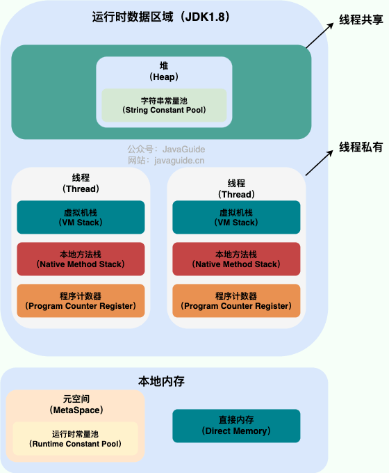
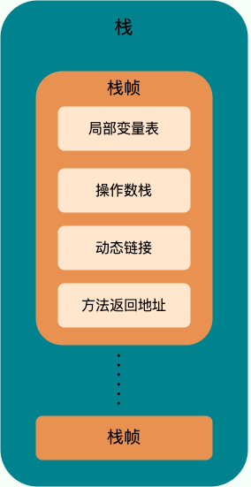
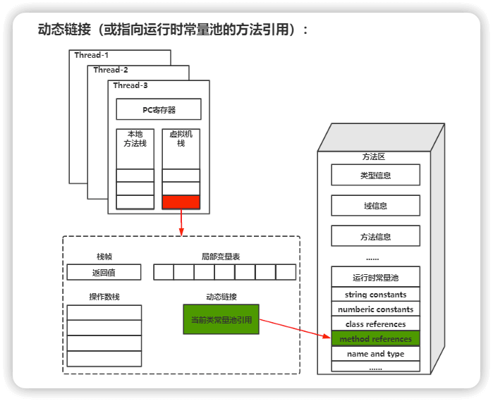
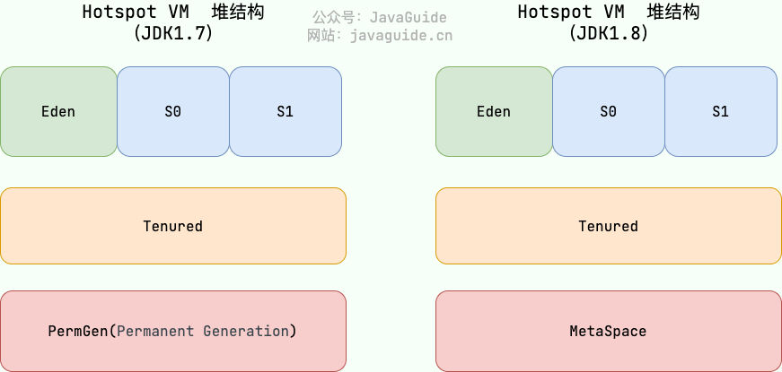
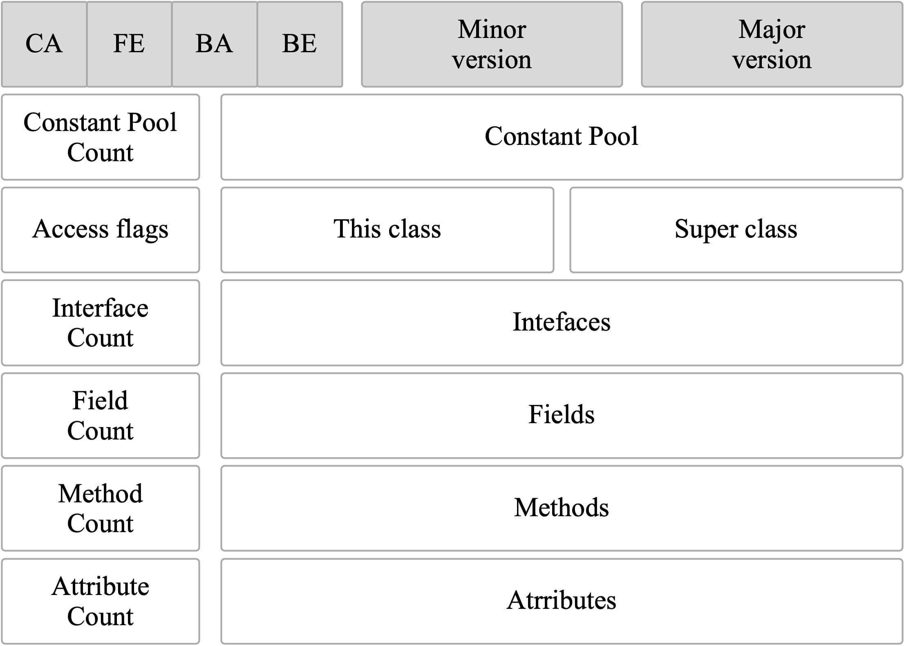
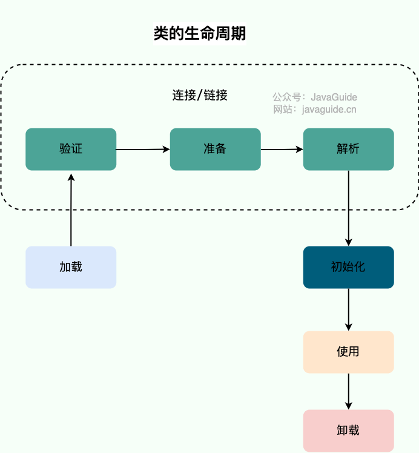
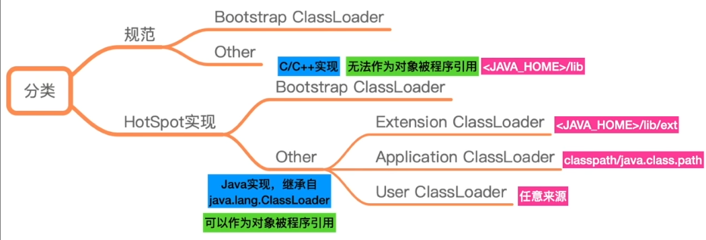
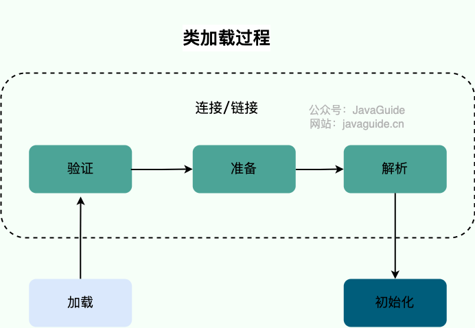
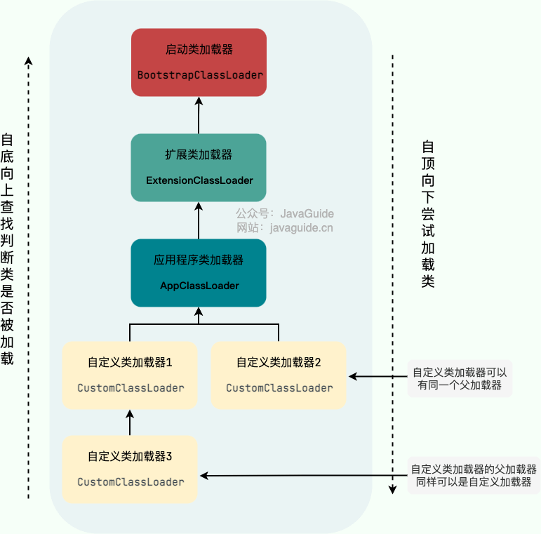
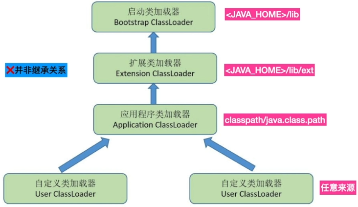

# JVM



## Java 虚拟机栈（VM Stack）



Java 虚拟机栈是线程私有的，声明周期和线程相同。

除Native方法调用是通过本地方法栈实现，其他所有Java方法调用都是通过栈来实现。

每一次方法调用都会有一个对应的栈帧被压入栈中，每一个方法调用结束后，都会有一个栈帧被弹出.

每个栈帧中都拥有：局部变量表、操作数栈、动态链接、方法返回地址。和数据结构上的栈类似，两者都是先进后出的数据结构，只支持出栈和入栈两种操作。

- ==局部变量表==。主要存放了编译期可知的各种数据类型，对象引用（reference）。
- ==操作数栈==。主要作为方法调用的中转站使用，用于存放方法执行过程中产生的中间计算结果。另外，计算过程中产生的临时变量也会放在操作数栈中。
- ==动态链接==。class文件中，方法调用以符号引用的形式存在于常量池。为了执行调用，这些符号引用必须被转换为内存中的直接引用。分为两种情况：

  - 对于静态方法、私有方法等在编译期就能确定版本的方法，这个转换在**类加载的解析阶段**就完成了，这称为**静态解析。**
  - 对于需要根据对象实际类型才能确定具体实现的**虚方法**（这是实现多态的基础），这个转换过程则被推迟到**程序运行期间**，由**动态链接**来完成。**动态链接**的核心作用是**在运行时解析虚方法的调用点，将其链接到正确的方法版本上**。

    
- ==方法返回地址==。Java方法有两种返回方式，一种是return语句正常返回，一种是抛出异常。不管哪种返回方式，都会导致栈帧被弹出。

## 堆（Heap）

Java 堆是所有线程共享的一块内存区域，在虚拟机启动时创建。**此内存区域的唯一目的就是存放对象实例，几乎所有的对象实例以及数组都在这里分配内存。**

Hotspot VM 堆结构



**JDK 8 版本之后 PermGen(永久代) 已被 Metaspace(元空间) 取代，元空间使用的是本地内存。**

大部分情况，对象都会首先在 Eden 区域分配，在一次新生代垃圾回收后，如果对象还存活，则会进入 S0 或者 S1，并且对象的年龄还会加 1(Eden 区-\>Survivor 区后对象的初始年龄变为 1)，当它的年龄增加到一定程度（默认为 15 岁），就会被晋升到老年代中。

## 方法区（MetaSpace）

当虚拟机加载一个类时，它会从 Class 文件中解析出相应的信息，并将这些**元数据**存入方法区。具体来说，方法区主要存储以下核心数据：

1. ​**类的元数据**：包括类的完整结构，如类名、父类、实现的接口、访问修饰符，以及字段和方法的详细信息（名称、类型、修饰符等）。
2. ​**方法的字节码**：每个方法的原始指令序列。
3. ​**运行时常量池**：每个类独有的，由 Class 文件中的常量池转换而来，用于存放编译期生成的各种字面量和对类型、字段、方法的符号引用。

## **运行时常量池**

Class 文件中除了有类的版本、字段、方法、接口等描述信息外，还有用于存放编译期生成的各种字面量（Literal）和符号引用（Symbolic Reference）的 **常量池表(Constant Pool Table)**  。

常见的符号引用包括类符号引用、字段符号引用、方法符号引用、接口方法符号。

常量池表会在类加载后存放到方法区的运行时常量池中。

## <span id="20251216172641-ez10du4" style="display: none;"></span>字符串常量池

**字符串常量池** 是 JVM 为了提升性能和减少内存消耗针对字符串（String 类）专门开辟的一块区域，主要目的是为了避免字符串的重复创建。

从1.7 开始，字符串常量池移动到堆中

## Java 对象创建过程

1. ==类加载检查==

   虚拟机遇到一条 new 指令时，首先将去检查这个指令的参数是否能在常量池中定位到这个类的符号引用，并且检查这个符号引用代表的类是否已被加载过、解析和初始化过。如果没有，那必须先执行相应的类加载过程。
2. ==分配内存==

   在**类加载检查**通过后，接下来虚拟机将为新生对象**分配内存**。对象所需的内存大小在类加载完成后便可确定，为对象分配空间的任务等同于把一块确定大小的内存从 Java 堆中划分出来。分配方式有“指针碰撞”和“空闲列表”。

3. ==初始化零值==

   内存分配完成后，虚拟机需要将分配到的内存空间都初始化为零值（不包括对象头），这一步操作保证了对象的实例字段在 Java 代码中可以不赋初始值就直接使用，程序能访问到这些字段的数据类型所对应的零值。
4. ==设置对象头==

   初始化零值完成之后，**虚拟机要对对象进行必要的设置**，例如这个对象是哪个类的实例、如何才能找到类的元数据信息、对象的哈希码、对象的 GC 分代年龄等信息。 **这些信息存放在对象头中。**
5. ==执行 init 方法==

   在上面工作都完成之后，从虚拟机的视角来看，一个新的对象已经产生了，但从 Java 程序的视角来看，对象创建才刚开始，`<init>`​ 方法还没有执行，所有的字段都还为零。所以一般来说，执行 new 指令之后会接着执行 `<init>` 方法，把对象按照程序员的意愿进行初始化，这样一个真正可用的对象才算完全产生出来。

---

**对象的内存布局**

在 Hotspot 虚拟机中，对象在内存中的布局可以分为 3 块区域：**对象头（Header）** 、**实例数据（Instance Data）和对齐填充（Padding）** 。

==对象头==包括两部分信息：

1. 标记字段（Mark Word）：用于存储对象自身的运行时数据， 如哈希码（HashCode）、GC 分代年龄、锁状态标志、线程持有的锁、偏向线程 ID、偏向时间戳等等。
2. 类型指针（Klass pointer）：对象指向它的类元数据的指针，虚拟机通过这个指针来确定这个对象是哪个类的实例。

**==实例数据==**​**部分是对象真正存储的有效信息**，也是在程序中所定义的各种类型的字段内容。

**==对齐填充部分==**​**不是必然存在的，也没有什么特别的含义，仅仅起占位作用。**

## 垃圾回收

### 内存分配和回收原则

**对象优先在Eden区分配**

当 Eden 区没有足够空间进行分配时，虚拟机将发起一次 Minor GC。

如果对象在 Eden 出生并经过第一次 Minor GC 后仍然能够存活，并且能被 Survivor 容纳的话，将被移动到 Survivor 空间（s0 或者 s1）中，并将对象年龄设为 1(Eden 区-\>Survivor 区后对象的初始年龄变为 1)。

对象在 Survivor 中每熬过一次 MinorGC,年龄就增加 1 岁，当它的年龄增加到一定程度（默认为 15 岁），就会被晋升到老年代中。

大对象直接进入老年代。

‍

针对 HotSpot VM 的实现，它里面的 GC 其实准确分类只有两大种：

部分收集 (Partial GC)：

- 新生代收集（Minor GC / Young GC）：只对新生代进行垃圾收集；
- 老年代收集（Major GC / Old GC）：只对老年代进行垃圾收集。需要注意的是 Major GC 在有的语境中也用于指代整堆收集；
- 混合收集（Mixed GC）：对整个新生代和部分老年代进行垃圾收集。

整堆收集 (Full GC)：收集整个 Java 堆和方法区

### 死亡对象判断

堆中几乎放着所有的对象实例，对堆垃圾回收前的第一步就是要判断哪些对象已经死亡（即不能再被任何途径使用的对象）。

- 引用计数法

  无法解决循环引用问题
- 可达性分析算法

  这个算法的基本思想就是通过一系列的称为  **“GC Roots”**  的对象作为起点，从这些节点开始向下搜索，节点所走过的路径称为引用链，当一个对象到 GC Roots 没有任何引用链相连的话，则证明此对象是不可用的，需要被回收。

**哪些对象可以作为 GC Roots 呢？**

- 虚拟机栈(栈帧中的局部变量表)中引用的对象
- 本地方法栈(Native 方法)中引用的对象
- 方法区中类静态属性引用的对象
- 方法区中常量引用的对象
- 所有被同步锁持有的对象
- JNI（Java Native Interface）引用的对象

### 引用类型

引用分为强引用、软引用、弱引用、虚引用四种（引用强度逐渐减弱），强引用就是 Java 中普通的对象，而软引用、弱引用、虚引用在 JDK 中定义的类分别是 `SoftReference`​、`WeakReference`​、`PhantomReference`。

1. **强引用（StrongReference）**

   强引用实际上就是程序代码中普遍存在的引用赋值，这是使用最普遍的引用，其代码如下

   ```java
   String strongReference = new String("abc");
   ```

   如果一个对象具有强引用，那就类似于**必不可少的生活用品**，垃圾回收器绝不会回收它。当内存空间不足，Java 虚拟机宁愿抛出 OutOfMemoryError 错误，使程序异常终止，也不会靠随意回收具有强引用的对象来解决内存不足问题。

2. **软引用（SoftReference）**

   如果一个对象只具有软引用，那就类似于​**可有可无的生活用品**。软引用代码如下

   ```java
   // 软引用
   String str = new String("abc");
   SoftReference<String> softReference = new SoftReference<String>(str);
   ```

   如果内存空间足够，垃圾回收器就不会回收它，如果内存空间不足了，就会回收这些对象的内存。只要垃圾回收器没有回收它，该对象就可以被程序使用。软引用可用来实现内存敏感的高速缓存。

   软引用可以和一个引用队列（ReferenceQueue）联合使用，如果软引用所引用的对象被垃圾回收，JAVA 虚拟机就会把这个软引用加入到与之关联的引用队列中。

3. **弱引用（WeakReference）**

   如果一个对象只具有弱引用，那就类似于​**可有可无的生活用品**。弱引用代码如下：

   ```java
   String str = new String("abc");
   WeakReference<String> weakReference = new WeakReference<>(str);
   str = null; //str变成软引用，可以被收集
   ```

   弱引用与软引用的区别在于：==只具有弱引用的对象拥有更短暂的生命周期==。在垃圾回收器线程扫描它所管辖的内存区域的过程中，一旦发现了只具有弱引用的对象，不管当前内存空间足够与否，都会回收它的内存。不过，由于垃圾回收器是一个优先级很低的线程， 因此不一定会很快发现那些只具有弱引用的对象。

   弱引用可以和一个引用队列（ReferenceQueue）联合使用，如果弱引用所引用的对象被垃圾回收，Java 虚拟机就会把这个弱引用加入到与之关联的引用队列中。

4. **虚引用（PhantomReference）**

   "虚引用"顾名思义，就是形同虚设，与其他几种引用都不同，虚引用并不会决定对象的生命周期。如果一个对象仅持有虚引用，那么它就和没有任何引用一样，在任何时候都可能被垃圾回收。虚引用代码如下：

   ```java
   String str = new String("abc");
   ReferenceQueue queue = new ReferenceQueue();
   // 创建虚引用，要求必须与一个引用队列关联
   PhantomReference pr = new PhantomReference(str, queue);
   ```

   ​**虚引用主要用来跟踪对象被垃圾回收的活动**。

在程序设计中一般很少使用弱引用与虚引用，使用软引用的情况较多，这是因为**软引用可以加速 JVM 对垃圾内存的回收速度，可以维护系统的运行安全，防止内存溢出（OutOfMemory）等问题的产生**。

‍

**如何判断一个类是一个无用的类**

方法区主要回收的是无用的类，那么如何判断一个类是无用的类的呢？

- 该类所有的实例都已经被回收，也就是 Java 堆中不存在该类的任何实例。
- 加载该类的 `ClassLoader` 已经被回收。
- 该类对应的 `java.lang.Class` 对象没有在任何地方被引用，无法在任何地方通过反射访问该类的方法。

### 垃圾回收算法

- 标记-清除算法

  标记-清除（Mark-and-Sweep）算法分为“标记（Mark）”和“清除（Sweep）”阶段：首先标记出所有不需要回收的对象，在标记完成后统一回收掉所有没有被标记的对象。

  问题：

  1. ​**效率问题**：标记和清除两个过程效率都不高。
  2. ​**空间问题**：标记清除后会产生大量不连续的内存碎片。

- 复制算法

  为了解决标记-清除算法的效率和内存碎片问题，复制（Copying）收集算法出现了。它可以将内存分为大小相同的两块，每次使用其中的一块。当这一块的内存使用完后，就将还存活的对象复制到另一块去，然后再把使用的空间一次清理掉。这样就使每次的内存回收都是对内存区间的一半进行回收。

  问题：

  - ​**可用内存变小**：可用内存缩小为原来的一半。
  - **不适合老年代**：如果存活对象数量比较大，复制性能会变得很差。

- 标记整理算法

  标记-整理（Mark-and-Compact）算法是根据老年代的特点提出的一种标记算法，标记过程仍然与“标记-清除”算法一样，但后续步骤不是直接对可回收对象回收，而是让所有存活的对象向一端移动，然后直接清理掉端边界以外的内存。
- 分代收集算法

  当前虚拟机的垃圾收集都采用分代收集算法，这种算法没有什么新的思想，只是根据对象存活周期的不同将内存分为几块。一般将 Java 堆分为新生代和老年代，这样我们就可以根据各个年代的特点选择合适的垃圾收集算法。

  比如在新生代中，每次收集都会有大量对象死去，所以可以选择“复制”算法，只需要付出少量对象的复制成本就可以完成每次垃圾收集。而老年代的对象存活几率是比较高的，而且没有额外的空间对它进行分配担保，所以我们必须选择“标记-清除”或“标记-整理”算法进行垃圾收集。

## 类加载过程详解

类加载就是将编译后的 .class 文件以一种数据结构加载到内存后，程序可调用这个数据结构来构造 object

**类文件结构**



### 类的生命周期



类从被加载到虚拟机内存中开始到卸载出内存为止，它的整个生命周期可以简单概括为 7 个阶段：加载（Loading）、验证（Verification）、准备（Preparation）、解析（Resolution）、初始化（Initialization）、使用（Using）和卸载（Unloading）。其中，验证、准备和解析这三个阶段可以统称为连接（Linking）。

### 类加载过程

1. ==加载==

   加载是一个读取Class 文件，将其转化为某种静态数据结构存储在方法区内，并在堆中生成一个便于用户调用的 java.lang.Class 类型的对象的过程

   加载过程第一步，主要完成下面三件事情。

   1. 通过全类名获取定义此类的二进制字节流。
   2. 将字节流所代表的静态存储结构转换为方法区的运行时数据结构。
   3. 在内存中生成一个代表该类的 `Class` 对象，作为方法区这些数据的访问入口。

   加载这一步主要是通过 **类加载器** 完成的。

2. ==验证==

   **验证是连接阶段的第一步，这一阶段的目的是确保 Class 文件的字节流中包含的信息符合《Java 虚拟机规范》的全部约束要求，保证这些信息被当作代码运行后不会危害虚拟机自身的安全。**

   验证阶段这一步在整个类加载过程中耗费的资源还是相对较多的，但很有必要，可以有效防止恶意代码的执行。任何时候，程序安全都是第一位。
3. ==准备==

   **准备阶段是正式为类变量分配内存并设置类变量初始值的阶段**，这些内存都将在方法区中分配。

   注意：

   这时候进行内存分配的仅包括类变量（ Class Variables ，即静态变量，被 `static` 关键字修饰的变量，只与类相关，因此被称为类变量），而不包括实例变量。实例变量会在对象实例化时随着对象一块分配在 Java 堆中。

   ​`public static int value = 111;`​准备阶段是0而不是111，如果有`final` 修饰，那么准备阶段的值就被赋值111

4. ==解析==

   **解析阶段是虚拟机将常量池内的符号引用替换为直接引用的过程。**  解析动作主要针对类或接口、字段、类方法、接口方法、方法类型、方法句柄和调用限定符 7 类符号引用进行。

   **例如**：A 类中引用了 B类，在编译时，A 是不知道B的地址的，此时只有==符号引用==。当 JVM 加载A.class 时，发现引用B且B未加载，会加载B并把A对B的==符号引用==替换为==直接引用==。

5. ==初始化==

   **初始化阶段是执行初始化方法**  **​`<clinit> ()`​** ​**方法的过程，是类加载的最后一步，这一步 JVM 才开始真正执行类中定义的 Java 程序代码(字节码)。** （`<clinit>()`方法是编译之后自动生成的）

‍

**类卸载**

**卸载类即该类的 Class 对象被 GC。**

卸载类需要满足 3 个要求:

1. 该类的所有的实例对象都已被 GC，也就是说堆不存在该类的实例对象。
2. 该类没有在其他任何地方被引用
3. 该类的类加载器的实例已被 GC

## 类加载器

类加载器分类



JVM 规范：每个类加载器都有属于自己的命名空间

‍



加载是类加载过程的第一步，主要完成下面 3 件事情：

1. 通过全类名获取定义此类的二进制字节流
2. 将字节流所代表的静态存储结构转换为方法区的运行时数据结构
3. 在内存中生成一个代表该类的 `Class` 对象，作为方法区这些数据的访问入口

**类加载器介绍**

- 类加载器是一个负责加载类的对象，用于实现类加载过程中的加载这一步。
- 每个 Java 类都有一个引用指向加载它的 `ClassLoader`。
- 数组类不是通过 `ClassLoader` 创建的（数组类没有对应的二进制字节流），是由 JVM 直接生成的

简单来说，**类加载器的主要作用就是动态加载 Java 类的字节码（**   **​`.class`​**​ **文件）到 JVM 中（在内存中生成一个代表该类的** **​`Class`​**​ **对象）。**  字节码可以是 Java 源程序（`.java`​文件）经过 `javac` 编译得来，也可以是通过工具动态生成或者通过网络下载得来。

**类加载器加载规则**

JVM 启动的时候，并不会一次性加载所有的类，而是根据需要去动态加载。也就是说，大部分类在具体用到的时候才会去加载，这样对内存更加友好。

对于已经加载的类会被放在 `ClassLoader` 中。在类加载的时候，系统会首先判断当前类是否被加载过。已经被加载的类会直接返回，否则才会尝试加载。也就是说，对于一个类加载器来说，相同二进制名称的类只会被加载一次。

**类加载器总结**

1. BootstrapClassLoader（启动类加载器）

   顶层加载器，没有父级，主要用来加载JDK内部的核心类库
2. ExtensionClassLoader（扩展类加载器）

   负责加载`%JRE_HOME%/lib/ext`目录下的jar包和类等
3. AppClassLoader（应用程序类加载器）

   面向用户的加载器，负责加载当前应用 classpath 下的所有 jar 包和类。

除了这三种类加载器之外，用户还可以加入自定义的类加载器来进行拓展，以满足自己的特殊需求。



除了 `BootstrapClassLoader`​ 是 JVM 自身的一部分之外，其他所有的类加载器都是在 JVM 外部实现的，并且全都继承自 `ClassLoader`抽象类。这样做的好处是用户可以自定义类加载器，以便让应用程序自己决定如何去获取所需的类。

### 双亲委派模型



‍

每当一个类加载器接收到加载请求时，它会先将请求转发给父类加载器。在父类加载器没有找到所请求的类的情况下，该类加载器才会尝试去加载。

**双亲委派模型的好处**

双亲委派模型是 Java 类加载机制的重要组成部分，它通过委派父加载器优先加载类的方式，实现了两个关键的安全目标：==避免类的重复加载==和==防止核心 API 被篡改==。

JVM 区分不同类的依据是类名加上加载该类的类加载器，即使类名相同，如果由不同的类加载器加载，也会被视为不同的类。 双亲委派模型确保核心类总是由 `BootstrapClassLoader` 加载，保证了核心类的唯一性。

**打破双亲委派模型方法**

自定义加载器的话，需要继承 `ClassLoader`​ 。如果我们不想打破双亲委派模型，就重写 `ClassLoader`​ 类中的 `findClass()`​ 方法即可，无法被父类加载器加载的类最终会通过这个方法被加载。但是，如果想打破双亲委派模型则需要重写 `loadClass()` 方法。

重写 `loadClass()`方法之后，我们就可以改变传统双亲委派模型的执行流程。例如，子类加载器可以在委派给父类加载器之前，先自己尝试加载这个类，或者在父类加载器返回之后，再尝试从其他地方加载这个类。具体的规则由我们自己实现，根据项目需求定制化。
