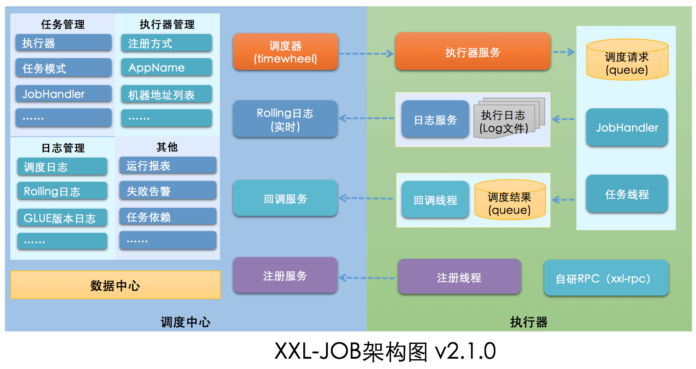

# 定时任务

## Quartz

一个很火的开源任务调度框架，完全由 Java 写成。Quartz 可以说是 Java 定时任务领域的老大哥或者说参考标准，其他的任务调度框架基本都是基于 Quartz 开发的。

使用 Quartz 可以很方便地与 Spring 集成，并且支持动态添加任务和集群。但是，Quartz 使用起来也比较麻烦，API 繁琐。

另外，Quartz 虽然也支持分布式任务。但是，它是在数据库层面，通过数据库的锁机制做的，有非常多的弊端比如系统侵入性严重、节点负载不均衡。

优缺点总结：

- 优点：可以与 Spring 集成，并且支持动态添加任务和集群。
- 缺点：分布式支持不友好，不支持任务可视化管理、使用麻烦（相比于其他同类型框架来说）

## XXL-JOB

XXL-JOB 于 2015 年开源，是一款优秀的轻量级分布式任务调度框架，支持任务可视化管理、弹性扩容缩容、任务失败重试和告警、任务分片等功能。

其解决了很多 Quartz 的不足。



要用 XXL-JOB 的话，只需要重写 IJobHandler 自定义任务执行逻辑就可以了。

```java
@JobHandler(value="myApiJobHandler")
@Component
public class MyApiJobHandler extends IJobHandler {

    @Override
    public ReturnT<String> execute(String param) throws Exception {
        //......
        return ReturnT.SUCCESS;
    }
}
```

还可以直接基于注解定义任务。

```java
@XxlJob("myAnnotationJobHandler")
public ReturnT<String> myAnnotationJobHandler(String param) throws Exception {
  //......
  return ReturnT.SUCCESS;
}
```

优缺点总结：

- 优点：开箱即用（学习成本比较低）、与 Spring 集成、支持分布式、支持集群、支持任务可视化管理。
- 缺点：不支持动态添加任务（如果一定想要动态创建任务也是支持的）
