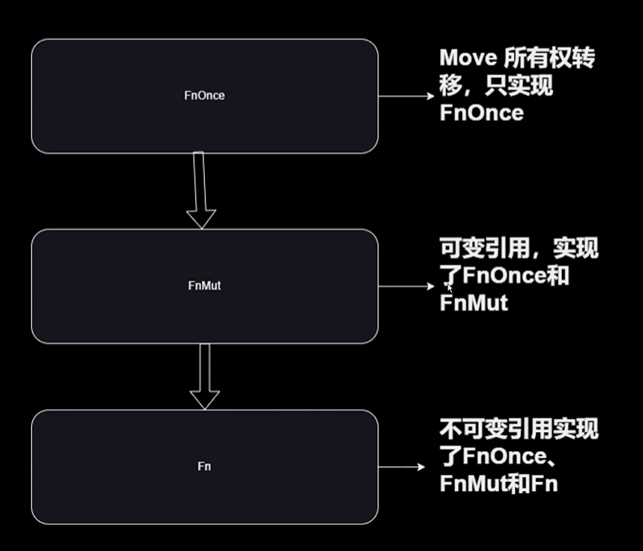

# Rust基础

## 第一章 Rust基础知识

### rustc

Rust 编程语言的编译器

- 查看版本

  ​`rustc --version`
- 编译生成二进制文件

  ​`rustc -o output_filename filename.rs`
- 编译生成库文件

  ​`rustc --crate-type lib filename.rs`

### cargo

Rust 的包管理工具

- 隐式使用rustc进行编译
- 命令

  - 创建

    ​`cargo new project_name`

    - ​`cargo new --lib project_name`创建一个新的Rust 库项目
  - 构建项目（生成二进制可执行文件或库文件）

    - ​`cargo build`

      - ​`cargo build --release`为生成优化的可执行文件，常用于生产环境
  - 检测

    - ​`cargo check`
  - 运行/测试

    - ​`cargo run/test`

项目结构

- 库

  project_name/  
  Cargo.toml  
  src/  
      lib.rs
- 可执行二进制：

  project_name/  
  Cargo.toml  
  src/  
      main.rs

Cargo.toml文件

- package

  - 设置项目名
  - 版本等
- dependencies

  - 设置依赖
  - [build-dependencies] 列出了在构建项目时需要的依赖项
  - [dev-dependencies] 列出了只在开发时需要的依赖项

### 获取第三方库

官方网站：https://crates.io/

通过修改Cargo.toml 文件来加载第三方库

**安装插件 cargo-edit**

安装：`cargo install cargo-edit`

- 添加库

  - ​`cargo add dependency_name`
  - 安装指定版本

    - ​`cargo add dependency_name@1.2.3`
  - 添加开发时用的依赖库

    - ​`cargo add --dev dev_dependency_name`
  - 添加构建时用的依赖库

    - ​`cargo add --build build_dependency_name`
- 删除库

  - ​`cargo rm dependency_name`

==新版已经默认支持这些命令，无需安装 cargo-edit==

**设置国内源**

rsproxy.cn

Windows 配置文件路径：`C:\Users\用户名\.cargo\config`

```toml
[source.crates-io]
replace-with = 'rsproxy-sparse'
[source.rsproxy]
registry = "https://rsproxy.cn/crates.io-index"
[source.rsproxy-sparse]
registry = "sparse+https://rsproxy.cn/index/"
[registries.rsproxy]
index = "https://rsproxy.cn/crates.io-index"
[net]
git-fetch-with-cli = true
```

## 第二章 变量与常见数据类型

### 变量与不可变性

**Rust 中的变量基础知识**

1. 在Rust 中，使用let 关键字声明变量
2. Rust 支持类型推导，也可以显示指定变量类型：

   ​`let x: i32 = 5; `显示指定 x 的类型为 i32
3. 变量名蛇形命名法（Snake Case），而枚举和结构体命名使用帕斯卡命名法（Pascal Case）。

   如果变量没有用到可以前置下划线，消除警告
4. 强制类型转换 Casting a Value to a Different Type

   ​`let a = 3.1; let b = a as i32;`

5. 打印变量（{} 与 {:?} 需要实现特质之后的章节会介绍，基础类型默认实现）

   1. ​`println!("val: {}", x);`
   2. ​`println!("val: {x}");`

**Rust 中的变量是默认不可变的**

不可变性是Rust实现其可靠性和安全性目标的关键

它迫使程序员更深入地思考程序状态的变化，并明确哪些部分的程序状态可能会发生变化的

不可变性有助于防止一类常见的错误，如数据竞争和并发问题

**使用** **==mut==**  **关键字进行可变声明**

```rust
let mut y = 10;
y = 20; // 合法的修改
```

**Shadowing Variables 并不是重新赋值**

Rust 允许隐藏一个变量，这意味着可以声明一个与现有变量同名的新变量，从而有效地隐藏前一个变量。

- 可以改变值
- 可以改变类型
- 可以改变可变性

### 常量const 与静态变量 static

**const常量**

- 常量的值必须是在编译时已知的常量表达式，必须指定类型与值
- 与C 的宏定义（宏替换）不同，Rust的const 常量的值被直接嵌入到生成的底层机器代码中，而不是进行简单的字符替换
- 常量名与静态变量名命名全部大写，单词之间加入下划线
- 常量的作用域是==块级作用域==，它们只在声明它们的作用域内可见

**static 静态变量**

- 与const 常量不同，static变量是在运行时分配内存的
- 并不是不可变的，可以使用unsafe修改
- 静态变量的生命周期为整个程序的运行时间

修改静态变量

```rust
static mut STATIC_NUMBER: i32 = 25;
unsafe {
	STATIC_NUMBER = 100;
}
```

### 基础数据类型

Integer Types 默认推断为 i32

- i8, i16, i32, i64, i128

Unsigned Integer Types

- u8, u16, u32, u64, u128

Platform-Specific Integer Types

- usize
- isize

Float Types

- f32, f64
- 尽量用 f64

Boolean Values

- ture, false

Character Types

- char `'c'`
- &str `"hello"`
- String `String::from("hello");`

### 元组与数组

相同点：

1. 元组和数组都是Compound Types，而Vec 和 Map 都是Collection Types
2. 元组和数组长度都是固定的

不同点：

Tuples 不同类型的数据类型

Arrays 同一类型的数据类型

**数组**

数组是固定长度的同构集合

创建方式：

- ​`[a, b, c]`
- ​`[value; size]`

获取元素 `arr[index]`

获取长度 `arr.len()`

**元组**

元组是固定长度的异构集合

Empty Tuple () 为函数默认返回值

元组获取元素 `tup.index`

没有`len()`

**ownership**

正常赋值是 copy （实现了特质）

move ownership

例子：String

```rust
let string_item = String::from("aa");
let string_item_move = string_item;
// 此时，string_item 的所有权转移到 string_item_move
```

## 第三章 Ownership 与 结构体、枚举

### Rust内存管理模型

**Stop the world**

"Stop the world" 是与垃圾回收（Garbage Collection）相关的术语，它指的是在进行垃圾回收时系统暂停程序的运行。

这个术语主要是用于描述一种全局性的暂停，即所有应用线程都被停止，以便垃圾回收器能够安全地进行工作。这种全局性的停止会导致一些潜在的问题，特别是对于需要低延迟和高性能的应用程序。

需要注意的是，并非所有的垃圾回收算法都需要”stop the world“，有一些现代的垃圾回收器采用了一些技术来减少全局停顿的影响，比如并发垃圾回收和增量垃圾回收。

**所有权有以下三条规则：**

- Rust 中的每个值都有一个变量，称为其所有者。
- 一次只能有一个所有者。
- 当所有者不在程序运行范围时，该值将被删除。

```rust
fn get_length(s: String) -> usize {
    s.len()
}
fn main() {
    let s1 = String::from("this is String");
    let length = get_length(s1);
    print!("{s1}"); // 报错
}
```

将s1传入函数 get_length，将所有权交给了函数，函数运行结束，s1也会被销毁。

### String与&str

- String是一个堆分配的可变字符串类型

  源码：

  ```rust
  pub struct String {
  	vec: Vec<u8>,
  }
  ```

- &str 是指字符串切片引用，是在栈上分配的

  - 凡是用双引号包括的字符串常量整体的类型性质都是 ==&amp;str==
  - 不可变引用，指向存储在其他地方的 UTF-8 编码的字符串数据
  - 由指针和长度构成

注意String是有所有权的，而&str并没有

- Struct 中属性使用String

  - 如果不能显示声明生命周期无法使用&str
  - 不只是麻烦，还有更多的隐患
- 函数参数推荐使用&str（如果不想交出所有权）

  - &str 为参数，可以传递&str 和 &String
  - &String 为参数，只能传递&String 不能传递&str

### 枚举与匹配模式

枚举（enums）是一种用户自定义的数据类型，用于表示具有一组离散可能值的变量

- 每种可能值都称为”variant“（变体）
- ​`枚举名::变体名`

枚举的好处

- 可以使你的代码更严谨、更易读
- More robust programs

```rust
enum Shape {
	Circle(f64),
	Rectangle(f64, f64),
	Square(f64),
}
```

**常用的枚举类型：Option 和 Result**

```rust
pub enum Option<T> {
	None,
	Some(T),
}
```

```rust
pub enum Result<T, E> {
	Ok(T),
	Err(E),
}
```

**匹配模式**

1. match 关键字实现
2. 必须覆盖所有的变体
3. 可以用 `_`​、`..=`​、`三元(if)` 等来进行匹配

```rust
match number {
	0 => println!("Zero"),
	1 | 2 => println!("One or Two"),
	3..=9 => println!("From Three to Nine"),
	n if n % 2 == 0 => println!("Even number"),
	_ => println!("Other"),
}
```

例子：

```rust
enum Color {
    Red,
    Yellow,
    Blue
}
fn print_color(my_color: Color) {
    match my_color {
        Color::Blue => println!("Blue"),
        Color::Yellow => println!("Yellow"),
        Color::Red => println!("Red"),
    }
}
fn main() {
    print_color(Color::Blue);
}
```

```rust
enum BuildingLocation {
    Number(i32),
    Name(String), // 不用 &str
    Unknown,
}
impl BuildingLocation {
    fn print_location(&self) {
        match self {
            BuildingLocation::Number(c) => println!("building number{}", c),
            BuildingLocation::Name(name) => println!("name is {}", *name),
            BuildingLocation::Unknown => println!("unknown"),
        }
    }
}
fn main() {
    let house = BuildingLocation::Name("my house".to_string());
    house.print_location();
}
```

### 结构体

结构体是一种用户定义的数据类型，用于创建自定义的数据结构

```rust
struct Point {
	x: i32,
	y: i32,
}
```

每条数据（x和y）称为属性（字段 field）

通过 . 来访问结构体中的属性

**结构体中的方法**

这里的方法是指，通过实例调用（&self, &mut self, self）

```rust
impl Point {
	fn distance(&self, other: &Point) -> f64 {
		let dx = (self.x - other.x) as f64;
		let dy = (self.y - other.y) as f64;
		(dx * dx + dy * dy).sqrt()
	}
}
```

关联函数是与类型相关联的函数，调用时为结构体名::函数名

```rust
impl Point {
	fn new(x: u32, y: u32) -> Self {
		Point { x,y }
	}
}
```

结构体中的关联变量

这里的关联变量是指，和结构体类型相关的变量，也可以在特质或是枚举中

```rust
impl Point {
	const PI: f64 = 3.14;
}
```

调用时使用Point::PI

例子：

```rust
enum Flavor {
    Spicy,
    Sweet,
    Fruity
}
struct Drink {
    flavor: Flavor,
    price: f64,
}
impl Drink {
    // 方法
    fn buy(&self){
        if self.price > 10.0 {
            println!("I am poor");
        }else {
            println!("buy it");
        }
    }
    // 关联函数
    fn new(price: f64) -> Self{
        Drink {
            flavor: Flavor::Fruity,
            price
        }
    }
}

fn main() {
    let fenta = Drink::new(12.0);
    fenta.buy();
}
```

### Ownership与结构体

1. Each value in Rust has an owner.
2. There can only be one owner at a time.
3. Values are automatically dropped when the owner goes out of scope.

每当将值从一个位置传递到另一个位置时，borrow checker 都会重新评估所有权。

1. Immutable Borrow. 使用不可变的借用，值的所有权仍归发送方所有，接收方直接接收对该值的引用，而不是该值的副本。但是，他们不能使用该引用来修改它指向的值，编译器不允许这样做。释放资源的责任仍由发送方承担。仅当发件人本身超出范围时，才会删除改值。
2. Mutable Borrow. 使用可变的借用所有权和删除值的责任也由发送者承担。但是接收方能够通过他们的引用来修改该值。
3. Move. 这是所有权从一个地点转移到另一个地点。borrow checker 关于释放该值的决定将由该值的接收者（而不是发送者）通知。由于所有权已从发送方转移到接收方，因此发送方在将引用移动到另一个上下文后不能再使用该引用，发送方在移动后对value的任何使用都会导致错误。

**结构体中关联函数的参数**

​`&self (self: &Self)`不可变引用

​`&mut self (self: &mut Self)` 可变引用

​`self (slef: Self)` Move

```rust
impl Point {
	get (self: Self)-> i32 {
		self.x
	}
}
```

self参数相当于Point::get(point)调用后丧失所有权(point为实例对象)

&self参数相当于Point::get(&point)

&mut self参数相当于Point::get(&mut point)

例子：

```rust
struct Counter {
    number: i32,
}
impl Counter {
    fn new(number: i32) -> Self {
        Self{number}
    }
    // 不可变引用
    fn get_number(&self) -> i32 {
        self.number
    }
    // 可变引用
    fn add(&mut self, increment: i32){
        self.number += increment
    }
    // 借用
    fn give_up(self) {
        println!("free {}", self.number)
    }
    fn combine(c1: Self, c2: Self) -> Self {
        Self {
            number: c1.number + c2.number
        }
    }
}

fn main() {
    let mut c1 = Counter::new(0);
    println!("c1 is :{}", c1.get_number());
    c1.give_up();
    // println!("{}", c1.get_number()); c1 调用完give_up() 就不存在了
    let  n1 = Counter::new(3);
    let  n2 = Counter::new(2);
    let  n = Counter::combine(n1, n2);
    println!("n is {}", n.get_number());
    // println!("n1 is {}, n2 is {}", n1.get_number(), n2.get_number()); n1 和 n2 已经不存在了
}
```

### 堆栈与Copy和Move

#### 堆与栈

**stack**

1. 堆栈将按照获取值的顺序存储值，并以相反的顺序删除值
2. 操作搞笑，函数作用域就是再栈上
3. 堆栈上存储的所有数据都必须具有已知的固定大小数据

‍

**heap**

1. 堆的规律性较差
2. 长度不确定

**Box**

Box 是一个智能指针，它提供对堆分配内存的所有权。它允许你将数据存储在堆上而不是栈上，并且在复制或移动时保持对数据的唯一拥有权。使用Box可以避免一些内存管理问题，如悬指针和重复释放

1. 所有权转移
2. 释放内存
3. 解引用
4. 构建地推数据结构

#### Copy 与 Clone

Move：所有权转移

Clone：深拷贝

Copy：Copy是在Clone的基础上建立的maker trait（Rust中最类似继承的关系）

1. trait（特质）是一种定义共享行为的机制。Clone也是特质
2. marker trait 是一个没有任何方法的 trait，它主要用于向编译器传递某些信息，以改变类型的默认行为

#### 关系

stack

1. 基础类型
2. tuple 和 array
3. struct 与枚举等也是存储在栈上，如果属性有String等在堆上的数据类型会指向堆的

heap

Box Rc String/Vec 等

一般来说在栈上的数据类型都默认copy，但struct 等默认为move，需要Copy只需要设置数据类型实现Copy特质即可，或是调用Clone函数（需要实现Clone特质）

```rust
struct Point {
    x: i32,
    y: i32
}

fn main() {
    let boxed_point = Box::new(Point{x: 10, y: 20});
    println!("x is {}, y is {}", boxed_point.x, boxed_point.y);
    // 修改box指向的值
	let point = boxed_point.as_mut();
    point.x += 10;
    point.y += 20;
    println!("x is {}, y is {}", point.x, point.y);

    let mut boxed_number = Box::new(30);
    *boxed_number = 100;
    println!("number is {}", boxed_number)
}
```

## 第四章 流程控制与函数

### if 流程控制 与 match模式匹配

Execution Flow（流程）

**match表达式**

- match 用于模式匹配，允许更复杂的条件和分支
- 可以处理多个模式，提高代码的表达力
- match 是表达式，可以返回值

```rust
match value {
	pattern1 => // code block,
	parrern2 => // code block,
	_ => // code block executed for any other case,
}
```

if 和 match对比：

- 复杂性：if 适用于简单的条件判断，而match更适用于复杂的模式匹配
- 表达力：match更灵活，可以处理多个条件和模式，使代码更清晰
- 返回值：两者都是表达式，可以返回值，但match通常用于更复杂的场景

```rust
fn main() {
    let age = 25;
    let msg = if age >= 35 { "you were fired" } else { "you can work" };
    println!("{msg}")
}
```

```rust
fn main() {
    let num = 90;
    match num {
        80 => println!("80"),
        90 => println!("90"),
        _ => println!("else")
    }
    match num {
        25..=50 => println!("25 ... 50"),
        51..=100 => println!("51 ... 100"),
        _ => println!("else")
    }
    match num {
        25|50|75 => println!("25 or 50 or 75"),
        100|200 => println!("100 or 200"),
        _ => println!("else")
    }
    let res = match num {
        x if x < 60 => "bad".to_owned(),
        x if x == 60 => "luck".to_owned(),
        _ => "else".to_owned(),
    };
    println!("{res}")
}
```

### 循环与break continue 以及与迭代的区别

Rust提供了几种循环结构，其中常见的是 loop, while, for

1. loop 循环

   ```rust
   loop {
   	// 无限循环代码
   }
   ```

2. while 循环

   ```rust
   while condition {
   	// 条件为真时执行的代码
   }
   ```

3. for 循环

   ```rust
   for item in iterable {
   	// 遍历可迭代对象执行的代码
   }
   ```

   for 循环用于迭代集合或范围，执行代码块来处理每个元素

**break 和 continue**

- break关键字用于立即终止循环，并跳出循环体

  - 可以用于跳出指定标签循环
- continue 关键字用于立即跳过当前循环中剩余的代码，直接进入下一次循环

**迭代**

Rust 的迭代主要用于迭代器（iterator）来实现。迭代器是一个抽象，提供了一种访问集合元素的统一方式。

从实现上来说，在Rust中，迭代器是一种实现了 Iterator trait的类型

简化源码：

```rust
pub trait Iterator {
	type Item;
	fn next(&mut self) -> Option<Self::Item>;
}
```

**循环和迭代的不同**

循环适用于需要明确控制循环流程的情况，而迭代器则提供了一种更抽象的方式来处理集合元素。通常，推荐迭代器，因为它们可以提高代码的可读性和表达力。

for循环是一种语法结构，用于遍历结合中的元素。它依赖于集合类型实现 Iterator trait

在Rust中，迭代器提供了一系列用于遍历集合元素的方法，比如 next(), map(), filter()等，可以让我们的代码更具有表达性。

```rust
fn main() {
    let array = [0, 1, 2, 3, 4, 5, 6, 7];
    for element in array {
        print!("{element} ")
    }
    println!("\n----");
    for i in 0..10 {
        print!("{i} ")
    }

    // 跳出外部循环
    'outer: loop {
        println!("outer");
        loop {
            println!("inner");
            break 'outer;
        }
    }
}
```

迭代写法

```rust
fn main() {
    let array = [0, 1, 2, 3, 4, 5, 6, 7];
    let iter_number: Vec<_> = array.iter().map(|&x|x*x).collect();
    println!("{:?}", iter_number);
}
```

### 函数基础与Copy值参数传递

#### 函数基础

1. 函数的定义：在Rust中，使用`fn`​关键字声明和定义函数，而 ==main== 是程序的入口，是一种特殊函数。
2. 参数和返回值

   函数可以接受零个或多个参数，每个参数都需要指定类型

   函数可以有返回值，使用 `->`​指定返回值类型。如果函数没有返回值，可以使用`-> ()`或省略这部分
3. 调用函数：使用函数名和传递给函数的实际参数

**Copy by value**

- 如果数据类型实现Copy特质，则在函数传参时会实现Copy by value操作
- 会将实参拷贝为形参，形参改变不会影响实参
- 如果要改变形参需要加 `mut`

- Struct，枚举，集合等没有实现Copy trait，会实现move操作失去所有权
- 未数据类型实现Copy trait，就可以实现Copy by value

#### 函数值传递

函数的代码本身是存储在可执行文件的代码段，而在调用时函数会在栈上开辟一个新的stack frame（栈空间），用于存储函数的局部变量、参数和返回地址等信息，而当函数结束后会释放该空间。

而当传入 none-Copy value （Vec，String等）  
传入函数时会转移value的所有权给形参，实参会失去value的所有权  
而在函数结束时，value的所有权会释放

**不可变借用**

- 如果不想失去value的所有权，又没有修改value的需求，可以使用不可变借用
- 在Rust中，可以将不可变借用作为函数的参数，从而在函数内部访问参数值但不能改变它。这有助于确保数据的安全性，防止在多处同时对数据进行写操作，从而避免数据竞争。
- 使用不可变借用

  - 使用 `*` 获取值

**可变借用**

- 如果你有修改值的需求，可以使用可变借用，以允许在函数内部修改参数的值  
  这允许函数对参数进行写操作，但在同一时间内只能有一个可变引用
- 需要在形参前加 `&mut`

应用可变借用

- 使用 `*`获取值

```rust
// 实现copy特质的会将副本给形参，没有实现的会执行move
fn move_fn(p1: i32, p2: String) {
    println!("p1 is {p1}, p2 is {p2}")
}
// 不可变借用
fn print_value(value: &i32) {
    println!("{value}")
}
#[derive(Debug)]
struct Point {
    x: i32,
    y: i32,
}
// 可变借用
fn modify_point(point: &mut Point) {
    point.x += 1;
    (*point).y += 2;
}
fn main() {
    let p1 = 32;
    let p2 = "jlasdf".to_owned();
    move_fn(p1, p2);
    println!("{p1}");
    // println!("{p2}"); // 报错，p2已经将所有权传递给函数了

    let a = 10;
    print_value(&a);
    println!("{a}");

    let mut p = Point { x: 3, y: 4 };
    modify_point(&mut p);
    println!("{:?}", p)
}
```

### 函数返回值与所有权机制

**返回Copy与Non-Copy**

都可以返回，但是注意Non-Copy 是在堆上

性能：

一般情况下，返回Copy类型的值通常具有更好的性能。这是因为Copy类型的值是通过复制进行返回的，而不涉及堆上内存的分配和释放，通常是在栈上分配。这样的操作比涉及堆上内存的分配和释放更为高效。

**返回引用**

- 在只有传入一个引用参数，只有一个返回引用时，生命周期不需要声明
- 其他情况下需要声明引用的声明周期
- 慎用 `'static`

```rust
fn fn_copy_back() -> i32 {
    let n = 42;
    n
}
fn fn_non_copy_back() -> String {
    let s = String::from("hello");
    s
}
fn get_mess(mark: i32) -> &'static str {
    if mark == 0 {
        "😊 "
    } else {
        "🤣"
    }
}

fn main() {
    let num = fn_copy_back();
    println!("num is {num}");
    let s = fn_non_copy_back();
    println!("s is {s}");
    println!("{}", get_mess(0));
}
```

### 高阶函数 函数作为参数与返回值

高阶函数（Higher-Order Functins）：Rust允许使用高阶函数，即函数可以作为参数传递给其他函数，或者函数可以返回其他函数。

高阶函数也是函数式编程的重要特性

**高阶函数与集合**

1. map函数：`map`函数可以用于对一个集合中的每一个元素应用一个函数，并返回包含结果的新集合。
2. filter函数：`filter`函数用于过滤集合中的元素，根据一个谓词函数的返回值
3. fold函数：`fold`​函数（也称为`reduce`）可以用于迭代集合的每个元素，并将它们累计到一个单一的结果中。

```rust
fn mul_twice(f: fn(i32) -> i32, x: i32) -> i32 {
    f(f(x))
}
fn mul(x: i32) -> i32 {
    x * x
}
fn main() {
    let result = mul_twice(mul, 3);
    println!("{result}");
}
```

## 第五章 Error错误处理

### Result、Option以及panic!宏

Rust中的错误可以分为两种

- Recoverable error: 有返回类型

  - 返回Result类型
  - 返回Option类型
- Unrecoverable type: 没有返回类型，直接崩溃

  - panic macro 将终止当前进程

**Result**

Resut是一个枚举类型，有两个变体：Ok和Err。它通常用于表示函数的执行结果，其中Ok表示成功的结果，Err表示出现了错误

```rust
pub enum Result<T, E> {
	Ok(T),
	Err(E),
}
```

**Option**

Option也是一个枚举类型，有两个变体：Some和None。它通常用于表示一个可能为空的值。

```rust
pub enum Option<T> {
	None,
	Some(T),
}
```

**panic!**

当程序遇到无法继续执行的错误时，可以使用`panic!`宏来引发恐慌。恐慌会导致程序立即终止，并显示一条错误信息。

### unwrap() 与 ?

**unwrap()**

注意：该方法并不安全

unwrap() 是Result 和 Option 类型提供的方法之一。他是一个简便的方法，用于获取 Ok 和 Some 的值，如果是Err或None则会引发 panic

 **? 运算符**

? 用于简化 Result 和 Option类型的错误传播。它只能用于返回 Result 或 Option的函数中，并且在函数内部可以像使用 unwrap() 一样访问 Ok 或Some 的值，但是如果是 Err 或 None 则会提前返回。

```rust
use std::num::ParseIntError;

fn find_first_even(numbers: Vec<i32>) -> Option<i32> {
    let first_even = numbers.iter().find(|&num| num % 2 ==0)?;
    Some(*first_even)
}

// 传递错误
fn parse_number(input: &str) -> Result<i32, ParseIntError> {
    let val = input.parse::<i32>()?;
    Ok(val)
}

fn main() {
    let result_ok: Result<i32, &str> = Ok(32);
    let value = result_ok.unwrap();
    println!("{value}");

    let numbers = vec![1,2,3,4,5];
    let result = find_first_even(numbers);
    match result {
        Some(number) => println!("{number}"),
        None => println!("no even number")
    }

    match parse_number("d") {
        Ok(res) => println!("parse success {res}"),
        Err(err) => println!("failed to parse: {err}")
    }
}
```

### 自定义Error类型

**自定义Error步骤：**

1. 定义错误类型的结构体：创建一个结构体来表示你的错误类型，通常包含一些字段来描述错误的详细信息。
2. 实现 std::fmt::Display trait：实现这个 trait 以定义如何展示错误信息。这个是为了使错误能够以人类可读的方式打印出来。
3. 实现 std::error::Error trait：实现这个 trait 以满足 Rust 的错误处理机制的要求。

```rust
#[derive(Debug)]
struct MyError {
    detail: String,
}
impl std::error::Error for MyError {
    fn description(&self) -> &str {
        &self.detail
    }
}

impl std::fmt::Display for MyError {
    fn fmt(&self, f: &mut std::fmt::Formatter<'_>) -> std::fmt::Result {
        write!(f, "Custom Error: {}", self.detail)
    }
}

fn func() -> Result<(), MyError> {
    Err(MyError{
        detail: "Custom Error".to_owned(),
    })
}

fn main() {
    match func() {
        Err(err) => println!("Error: {err}"),
        Ok(_) => println!("func ok")
    }
}
```

## 第六章 Borrowing借用 && Lifetime 声明周期

### Borrowing（引用的函数的命名）

**引用（Reference）：**

1. 引用是一种变量的别名，通过 & 符号创建。（非所有权）
2. 引用可以是不可变的（&T）或可变的（&mut T）
3. 引用允许在不传递所有权的情况下访问数据，它们是安全且低开销的

**借用（Borrowing）：**

1. 借用是通过引用（Reference）来借用（Borrow）数据，从而在一段时间内访问数据而不拥有它
2. 借用分为科比那借用和不可变借用。可变借用（&mut）允许修改数据，但在生命周期内只能有一个可变借用。不可变借用（&）允许多个同时存在，但不允许修改数据。

**Borrow Checker 的规则**

1. 不可变引用规则：

   在任何给定的时间，要么有一个可变引用，要么有多个不可变引用，但不能同时存在可变引用和不可变引用。这确保了在同一时间只有一个地方对数据进行修改，或者有多个地方同时读取数据。
2. 可变引用规则：

   在任何给定的时间，只能有一个可变引用来访问数据。这防止了并发修改相同数据的问题，从而防止数据竞争。

生命周期规则：

1. 引用的生命周期必须在被引用的数据有效的时间范围内。这防止了悬垂引用，即引用的数据已经被销毁，但引用仍然存在。
2. 可变引用与不可变引用不互斥：

   可以同时存在多个不可变引用，因为不可变引用不会修改数据，不会影响其他引用。但不可变引用与可变引用之间是互斥的。

**手动指定Lifetime**

生命周期参数在函数/结构体签名中指定：

一般情况下Borrow Checker会自行推断。

在函数/结构体签名中使用生命周期函数允许函数声明引用的有效范围。

### 生命周期与函数

大多数情况下，生命周期是隐式且被推断的

生命周期的主要目的是防止悬垂引用

悬垂引用：引用指向的数据在代码结束后被释放，但引用仍然存在。生命周期的引用有助于确保引用的有效性，防止程序在运行时出现悬垂引用的情况。通常生命周期的推断，Rust能够在编译时检查代码，确保引用的有效性，而不是在运行时出现悬垂引用的错误。

**生命周期与函数**

编译器在没有显式注解的情况下，使用三个规则来推断这些生命周期：

1. 第一个规则是每个作为引用的参数都会得到它自己的声明周期函数
2. 第二个规则是，如果只有一个输入生命周期函数，那么该生命周期函数将被分配给所有输出生命周期函数（该生命周期将分配给返回值）
3. 第三个规则是，如果有多个输入生命周期参数，但其中一个是对self或不可变self的引用时。因为在这种情况下它是一个方法，所以self的生命周期被分配给所有输出生命参数。

```rust
fn no_need(s: &str) -> &str {
    s
}
```

```rust
fn longest<'a, 'b, 'out>(s1: &'a str, s2: &'b str) -> &'out str
where 'a: 'out,
'b: 'out
{
    if s1.len() > s2.len() {
        s1
    }else {
        s2
    }

}
```

### Lifetime 与 Struct

**结构体中的引用**

在结构体中的引用需要标注生命周期

结构体的方法（&self等）不需要标注生命周期

```rust
struct MyString<'a> {
    text: &'a str, // 使用 String
}
impl<'a> MyString<'a> {
    fn get_length(&self) -> usize {
        self.text.len()
    }
    fn modify_data(&mut self) {
        self.text = "world"
    }
}

struct StringHolder {
    data: String
}

impl StringHolder {
    fn get_ref(&self) -> &String{
        &self.data
    }
}

fn main() {
    let str1 = String::from("hello");
    let mut x = MyString{
        text: str1.as_str(),
    };
    x.modify_data();
    println!("{}", x.text);

    let holder = StringHolder{
        data: String::from("Hello"),
    };
    println!("{}", holder.get_ref())
}
```

## 第七章 Generic泛型

泛型是一种编程语言特性，它允许在代码中使用参数化类型，以便在不同地方使用相同的代码逻辑处理多种数据类型，而无需为每种类型编写单独的代码

作用：

1. 提高代码的复用性
2. 提高代码的可读性
3. 提高代码的抽象性

```rust
struct Point<T> {
    x: T,
    y: T,
}

fn main() {
    let p1 = Point{x: 1.0, y: 2.0};
    let p2 = Point{x: 1, y: 2};
    let p3 = Point{x: "hello", y: "world"};
    println!("{}, {}", p1.x, p1.y);
    println!("{}, {}", p2.x, p2.y);
    println!("{}, {}", p3.x, p3.y);
}

```

### 泛型与函数

在Rust中，泛型也可以用于函数，使得函数能够处理多种类型的参数，提高代码的复用性和灵活性

1. 泛型与函数
2. 泛型与结构体中的方法

```rust
fn swap<T>(a: T, b: T) -> (T,T) {
    (b, a)
}

struct Point<T> {
    x: T,
    y: T,
}
impl<T> Point<T> {
    fn new(x: T, y: T) -> Self {
        Point { x, y }
    }
    fn get_coord(&self) -> (&T, &T) {
        (&self.x, &self.y)
    }
}
fn main() {
    let (a, b) = swap(1, 2);
    println!("{}, {}", a, b);
    println!("{:?}", swap("hello", "world"));

    let point = Point::new(1, 2);
    let (x, y) = point.get_coord();
    println!("{}, {}", x, y);
}

```

## 特质

### Trait

在Rust中，特质（Traits）是一种定义方法签名的机制

特质允许你定义一组方法的签名，但可以不提供具体的实现（也可以提供）。这些方法签名可以包括参数和返回类型，但可以不包括方法的实现代码。

任何类型都可以实现特质，只要它们提供了特质中定义的所有方法。这使得你可以额为不同类型提供相同的行为。

特性（trait）概念接近于 Java 中的接口（Interface），但两者不完全相同。特性与接口相同的地方在于它们都是一种行为规范，可以用于标识哪些类有哪些方法。

```rust
trait Descriptive {
    fn describe(&self) -> String;
}
```

格式是：

```rust
impl &lt;特性名&gt; for &lt;所实现的类型名&gt;
```

**特点**

1. 内置常量：特质可以内置常量（const），特质中定义的常量在程序的整个生命周期内都是有效的
2. 默认实现：特质可以提供默认的方法实现。如果类型没有为特质中的某个方法提供自定义实现，将会使用默认实现。
3. 多重实现：类型可以实现多个特质，这允许你将不同的行为组合在一起。
4. 特质边界：在泛型代码中，你可以使用特质作为类型约束。这被称为特质边界，它限制了泛型必须实现的特质。
5. Trait Alias：Rust还支持 trait alias，允许你为复杂的 trait 组合创建简洁的别名，以便在代码中更轻松地引用。

```rust
trait Greeter {
    fn greet(&self);
}
struct Person {
    name: String,
}

impl Greeter for Person {
    fn greet(&self) {
        println!("{}", self.name)
    }
}
fn main() {
    let person = Person { name: "zhy".to_owned(), };
    person.greet();
}
```

### Trait Object

实现的了某种Trait的实例

1. 在运行时动态分配的对象

   “运行时泛型” 比泛型要灵活的多
2. 可以在集合中混入不同的类型对象

   更容易处理相似的数据
3. 有一些小小的性能损耗

**dyn 关键字**

dyn 是 Rust 中的关键字，用于声明特质对象（trait object）的类型。特质对象是实现了特定特质的类型的实例，但其具体类型在编译时是未知的。因此，为了让编译器知道我们正在处理的是特质对象，我们需要在特质名称前面加上 dyn关键字。

dyn关键字的作用是指示编译器处理特质对象。

**Rust中数据传输的三种形式**

不可变引用（immutable Reference）

​`&dyn Trait`

可变引用（Mutable Reference）

​`&mut dyn Trait`

Move 语义所有权转移

特质需要用 `Box&lt;dyn Trait&gt;` 实现Move，如果你需要在函数调用之间传递特质的所有权，并且希望避免在栈上分配大量的内存，可以使用 `Box&lt;dyn Trait&gt;`

### 特质与Box

创建trait Object的三种方式

```rust
let o = Object{};
let o_obj: &dyn Object = &o;
```

```rust
let o_obj: &dyn Object = Object{};
```

```rust
let o_obj:Box<dyn Object> = Box::new(Object{});
```

第一种和第二种都是创建不可变引用

第三种最常用也最灵活，一般来说会使用Box和特质来组成集合元素

```rust
// trait  不可变引用
struct Obj {

}
trait Overview {
    fn overview(&self) -> String {
        String::from("overview")
    }
}
impl Overview for Obj {
    fn overview(&self) -> String {
        String::from("Obj")
    }
}

fn call_obj(item: &impl Overview) {
    println!("Overview {}", item.overview())
}
fn call_obj_box(item: Box<dyn Overview>) {
    println!("Overview {}", item.overview())
}

fn main() {
    let a = Obj{};
    call_obj(&a);
    println!("{}", a.overview());
    let b_a = Box::new(Obj{});
    call_obj_box(b_a);
    // println!("{}", b_a.overview()); 访问报错，所有权转移
}
```

### Trait Object 与 泛型

泛型与impl不同的写法

- ​`fn call(item1: &impl Trait, item2: &impl Trait);`

  可以是不同类型
- ​`fn call_feneric<T: Trait>(item1: &T, item2: &T);`

  可以是相同类型

实现多个特质的对象

- ​`fn call(item1: &(impl Trait + AnotherTrait));`
- ​`fn call_generic<T: Trait + AnotherTrait>(item1: &T);`

### 重载运算符

```rust
use std::ops::Add;

#[derive(Debug)]
struct Point<T> {
    x: T,
    y: T
}
// T 的类型，可以进行执行相加操作
impl<T> Add for Point<T> where T: Add<Output = T> {
    type Output = Self;
    fn add(self, rhs: Self) -> Self::Output {
        Point {
            x: self.x + rhs.x,
            y: self.y + rhs.y
        }
    }
}

fn main() {
    let p1 = Point{ x: 2, y: 1};
    let p2 = Point{ x: 3, y: 2};
    println!("{:?}", p1 + p2);
}
```

### Trait 与多态和继承

Rust 并不支持传统的面向对象的概念，但是你可以在特质中通过层级化来完成你的需求

Rust 选择了一种==函数式==的编程范式，即“组合和委托”而非“继承”

编程语言的大势也是==组合优于继承==

**多态**

多态是面向对象编程中的一个重要概念，指的是同一个方法调用可以根据对象的不同类型而表现出不同的行为。简单来说，多态允许一个接口或方法在不同的上下文中表现出不同的行为。这样做的好处是可以提高代码的灵活性和可扩展性，使得代码更易于维护和理解。

Rust中的多态无处不在

```rust
trait Drive {
    fn drive(&self);
}
struct Car;
struct SUV;

impl Drive for Car {
    fn drive(&self) {
        println!("car is driving")
    }
}

impl Drive for SUV {
    fn drive(&self) {
        println!("suv is driving")
    }
}
fn road(vehicle: &dyn Drive) {
    vehicle.drive();
}

// 继承思想
trait Queue {
    fn len(&self) -> usize;
    fn push_back(&mut self, n: i32);
    fn pop_front(&mut self) -> Option<i32>;
}
trait DeQueue: Queue {
    fn push_front(&mut self, n: i32);
    fn pop_back(&mut self) -> Option<i32>;
}
struct MyQueue {
    data: i32
}
// 虽然像是继承，但是还是需要单独实现各个特质的方法
impl DeQueue for MyQueue {
    fn pop_back(&mut self) -> Option<i32> {
    
    }
    fn push_front(&mut self, n: i32) {
    
    }
}
impl Queue for MyQueue {
    fn len(&self) -> usize {
    
    }
    fn pop_front(&mut self) -> Option<i32> {
    
    }
    fn push_back(&mut self, n: i32) {
    
    }
}
fn main() {
    let car = Car;
    let suv = SUV;
    road(&car);
    road(&suv);
  
}
```

### 常见的Trait

Clone、Copy、Debug、PartialEq

```rust
#[derive(Debug, Clone)]
enum Race {
    White,
    Yellow,
    Black
}
impl PartialEq for Race {
    fn eq(&self, other: &Self) -> bool {
        match (self, other) {
            (Race::White, Race::White) => true,
            (Race::Yellow, Race::Yellow) => true,
            (Race::Black, Race::Black) => true,
            _ => false,
        }
    }
}
#[derive(Debug, Clone)]
struct User {
    id: u32,
    name: String,
    race: Race
}
impl PartialEq for User {
    fn eq(&self, other: &Self) -> bool {
        self.id == other.id && self.name == other.name && self.race == other.race
    }
}
fn main() {
    let user = User {
        id: 3,
        name: "zhy".to_owned(),
        race: Race::Yellow
    };
    println!("{:#?}", user);
    let user2 = user.clone();
    println!("{:#?}", user2);
    println!("{}", user == user2)
}
```

## 第九章 Iterator迭代器

### 迭代与循环

迭代

迭代是对序列中的元素进行逐个访问的过程

控制条件：迭代通常使用迭代器（Iterator）来实现，迭代器提供了对序列元素的访问和操作

退出条件：通常不需要显式的退出条件，迭代器会在处理完所有元素后自动停止

使用场景：适用于需要遍历数据结构中的元素的情况，例如数组、切片、集合等

在Rust中，循环和迭代性能的差距可能会取决于具体的使用情况和编译器的优化。绝大多数情况下，Rust的迭代器是经过优化的，可以达到或接近手动编写循环的性能水平。

### Intolterator、Iterator、Iter

**Introlterator Trait**

IntoIterator 是一个Rust Trait，它定义了一种将类型转换为迭代器的能力

该Trait包含一个方法 into_iter，该方法返回了一个实现了 Iterator Trait 的迭代器

通常，当你有一个类型，希望能够对其进行迭代时，你会实现 IntoIterator Trait来提供将该类型转换为迭代器的方法

**Iterator Trait**

Iterator是Rust标准库中的Trait，定义了一种访问序列元素的方式

它包含了一系列方法，如 next，map，filter，sum等，用于对序列进行不同类型的操作

通过实现Iterator Trait，你可以创建自定义的迭代器，以定义如何迭代你的类型中的元素

```rust
pub trait Iterator {
	type Item;
	fn next(&mut self) -> Option<Self::Itenm>;
}
```

**源码中经常出现的Iter**

Iter 是 Iterator Trait 的一个具体实现，通常用于对集合中的元素进行迭代

在Rust中，你会经常看到Iter，特别是在对数组、切片等集合类型进行迭代时

通过IntoIterator Trait，你可以获取到一个特定类型的迭代器，比如Iter，然后可以使用Iterator Trait 的方法进行操作

```rust
fn main() {
    let v = vec![1, 2, 3, 4, 5]; // intoIterator 特质 into_iter
    // 转换为迭代器
    let iter = v.into_iter(); // move 所有权转移
    println!("{}", iter.sum::<i32>());
    // array
    let array = [1, 2, 3, 4, 5];
    let iter = array.iter();
    println!("{:?}", iter.sum::<i32>());
    // chars
    let text = "hello";
    let iter = text.chars();
    let uppercase = iter.map(|c|c.to_ascii_uppercase()).collect::<String>();
    println!("{}", uppercase);
}

```

### 获取迭代器的方法

​`iter()`

iter() 方法返回一个不可变引用的迭代器，用于只读访问集合的元素

该方法适用于你希望在不修改集合的情况下迭代元素的场景

​`iter_mut()`

iter_mut() 方法返回一个可变引用的迭代器，用于允许修改集合中的元素

该方法适用于你希望在迭代过程中修改集合元素的场景

​`into_iter()`

into_iter() 方法返回一个拥有所有权的迭代器，该迭代器会消耗集合本身，将所有权转移到迭代器

该方法适用于你希望在迭代过程中拥有集合的所有权，以便进行消耗性的操作，如移除元素

```rust
fn main() {
    let vec = vec![1, 2, 3, 4, 5];
    // iter
    for &item in vec.iter() {
        println!("{}", item);
    }
    println!("{:?}", vec);
    // iter_mut
    let mut vec = vec![1, 2, 3, 4, 5];
    for item in vec.iter_mut() {
        *item *= 2;
    }
    println!("{:?}", vec);
    let vec = vec![1, 2, 3, 4, 5];
    for item in vec.into_iter() {
        println!("{}", item);
    }
    // println!("{:?}", vec); // error vec 所有权已经转移
}

```

### 自定义实现iter() iter_mut() into_iter()

```rust
#[derive(Debug)]
struct Stack<T> {
    items: Vec<T>,
}

impl<T> Stack<T> {
    fn new() -> Self {
        Stack { items: Vec::new() }
    }
    fn push(&mut self, item: T) {
        self.items.push(item);
    }
    fn pop(&mut self) -> Option<T> {
        self.items.pop()
    }
    // 不可变引用
    fn iter(&self) -> std::slice::Iter<T> {
        self.items.iter()
    }
    // 可变引用
    fn iter_mut(&mut self) -> std::slice::IterMut<T> {
        self.items.iter_mut()
    }
    // 所有权转移
    fn into_iter(self) -> std::vec::IntoIter<T> {
        self.items.into_iter()
    }
}

fn main() {
    let mut my_stack = Stack::new();
    my_stack.push(1);
    my_stack.push(2);
    my_stack.push(3);
    for item in my_stack.iter() {
        println!("{}", item);
    }
    for item in my_stack.iter_mut() {
        *item *= 2;
    }
    println!("{:?}", my_stack);
    for item in my_stack.into_iter() {
        println!("{}", item);
    }
    // println!("{:?}", my_stack); // error my_stack 所有权已经转移
}

```

## 第十章 Closures 闭包

### 闭包概念

闭包是一种可以捕获其环境中变量的匿名函数

闭包的语法相对简介灵活，同时也具有强大的功能。闭包在Rust中被广泛用于函数式编程、并发编程以及简化代码等方面。

定义闭包的语法

- 在`||`内定义参数
- 可选的指定参数/返回类型
- 在 {} 内定义闭包体

你可以将闭包分配给一个变量，然后使用该变量，就像它是一个函数来调用闭包

```rust
#[derive(Debug)]
struct User {
    name: String,
    score: u64,
}

fn sort_score(users: &mut Vec<User>) {
    users.sort_by_key(sort_helper);
}
fn sort_helper(user: &User) -> u64 {
    user.score
}
fn sort_score_closure(users: &mut Vec<User>) {
    users.sort_by_key(|user| user.score);
}
fn main() {
    let a = User {
        name: "a".to_string(),
        score: 40,
    };
    let b = User {
        name: "b".to_string(),
        score: 30,
    };
    let c = User {
        name: "c".to_string(),
        score: 90,
    };
    let mut users = vec![a, b, c];
    // sort_score(&mut users);
    // println!("{:?}", users);
    // 闭包
    sort_score_closure(&mut users);
    println!("{:?}", users);
}

```

### 闭包获取参数

由Rust编译器觉得用哪种方式获取外部参数

1. 不可变引用 Fn
2. 可变引用 FnMut
3. 转移所有权（Move）FnOnce

所有权转移Move

Rust编译器判断

```rust
fn main() {
    // Fn获取外部参数
    let s1 = String::from("hello, 1111");
    let s2 = String::from("hello, 2222");
    let fn_func = |s: &str| {
        println!("{}", s1);
        println!("{}", s);
        println!("{}", s2);
    };
    fn_func("zju");
    println!("{}, {}", s1, s2);

    // FnMut获取外部参数
    let mut s1 = String::from("hello, 1111");
    let mut s2 = String::from("hello, 2222");
    let mut fn_func = |s: &str| {
        s1.push_str(s);
    };
    fn_func("zhy");
    println!("{}, {}", s1, s2);

    // FnOnce获取外部参数
    let s1 = String::from("hello, 1111");
    let s2 = String::from("hello, 2222");
    let fn_func = || {
        println!("{}", s1);
        std::mem::drop(s1);
    };
    fn_func();
    // println!("{}, {}", s1, s2); // s1已经被move了
    // 强制 move
    let move_fn = move || {
        println!("{}", s2);
    }; // Fn : FnMut : FnOnce fn 实现了 FnMut 和 FnOnce
    move_fn();
}
```

### 闭包是怎么工作的

1. Rust编译器将闭包放入一个结构体
2. 结构体会声明一个call function，而闭包就是函数，call function 会包含闭包的所有代码
3. 结构体会生产一些属性会捕获闭包外的参数
4. 结构体会实现一些特质

   FnOnce  
   FnMut  
   Fn



```rust
fn apply_closure<F: Fn(i32, i32) -> i32>(closure: F, x: i32, y: i32) -> i32 {
    closure(x, y)
}

fn main() {
   let x = 5;
   let add_closure = |a, b| {
    println!("x is {}", x);
    a + b
   };
   let result = apply_closure(add_closure, 1, 2);
   println!("result is {}", result);
}

```

‍
